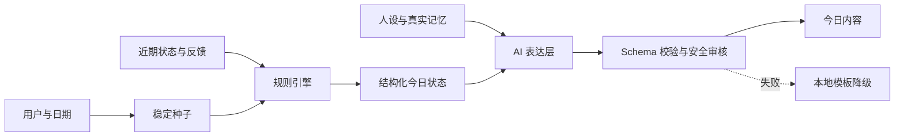
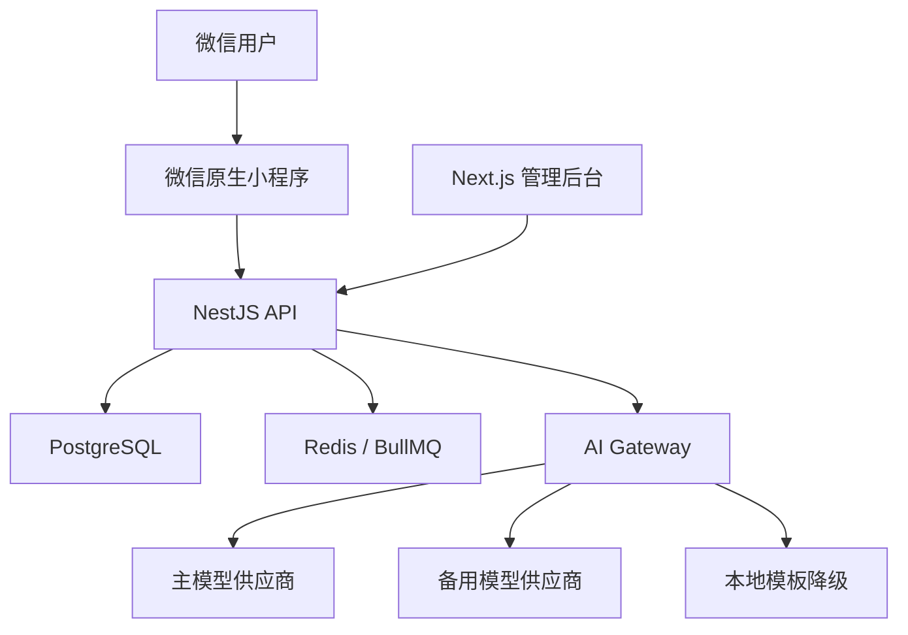

# DailyEnergy

> 每日能量小程序  
> 一个每天陪伴用户一分钟的数字朋友。

## 项目简介

DailyEnergy 是一款面向微信生态的轻量陪伴小程序。

用户每天用大约一分钟完成一次状态签到，收到一份个性化的“今日能量与行动建议”，点亮当天记录，并在持续使用中看到自己的周、月状态变化。

它不是传统算命工具，也不是无限聊天机器人。运势只是每天见面的理由，真正的产品是稳定、克制、有记忆的陪伴关系。

**核心定位：每天 1 分钟，让今天更有方向感，也让用户感到有一位朋友在等自己。**

---

## 我们为什么做它

现代人每天会多次打开手机，却很少在打开一个应用时感到：

> 今天有人记得我，也有人在等我。

我们希望创造一位数字朋友。它不会贩卖焦虑，不会用恐惧证明预测“准确”，也不会用廉价夸奖讨好用户。它会记得用户在意的事，在合适的时候给出一句自然的回应、一个可完成的小行动，以及持续回望自己的机会。

我们提供的不是对未来的确定答案，而是：

- 对今天的一点期待；
- 对情绪的一点照顾；
- 对行动的一点方向；
- 对长期生活的一份温柔记录。

---

## 产品原则

1. **陪伴大于预测**：不承诺预知未来，预测内容用于娱乐、反思与日常行动参考。
2. **关系大于功能**：用户留下来不是因为功能多，而是因为产品记得他、理解他，并保持连续性。
3. **仪式感大于信息量**：每天一分钟，一次完整体验，不制造信息负担。
4. **行动大于结论**：每份今日内容只给一个清晰、温和、可完成的建议。
5. **稳定大于随机**：规则负责生成可复现的结构化结果，AI负责人性化表达。
6. **克制大于讨好**：不句句夸奖、不灌鸡汤、不说教，允许幽默、留白和适度直接。
7. **记忆必须真实**：只引用用户确实提供或系统确实记录的信息，不伪造共同经历。
8. **成长大于打卡**：打卡、点亮和勋章用于呈现共同经历，不用惩罚和焦虑强迫留存。
9. **安全高于沉浸**：不以“朋友”身份替代医生、心理咨询师、律师或投资顾问。
10. **隐私默认最小化**：只收集实现当前体验所必需的数据，并允许用户查看、修改和删除。

---

## 核心体验

### 第一次见面

首次进入不是填写一张冰冷的注册表，而是完成一次简短的“认识朋友”：

- 用户希望被怎样称呼；
- 用户最近的状态；
- 用户喜欢的陪伴方式：温柔、轻松幽默或清醒直接；
- 可选的生日、作息和重要事项。

系统只提供一个核心数字朋友，通过温柔度、幽默度和直接度调整表达，不在 MVP 阶段引入大量角色。

### 每天一分钟

```text
打开小程序
  ↓
朋友式问候
  ↓
10 秒晨间状态签到
  ↓
今日能量与五维状态
  ↓
一段个性化解释
  ↓
一个行动建议 / 今日小任务
  ↓
阅读完成并点亮当天
```

晚上可用约 10 秒补充真实反馈：

- 今天整体感觉如何；
- 今日建议是否有帮助；
- 今日任务是否完成；
- 今天最想留下的一句话（可选）。

### 长期关系

随着共同经历增加，数字朋友会逐步表现出关系变化：

- 记得用户的表达偏好、作息与重要事项；
- 在面试、考试、生日等重要日子自然提及；
- 在第 3、7、21、30 天等节点给出专属回应；
- 用周报、月报和点亮地图帮助用户回看真实状态；
- 偶尔提供一封信或小惊喜，而不是机械弹出积分提示。

---

## 第一阶段 MVP

第一阶段只验证一个核心假设：

> 用户是否愿意连续 7 天，每天花 1 分钟回来见这位数字朋友？

### 包含

- 微信快捷登录；
- 昵称与陪伴风格设置；
- 晨间情绪、精力、睡眠快速签到；
- 每日固定且可复现的五维状态；
- 朋友式今日解读；
- 一条行动建议和一个可选小任务；
- 每日点亮、连续记录与基础勋章；
- 晚间真实状态反馈；
- 7 天趋势与简短总结；
- 重要事项的基础结构化记忆；
- 分享卡片；
- 基础埋点、内容安全与隐私能力。

### 暂不包含

- 无限 AI 聊天；
- 多个 AI 角色与复杂角色商城；
- 八字、星盘等专业排盘；
- 社区、陌生人互动与内容广场；
- 语音陪伴；
- 复杂会员、商城或“化解运势”付费；
- 自研模型、独立向量数据库与过早微服务化。

---

## 运势生成原则

每日内容不能完全交给大模型随机生成。

系统采用三层生成机制：

1. **稳定种子**：根据用户、日期、资料版本和算法版本生成，保证同一用户当天重复查看的核心结果一致。
2. **规则引擎**：生成整体、情绪、行动、社交、财富、健康等结构化分数及候选建议。
3. **AI 表达层**：结合用户偏好、近期状态、关系等级和真实记忆，把结构化事实表达得像一位自然、克制的朋友。



核心约束：

- 当天结果幂等，刷新不会“改运”；
- 低分表示适合谨慎、休息或调整，不暗示灾祸；
- AI 只能解释已提供的结构化事实，不能自行虚构预测依据；
- 所有 AI 输出必须经过 Schema 校验、安全审核和失败降级；
- 模型、Prompt、算法和生成结果必须可追踪版本。

---

## 技术方案

本项目以 AI 辅助开发的一致性、可维护性和后续扩展为优先，采用 TypeScript 全栈。

| 层级 | 技术选择 |
|---|---|
| 小程序 | 微信原生小程序 + TypeScript |
| 业务 API | NestJS + TypeScript |
| 数据库 | PostgreSQL |
| ORM | Prisma |
| 缓存与队列 | Redis + BullMQ |
| 输入输出校验 | class-validator + Zod |
| 管理后台 | Next.js + TypeScript |
| 对象存储 | 腾讯云 COS 或 S3 兼容存储 |
| 部署 | Docker Compose，后续按规模演进 |

### 系统架构



AI 模型不会从小程序端直接调用。所有供应商接入统一经过 AI Gateway，以实现：

- API Key 隔离；
- 模型切换与超时重试；
- Prompt 版本管理；
- 结构化输出校验；
- 内容安全与敏感场景处理；
- Token 与成本统计；
- 缓存、幂等和本地降级。

---

## 推荐仓库结构

```text
daily-energy/
├── README.md
├── AGENTS.md               # AI 与开发协作规则
├── ROADMAP.md              # 长期路线图与阶段门槛
├── apps/
│   ├── miniapp/              # 微信原生小程序
│   ├── api/                  # NestJS 业务后端
│   └── admin/                # Next.js 管理后台
├── packages/
│   ├── shared-types/         # 前后端共享类型
│   ├── shared-schemas/       # Zod Schema 与枚举
│   ├── prompt-library/       # 可版本化 Prompt
│   └── eslint-config/        # 统一工程规范
├── prisma/
│   ├── schema.prisma
│   └── migrations/
├── docs/
│   ├── INDEX.md             # 文档索引与状态
│   ├── product/              # 愿景、原则、用户、旅程、MVP
│   ├── ai/                   # 人设、记忆、Prompt、安全
│   ├── technical/            # 架构、数据库、API、部署
│   ├── design/               # 设计系统、动效、插画
│   ├── analytics/            # 埋点、指标、实验
│   ├── operations/           # 内容、通知、用户支持
│   └── decisions/            # Architecture Decision Records
├── tasks/                    # 当前里程碑与任务状态
├── docker/
└── tests/
```

---

## 文档即长期记忆

本仓库是项目的唯一真相来源（Single Source of Truth）。聊天记录、口头讨论和 AI 临时回答都不能替代已确认的项目文档。

信息冲突时按以下优先级处理：

1. 已接受的 ADR；
2. 当前版本的产品、AI、技术与设计规范；
3. API Schema、数据库 Schema 和测试；
4. 当前任务说明；
5. 聊天记录与临时草稿。

每项重要决定都应写入文档。改变产品定位、技术栈、数据模型、安全边界或核心交互前，必须新增或更新 ADR，并说明背景、选择、替代方案和影响。

### AI 协作约定

任何 AI Agent 开始工作前应：

1. 阅读本 README；
2. 阅读与任务直接相关的产品、技术和设计文档；
3. 检查现有 ADR 与 Schema；
4. 明确当前任务范围和不做事项；
5. 修改代码时同步测试与相关文档；
6. 不擅自更换框架、数据库、目录规范或产品定位；
7. 不在生产环境执行未经审核的破坏性迁移；
8. 不把密钥、用户隐私或完整敏感输入写入代码与日志。

---

## 安全与合规边界

产品内容用于娱乐、情绪记录和日常生活参考，不构成医疗、心理治疗、法律、投资或其他专业建议。

严禁生成或暗示：

- 灾祸、疾病、破财或死亡将确定发生；
- 因“运势”延误就医或采取危险行为；
- 某项投资必然盈利或亏损；
- 伴侣必然背叛等未经证实的关系结论；
- 通过恐惧推动付费、充值或购买“化解”服务；
- AI 拥有并不存在的记忆、感受或现实能力。

涉及自伤、自杀、暴力威胁、医疗急症等高风险内容时，必须退出普通运势与陪伴流程，进入固定的安全响应与求助引导机制。

---

## 第一阶段验证指标

MVP 的成功不以功能数量衡量，而以用户是否愿意持续回来衡量。首轮内测重点关注：

- 首次认识流程完成率；
- 今日内容生成与阅读完成率；
- 次日、3 日和 7 日留存；
- 连续点亮 3 天、7 天的用户比例；
- 晚间反馈率；
- 今日建议“有帮助”比例；
- 今日任务完成率；
- 分享卡片生成与分享率；
- AI 生成失败率、平均响应时间与单用户成本；
- 用户对“它记得我”和“像朋友”的主观反馈。

第一阶段最重要的问题只有三个：

1. 用户会不会在第二天主动回来？
2. 用户是否觉得内容自然、有用，而不是模板化鸡汤？
3. 用户是否开始把它感知为一位熟悉自己的朋友？

---

## 路线图

### Phase 0：Blueprint

- 明确愿景、产品原则与用户画像；
- 完成 MVP 用户旅程和功能范围；
- 定义 AI 人设、记忆、安全和输出规范；
- 完成架构、数据库、API、埋点和设计系统；
- 通过 ADR 固化关键决策。

### Phase 1：MVP

- 打通“首次认识—晨间签到—今日内容—点亮—晚间反馈—周趋势”闭环；
- 完成稳定生成、AI 降级、安全审核和基础埋点；
- 邀请 50～100 名种子用户内测；
- 只围绕留存、内容质感和关系感迭代。

### Phase 2：关系成长

- 增加长期结构化记忆；
- 增加周报、月报、专属来信与惊喜系统；
- 完善勋章、成长地图和分享体验；
- 验证会员权益，但不以无限聊天作为唯一卖点。

### Phase 3：品牌与扩展

- 形成稳定的数字朋友品牌人格；
- 扩展节日、重要日子和长期目标陪伴；
- 在验证真实需求后，再评估 App、其他小程序平台或 AI 算法服务。

---

## 当前状态

```text
阶段：Phase 0B — 开发前详细规格
状态：S-31 测试策略已 Accepted；S-32 部署、配置与回滚 Draft 已完成并进入 In Review，尚未开始业务编码
当前目标：完成页面、状态、Schema、AI、数据、API、隐私、分析与工程规范
当前任务：S-32 部署、配置和回滚（In Review）
```

长期工作入口：

1. [ROADMAP.md](./ROADMAP.md)：长期阶段、交付物和退出门槛；
2. [docs/INDEX.md](./docs/INDEX.md)：文档依赖、状态和读取顺序；
3. [tasks/current.md](./tasks/current.md)：唯一正在执行的任务；
4. [tasks/backlog.md](./tasks/backlog.md)：有序候选任务；
5. [AGENTS.md](./AGENTS.md)：AI 与开发协作规则。

当前任务范围：

- 审核 Draft `docs/technical/deployment.md`；
- 审核 LOCAL/CI/DEV/STAGING/PRODUCTION/RECOVERY/EVALUATION/MINIAPP_RUNNER 环境边界；
- 审核单 host Compose、独立 PG/Redis/object、runtime profile 与非 HA 限制；
- 审核 build-once、image digest、Release Manifest、SBOM/provenance 和供应链 Gate；
- 审核配置分级、secret/OIDC、启动指纹、migration 与 consumer-before-producer 发布；
- 审核 rollback matrix、35 天 backup、WAL/PITR、Redis 重建和隔离恢复；
- 审核 Production Blocked Gate、artifact/remote cache 和 48 个 S-32 场景。

S-32 不创建 Docker/Compose、CI workflow、migration、secret、云资源或生产环境，也不提前实现 S-33 可观测性。新的 AI 会话应先读取 `AGENTS.md` 和 `tasks/current.md`，不要根据聊天记录猜测进度。

---

## 一句话共识

> 规则负责稳定，AI 负责人味，记忆负责关系，点亮负责习惯，反馈负责个性化。

**运势只是相见的理由，陪伴才是真正的产品。**
