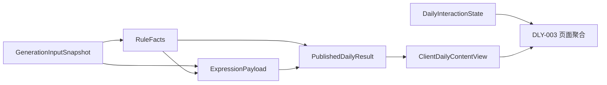

# DailyEnergy 今日内容 Schema

- **文档状态**：Draft
- **所属任务**：S-07 — 今日内容 Schema
- **最后更新**：2026-07-20
- **适用范围**：每日生成输入、规则事实、表达载荷、已发布结果和客户端安全视图
- **上游规范**：[产品状态机](../product/state-machine.md)、[业务规则](../product/business-rules.md)、[人格手册](./personality.md)、[第一阶段 MVP](../product/mvp.md)、[内容布局](../design/content-layout.md)
- **下游任务**：S-08 晚间与七天 Schema、S-09 可执行共享 Schema、S-10 稳定结果、S-11 规则引擎、S-12 AI Gateway、S-13 Prompt、S-14 记忆、S-17～S-20 数据与接口

## 1. 文档目的

本文定义 DailyEnergy “今日内容”的唯一文档级契约，使规则引擎、AI、备用模型、受控模板、存储、API 和前端对同一结果使用相同语义。

本文必须保证：

1. 规则事实、AI 表达、真实记录、生成元数据和可变行为状态互相分离；
2. AI 不能创造或修改分数、档位、重点维度、行动方向、记忆或用户真实状态；
3. 主模型、备用模型和完整模板产生同一结构；
4. 客户端只接收完成校验、移除内部元数据和敏感源引用的安全视图；
5. 五维名称不与真实“情绪、精力、睡眠”混淆，也不包装医疗或财务预测；
6. 每个文本、数组、数值、枚举、可选字段和版本都有明确约束；
7. 已发布结果按生成时版本冻结，行为变化不改写内容；
8. 删除事项或关系源事实后，可以定位、遮蔽或失效所有引用；
9. 任一必需字段、Schema 或 Safety 校验失败时，不局部发布普通内容；
10. 本文可以无歧义转换为 S-09 的可执行 Schema，但当前不创建代码。

## 2. 规范用语与术语

### 2.1 规范强度

- **必须**：下游 Schema、Prompt、API 和实现不得绕过；
- **应该**：默认设计，偏离需要单独评审；
- **可以**：不改变不变量时允许；
- **禁止**：AI、模板、配置和客户端都不能触发。

### 2.2 术语

| 术语           | 定义                                                                             |
| -------------- | -------------------------------------------------------------------------------- |
| 生成输入快照   | 生成时允许使用的规范化签到、资料版本、关系上下文和最小源引用，只在受限服务端使用 |
| 规则事实       | 稳定规则引擎产生的整体、五维、重点、解释依据、行动候选和娱乐元素事实             |
| 表达载荷       | AI 或受控模板在固定事实与约束下生成的短文本；不能新增事实                        |
| 已发布结果     | 通过结构、业务、人格和 Safety 校验后原子保存的不可变事实与表达组合               |
| 客户端安全视图 | 由服务端显式投影的可展示契约，不含原始分数、模型、Prompt、敏感源引用和审核细节   |
| 行为状态       | 点亮、任务状态、内容帮助度和晚间反馈等可变事实；不属于已发布结果                 |
| 源依赖         | 某个表达段落使用的真实记录、关系或重要事项引用，用于审计和删除传播               |
| 隐私回退       | 删除源依赖后，用同一规则事实预先校验的无源文本替代受影响段落                     |
| 核心阅读       | 默认展开时从问候到可选任务、点亮前可以完成的主要文本，不含其余四维展开和娱乐元素 |
| 展示字符       | Unicode 用户感知字符；前后空白不计，内部多余空白先规范化，精确算法由 S-09 固化   |

## 3. 契约分层

### 3.1 六个对象边界

| 对象                    | 写入者        | 权威用途                     | 持久性                   | 客户端可见           |
| ----------------------- | ------------- | ---------------------------- | ------------------------ | -------------------- |
| GenerationInputSnapshot | 生成编排服务  | 固定生成依据和允许上下文     | 受限持久；按删除规则处理 | 否                   |
| RuleFacts               | 规则引擎      | 唯一稳定事实、排序和行动约束 | 随结果冻结               | 只投影中性档位与标签 |
| ExpressionPayload       | AI 或受控模板 | 在事实内表达短文本           | 随结果冻结               | 通过安全视图可见     |
| PublishedDailyResult    | 发布服务      | 原子、可追踪的内部结果       | 不可变；隐私遮蔽例外     | 否，禁止直接序列化   |
| ClientDailyContentView  | 服务端投影器  | DLY-003 和历史详情的安全内容 | 可缓存；随源删除失效     | 是                   |
| DailyInteractionState   | 行为/反馈服务 | 点亮、任务状态、帮助度和反馈 | 独立可变                 | 通过页面聚合单独提供 |

### 3.2 数据流



`PublishedDailyResult` 与 `ClientDailyContentView` 是显式不同契约。禁止把内部对象做字段黑名单后直接下发；必须使用版本化白名单投影。

## 4. S-07 决策摘要

以下结论在本文仍为 Draft，等待本 PR 审核后成为后续任务的约束。

|   # | 问题               | 推荐结论                                                                                             |
| --: | ------------------ | ---------------------------------------------------------------------------------------------------- |
|   1 | 五维稳定 ID 与名称 | `pace` 今日节奏、`action` 行动推进、`connection` 沟通连接、`resources` 资源安排、`recovery` 恢复留白 |
|   2 | 分数与档位         | 规则内部使用 0～100 整数和版本化映射；客户端不下发原始分数，只显示 LOW / STEADY / HIGH 的中性文案    |
|   3 | 整体能量           | 由规则事实产生内部分数和档位，客户端只见“适合放轻 / 适合稳住 / 适合推进”等娱乐参考标签               |
|   4 | 对象分层           | 输入快照、规则事实、表达、内部结果、客户端视图和行为状态使用显式不同契约                             |
|   5 | 重点与排序         | 规则引擎给出唯一 `focus_dimension_id` 和五维 `display_order`；AI 不得排序                            |
|   6 | 主要行动           | 规则先选择一个语义行动计划；AI 只写指令、可选理由和最多一个时间/范围约束                             |
|   7 | 可选任务           | 每个已发布 P0 结果包含一个不可变任务定义；用户任务状态外置，任务不影响点亮                           |
|   8 | 关系节点           | 第 3/4/7 日卡片属于页面组合状态，不写入每日结果；问候可以使用生成时关系阶段快照                      |
|   9 | 重要事项           | 只能通过受控源引用影响指定表达段；必须记录源依赖并提供无源隐私回退                                   |
|  10 | 生成元数据         | 模型、Prompt、供应商、审核和原始分数仅服务端；客户端只接收必要的结果/Schema 版本和个性化提示         |
|  11 | 富文本             | 所有生成文本为纯文本；禁止 Markdown、HTML、URL 和文本内 emoji，视觉图标由客户端控制                  |
|  12 | 字数               | 沿用上游单字段预算，并新增核心阅读最多 320 字、完整默认语言内容最多 480 字                           |
|  13 | 可选与空值         | 已发布对象不使用 `null` 或空字符串；可选字段省略；维度固定 5 个；娱乐元素允许空数组                  |
|  14 | 校验与发布         | 任一必需字段、Schema 或 Safety 失败都不局部发布；改用完整备用/模板载荷，仍失败则硬失败               |
|  15 | 版本兼容           | AI 输出严格拒绝未知字段；历史保存原版本；服务端适配器投影客户端支持的 major，不静默重写历史          |
|  16 | 真实签到           | 生成输入快照可以包含规范化签到，但客户端每日内容视图不复制真实签到；页面从独立真实记录对象组合       |
|  17 | 幸运元素           | P0 契约保留 0～2 个可选仪式元素，仅 `COLOR` / `NUMBER`，值由规则产生且不承诺结果                     |
|  18 | 客户端输出         | 使用显式 ClientDailyContentView，不使用内部对象裁剪或让前端理解 provenance                           |

## 5. 契约版本与结果身份

### 5.1 版本字段

| 字段                     | 示例            | 含义                                   | 客户端                           |
| ------------------------ | --------------- | -------------------------------------- | -------------------------------- |
| `contract`               | `daily-content` | 契约家族固定标识                       | 必需                             |
| `schema_version`         | `1.0.0`         | 本文结构版本                           | 必需                             |
| `result_version`         | `daily-v1`      | 规则、算法和产品配置组合产生的结果版本 | 必需                             |
| `result_id`              | 不透明 ID       | 一份已发布结果的唯一引用               | 必需                             |
| `product_date`           | `2026-07-20`    | 权威产品日期，格式 YYYY-MM-DD          | 必需                             |
| `generated_at`           | RFC 3339 UTC    | 原子发布时间                           | 客户端可以接收，但不用于日期归属 |
| `input_snapshot_version` | 不透明版本      | 生成输入快照版本                       | 内部                             |
| `rule_version`           | 规则版本        | 规则事实来源                           | 内部                             |
| `algorithm_version`      | 算法版本        | 分数与排序算法                         | 内部                             |
| `prompt_version`         | Prompt 版本     | AI 表达来源                            | 内部                             |
| `template_version`       | 模板版本或省略  | 受控模板来源                           | 内部                             |
| `safety_policy_version`  | Safety 版本     | 发布时审核依据                         | 内部                             |

`schema_version` 与 `result_version` 不得混用。Schema 相同不代表规则结果相同；规则版本变化也不要求改变契约结构。

### 5.2 版本规则

- major：不兼容的字段或语义变化；
- minor：同一 major 内增加可选字段或新枚举能力，旧客户端由服务端投影兼容视图；
- patch：不改变数据结构的说明、校验或错误修正；
- 已发布历史保存原始 `schema_version` 与结果快照；
- 历史读取通过版本化适配器生成客户端视图，不修改存储快照；
- 客户端不支持 major 时，不尝试猜测字段，显示可恢复状态并请求受支持投影；
- 具体唯一键、稳定种子和 `result_version` 组成由 S-10 决定。

## 6. GenerationInputSnapshot

### 6.1 允许字段

| 字段组            | 内容                                         | 规则                                     |
| ----------------- | -------------------------------------------- | ---------------------------------------- |
| identity          | 内部用户引用、产品日期、结果版本             | 不向模型暴露无关身份信息                 |
| checkin           | 生成时规范化情绪、精力、睡眠选项和修订       | “说不准”是有效枚举；不含推断诊断         |
| profile           | 安全称呼、表达偏好、资料版本                 | 空称呼保持省略，不造“朋友”等昵称         |
| relationship      | 生成时阶段、相遇日计数、允许的最近事实引用   | 不含积分、亲密度或未授权历史             |
| permitted_context | 当前输入、短期真实状态、重要事项等最小源引用 | 每项有来源、修订、用途、有效性和删除能力 |
| product           | locale、人格版本、内容策略和实验版本         | 实验不能突破 Accepted 规范               |

### 6.2 禁止字段

GenerationInputSnapshot 不得包含：

- 与当前结果无关的全部历史自由文本；
- 未经授权的敏感事项或模型推断；
- 原始微信凭证、手机号、渠道密钥或模型密钥；
- 已删除、过期、暂停或用途不匹配的事项；
- 分析画像、广告标签或渠道推断；
- Safety 受限详情超过当前生成所需的最小状态；
- 未提交客户端草稿。

### 6.3 输入快照示例

以下为脱敏概念示例，只在服务端受限环境存在：

```json
{
  "snapshot_version": "input-v1",
  "product_date": "2026-07-20",
  "result_version": "daily-v1",
  "checkin": {
    "revision": 1,
    "mood": "STEADY",
    "energy": "LOW",
    "sleep": "OKAY"
  },
  "profile": {
    "revision": 2,
    "expression_style": "BALANCED"
  },
  "relationship": {
    "stage": "NEWLY_MET",
    "encounter_day_count": 2
  },
  "permitted_context": []
}
```

签到更正后该快照不被改写；每日结果继续引用生成时修订，页面可用系统层说明“内容依据生成时记录”。

## 7. RuleFacts

### 7.1 总体结构

RuleFacts 至少包含：

- `overall`：内部整数分数、档位和受控标签 token；
- `dimensions`：固定五维的内部整数分数、档位和标签 token；
- `focus_dimension_id`：唯一重点维度；
- `supporting_dimension_id`：可选的当前余量来源；
- `care_dimension_id`：可选的需要放轻维度；
- `display_order`：五维 ID 的完整、无重复排列；
- `explanation_basis`：最多 5 个可追溯信号；
- `action_candidates`：1～3 个规则行动候选；
- `selected_action_id`：唯一选中的主要行动；
- `optional_task_plan`：一个更低负担的可选任务计划；
- `ritual_facts`：0～2 个规则生成的仪式元素。

所有字段在相同输入与版本下确定。AI 只能读取，不能写入。

### 7.2 分数和档位

- 内部分数必须是 0～100 的整数；
- 档位必须是 `LOW`、`STEADY` 或 `HIGH`；
- 分数到档位的阈值由版本化规则决定，不在本文固化；
- 客户端安全视图不包含原始分数；
- 档位不表示坏事、成功概率、健康、财富或人格；
- 低档位表示降低负担或多留意，高档位表示相对余量，不承诺结果；
- 整体档位使用受控中性标签，不直接显示“低分”“高分”。

推荐整体标签 token：

| 档位   | token            | 默认中文 |
| ------ | ---------------- | -------- |
| LOW    | `TAKE_IT_GENTLY` | 适合放轻 |
| STEADY | `KEEP_IT_STEADY` | 适合稳住 |
| HIGH   | `ROOM_TO_MOVE`   | 适合推进 |

中文可以随受控文案版本调整，但 token 语义不能由 AI 改变。

## 8. 五维契约

### 8.1 稳定维度

| 稳定 ID      | 中文显示名 | 安全语义                             | 禁止解释                 |
| ------------ | ---------- | ------------------------------------ | ------------------------ |
| `pace`       | 今日节奏   | 今天更适合快一点、稳一点还是减少切换 | 真实情绪、人格或命运     |
| `action`     | 行动推进   | 开始、排序或完成一件事的相对行动余量 | 成功概率、自律评价       |
| `connection` | 沟通连接   | 表达、确认、倾听和边界的行动参考     | 他人真实意图、感情结论   |
| `resources`  | 资源安排   | 时间、注意力、任务容量和日程安排     | 财运、收入、投资或破财   |
| `recovery`   | 恢复留白   | 休息、停顿和减少负担的行动参考       | 健康诊断、治疗或身体结论 |

这五个 ID、语义和 canonical order 在同一 major 内稳定：

`pace → action → connection → resources → recovery`

上游曾使用的“情绪、财富、健康”等暂定维度不进入本契约，以避免真实状态、医疗和财务预测混淆。

### 8.2 展示顺序

- `dimensions` 内部存储使用 canonical order；
- `display_order` 是五个稳定 ID 的完整排列；
- `focus_dimension_id` 必须位于 `display_order[0]`；
- 其余维度按与主要行动的相关性排列，不按分数从低到高制造警报墙；
- `supporting_dimension_id` 与 `care_dimension_id` 可省略；存在时必须是有效维度；
- AI 不接收“自行选重点”指令，也不能返回排序。

### 8.3 单维客户端字段

每一维客户端只接收：

- `id`；
- `label`；
- `band`；
- `band_label`；
- 12～35 字 `explanation`；
- `is_focus`。

不得接收内部 `score`、权重、阈值、候选排序理由或其他用户的比较数据。

## 9. 行动计划与任务定义

### 9.1 主要行动计划

规则候选允许以下 `kind`：

| kind                   | 语义                             |
| ---------------------- | -------------------------------- |
| `PRIORITIZE_ONE`       | 只选一件最重要的事               |
| `PREPARE_ONE_STEP`     | 提前完成一个小准备               |
| `COMMUNICATE_CLEARLY`  | 安排一次确认、表达或倾听         |
| `REDUCE_SWITCHING`     | 减少无效切换或同时进行           |
| `ORGANIZE_SMALL_SCOPE` | 整理一个有限区域或信息块         |
| `PAUSE_AND_RECOVER`    | 留出短暂停顿或降低负担           |
| `REFLECT_BRIEFLY`      | 记录一个真实感受或问题           |
| `SEEK_REAL_SUPPORT`    | 向现实中的可信任对象寻求一般支持 |

每个候选至少包含：

- `action_id`；
- `kind`；
- `target_scope`；
- `effort`：`VERY_LIGHT` 或 `LIGHT`；
- 可选 `timebox_minutes`：5～30 的整数；
- 最多一个 `constraint_token`；
- 与维度和输入信号的内部依据引用。

规则引擎选出唯一 `selected_action_id`。AI 不能更换 kind、目标、负担、时间盒或约束。

### 9.2 主要行动表达

ExpressionPayload 的主要行动只包含：

- `action_id`：必须等于 `selected_action_id`；
- `instruction`：15～45 字，动词开头，一件事；
- 可选 `rationale`：10～35 字；
- 可选 `constraint_label`：4～16 字，且最多一个。

禁止多步清单、课程、购买、外链、连续挑战、“必须完成”、专业诊疗、投资交易或危险行为。

### 9.3 可选任务

每个 P0 PublishedDailyResult 必须包含一个不可变 `optional_task_plan` 和对应 10～35 字任务表达。这里的“可选”表示用户可以不做，不表示字段可缺失。

任务必须：

- 比主要行动负担更低或相同；
- 不重复主要行动全文；
- 不依赖付费、授权、分享或连续签到；
- 不影响点亮和关系；
- 不包含任务状态。

`UNMARKED / INTERESTED / COMPLETED / SKIPPED` 由 DailyInteractionState 单独提供。

## 10. ExpressionPayload

### 10.1 必需结构

| 字段                     | 必需 |                             长度/数量 | 作用                                 |
| ------------------------ | ---- | ------------------------------------: | ------------------------------------ |
| `greeting`               | 是   |                              8～24 字 | 时段和关系阶段内的短问候             |
| `state_response`         | 是   |                             20～60 字 | 使用至多一项生成时真实输入，克制回应 |
| `overall_summary`        | 是   |                             12～30 字 | 解释整体娱乐档位的行动倾向           |
| `core_tip`               | 是   |                             20～50 字 | 首屏唯一重点提示                     |
| `explanation_paragraphs` | 是   |              1～2 段，总计 60～140 字 | 为什么与今天有关                     |
| `dimension_explanations` | 是   |              恰好五项，每项 12～35 字 | 对应稳定维度 ID                      |
| `primary_action`         | 是   |                             见第 9 节 | 唯一主要行动表达                     |
| `optional_task`          | 是   |                             10～35 字 | 次级可选任务表达                     |
| `ritual_notes`           | 是   | 与 RuleFacts 元素一一对应，可为空对象 | 8～24 字娱乐说明                     |
| `closing`                | 是   |                              8～30 字 | 不重复、不要求回应的收尾             |

`state_response` 使用的签到修订必须与 GenerationInputSnapshot 一致。如果用户后来更正签到，结果文本不改写；页面通过系统层说明生成依据，而不是让 AI 重写。

### 10.2 文本格式

所有文本必须：

- 使用简体中文纯文本；
- 去除首尾空白和连续多余空白；
- 单个字符串不含换行；多段使用数组；
- 不含 Markdown 标题、列表、链接、代码、表格或强调标记；
- 不含 HTML、XML、脚本、URL 或协议字符串；
- 不含文本内 emoji，视觉图标由客户端受控添加；
- 不连续使用两个及以上感叹号或问号；
- 不使用占位符、模板变量、系统提示或模型自述；
- 不包含未经允许的用户原文复述。

### 10.3 总字数

- 核心阅读最多 320 个展示字符；
- 全部默认语言内容最多 480 个展示字符；
- 核心阅读包含问候、状态回应、整体摘要、核心提示、解释、重点维度说明、主要行动、理由、约束、可选任务和收尾；
- 完整内容额外包含其余四维说明和仪式元素；
- 单字段上限与总上限同时生效；
- 预算是上限，不要求填满。

## 11. 仪式元素

### 11.1 契约

`ritual_facts` 必须是 0～2 项数组，只允许：

| kind     | 规则值         | 客户端显示             | 限制                         |
| -------- | -------------- | ---------------------- | ---------------------------- |
| `COLOR`  | 受控颜色 token | 本地化颜色名和受控色块 | 不称为治疗、转运或结果保证   |
| `NUMBER` | 1～9 整数      | 数字和 8～24 字说明    | 不用于赌博、投资或确定性预测 |

- 同一 kind 最多一项；
- 值由规则引擎产生，AI 只能写 `ritual_notes`；
- 数组为空仍是完整 AVAILABLE 结果；
- 元素只出现在主要行动和点亮之后；
- 客户端始终标注“娱乐与行动参考”；
- 不因 F3 个性化减少而制造新的仪式元素。

### 11.2 文案边界

可以：“把鼠尾草绿当作今天的小小仪式感。”

禁止：“穿这个颜色会转运”“数字 8 会带来横财”“错过就会失去好运”。

## 12. 关系、记忆与源依赖

### 12.1 关系模块边界

第 3 日风格校准、第 4 日重要事项邀请和第 7 日回望属于当前派生状态与节点回执，必须由 DLY-003 页面聚合单独提供，不写进 PublishedDailyResult。

ExpressionPayload 的 `greeting` 和一般表达可以使用生成时关系阶段快照，但：

- 不显示内部相遇日计数，除非节点模块明确需要；
- 不把阶段称为亲密度或等级；
- 关系数据删除后，含关系依赖的表达必须使用无源回退或失效；
- 中断后不使用责备、受伤或等待语言。

### 12.2 重要事项使用

重要事项只能影响已明确允许的表达段，并满足：

1. 事项真实存在、ACTIVE、修订明确；
2. 用户允许用于每日内容；
3. 当前时机和用途匹配；
4. 输入只包含完成当前表达所需的最小安全文本；
5. 不推断疾病、关系、财务或结果；
6. 每个受影响段有源依赖和隐私回退；
7. 客户端不接收事项 ID、修订或依赖图。

### 12.3 SourceDependency

内部源依赖至少包含：

- `source_ref`：不透明内部引用；
- `source_type`：`CHECKIN`、`RECENT_RECORD`、`RELATIONSHIP` 或 `IMPORTANT_MATTER`；
- `source_revision`；
- `purpose`；
- `segment_paths`：受影响表达字段路径；
- `fallback_paths`：对应无源回退；
- `valid_at_publish`。

原始自由文本不复制进 SourceDependency。

### 12.4 删除后的解析

- CHECKIN 随单日删除时，整个每日结果按 DAY 删除级联失效；
- IMPORTANT_MATTER 或 RELATIONSHIP 源删除时，服务端根据依赖图切换到发布时已校验的无源回退；
- 如果主要行动语义无法在不使用源数据的情况下保持一致，整个结果不再展示，而不是重新生成；
- 原始已发布快照按 S-18 的受限保留规则处理，客户端缓存立即失效；
- 隐私回退不是新 AI 调用，不改变规则事实或结果版本；
- 客户端只看到当前允许的解析结果，不看到“已删除事项”细节。

## 13. 生成模式与个性化

### 13.1 内部枚举

| 字段                    | 枚举                                         | 说明                     |
| ----------------------- | -------------------------------------------- | ------------------------ |
| `generation_mode`       | PRIMARY_AI / BACKUP_AI / CONTROLLED_TEMPLATE | 表达来源，不改变规则事实 |
| `personalization_level` | FULL / REDUCED                               | 允许上下文是否完整       |
| `validation_status`     | PASSED                                       | 只有 PASSED 可以发布     |

模型供应商、模型名、尝试、Token、延迟、Prompt、模板、审核类别和失败原因只在内部 provenance。

### 13.2 用户表现

| 层级          | 内部状态                   | 客户端提示                                              |
| ------------- | -------------------------- | ------------------------------------------------------- |
| F0 正常       | PRIMARY_AI + FULL          | NONE                                                    |
| F1 模型切换   | BACKUP_AI + FULL           | NONE                                                    |
| F2 完整模板   | CONTROLLED_TEMPLATE + FULL | NONE                                                    |
| F3 个性化减少 | 任一 mode + REDUCED        | PERSONALIZATION_REDUCED，一条中性系统说明               |
| F4 硬失败     | 没有可发布结果             | 不产生 ClientDailyContentView；按业务规则恢复或 SYS-003 |

客户端不显示“AI 失败”“备用模型”“模板”“供应商”或内部错误。恢复服务后不替换当天已经展示的结果。

## 14. PublishedDailyResult

### 14.1 根对象

内部已发布结果由以下部分组成：

- `contract`；
- `schema_version`；
- `identity`；
- `input_snapshot_ref`；
- `facts`；
- `expression`；
- `source_dependencies`；
- `privacy_fallbacks`；
- `provenance`；
- `validation`。

发布服务必须一次性写入完整对象。不可先发布事实、再异步补文本。

### 14.2 完整内部示例

以下仅为虚构、脱敏示例；分数与版本不代表最终算法：

```json
{
  "contract": "daily-content",
  "schema_version": "1.0.0",
  "identity": {
    "result_id": "dr_example_20260720",
    "user_ref": "user_example",
    "product_date": "2026-07-20",
    "result_version": "daily-v1",
    "generated_at": "2026-07-20T08:05:00Z"
  },
  "input_snapshot_ref": "input_example_v1",
  "facts": {
    "overall": {
      "score": 58,
      "band": "STEADY",
      "label_token": "KEEP_IT_STEADY"
    },
    "dimensions": [
      {
        "id": "pace",
        "score": 54,
        "band": "STEADY",
        "label_token": "KEEP_IT_STEADY"
      },
      {
        "id": "action",
        "score": 43,
        "band": "LOW",
        "label_token": "TAKE_IT_GENTLY"
      },
      {
        "id": "connection",
        "score": 63,
        "band": "STEADY",
        "label_token": "KEEP_IT_STEADY"
      },
      {
        "id": "resources",
        "score": 57,
        "band": "STEADY",
        "label_token": "KEEP_IT_STEADY"
      },
      {
        "id": "recovery",
        "score": 72,
        "band": "HIGH",
        "label_token": "ROOM_TO_MOVE"
      }
    ],
    "focus_dimension_id": "action",
    "supporting_dimension_id": "recovery",
    "care_dimension_id": "action",
    "display_order": ["action", "pace", "connection", "resources", "recovery"],
    "explanation_basis": [
      {
        "type": "CHECKIN_SIGNAL",
        "code": "SELF_REPORTED_ENERGY_LOW"
      },
      {
        "type": "DIMENSION_SIGNAL",
        "code": "ACTION_NEEDS_LIGHTER_START"
      }
    ],
    "action_candidates": [
      {
        "action_id": "act_reduce_switching",
        "kind": "REDUCE_SWITCHING",
        "target_scope": "ONE_TASK",
        "effort": "VERY_LIGHT",
        "timebox_minutes": 10,
        "constraint_token": "NO_MULTITASKING"
      },
      {
        "action_id": "act_prepare_one_step",
        "kind": "PREPARE_ONE_STEP",
        "target_scope": "ONE_STEP",
        "effort": "LIGHT",
        "timebox_minutes": 15
      }
    ],
    "selected_action_id": "act_reduce_switching",
    "optional_task_plan": {
      "task_id": "task_close_one_background",
      "kind": "REDUCE_SWITCHING",
      "effort": "VERY_LIGHT"
    },
    "ritual_facts": [
      {
        "ritual_id": "ritual_color_sage",
        "kind": "COLOR",
        "value": "SAGE_GREEN"
      },
      {
        "ritual_id": "ritual_number_4",
        "kind": "NUMBER",
        "value": 4
      }
    ]
  },
  "expression": {
    "greeting": "早上好，我们先把今天放稳一点。",
    "state_response": "你今天的精力不算满，少一点切换会比硬撑更省力。",
    "overall_summary": "今天适合稳住节奏，再推进一小步。",
    "core_tip": "先保护注意力，再决定今天真正要推进的那一件事。",
    "explanation_paragraphs": [
      "今天的行动余量偏轻，但恢复留白相对充足。与其同时开启很多事情，不如把注意力留给一个清楚的小目标。",
      "沟通和资源安排保持平稳，提前确认一次重点，就能减少临场切换。"
    ],
    "dimension_explanations": {
      "pace": "节奏适合保持稳定，不必突然加速。",
      "action": "行动先从最小的一步开始，别同时推进。",
      "connection": "沟通可以多确认一次，减少彼此猜测。",
      "resources": "时间和注意力够用，但需要先排顺序。",
      "recovery": "今天有一点留白余量，可以用来恢复。"
    },
    "primary_action": {
      "action_id": "act_reduce_switching",
      "instruction": "关掉一个不必要的后台，只推进眼前最重要的一件事。",
      "rationale": "减少切换，比勉强提高速度更有效。",
      "constraint_label": "先做十分钟"
    },
    "optional_task": {
      "task_id": "task_close_one_background",
      "instruction": "现在关闭一个会分散注意力的页面。"
    },
    "ritual_notes": {
      "ritual_color_sage": "把鼠尾草绿当作今天的小小仪式感。",
      "ritual_number_4": "数字 4 只是一点轻松的娱乐参考。"
    },
    "closing": "今天先做好这一件就够了。"
  },
  "source_dependencies": [],
  "privacy_fallbacks": {},
  "provenance": {
    "input_snapshot_version": "input-v1",
    "rule_version": "rules-example-v1",
    "algorithm_version": "algorithm-example-v1",
    "generation_mode": "PRIMARY_AI",
    "personalization_level": "FULL",
    "prompt_version": "prompt-example-v1",
    "provider": "internal-example",
    "model": "model-example",
    "safety_policy_version": "safety-example-v1"
  },
  "validation": {
    "status": "PASSED",
    "validated_at": "2026-07-20T08:05:00Z"
  }
}
```

示例中的 `user_ref`、分数、provider、model、规则信号和依赖均不得进入客户端安全视图。

## 15. ClientDailyContentView

### 15.1 根对象

客户端安全视图只包含渲染今日内容所需的白名单字段：

- 契约与结果身份；
- “娱乐与行动参考”分类标签；
- 整体档位、显示标签和摘要；
- 五维中性档位、说明、重点和排序；
- 问候、状态回应、核心提示和解释；
- 唯一主要行动和任务定义；
- 可选仪式元素；
- 收尾；
- 个性化系统提示。

真实签到、点亮、任务状态、帮助度、反馈访问和关系节点由页面聚合接口单独组合。

### 15.2 客户端示例

```json
{
  "contract": "daily-content-view",
  "schema_version": "1.0.0",
  "result_id": "dr_example_20260720",
  "product_date": "2026-07-20",
  "result_version": "daily-v1",
  "generated_at": "2026-07-20T08:05:00Z",
  "content_label": "娱乐与行动参考",
  "greeting": "早上好，我们先把今天放稳一点。",
  "state_response": "你今天的精力不算满，少一点切换会比硬撑更省力。",
  "overall": {
    "band": "STEADY",
    "band_label": "适合稳住",
    "summary": "今天适合稳住节奏，再推进一小步。"
  },
  "focus_dimension_id": "action",
  "dimensions": [
    {
      "id": "action",
      "label": "行动推进",
      "band": "LOW",
      "band_label": "适合放轻",
      "explanation": "行动先从最小的一步开始，别同时推进。",
      "is_focus": true
    },
    {
      "id": "pace",
      "label": "今日节奏",
      "band": "STEADY",
      "band_label": "适合稳住",
      "explanation": "节奏适合保持稳定，不必突然加速。",
      "is_focus": false
    },
    {
      "id": "connection",
      "label": "沟通连接",
      "band": "STEADY",
      "band_label": "适合稳住",
      "explanation": "沟通可以多确认一次，减少彼此猜测。",
      "is_focus": false
    },
    {
      "id": "resources",
      "label": "资源安排",
      "band": "STEADY",
      "band_label": "适合稳住",
      "explanation": "时间和注意力够用，但需要先排顺序。",
      "is_focus": false
    },
    {
      "id": "recovery",
      "label": "恢复留白",
      "band": "HIGH",
      "band_label": "余量较多",
      "explanation": "今天有一点留白余量，可以用来恢复。",
      "is_focus": false
    }
  ],
  "core_tip": "先保护注意力，再决定今天真正要推进的那一件事。",
  "explanation_paragraphs": [
    "今天的行动余量偏轻，但恢复留白相对充足。与其同时开启很多事情，不如把注意力留给一个清楚的小目标。",
    "沟通和资源安排保持平稳，提前确认一次重点，就能减少临场切换。"
  ],
  "primary_action": {
    "action_id": "act_reduce_switching",
    "instruction": "关掉一个不必要的后台，只推进眼前最重要的一件事。",
    "rationale": "减少切换，比勉强提高速度更有效。",
    "constraint_label": "先做十分钟"
  },
  "optional_task": {
    "task_id": "task_close_one_background",
    "instruction": "现在关闭一个会分散注意力的页面。"
  },
  "rituals": [
    {
      "kind": "COLOR",
      "display_value": "鼠尾草绿",
      "note": "把鼠尾草绿当作今天的小小仪式感。"
    },
    {
      "kind": "NUMBER",
      "display_value": "4",
      "note": "数字 4 只是一点轻松的娱乐参考。"
    }
  ],
  "closing": "今天先做好这一件就够了。",
  "personalization_notice": "NONE"
}
```

### 15.3 明确排除

ClientDailyContentView 禁止包含：

- `user_ref`、输入快照和真实签到副本；
- 内部整数分数、权重、阈值和候选行动；
- provider、model、Prompt、Token、延迟、错误和重试；
- Safety 分类、审核标签和受限事件；
- 重要事项 ID、关系依赖、源修订和隐私回退；
- 模型原始输出或未识别字段；
- 点亮、任务状态、帮助度和晚间反馈；
- 系统权限、通知或删除任务状态。

## 16. 空值、可选字段与未知字段

### 16.1 通用规则

- PublishedDailyResult 与 ClientDailyContentView 不使用 `null`；
- 可选字段没有值时省略，不使用空字符串；
- 必需字符串为空或仅空白时校验失败；
- `dimensions` 必须恰好五项且 ID 唯一；
- `display_order` 必须是五维 ID 的完整排列；
- `explanation_paragraphs` 必须 1～2 项；
- `action_candidates` 必须 1～3 项；
- `ritual_facts` / `rituals` 允许空数组；
- `source_dependencies` 允许空数组；
- `privacy_fallbacks` 允许空对象；
- 可选理由和约束省略，不传 `null`、`""` 或空对象；
- 布尔值只在 false 也有明确产品语义时存在。

### 16.2 未知字段

- AI 和模板 ExpressionPayload 使用严格白名单，未知字段导致整个表达载荷拒绝；
- RuleFacts 未知字段按其版本拒绝，不允许 AI 风格字段混入；
- PublishedDailyResult 使用严格版本化 Schema；
- ClientDailyContentView 同 major 的未知可选字段可以被旧客户端忽略，但绝不自动渲染；
- 未知枚举值不能按字符串显示；服务端必须投影受支持值或返回不兼容状态；
- 任何名为 `raw_text`、`html`、`markdown`、`chat`、`messages` 或 `model_output` 的字段都不属于本契约。

## 17. 校验与原子发布

### 17.1 校验顺序

1. 校验 GenerationInputSnapshot 的授权、有效性和最小化；
2. 校验 RuleFacts 的确定性、五维完整性、排序和行动引用；
3. 生成 ExpressionPayload；
4. 严格结构校验；
5. 字符、数组、纯文本和格式校验；
6. 检查表达是否只引用允许事实；
7. 人格、专业边界和重复控制；
8. Safety 分类与固定阻断；
9. 检查源依赖与隐私回退完整；
10. 计算客户端安全视图并再次验证白名单；
11. 原子发布 PublishedDailyResult；
12. 返回 ClientDailyContentView。

### 17.2 失败处理

| 失败                     | 行为                                                    |
| ------------------------ | ------------------------------------------------------- |
| AI 结构、长度或事实越界  | 丢弃整个 AI 表达，使用同一 RuleFacts 尝试备用或完整模板 |
| 单个文本段不安全         | 不保留其他 AI 段落拼接发布；切换完整备用载荷            |
| RuleFacts 不完整或不确定 | 不调用开放 AI 补事实；使用固定安全默认规则或硬失败      |
| 隐私回退缺失             | 有删除型依赖的结果不得发布                              |
| Safety 高风险命中        | 不发布普通结果，进入 SAFE-001 流程                      |
| 客户端投影失败           | 不直接下发内部对象；进入可恢复错误                      |
| 所有完整路径失败         | F4，不产生 AVAILABLE 结果                               |

禁止把“通过的字段”和“失败字段的临时文本”拼成部分结果。备用模型和模板必须独立形成一个完整、同构、可校验的 ExpressionPayload。

## 18. 模板与个性化减少示例

### 18.1 受控模板表达

模板仍必须填满全部必需字段，并使用同一 action/task ID：

```json
{
  "greeting": "你好，我们先用一分钟看看今天。",
  "state_response": "今天的状态信息有限，先按做得到的节奏往前走。",
  "overall_summary": "今天适合稳稳推进，不必一次做很多。",
  "core_tip": "先选一件最重要的事，把第一步做得足够小。",
  "explanation_paragraphs": [
    "今天更适合减少切换，把注意力放在一个清楚的小目标上。完成第一步后，再决定是否继续；如果余量不够，也可以停在这里，不必把今天一次做完。"
  ],
  "dimension_explanations": {
    "pace": "节奏保持平稳，先别临时加太多安排。",
    "action": "行动从第一步开始，不要求一次完成。",
    "connection": "沟通时先确认重点，减少来回猜测。",
    "resources": "把时间留给最重要的一件事。",
    "recovery": "给自己一点停顿，避免持续消耗。"
  },
  "primary_action": {
    "action_id": "act_prepare_one_step",
    "instruction": "选出今天最重要的一件事，只完成它的第一步。",
    "constraint_label": "先做十分钟"
  },
  "optional_task": {
    "task_id": "task_write_first_step",
    "instruction": "把这件事的第一步写成一句话。"
  },
  "ritual_notes": {},
  "closing": "先完成这一小步就够了。"
}
```

F2 完整模板不向用户提示技术失败。

### 18.2 个性化减少

F3 仍返回完整 ClientDailyContentView，只将：

```json
{
  "personalization_notice": "PERSONALIZATION_REDUCED"
}
```

投影为一条中性系统说明，例如“部分个性化暂时不可用，今天的内容仍可以正常阅读”。不得要求用户重新提供敏感信息，也不得暴露失败模块。

## 19. 历史冻结、删除与缓存

### 19.1 历史冻结

- 已发布 RuleFacts、ExpressionPayload、行动定义和任务定义不因刷新、模型恢复、偏好修改或 Schema minor 升级改变；
- 签到更正不重生成；页面可以显示生成时依据说明；
- 模型、Prompt、规则、模板或文案版本升级只影响未生成结果；
- 历史读取保留当时中性标签语义，不用新 Prompt 重写；
- 客户端缓存必须绑定 `result_id + schema_version + projection_version` 或等价身份。

### 19.2 删除

- DAY 删除使整个结果、客户端视图、缓存、行为和派生引用失效；
- 事项或关系源删除按第 12.4 节解析隐私回退或使结果不可展示；
- 删除后不得把原始模型文本从日志、缓存或分析平台重新回填；
- 当前日明确重新开始产生新的发布过程，但同日稳定核心和不重抽规则仍生效；
- 物理保留、审计和备份时限由 S-18 决定；
- 客户端只接收最新允许视图，不接收删除原因或内部依赖图。

## 20. 页面组合边界

DLY-003 页面聚合可以组合：

```text
ClientDailyContentView
+ CurrentRealCheckinView
+ DailyInteractionState
+ FeedbackAccessState
+ RelationshipModule
+ ImportantMatterInviteState
+ SystemDisplayState
```

该组合不是新的可写“daily_status”。各对象仍有独立权威来源。

| 页面模块                                         | 来源                                  |
| ------------------------------------------------ | ------------------------------------- |
| 日期、整体、五维、解释、行动、任务定义、仪式元素 | ClientDailyContentView                |
| “你的状态”真实签到                               | CurrentRealCheckinView                |
| 点亮、任务当前标记、帮助度                       | DailyInteractionState                 |
| 晚间入口和既有反馈                               | FeedbackAccessState / Feedback record |
| 第 3/4/7 日关系卡                                | RelationshipModule                    |
| Offline、跨日、降级提示和局部错误                | SystemDisplayState                    |

前端不得因为接口方便把这些对象合并回一份可持久修改的内容结果。

## 21. 下游必须继承的约束

### 21.1 S-08 / S-09

- 复用 `contract`、`schema_version`、无 null、严格 AI 输出和客户端投影规则；
- 晚间真实反馈不得复用娱乐五维；
- 七天总结必须引用真实记录和源依赖；
- 可执行 Zod/JSON Schema 必须落实所有枚举、长度、数组和未知字段规则；
- 示例必须作为正向测试，违规样例作为负向测试。

### 21.2 规则引擎与 Prompt

- 规则引擎独占 RuleFacts 写入权；
- Prompt 只能得到已选择的事实、行动约束和最小允许上下文；
- Prompt 明确禁止新增事实和字段；
- AI 返回严格 ExpressionPayload，不返回 PublishedDailyResult；
- 模板使用相同表达契约；
- 重复控制基于结构和历史版本，不通过随机改分数制造变化。

### 21.3 数据库与 API

- 内部结果、客户端投影和行为状态分开；
- 每日结果原子发布并保持唯一；
- provenance、源依赖和隐私回退受限存储；
- API 不能直接序列化内部对象；
- 缓存按用户、结果、版本和删除状态失效；
- 历史版本通过适配器读取，不原地迁移内容文本。

### 21.4 前端

- 只渲染 ClientDailyContentView 白名单；
- 不显示内部原始分数或未知枚举；
- 五维默认展开 `focus_dimension_id`，其余按 `dimensions` 数组顺序；
- “娱乐与行动参考”与真实签到使用不同标签和视觉；
- 不把任务定义当作任务状态；
- 关系卡和反馈入口来自页面聚合，不从内容文本推断；
- 不解析 Markdown/HTML，不执行内容中的链接或代码。

### 21.5 测试

至少覆盖：

1. 五维恰好五项、ID 唯一且 canonical/display order 合法；
2. 客户端视图永远不含内部分数和 provenance；
3. AI 不能改变 action/task ID、维度档位或排序；
4. 每个字段与总字符预算同时生效；
5. 主模型、备用模型和模板通过同一严格 Schema；
6. 未知字段、null、空字符串、URL、HTML、Markdown 和 emoji 被拒绝；
7. 任一段落 Safety 失败不产生局部发布；
8. 事项引用都有依赖和隐私回退；
9. 源删除后不会泄露原文或幽灵引用；
10. 历史适配不修改原快照；
11. 行为状态变化不改变内容结果；
12. 客户端 major 不兼容时不会猜测渲染。

## 22. 验收场景

### 22.1 正常主模型

规则事实稳定，AI 返回完整表达，全部校验通过，原子发布；客户端只看到中性档位、短文本和一个行动。

### 22.2 备用模型

主模型结构失败，丢弃整份表达；备用模型使用同一 RuleFacts 返回完整载荷。客户端不显示模型切换，结果核心不变。

### 22.3 完整模板

模型均不可用，受控模板生成全部必需字段。结果仍为 AVAILABLE，点亮和反馈正常，客户端不显示“AI 故障”。

### 22.4 个性化减少

重要事项服务不可用，但规则和安全内容完整。结果使用 REDUCED，客户端只显示一条中性系统说明，不要求重填资料。

### 22.5 AI 改分数

模型返回 `score`、`band` 或新的维度字段，严格 ExpressionPayload 因未知字段失败；不能覆盖 RuleFacts。

### 22.6 单段不安全

主要行动包含投资指令，即使其他段通过，也丢弃整份 AI 表达，切换完整模板；不拼接局部结果。

### 22.7 签到更正

用户生成后更正真实精力，独立签到记录更新；今日内容、生成输入快照和结果文本冻结，页面显示生成时依据说明。

### 22.8 事项删除

结果中的一个理由引用用户事项，内部依赖找到对应段并使用发布时无源回退；客户端不再出现事项内容。无法安全回退时结果不再展示。

### 22.9 关系日删除

关系阶段重算；关系卡由页面聚合变化。每日结果不自动重写；含已删关系依赖的问候使用隐私回退。

### 22.10 历史旧版本

客户端请求一份 1.x 历史结果，服务端适配为当前支持的 1.x 安全视图；存储快照和文本保持不变。

### 22.11 客户端看到未知枚举

服务端发现客户端不支持新的枚举，投影受支持中性值或返回不兼容状态；前端不把内部字符串直接显示给用户。

### 22.12 单日删除

DAY 删除后 PublishedDailyResult、ClientDailyContentView 和缓存全部不可读；页面不能从分析日志或模型原文恢复内容。

## 23. 明确推迟的决定

| 决定                                               | 负责任务    | 本文固定边界                                   |
| -------------------------------------------------- | ----------- | ---------------------------------------------- |
| 晚间反馈和七天总结字段、真实趋势与总结来源         | S-08        | 不复用娱乐五维；真实记录独立                   |
| 可执行 Zod/JSON Schema、字符算法和 TypeScript 类型 | S-09        | 必须落实本文全部约束                           |
| 稳定种子、结果唯一键和 `result_version` 组成       | S-10        | 同日稳定、历史不改写                           |
| 分数阈值、权重、信号代码和行动选择算法             | S-11        | 五维 ID、0～100 内部分数和客户端不显示原始分数 |
| 模型供应商、重试、超时、结构修复和成本             | S-12        | 所有路径返回同构完整表达，不能局部发布         |
| Prompt 具体文本、重复控制和风格参数                | S-13        | AI 只写 ExpressionPayload，不能新增事实        |
| 结构化记忆模型、用途、有效期和隐私回退实现         | S-14        | 每个引用可追溯、可删除、有无源回退             |
| Safety 分类、受限元数据和固定安全响应              | S-15        | 普通结果 Safety 失败不得发布                   |
| 领域实体、依赖图和删除传播                         | S-17 / S-18 | 客户端无幽灵引用，物理策略不能削弱删除         |
| 数据库、API、缓存和版本适配实现                    | S-19 / S-20 | 内部对象不得直接下发，历史不原地重写           |
| 事件名称、内容质量与降级指标                       | S-24 / S-25 | 埋点不含模型原文、敏感源或未授权数据           |

## 24. 完成与审核清单

- [x] 六个对象边界和数据流明确；
- [x] 18 项推荐决策完整；
- [x] 结果身份、Schema 版本和历史冻结明确；
- [x] 五维稳定 ID、名称、语义、分数和显示规则明确；
- [x] 规则事实、主要行动和任务定义完整；
- [x] 表达字段、纯文本、单字段和总字数约束完整；
- [x] 仪式元素 P0 边界明确；
- [x] 关系模块、重要事项、源依赖和隐私回退明确；
- [x] 生成模式、降级和客户端提示明确；
- [x] PublishedDailyResult 与 ClientDailyContentView 示例完整；
- [x] null、空值、未知字段和版本兼容明确；
- [x] 校验顺序、原子发布和失败处理明确；
- [x] 模板和个性化减少示例完整；
- [x] 页面组合与下游约束明确；
- [x] 12 个验收场景完整；
- [ ] 用户审核确认后将本文从 Draft 更新为 Accepted。

本文被接受前，不开始 S-08，也不创建正式前端、后端、数据库、可执行 Schema、Prompt 或 AI Gateway 实现。
