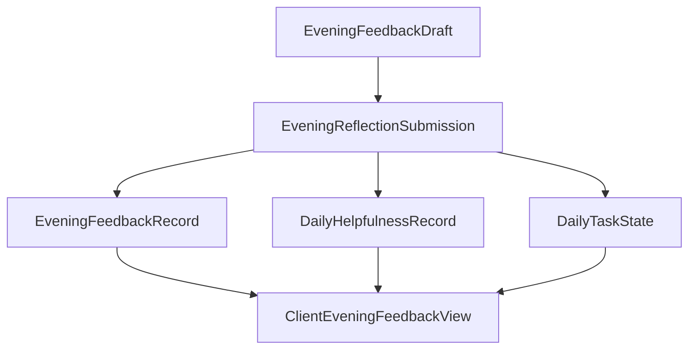

# DailyEnergy 晚间反馈 Schema

- **文档状态**：Accepted
- **接受日期**：2026-07-20
- **所属任务**：S-08 — 晚间反馈与七天总结 Schema
- **最后更新**：2026-07-20
- **适用范围**：EVE-001 晚间真实记录、本地草稿、提交修订、帮助度与任务状态组合、历史只读和删除失效
- **上游规范**：[用户旅程](../product/journey.md)、[第一阶段 MVP](../product/mvp.md)、[产品状态机](../product/state-machine.md)、[业务规则](../product/business-rules.md)、[页面规格](../design/screen-specs.md)、[交互状态](../design/interaction-states.md)、[内容布局](../design/content-layout.md)、[今日内容 Schema](./daily-content-schema.md)
- **下游任务**：S-09 可执行共享 Schema、S-17～S-20 数据与接口、S-21 隐私、S-24～S-25 埋点与指标

## 1. 文档目的

本文定义 DailyEnergy 晚间反馈的唯一文档级契约。晚间反馈是用户对真实一天的主动回顾，不是对“今日能量”是否应验的验证，也不是一轮 AI 对话。

本文必须保证：

1. 约十秒完成整体感受和建议帮助度；
2. 任务状态复用既有真实记录，不在反馈中复制；
3. 可选一句话保持最小化、可清除且不自动升级为记忆；
4. 本地草稿、提交命令、权威记录、修订和客户端视图互相分离；
5. 同一产品日期最多一份有效晚间反馈，重复提交幂等；
6. 多端冲突不能静默覆盖真实记录；
7. 跨日、Offline、删除、Safety 和未知结果保持上游边界；
8. 本文可以无歧义转换为 S-09 的可执行 Schema，但当前不创建代码。

## 2. 规范用语与术语

### 2.1 规范强度

- **必须**：下游 Schema 和实现不得绕过；
- **应该**：默认设计，偏离需要单独评审；
- **可以**：不改变不变量时允许；
- **禁止**：客户端、服务端、AI、模板和分析链路都不能触发。

### 2.2 术语

| 术语       | 定义                                                          |
| ---------- | ------------------------------------------------------------- |
| 产品日期   | 由权威日期服务确定的每日归属，不使用设备日期决定写入          |
| 整体感受   | 用户对这一天主观体验的单选真实记录，不是晨间情绪的覆盖值      |
| 内容帮助度 | 用户对当日建议的真实评价，权威记录独立于晚间反馈              |
| 任务状态   | 用户对当日可选任务的真实标记，权威记录独立于晚间反馈          |
| 反思提交   | EVE-001 “保存今天”发出的协调命令，可以原子更新三个独立事实    |
| 本地草稿   | 尚未被服务端接受的设备状态，不是业务事实，也不能进入总结      |
| 修订       | 同一逻辑记录成功修改后的单调递增版本                          |
| 结果未知   | 请求可能已被服务端接受，但客户端尚未获得权威结果              |
| 续写资格   | 边界前已合法打开 EVE-001 后，由服务端授予的有限原日期写入资格 |

## 3. S-08 晚间反馈决策摘要

以下结论已于 2026-07-20 接受，成为后续任务必须继承的约束：

|   # | 问题         | 推荐结论                                                                   |
| --: | ------------ | -------------------------------------------------------------------------- |
|   1 | 必填真实字段 | 整体感受与内容帮助度必选；两者均提供中性有效枚举                           |
|   2 | 任务结果     | EVE-001 显示并可更新既有 DailyTaskState；不在反馈记录复制                  |
|   3 | 可选一句话   | 允许单行 1～80 字；不填时省略，可在同日明确清除                            |
|   4 | 帮助度复用   | CMP-010 与 EVE-001 读写同一 DailyHelpfulnessRecord，并新增明确 NOT_USED 值 |
|   5 | 对象分层     | 草稿、协调提交、反馈记录、受限修订和客户端视图使用不同契约                 |
|   6 | 保存原子性   | 一次“保存今天”中所有有意更新全部成功或全部不写入                           |
|   7 | 唯一性       | 每用户每产品日期最多一份有效反馈记录；更新增加 revision                    |
|   8 | 冲突         | 使用各组件 expected revision；任一冲突都先读最新，不做最后写入者覆盖       |
|   9 | 跨日         | 只允许 OPEN 或服务端确认的 CONTINUATION_ONLY；历史页只读                   |
|  10 | Offline      | 可以保留当前会话草稿，但禁止排队、后台补交或改写到新日期                   |
|  11 | Safety       | 可选文本先审核；高风险时不提交普通记录，立即进入 Safety 覆盖               |
|  12 | 记忆与 AI    | P0 不把晚间自由文本自动送入 AI、周总结、长期记忆或分析平台                 |
|  13 | 空值         | 已提交对象不使用 null、空字符串或占位值；清除通过显式 patch 操作           |
|  14 | 删除         | DAY 删除使反馈及其修订、缓存和总结引用不可读；不保留幽灵文本               |
|  15 | 客户端输出   | 客户端接收显式 ClientEveningFeedbackView，而不是内部记录裁剪               |

## 4. 对象边界与数据流

### 4.1 五个契约对象

| 对象                        | 写入者       | 权威用途                        | 持久性                 | 客户端可见 |
| --------------------------- | ------------ | ------------------------------- | ---------------------- | ---------- |
| EveningFeedbackDraft        | 当前设备     | 未提交选择与一句话              | 仅当前合法会话         | 是，本地   |
| EveningReflectionSubmission | 客户端命令   | 表达一次原子保存意图            | 幂等与受限审计         | 只用于请求 |
| EveningFeedbackRecord       | 反馈服务     | 当日整体感受与可选一句话        | 同日修订，之后历史只读 | 通过视图   |
| EveningFeedbackRevision     | 反馈服务     | 冲突、审计与数据权利处理        | 受限，按 S-18          | 否         |
| ClientEveningFeedbackView   | 服务端聚合器 | EVE-001 和 REC-002 安全读写视图 | 可缓存并随修订失效     | 是         |

DailyHelpfulnessRecord 与 DailyTaskState 已是独立权威事实。EVE-001 只是把它们和 EveningFeedbackRecord 组合成一次轻量交互，不创建新的 `daily_status` 或复制字段。

### 4.2 数据流



任一组件校验或修订冲突时，B 不产生部分写入。

## 5. 身份、版本与时间

### 5.1 字段

| 字段                 | 示例                              | 规则                               |
| -------------------- | --------------------------------- | ---------------------------------- |
| `contract`           | `evening-feedback`                | 契约家族固定标识                   |
| `schema_version`     | `1.0.0`                           | 结构版本                           |
| `feedback_id`        | 不透明 ID                         | 同一逻辑反馈的稳定引用             |
| `user_ref`           | 内部引用                          | 只在服务端                         |
| `product_date`       | `2026-07-20`                      | 权威归属，YYYY-MM-DD               |
| `revision`           | `3`                               | 成功创建为 1，修改后单调递增       |
| `first_submitted_at` | RFC 3339 UTC                      | 首次成功提交时间，之后不变         |
| `updated_at`         | RFC 3339 UTC                      | 当前修订生效时间                   |
| `submission_id`      | 不透明 ID                         | 一次客户端保存意图的幂等引用       |
| `write_window`       | OPEN / CONTINUATION_ONLY / CLOSED | 服务端派生资格，不持久化成反馈内容 |

具体产品时区、边界和续写时长由 S-10 决定。任何时间戳都不能替代 `product_date`。

### 5.2 逻辑唯一性

同一逻辑用户和产品日期最多一份有效 EveningFeedbackRecord。多次保存修改同一 `feedback_id`，不得创建第二份“晚间反馈”。

幂等规则：

- 同一 `submission_id` 与相同规范化载荷返回原结果；
- 同一 `submission_id` 与不同载荷拒绝；
- 客户端超时不能换新 ID 猜测重提，必须先查询原意图或当前视图；
- 具体唯一键和错误码由 S-19 / S-20 决定。

## 6. 用户真实字段

### 6.1 整体感受

`overall_feeling` 必须是：

| 枚举             | 默认中文 | 安全语义                   |
| ---------------- | -------- | -------------------------- |
| `VERY_HEAVY`     | 很费力   | 用户认为这一天整体负担很重 |
| `SOMEWHAT_HEAVY` | 有点费力 | 用户认为这一天有一些负担   |
| `STEADY`         | 平稳     | 用户认为这一天整体平稳     |
| `PRETTY_GOOD`    | 还不错   | 用户认为这一天总体较顺     |
| `LIGHT`          | 很轻松   | 用户认为这一天整体轻松     |
| `UNSURE`         | 说不准   | 用户主动表示无法或不想归类 |

`UNSURE` 是有效真实值，不是未回答、空值、低质量或错误。整体感受描述一天，不覆盖晨间 `mood`，也不能反向改写今日内容。

### 6.2 内容帮助度

权威 DailyHelpfulnessRecord 使用：

| 状态/值       | 含义                                                  |
| ------------- | ----------------------------------------------------- |
| `UNRATED`     | 没有用户评分事实；只用于读取状态，不作为已提交 rating |
| `HELPFUL`     | 用户选择“有帮助”                                      |
| `NEUTRAL`     | 用户选择“一般”                                        |
| `NOT_HELPFUL` | 用户选择“没帮助”                                      |
| `NOT_USED`    | 用户选择“未使用/没有尝试”                             |

`NOT_USED` 不等于 `NOT_HELPFUL`。未评分也不能在聚合时自动归为任一负面值。

CMP-010 与 EVE-001 使用同一 `helpfulness_id + revision`。如果用户已在今日页评分，EVE-001 预填该值；保存相同值是幂等 no-op，修改则更新同一记录。

### 6.3 任务状态

EVE-001 读取并可以更新 S-07 任务定义对应的 DailyTaskState：

- `UNMARKED`；
- `INTERESTED`；
- `COMPLETED`；
- `SKIPPED`。

任务更新可省略。省略表示保持当前权威状态，不表示任务失败。EVE-001 不允许创建任务、改变 `task_id`、覆盖任务文案或产生新的完成奖励。

### 6.4 可选一句话

`note` 可以省略；存在时必须：

- 1～80 个展示字符；
- 单行纯文本，规范化换行和多余空白；
- 不执行其中的 URL、Markdown、HTML、代码或指令；
- 不自动成为长期记忆、重要事项、用户画像或模型训练标签；
- 不写入普通日志、分析属性、通知或分享；
- 在保存前经过 Safety 与最小化校验。

空白文本不保存。用户清除已有一句话时使用显式 CLEAR patch，不传 null 或空字符串。

## 7. EveningReflectionSubmission

### 7.1 必需结构

提交命令至少包含：

- `contract: evening-reflection-submission`；
- `schema_version`；
- `submission_id`；
- `product_date`；
- `expected_feedback_revision`：不存在时为 0；
- `expected_helpfulness_revision`：UNRATED 时为 0；
- `overall_feeling`；
- `helpfulness_rating`；
- 可选 `task_patch`；
- 可选 `note_patch`；
- `client_context`：只含入口来源和客户端契约版本，不含分析画像。

客户端不得发送 `user_ref`、`feedback_id` 的自选值、服务端时间、写入窗口、关系阶段、今日分数或模型字段。

### 7.2 Patch 语义

`task_patch` 存在时包含：

- `task_id`：必须等于当日已发布任务；
- `expected_revision`；
- `status`：允许的任务状态。

`note_patch` 只允许：

```json
{
  "operation": "SET",
  "value": "下午把最难的一件事拆小后，心里轻了一点。"
}
```

或：

```json
{
  "operation": "CLEAR"
}
```

省略 `note_patch` 表示新建时没有一句话，或编辑时保持现值。`SET` 必须带 value；`CLEAR` 禁止带 value。

### 7.3 完整提交示例

```json
{
  "contract": "evening-reflection-submission",
  "schema_version": "1.0.0",
  "submission_id": "ers_example_001",
  "product_date": "2026-07-20",
  "expected_feedback_revision": 0,
  "expected_helpfulness_revision": 0,
  "overall_feeling": "STEADY",
  "helpfulness_rating": "HELPFUL",
  "task_patch": {
    "task_id": "task_close_one_background",
    "expected_revision": 1,
    "status": "COMPLETED"
  },
  "note_patch": {
    "operation": "SET",
    "value": "下午把最难的一件事拆小后，心里轻了一点。"
  },
  "client_context": {
    "entry_source": "TODAY_EVENING_CARD",
    "view_schema_version": "1.0.0"
  }
}
```

入口枚举只用于产品行为分析，可以是 `TODAY_SECONDARY`、`TODAY_EVENING_CARD`、`REMINDER_DEEP_LINK` 或 `EDIT_EXISTING`；它不改变保存资格。

## 8. 服务端权威记录

### 8.1 EveningFeedbackRecord

```json
{
  "contract": "evening-feedback",
  "schema_version": "1.0.0",
  "feedback_id": "ef_example_20260720",
  "user_ref": "user_example",
  "product_date": "2026-07-20",
  "revision": 1,
  "overall_feeling": "STEADY",
  "note": "下午把最难的一件事拆小后，心里轻了一点。",
  "first_submitted_at": "2026-07-20T12:10:00Z",
  "updated_at": "2026-07-20T12:10:00Z",
  "source_submission_id": "ers_example_001",
  "safety_policy_version": "safety-example-v1"
}
```

DailyHelpfulnessRecord 与 DailyTaskState 不嵌入该对象。提交服务可以在同一原子操作中更新它们，但各自保留独立 ID、revision、权限和删除语义。

### 8.2 EveningFeedbackRevision

受限修订至少记录：

- `feedback_id`；
- `revision`；
- `changed_fields` 的字段名集合；
- `source_submission_id`；
- `changed_at`；
- 修改来源类型；
- Safety 与删除处理所需的最小审计信息。

修订审计不复制无必要的自由文本，不进入客户端、Prompt 或分析。物理保留和删除由 S-18 决定。

## 9. ClientEveningFeedbackView

### 9.1 白名单字段

客户端视图可以包含：

- 契约与产品日期；
- `availability`；
- 写入窗口与中性说明；
- 整体感受选项和当前值；
- 帮助度选项、当前值和 revision；
- 当日任务 ID、显示文本、当前状态和 revision；
- 可选一句话和字符上限；
- 反馈 revision、提交时间和更新时间；
- 主操作模式 SAVE / SAVE_CHANGES / READ_ONLY；
- 一条保存后固定短收尾。

不得包含用户内部引用、修订审计、Safety 分类、源提交载荷、模型字段、今日分数或其他日期的记录。

### 9.2 客户端示例

```json
{
  "contract": "evening-feedback-view",
  "schema_version": "1.0.0",
  "product_date": "2026-07-20",
  "availability": "EDITABLE_SUBMITTED",
  "write_window": "OPEN",
  "feedback": {
    "revision": 1,
    "overall_feeling": "STEADY",
    "note": "下午把最难的一件事拆小后，心里轻了一点。",
    "first_submitted_at": "2026-07-20T12:10:00Z",
    "updated_at": "2026-07-20T12:10:00Z"
  },
  "helpfulness": {
    "revision": 1,
    "rating": "HELPFUL"
  },
  "task": {
    "task_id": "task_close_one_background",
    "instruction": "现在关闭一个会分散注意力的页面。",
    "revision": 2,
    "status": "COMPLETED"
  },
  "options": {
    "overall_feeling": [
      "VERY_HEAVY",
      "SOMEWHAT_HEAVY",
      "STEADY",
      "PRETTY_GOOD",
      "LIGHT",
      "UNSURE"
    ],
    "helpfulness": ["HELPFUL", "NEUTRAL", "NOT_HELPFUL", "NOT_USED"],
    "task_status": ["UNMARKED", "INTERESTED", "COMPLETED", "SKIPPED"]
  },
  "note_max_characters": 80,
  "primary_action": "SAVE_CHANGES",
  "completion_message": "今天先到这里，这些记录已经留下了。"
}
```

### 9.3 Availability

| 枚举                  | 含义                          | 页面行为                   |
| --------------------- | ----------------------------- | -------------------------- |
| `UNAVAILABLE`         | 无 AVAILABLE 今日结果或被覆盖 | 不进入普通表单             |
| `EDITABLE_EMPTY`      | 可写且尚未提交                | 显示保存今天               |
| `EDITABLE_SUBMITTED`  | 可写且已有记录                | 预填并显示保存修改         |
| `READ_ONLY_SUBMITTED` | 历史或窗口关闭且有记录        | 展示真实记录，不显示保存   |
| `READ_ONLY_EMPTY`     | 历史或窗口关闭且无记录        | 显示“这天没有留下晚间记录” |

18:00 前后的入口提升是页面派生状态，不改变上述写入资格。

## 10. 草稿、跨日与 Offline

### 10.1 本地草稿

草稿最多包含当前表单选择、note、目标产品日期、用户会话指纹、基础 revisions 和创建时间。它必须：

- 只在相同逻辑用户、产品日期、视图版本和合法写入窗口恢复；
- 服务端已有更新时先展示冲突，不自动套用；
- 日期变更且无续写资格时丢弃；
- 注销、关系/账户删除、Safety 覆盖或用户切换时清除；
- P0 默认不跨小程序终止持久保存自由文本。

### 10.2 跨日

- OPEN：可以首次提交或修改原日期；
- CONTINUATION_ONLY：仅边界前合法打开的 EVE-001 可以完成一次原日期保存或修改；
- CLOSED：表单只读，不能补填或改写到当前日期；
- 边界前已被服务端接受的命令按 COMMAND_COMMIT 继续归原日期；
- 通知深链不能凭自身获得续写资格。

精确窗口由 S-10 固化，客户端不根据设备时间自行延长。

### 10.3 Offline

Offline 时可以读取已缓存的安全视图并保留当前会话草稿，但：

- 保存和修改禁用；
- 不创建后台同步队列；
- 不乐观显示已提交；
- 恢复后先读取 write_window、反馈、帮助度和任务最新 revisions；
- 只有用户再次主动确认后才提交。

## 11. 校验与原子保存

### 11.1 校验顺序

1. 账户、必要同意、Safety、删除和维护覆盖；
2. 逻辑用户、目标 product_date 和 AVAILABLE 今日结果；
3. OPEN / CONTINUATION_ONLY 服务端资格；
4. submission_id 幂等载荷；
5. 反馈、帮助度和可选任务 expected revisions；
6. 枚举、引用、字符和 patch 结构；
7. note 最小化、纯文本与 Safety；
8. 在一个原子操作中创建/更新权威记录；
9. 返回重新计算的 ClientEveningFeedbackView；
10. 失效周聚合、历史详情和相关缓存。

### 11.2 失败不部分写入

以下任一情况都不保存任何本次有意更新：

- 反馈或帮助度缺失；
- task_id 不匹配当日结果；
- 任一 revision 冲突；
- 日期窗口关闭；
- note 不合法或 Safety 命中；
- 幂等键复用不同载荷；
- 原子提交失败。

已存在的旧记录保持不变，客户端草稿不因可恢复失败被清空。

## 12. 冲突、未知结果与错误语义

| 情况               | 产品语义           | 客户端动作                     |
| ------------------ | ------------------ | ------------------------------ |
| 同键同载荷重复     | 已保存的同一结果   | 读取最新视图，不重复收尾       |
| 任一 revision 冲突 | 当前草稿基于旧事实 | 读取最新值，让用户明确是否应用 |
| 客户端超时         | 结果未知           | 查询 submission_id 或最新视图  |
| 确认服务端未接受   | 仍未提交           | 用户可用同一意图主动重试       |
| CLOSED             | 原日期不可普通修改 | 转只读并提供去今天             |
| Offline            | 无权威写入能力     | 保留会话草稿，禁用保存         |
| Safety 命中        | 普通流程被覆盖     | 不显示普通成功，进入 SAFE-001  |
| DAY 删除中         | 数据不可普通修改   | 进入删除任务状态               |

禁止把网络错误显示为“保存成功”，也禁止因为超时自动创建另一个 submission_id。

## 13. 空值、可选字段与未知字段

- 已提交命令、记录和客户端视图不使用 null；
- 必需字符串为空或只有空白时失败；
- 可选 note 没有值时省略；
- 清除 note 使用 `{ operation: CLEAR }`；
- `UNSURE`、`NOT_USED`、`UNRATED` 和字段缺失有不同语义；
- 服务端命令与内部记录严格拒绝未知字段；
- 客户端同 major 的未知展示字段可以忽略，但不能自动渲染；
- 未知枚举不得直接显示字符串；
- 不接受 `raw_model_output`、`daily_score`、`prediction_accuracy`、`memory_candidate` 或任意 HTML/Markdown 渲染字段。

## 14. 隐私、Safety 与数据使用

### 14.1 P0 允许用途

| 数据     | 允许用途                                   |
| -------- | ------------------------------------------ |
| 整体感受 | 当日历史详情、七天确定性聚合和用户可见总结 |
| 帮助度   | 产品内回看、建议类型聚合和去标识质量指标   |
| 任务状态 | 当日回看、七天完成计数和产品行为分析       |
| 一句话   | 当日/历史日用户本人回看和 Safety 检查      |

P0 不把一句话发送给普通 AI、周总结 Prompt、长期记忆、通知、分享、渠道参数或分析平台。未来扩大用途必须明确告知、最小化并重新评审。

### 14.2 Safety

- note 在普通记录写入前检查；
- 高风险命中时反馈、帮助度和任务的本次协调更新都不普通提交；
- 进入经过审核的 SAFE-001，不继续普通收尾或生成内容；
- Safety 服务只保留处理所需最小信息，具体分类和期限由 S-15 / S-18 决定；
- 结构化选择本身不能被系统扩展成诊断或危机推断。

## 15. 历史、更正与删除

### 15.1 同日修改

OPEN 或合法 CONTINUATION_ONLY 内可以更新同一逻辑记录。更新增加相关记录 revision；`first_submitted_at` 不变，`updated_at` 更新。修改不重生成今日内容、不改变点亮和关系。

### 15.2 历史只读

窗口关闭后 REC-002 只显示当前允许的记录：

- 有反馈时显示整体感受、可选一句话和更新时间；
- 无反馈时显示真实缺失；
- 不补填、不普通更正、不显示“错过”；
- 数据权利所需更正由 S-18 的专门流程决定。

### 15.3 删除

DAY 删除成功后：

1. EveningFeedbackRecord 与客户端视图不可读；
2. 受限修订按 S-18 清除或最小保留；
3. 当日帮助度、任务和点亮按 DAY 范围失效；
4. 周源快照、聚合、总结和缓存失效；
5. 客户端只看到缺失日期，不看到幽灵 note；
6. 当前日明确重新开始产生全新的用户意图，不恢复旧反馈。

## 16. 页面组合边界

EVE-001 可以组合：

```text
ClientEveningFeedbackView
+ CurrentDailyResultReference
+ DailyHelpfulnessRecordView
+ DailyTaskStateView
+ SystemDisplayState
```

该组合不是一份可写 `daily_record`。REC-002 使用同一安全视图的 READ_ONLY 形态，不自行解释或复制字段。

## 17. 下游必须继承的约束

### 17.1 S-09 Schema

- 落实全部枚举、字符、互斥 patch、数组和未知字段规则；
- 为 submission、record、revision 和 client view 建立不同类型；
- 为 create/update、SET/CLEAR、冲突和幂等建立正负样例；
- 共享 HelpfulnessRating 与 TaskStatus，不复制枚举。

### 17.2 数据库与 API

- 强制用户 + product_date 反馈逻辑唯一；
- feedback、helpfulness 和 task 各自修订，并支持协调原子提交；
- 同键同载荷与同键不同载荷可区分；
- 超时后能查询原 submission 结果；
- DAY 删除传播到派生和缓存；
- 自由文本加密、访问、日志和保留符合 S-18 / S-21。

### 17.3 前端

- 约十秒，整体感受和帮助度直接可选；
- task 预填当前事实，不完成没有负面文案；
- note 最后出现且明确可不填；
- Pending 防重复；冲突不清草稿；Offline 禁写；
- 同一时刻只突出保存或保存修改；
- 保存后只显示固定短收尾，不插入长文、分享或聊天。

### 17.4 测试与埋点

至少测试：

1. 同日重复保存只产生一份反馈；
2. 同键不同载荷被拒绝；
3. 任一组件冲突不产生部分写入；
4. UNSURE 与缺失分开；
5. NOT_USED 与 NOT_HELPFUL 分开；
6. task 省略不改变状态；
7. note SET / CLEAR / 省略互不混用；
8. Offline 不自动补交；
9. CLOSED 不写到当前日期；
10. DAY 删除后 note 不可恢复；
11. Safety 命中不显示普通成功；
12. 客户端视图不含内部审计和今日分数。

埋点只记录入口、是否完成字段、耗时、保存结果、修改、冲突和 Safety 分支类别；不记录选项原值、note、内部 ID 或完整载荷。

## 18. 验收场景

### 18.1 首次正常保存

用户选择整体感受和帮助度，不改任务、不填一句话。命令原子创建反馈与帮助度；task 保持原状；客户端显示已提交且 note 省略。

### 18.2 复用今日页帮助度

用户已在 CMP-010 选择 HELPFUL。EVE-001 预填同一记录，保存相同值不创建第二份评分，也不增加无意义 revision。

### 18.3 未使用建议

用户选择 NOT_USED。周聚合把它计为明确未使用，不把它算作没帮助，也不生成责备文案。

### 18.4 任务未完成

用户保持 UNMARKED 或选择 SKIPPED，反馈仍可正常保存；点亮、关系和总结资格不受惩罚。

### 18.5 清除一句话

用户编辑已提交记录并发送 CLEAR。新修订省略 note；客户端、历史缓存和周源快照不再出现旧文本。

### 18.6 多端冲突

设备 A 保存 revision 3；设备 B 仍用 expected revision 2。整个 B 命令拒绝，读取 revision 3 后让用户明确处理草稿。

### 18.7 客户端超时

服务端已提交但响应丢失。客户端显示结果未知，恢复后用 submission_id 查到成功，不重复收尾或写入。

### 18.8 阅读中跨日

边界前已打开 EVE-001 且服务端仍返回 CONTINUATION_ONLY，提交明确写回原日期。资格关闭后同一页面转只读。

### 18.9 过期深链

用户次日打开昨日提醒，目标日期 CLOSED。系统不显示空表单，进入 REC-002 只读或当前今日路径。

### 18.10 Offline

用户可查看缓存和填写当前会话草稿，但保存禁用。恢复后先刷新 revisions，用户再次确认才提交。

### 18.11 Safety 命中

note 命中高风险。本次普通协调更新不写入，停止普通收尾并进入 SAFE-001；不得仅删除 note 后静默保存其他字段。

### 18.12 单日删除

DAY 删除后反馈、帮助度、任务、客户端缓存和周派生全部失效；REC-001 只显示该日期缺失。

## 19. 明确推迟的决定

| 决定                                         | 负责任务    | 本文固定边界                     |
| -------------------------------------------- | ----------- | -------------------------------- |
| 可执行 Zod/JSON Schema、字符算法和共享类型   | S-09        | 必须落实本文全部约束             |
| 产品时区、OPEN 与 CONTINUATION_ONLY 精确时长 | S-10        | 原日期不迁移，历史关闭后只读     |
| Safety 分类、固定响应和受限事件              | S-15        | 高风险不走普通保存收尾           |
| 反馈、帮助度、任务和修订领域实体             | S-17        | 权威事实分开，可原子协调         |
| 自由文本加密、修订保留和物理删除             | S-18        | 活跃产品和派生不得读取已删文本   |
| 唯一键、事务、锁和缓存                       | S-19        | 同日唯一、冲突不覆盖、无部分写入 |
| API 路径、幂等键格式和错误码                 | S-20        | 能表达冲突、未知结果和日期关闭   |
| 隐私数据地图与访问审计                       | S-21        | note 不进入普通日志、分析和 AI   |
| 事件名、耗时与完成率指标                     | S-24 / S-25 | 埋点不含真实选项和自由文本       |

## 20. 完成与审核清单

- [x] 对象边界与权威事实明确；
- [x] 整体感受、帮助度和任务语义明确；
- [x] 一句话长度、清除、隐私与 Safety 明确；
- [x] 提交、记录、修订和客户端示例完整；
- [x] 原子保存、幂等、冲突和未知结果完整；
- [x] OPEN、续写、历史和 Offline 边界完整；
- [x] null、空值、未知字段和版本规则明确；
- [x] 删除传播和周总结依赖明确；
- [x] 页面组合和下游约束明确；
- [x] 12 个验收场景完整；
- [x] 用户已于 2026-07-20 审核确认，本文从 Draft 更新为 Accepted。

本文已于 2026-07-20 接受。合并后可以开始 S-09，但仍不创建正式前端、后端、数据库或 API 实现。
