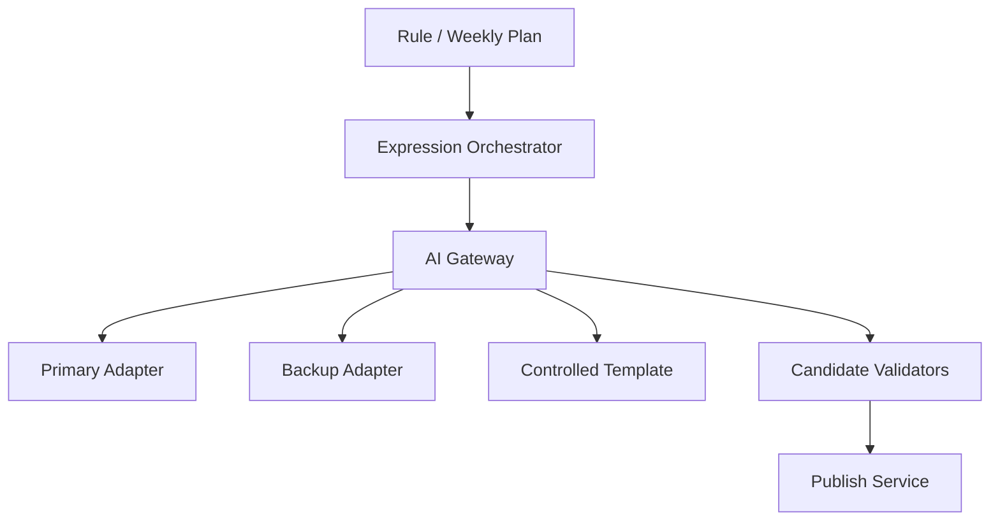

# DailyEnergy AI Gateway 规范

- **文档状态**：Draft
- **所属任务**：S-12 — AI Gateway 决策与规范
- **最后更新**：2026-07-22
- **适用范围**：Daily / Weekly 受控表达调用、provider adapter、路由、超时、失败、降级、熔断、成本、隐私和可观测性
- **上游规范**：[数字朋友人格](./personality.md)、[今日内容 Schema](./daily-content-schema.md)、[七天趋势与总结 Schema](./weekly-summary-schema.md)、[确定性生成引擎](./generation-engine.md)、[评分与规则选择](./scoring-rules.md)、[ADR-0002](../decisions/ADR-0002-deterministic-daily-result.md)
- **决策 ADR**：[ADR-0003 AI Provider Abstraction](../decisions/ADR-0003-ai-provider-abstraction.md)
- **下游任务**：S-13、S-15～S-20、S-25、S-29、S-31、S-33、AI-001～AI-006、AI-011

## 1. 文档目的

本文把 ADR-0003 转换为可实现、可测试的 Gateway 契约。核心验收句是：

> 对任一合法、冻结的表达 invocation，Gateway 只能使用批准的最小输入，按有限的 primary → backup → controlled template 路径产生第一份完整合格 candidate，或返回唯一的规范失败；任何路径都不能改变事实、拼接内容或绕过 Safety、删除、预算与 deadline。

Gateway 负责“怎样安全地得到完整表达”，不负责“今天的事实是什么”。

## 2. 权威边界

本文继承且不得重开：

- RuleFacts、Daily ControlledExpressionPlan、WeeklyAggregateFacts 和 WeeklyExpressionPlan 由确定性服务产生；
- AI 只能填写严格 ExpressionPayload 的文本槽位；
- primary、backup、template 使用逐字段相同的事实与计划；
- 任一字段失败都丢弃整份 candidate，禁止局部发布；
- 第一份完整合格 candidate 由发布服务原子保存；
- 同用户同产品日期只有一份 AVAILABLE 每日结果；
- 已发布内容不因模型、Prompt、路由或供应商恢复而替换；
- Safety、Deleting、账户与日期窗口优先于普通生成；
- Daily v1 不解析 permitted context，Weekly 不读取 raw notes、每日 AI 文本或娱乐分数；
- provider、model、Prompt、Token、失败与审核细节不进入客户端。

发生冲突时，以 Accepted ADR、Schema 和生成引擎为准。

## 3. 范围

### 3.1 本文负责

- Gateway / adapter / route registry / template renderer 的职责；
- Daily 与 Weekly workload 输入、输出和版本绑定；
- route snapshot、attempt、candidate 与 outcome 的概念契约；
- primary、backup、template 的顺序和尝试上限；
- 超时、取消、未知结果、熔断、并发、限流和成本；
- 结构、事实、人格、隐私和 Safety 校验顺序；
- provider usage 与失败归一化；
- 最小披露、密钥、日志、指标和原始响应策略；
- 发布前、配置发布和回滚所需的验证矩阵。

### 3.2 本文不负责

- 生产 TypeScript、NestJS module、队列、数据库或 API；
- S-13 的 Prompt 全文和句式策略；
- S-14 的结构化记忆解析与源依赖；
- S-15 的风险分类器、地区资源和固定安全响应；
- S-16 的最终模型排名、阈值与人工评分；
- S-17～S-20 的实体、表、事务、外部错误码和缓存键；
- S-25/S-33 的业务指标目标与报警接收人；
- 具体云厂商合同、数据区域和采购承诺；
- 客户端等待动画或最终错误文案。

## 4. 组件与依赖方向



| 组件 | 可以做 | 禁止做 |
| --- | --- | --- |
| Expression Orchestrator | 冻结 invocation、检查 live guards、请求 Gateway、交给发布服务 | 直接调用 provider、拼接候选 |
| AI Gateway | 解析 route、预算与熔断、顺序调用、验证完整 candidate | 读业务数据库、重算 facts、直接发布 |
| Provider Adapter | 认证、协议映射、取消、结构化输出、usage 归一化 | 决定 Prompt、重试、业务降级、安全结论 |
| Controlled Template | 用精确 plan/template version 生成完整 payload | 查询当前目录、选择另一 action 或 facts |
| Candidate Validators | 严格验证结构、绑定、人格、隐私与 Safety | 自动修补、删除失败字段、改写文本 |
| Publish Service | 重查守卫、唯一性、原子发布 | 重新调用模型、选择“更好文案” |

业务 package 不能依赖 provider SDK；只有 adapter package 可以依赖。管理后台也只能管理受审 route manifest，不能发送任意 Prompt 调用生产 provider。

## 5. Workload 与版本

v1 只有两个普通表达 workload：

| workload | 输入事实 | 输出 | 失败后的用户能力 |
| --- | --- | --- | --- |
| `DAILY_EXPRESSION_V1` | RuleFacts + ControlledExpressionPlanV1 安全投影 | `ExpressionPayloadSchema 1.0.0` | template 成功仍可完成今日；全失败为 F4 |
| `WEEKLY_EXPRESSION_V1` | WeeklyExpressionPlan + approved fact value map | `WeeklyExpressionPayloadSchema 1.0.0` | 图表/计数始终可读；全失败只使 summary FAILED |

以下 workload 不属于普通 Gateway：高风险固定响应、开放聊天、记忆抽取、自由文本分类、embedding、图片、语音、网页检索和管理端任意测试。未来增加必须单独定义输入、输出、Safety、成本和数据用途，不能复用 Daily/Weekly token 偷渡。

每次 invocation 必须精确绑定：

- `gateway_contract_version = expression-gateway-v1`；
- `gateway_policy_version = gateway-policy-v1`；
- workload；
- route manifest version 与 fingerprint；
- input plan contract/version 与 fingerprint；
- output schema version；
- prompt version；
- template version；
- safety policy version；
- personalization level；
- overall deadline。

任何 `latest`、版本范围、缺失 version 或 fingerprint 不一致都在 provider 调用前失败。

## 6. 概念对象

这些对象用于约束 S-17～S-20，不向当前共享 Schema 增字段。

### 6.1 GatewayInvocationV1

```text
GatewayInvocationV1 {
  gateway_contract_version
  invocation_id
  workload
  owner_intent_ref
  owner_revision_ref?

  plan_contract_version
  plan_ref
  plan_fingerprint
  prepared_model_input

  output_schema_version
  prompt_version
  template_version
  safety_policy_version
  personalization_level

  route_manifest_version
  route_manifest_fingerprint
  accepted_at
  hard_deadline_at
}
```

- `owner_intent_ref` 是每日 generation intent 或周 summary revision intent 的不透明引用。
- invocation 不含 user ID、stable subject、seed、raw score 或客户端 token。
- `prepared_model_input` 必须是 S-13 根据计划创建的封闭安全对象；Gateway 不再去数据库补字段。
- 同一 invocation 的重放必须使用相同 plan、Prompt、Schema、template 和 route fingerprint。

### 6.2 RouteManifestV1

```text
RouteManifestV1 {
  manifest_version
  fingerprint
  gateway_policy_version
  workload
  status: STAGED | ACTIVE | DISABLED | RETIRED

  primary: ProviderRouteV1
  backup: ProviderRouteV1
  template: TemplateRouteV1

  input_limits
  output_limits
  invocation_cost_limit_microunits
  price_catalog_version
  compatible_prompt_versions[]
  compatible_output_schema_versions[]
  compatible_safety_policy_versions[]
}
```

`ProviderRouteV1` 至少冻结：

```text
role
adapter_id + adapter_version
provider_id
provider_account_ref
endpoint_id + endpoint_region
model_id + optional immutable_model_revision
provider_parameter_set_id
capability_profile_id
data_handling_profile_id
request_deadline_ms
connect_deadline_ms
max_output_tokens
price_entry_id
```

`TemplateRouteV1` 至少冻结 renderer ID/version、template compatibility/version、locale catalog version 和最大本地执行时间。

manifest registry 必须验证：

- primary 与 backup 不是同一个 endpoint/account 故障域；若相同，发布时明确标为非 provider-level redundancy；
- 两条 provider route 都支持单 JSON 对象、取消、usage 和禁用 tools；
- route 不使用隐式默认 model；
- template 与 workload、plan、output Schema 兼容；
- 所有 compatibility arrays 使用唯一稳定 token 和 canonical order；
- fingerprint 覆盖所有语义字段。

### 6.3 GatewayAttemptRecordV1

```text
GatewayAttemptRecordV1 {
  attempt_id
  invocation_id
  route_role: PRIMARY_AI | BACKUP_AI | CONTROLLED_TEMPLATE
  ordinal: 1 | 2 | 3
  request_fingerprint
  adapter_id?
  provider_id?
  endpoint_id?
  requested_model_id?
  observed_model_id?
  started_at
  finished_at
  outcome_code
  provider_request_ref?
  input_units?
  output_units?
  billed_cost_microunits?
  retry_after_ms?
  candidate_fingerprint?
}
```

record 只保存元数据，不保存 Prompt 正文、事实值或无效原始输出。`provider_request_ref` 必须不透明且不能包含账户、密钥或用户身份。

### 6.4 GatewayCandidateV1

```text
GatewayCandidateV1 {
  candidate_id
  invocation_id
  attempt_id
  workload
  generation_mode
  expression_payload
  payload_fingerprint
  validation_receipt
  provenance_projection
}
```

candidate 只在全部 validator 通过后存在。失败 attempt 不能产生“部分 candidate”。Gateway 不返回 provider raw response。

### 6.5 GatewayOutcomeV1

```text
GatewayOutcomeV1 =
  CANDIDATE_READY { candidate }
  | RETURN_EXISTING { owner_result_ref }
  | BLOCKED { reason }
  | CANCELLED { reason }
  | RETRYABLE_GATEWAY_FAILURE { reason }
  | TERMINAL_GATEWAY_FAILURE { reason }
```

外部 API code 由 S-20 决定，但不能改变这里的重试语义。

## 7. Prepared model input

### 7.1 Daily

Daily 模型最多接收：

- expression contract、output schema 与 Prompt version；
- ControlledExpressionPlan 中的 semantic slots、known/uncertain fields、allowed basis、style 与 effective constraints；
- preferred name（存在时）；
- 固定人格与禁止 claim class 的 S-13 投影；
- 严格 JSON Schema 或等价 provider structured-output declaration。

明确禁止：raw score、完整 action candidates、未选行动、root seed、choice trace、manifest、stable subject、revision/ref、真实用户 ID、provider route、permitted context ref 或内容、历史自由文本。

### 7.2 Weekly

Weekly 模型最多接收：

- plan 选择的 headline、1～2 个 observation、可选 helpful pattern、next plan 与 coverage/disclosure；
- `approved_fact_ids` 对应的安全显示值；
- 每个值的稳定 fact ID 与允许表述边界；
- WeeklyExpressionPayload 的严格 Schema 和人格/禁止规则。

禁止发送七日源引用、revision、raw notes、每日 AI 文本、娱乐五维/分数、未批准 catalog facts 或其它用户比较。

### 7.3 大小上限

`gateway-policy-v1` 的 pre-serialization UTF-8 上限：

| workload | prepared model input | provider response body | max output tokens |
| --- | ---: | ---: | ---: |
| Daily | 16 KiB | 12 KiB | 1200 |
| Weekly | 24 KiB | 12 KiB | 1000 |

超限时 fail closed，不截断事实、Schema 或 Prompt，不让 adapter 自行摘要。S-13 若无法在上限内表达，必须升级 Prompt 设计或明确新 policy version。

Token 是 provider-specific usage，不作为字符校验替代。最终文本仍服从 Schema 的展示字符上限。

## 8. 编排流程

```text
invoke(invocation):
  1. validate_closed_invocation
  2. validate_live_admission
  3. resolve_exact_route_manifest
  4. validate_route_manifest_and_compatibility
  5. check_size_and_cost_budget
  6. render_and_validate_template_preflight
  7. if existing result: return existing
  8. try PRIMARY_AI when breaker/rate/budget allow
  9. validate complete primary response
 10. if valid: return candidate
 11. try BACKUP_AI when breaker/rate/budget allow
 12. validate complete backup response
 13. if valid: return candidate
 14. revalidate preflight template against live policy
 15. return controlled-template candidate
 16. if template invalid or deadline impossible: hard failure
```

关键语义：

- template preflight 在付费调用前完成，保证 fallback package、plan 和 Schema 相容；
- preflight candidate 不提前发布，也不能绕过最后 Safety 校验；
- 每个 provider response 都作为独立完整对象校验；
- primary invalid 不把任何字段传给 backup；backup 仍读取原始 frozen input；
- template 读取原始 frozen plan，不读取两个模型的输出或失败原因；
- 任一时刻 existing、Safety、Deleting、取消或 deadline guard 触发，停止后续路径；
- 迟到响应只记录 `LATE_RESPONSE_DISCARDED`，不能参与发布。

## 9. 尝试、超时与取消

### 9.1 v1 预算

| workload | total Gateway deadline | primary deadline | backup deadline | local validation/template reserve |
| --- | ---: | ---: | ---: | ---: |
| Daily | 8000 ms | 4000 ms | 3000 ms | 至少 1000 ms |
| Weekly | 20000 ms | 8000 ms | 8000 ms | 至少 4000 ms |

- deadline 是硬上限，不是目标延迟；S-33 应建立更低的 SLO。
- queue wait、rate limiter wait、connect、body read、parse 和 validators 都包含在 total。
- primary 实际提前结束的剩余时间可供 backup；不能挪用最后 template reserve。
- 若开始某条 provider route 后无法保证剩余 reserve，则跳过该 route。
- Weekly 表达可后台完成；20 秒不遮挡已验证的真实图表和计数。
- Daily 生成页超过交互阈值可以显示中性等待状态，但不显示 provider、队列或百分比。

### 9.2 尝试上限

- primary provider call：0 或 1 次；
- backup provider call：0 或 1 次；
- template render：preflight 1 次，最终只复用或按同版本重校验，不改变内容；
- 总 provider calls：最多 2；
- 不存在同角色自动 retry、模型修复 call 或并行 hedge。

429/5xx/timeout 直接进入下一角色。`Retry-After` 只记录并影响 breaker；v1 不在当前 invocation 内等待它，因为等待会侵占 template reserve。

### 9.3 取消

Gateway 必须传播以下取消：

- caller deadline / disconnect；
- generation completion 窗口关闭；
- Safety overlay；
- account restricted/deleting/deleted；
- DAY 或 source deletion；
- intent/revision superseded；
- existing result 已由并发胜者发布；
- route 被紧急禁用。

adapter 必须支持 AbortSignal 或等价取消。供应商无法真正取消时，Gateway 仍隔离迟到响应；迟到成功不能改变 outcome。

## 10. Provider adapter 契约

每个 adapter 必须实现等价接口：

```text
capabilities() -> immutable CapabilityProfile
invoke(ProviderRequest, deadline, cancellation) -> ProviderResult
normalize_usage(raw_usage) -> NormalizedUsage
normalize_error(raw_error) -> GatewayProviderError
health_probe() -> HealthResult
```

adapter 可以：

- 注入服务器端认证；
- 把内部 strict schema 映射为 provider structured-output 格式；
- 映射 provider-native sampling 参数；
- 解析单个响应 envelope；
- 返回 observed model ID、request ref 与 usage；
- 脱敏 provider 错误。

adapter 禁止：

- 拼装业务 Prompt 或增删事实；
- 自行重试、回退或选择 model；
- 去掉 Markdown fence、从 prose 提取 JSON 或修复字段；
- 把 provider safety block 改写为安全内容；
- 把 provider 默认值伪装成 route manifest 决定；
- 记录 request/response body；
- 开启 tools、web、files、code、image 或 streaming。

### 10.1 Structured output capability

生产 primary/backup 默认都必须支持强约束结构化输出。若某 provider 只能提供 JSON mode：

- route manifest 必须明确 `strict_schema_native=false`；
- S-16 必须单独评估结构失败率；
- 服务端仍只接受一个严格 JSON object；
- 不提供 fence stripping 或 repair 特权；
- 未达到 route 质量 Gate 时不能进入 ACTIVE。

### 10.2 参数

Gateway 不假设不同供应商的 temperature、top-p 或 seed 语义等价。每条 route 引用不可变 provider-native parameter set。任何参数变化创建新 route revision，并进入 S-16 回归。

模型 seed 不能替代 ADR-0002 根种子，也不构成文本确定性承诺。

## 11. Candidate 校验

每个 provider/template 输出固定按以下顺序校验：

1. response body 大小与 UTF-8 有效性；
2. 顶层恰好一个 JSON object，无前后文本；
3. 对应 ExpressionPayload strict Schema，未知字段拒绝；
4. 空值、字符、长度、数组、纯文本、URL/HTML/Markdown/emoji 规则；
5. Daily action/task/ritual/dimension 与 plan 逐字段绑定；
6. Daily assertion mode、known/uncertain field 和 allowed basis 边界；
7. Weekly fact_refs 属于 plan，文本中的数字/日期/状态都能由 refs 解析；
8. 人格、称呼、低状态幽默、压力与非确定性语言；
9. source dependency / privacy fallback 完整性（v1 Daily/Weekly 默认为空或既定安全投影）；
10. 当前 Safety policy；
11. provenance 可完整组装且不含不允许字段；
12. 客户端白名单 projection preflight；
13. 生成不可逆 payload fingerprint 与 validation receipt。

任何一步失败：

- 不修改 payload；
- 不保留已通过字段；
- 不返回部分 candidate；
- 记录第一个稳定 reason 和 validator version；
- 进入下一完整路径。

validator 不允许调用另一模型。重复控制、措辞质量和事实忠实度的更强测试由 S-13/S-16 提供，但不能降低当前 strict checks。

## 12. 失败分类与路由

### 12.1 Admission / contract

| reason | 分类 | provider call | 行为 |
| --- | --- | ---: | --- |
| `INVOCATION_SCHEMA_INVALID` | terminal contract | 0 | 硬失败 |
| `PLAN_BINDING_INVALID` | terminal contract | 0 | 硬失败 |
| `ROUTE_MANIFEST_NOT_FOUND` | config | 0 | template 可用则 template，否则硬失败 |
| `ROUTE_FINGERPRINT_MISMATCH` | terminal config | 0 | 硬失败，不取 latest |
| `ROUTE_COMPATIBILITY_INVALID` | terminal config | 0 | 硬失败 |
| `TEMPLATE_PREFLIGHT_FAILED` | terminal config | 0 | 硬失败并告警 |
| `INPUT_LIMIT_EXCEEDED` | terminal contract | 0 | 硬失败，不截断 |
| `SAFETY_OVERLAY_ACTIVE` | blocked | 0 | 退出普通链路 |
| `OWNER_CANCELLED_OR_DELETED` | cancelled | 0 | 丢弃 |
| `RESULT_ALREADY_AVAILABLE` | existing | 0 | 读取胜者 |

`ROUTE_MANIFEST_NOT_FOUND` 只有在 invocation 的精确 template version 仍可独立验证时才能 template；不能查询“当前默认模板”。

### 12.2 Provider infrastructure

| reason | 下一路径 | breaker |
| --- | --- | --- |
| `PROVIDER_CONNECT_TIMEOUT` | 是 | infrastructure failure |
| `PROVIDER_RESPONSE_TIMEOUT` | 是 | infrastructure failure |
| `PROVIDER_NETWORK_ERROR` | 是 | infrastructure failure |
| `PROVIDER_RATE_LIMITED` | 是 | infrastructure failure，记录 retry-after |
| `PROVIDER_UNAVAILABLE` | 是 | infrastructure failure |
| `PROVIDER_AUTH_INVALID` | 是 | 立即 open，等待配置修复 |
| `PROVIDER_PROTOCOL_INVALID` | 是 | infrastructure failure |
| `PROVIDER_CONTENT_BLOCKED` | 是 | 单独计数，不解除产品 Safety |
| `PROVIDER_CANCELLED` | 视 owner reason | 不计供应商失败 |
| `LATE_RESPONSE_DISCARDED` | 否 | 继承原超时结果 |

### 12.3 Candidate quality

```text
OUTPUT_BODY_TOO_LARGE
OUTPUT_NOT_SINGLE_JSON_OBJECT
OUTPUT_SCHEMA_INVALID
OUTPUT_TEXT_FORMAT_INVALID
OUTPUT_FACT_BINDING_INVALID
OUTPUT_UNAPPROVED_FACT_REF
OUTPUT_PERSONALITY_INVALID
OUTPUT_PRIVACY_DEPENDENCY_INVALID
OUTPUT_SAFETY_REJECTED
OUTPUT_PROJECTION_INVALID
```

这些都丢弃整份 candidate，并允许下一完整路径。它们不计 infrastructure breaker，但进入独立 quality breaker 和 S-16 回归。

### 12.4 Budget / capacity

```text
INVOCATION_COST_LIMIT_EXCEEDED
GLOBAL_COST_HARD_STOP
ROUTE_CONCURRENCY_FULL
DEADLINE_RESERVE_REQUIRED
CIRCUIT_OPEN
BREAKER_STATE_UNAVAILABLE
```

全部跳过对应 provider 并保留 template。`BREAKER_STATE_UNAVAILABLE` 必须 fail closed 到 template，不能在看不见故障状态时盲调 provider。

## 13. 熔断与健康

### 13.1 Infrastructure breaker

key 固定为：

```text
provider_id + provider_account_ref + endpoint_id + model_id + workload
```

`gateway-policy-v1` 状态规则：

- 最近 5 次连续 infrastructure failure，或最近 20 次中失败率至少 50% 且样本至少 10，进入 OPEN；
- 初次 OPEN 60 秒；之后失败按 120、240、480、900 秒递增，最大 15 分钟；
- cooldown 后进入 HALF_OPEN，最多放行 2 个探测 invocation；
- 连续 2 个 infrastructure success 才 CLOSED；任一探测失败重新 OPEN；
- auth/config invalid 立即 OPEN，直到凭据或 route revision 明确变化，不靠时间自动恢复；
- owner cancellation、Safety、contract/output quality failure 不计 infrastructure denominator。

### 13.2 Quality breaker

同一 route 最近 20 个有响应样本中，若 Schema、fact binding、personality 或 Safety candidate failure 合计达到 30%，且样本至少 10：

- route 暂停接受新普通流量；
- 当前 invocation 进入下一路径；
- 触发 S-16 regression 与 route owner 告警；
- 只有新评测通过或授权 route revision 才恢复。

provider content block 单独观察；若它对应真实输入 Safety，普通链路本应更早被挡住，不能用 backup 掩盖分类缺陷。

### 13.3 状态一致性

breaker 必须使用共享、带 TTL 的权威状态或等价协调，不能只靠单进程内存声称生产熔断。状态存储故障时 template 优先。具体 Redis key、原子脚本和多区域方案由 S-29/S-33 决定。

## 14. 限流、并发与成本

### 14.1 并发

- 每条 provider route 有独立 global concurrency cap；
- 每个 owner intent/revision 同时最多一个 active invocation；
- 等待 semaphore 的时间计入 total deadline；
- 不能保证 template reserve 时不排队，直接 template；
- provider 的 429 不通过无限队列转嫁给用户；
- weekly background 不能挤占 daily 核心体验，使用独立 workload pool 或保留配额。

具体并发数是部署容量配置，不属于产品语义，但配置必须版本化、可观察并有硬上限。

### 14.2 成本预检

调用前按 route price entry、实际 input units 或保守估算、max output tokens 计算：

```text
estimated_max_cost =
  estimated_input_cost
  + max_output_cost
  + provider_fixed_request_cost
```

只有同时满足以下条件才能调用：

- 当前 invocation 累计实际成本 + estimated max cost 不超过 manifest ceiling；
- workload 日/月预算未 hard stop；
- provider account quota 未知时仍有安全 route ceiling；
- 价格目录未过期且单位/币种一致。

价格缺失、过期或无法换算时跳过 provider，不按 0 成本处理。

### 14.3 Budget state

| 状态 | 行为 |
| --- | --- |
| `NORMAL` | 按 route 执行 |
| `SOFT_LIMIT` | 告警；只允许 manifest 已审核的低成本 route revision，不临时换 model |
| `HARD_LIMIT` | 新 provider calls 停止，完整 template 继续 |

预算不能阻断 existing result 读取、确定性事实、真实周图表、删除或固定 Safety 响应。不能向用户显示“因为你成本高所以模板”。

## 15. 幂等、未知结果与并发

### 15.1 唯一 attempt

逻辑唯一键等价为：

```text
(invocation_id, route_role, ordinal)
```

同一 key + 同 request fingerprint 只允许一个 provider dispatch；不同 fingerprint 是 terminal conflict。provider 支持 idempotency header 时传递不可反查用户的 attempt ID。

### 15.2 未知 provider outcome

客户端或 Gateway timeout 后不能假设 provider 未接收请求：

1. 标记 attempt 为 `OUTCOME_UNKNOWN`；
2. 查询本地是否已有完整 candidate 或 published result；
3. 若没有且时间足够，进入下一 route role；
4. 不重复 dispatch 同一 role；
5. 迟到结果隔离；
6. 实际 usage 以后到达时补充成本元数据，不改变业务 outcome。

### 15.3 并发胜者

多个执行者即使产生不同合格文本，也只能由发布服务的唯一性事务选出一份。Gateway candidate 不是 AVAILABLE 结果。输家读取胜者并删除短期 candidate；不能比较文案后选“最好”的一份。

## 16. Template 与个性化

### 16.1 Controlled template

template 必须：

- 输入同一 Daily/Weekly plan；
- 使用计划已选择的 template variant；
- 填满全部必需字段；
- 复制 action/task/ritual/fact refs；
- 通过同一 validators；
- 不读取 provider output、failure、当前数据库或最新目录；
- 无网络、无随机、无当前时间依赖；
- 由稳定 renderer/template/locale version 标识。

template 的完整中文文案由 C-007 和相应 Prompt/template library 任务实现，但 S-13 必须保证语义槽位与 template 兼容。

### 16.2 Personalization level

- `FULL` / `REDUCED` 在 invocation 创建前由允许上下文完整性决定；
- provider failure 不能把 FULL 改成 REDUCED；它只改变 generation mode；
- Daily v1 resolved context 为空，因此 provider 不得自行将一般文本声称为“记得你”；
- F3 的 `PERSONALIZATION_REDUCED` 由发布/投影规则决定，Gateway 只记录 frozen level；
- 模型恢复后不升级已发布 REDUCED 结果。

## 17. Safety 与隐私

### 17.1 两种 Safety 失败

| 类型 | 发生点 | 行为 |
| --- | --- | --- |
| input Safety overlay / high risk | ordinary Gateway 前 | 不调用任何普通 provider/template；进入 S-15 固定流程 |
| candidate unsafe expression | provider/template 输出验证 | 丢弃整份 candidate；允许下一完整普通路径，全部失败则 F4/FAILED |

backup 不能用来“推翻”权威 high-risk input classification。template 也不是高风险固定响应。

### 17.2 最小披露

Gateway 不接收或发送：

- 微信 openid/unionid、手机号、设备/广告/渠道 ID；
- stable_subject_id、root seed、choice digest、raw score；
- source ref/revision/fingerprint 和删除原因；
- 晚间 note、未授权重要事项、完整历史；
- provider key、内部系统拓扑、route budget；
- 其他用户内容或分析画像。

preferred name 是 Daily v1 唯一可选直接用户文本，必须已通过安全称呼 Schema；不存在时省略，不能造昵称。

### 17.3 密钥与网络

- key 来自服务器端 secret store / environment injection，不写入代码、manifest、日志或错误；
- adapter 只能访问 allowlisted official endpoint，使用 TLS 校验；
- provider response 不能携带可执行链接或 tool call；
- 生产与开发使用不同 account/key；
- key rotation 不改变 route semantic version，但必须审计 config revision；
- provider data retention/training 设置由 `data_handling_profile_id` 明确，未知时 route 不得 ACTIVE。

### 17.4 原始内容保存

v1 默认：

- provider request body 只存在于内存和受控网络传输；
- 无效 raw response 不落库、不进日志、不进分析；
- 只保存不可逆 payload fingerprint、稳定 failure reason、validator version 和 usage；
- 有效 expression 随 Published result 保存，不在 attempt record 复制；
- provider 自有 retention 必须由数据处理配置与后续隐私地图披露；
- 任何临时 debug capture 需要独立授权、脱敏、短 TTL、访问审计和 S-18/S-21 决策，不能默认开启。

## 18. Provenance

Published Daily 只使用当前严格 provenance 字段：

```text
input_snapshot_version
rule_version
algorithm_version
generation_mode
personalization_level
prompt_version or template_version
provider? + model?
safety_policy_version
```

- PRIMARY/BACKUP 必须有 provider、observed model 与 prompt version；
- CONTROLLED_TEMPLATE 必须有 template version，provider/model 省略；
- route manifest、adapter、attempt、Token、成本和 failure chain 属于 server-only attempt/derivation record；
- 不为方便审计向严格 Published schema 增未知字段；
- Weekly provenance 使用等价内部字段，最终结构由 S-17/S-19 固化。

## 19. 可观测性

### 19.1 指标

至少按 workload、environment、route manifest、role、provider、model 和 outcome 统计：

- invocation count；
- primary/backup/template candidate rate；
- end-to-end 与各 attempt latency；
- timeout、429、5xx、auth、protocol；
- Schema、fact binding、personality、privacy、Safety rejection；
- breaker state / open count / half-open result；
- input/output units、actual/estimated cost 与 unknown usage；
- late response 和 cancellation；
- Daily F4、Weekly summary FAILED；
- template preflight failure；
- route/model revision drift。

禁止用真实签到值、风格偏好、称呼、fact IDs 组合或文本作为 metric labels。高基数 attempt/result ref 只用于受限 trace，不进入通用时序标签。

### 19.2 Trace

允许 trace 连接：owner intent/revision → invocation → attempts → candidate → published result。trace 只含不透明 refs、时间、版本、reason 与 usage，不含 bodies。

### 19.3 告警方向

以下必须可告警，精确阈值由 S-33：

- template rate 或 F4/FAILED 突增；
- primary/backup p95 超时；
- quality breaker；
- auth/config breaker；
- unknown usage/cost 漂移；
- route observed model 与 manifest 不符；
- template preflight 或 validator version mismatch；
- raw-content logging detector 命中。

## 20. Route 发布、回滚与紧急控制

### 20.1 发布 Gate

route 从 STAGED 到 ACTIVE 前必须：

1. adapter conformance 通过；
2. provider/model 精确 ID 可观测；
3. strict output capability 与禁用 tools 验证；
4. Daily/Weekly Schema corpus 通过；
5. fact binding、人格、安全和隐私回归通过；
6. timeout/cancel/429/5xx 注入测试通过；
7. template preflight 全量通过；
8. 价格目录、cost ceiling、quota 和 data handling profile 有效；
9. primary/backup 故障域检查通过；
10. canary 范围和回滚目标明确。

### 20.2 配置变更

- 语义字段变化创建新 immutable route manifest；
- runtime concurrency / emergency disable 可作为审计 config revision，但不能换 model/Prompt/Schema；
- 新 route 只影响尚未开始的新 invocation；
- 已开始 invocation 使用 frozen route snapshot，除非该 route 被安全/凭据紧急禁用；
- 紧急禁用时剩余 provider 路径跳过，template 保持；
- rollback 指向上一 Accepted route manifest，不编辑当前版本；
- 已发布结果不回滚、不重生成。

## 21. 验收与故障注入矩阵

### 21.1 正常路径

- Daily primary 返回严格完整 payload，绑定/人格/Safety 通过，只调用一次 provider；
- Weekly primary 只引用批准 fact IDs，发布表达不影响事实图表；
- primary observed model、usage 和 published provenance 一致；
- template preflight 完成但 primary 成功时 template 不发布。

### 21.2 降级

- primary timeout，backup 成功，generation mode 为 BACKUP_AI，事实完全相同；
- primary 429、backup protocol error，template 完整成功；
- breaker OPEN 跳过 primary，不等待 cooldown，继续 backup/template；
- budget HARD_LIMIT 时 provider call 为 0，template 可用；
- Weekly 全路径失败时 summary FAILED，七天 slots/metrics 仍可见；
- Daily template 成功时客户端不显示 AI 故障。

### 21.3 结构和事实

- response 前后有 prose 或 Markdown fence 时拒绝；
- unknown field、null、空字符串、URL、HTML、emoji、长度超限时整份拒绝；
- AI 修改 action ID、task ID、ritual value、dimension order 时拒绝；
- LOW_ASSERTION 声称用户状态稳定时拒绝；
- Weekly 使用未批准 fact ref、发明数字/原因或读取 note 时拒绝；
- primary 通过的段落不能与 backup/template 组合。

### 21.4 生命周期

- duplicate attempt key 不重复 dispatch；
- provider outcome unknown 后不重复同一角色；
- concurrent candidates 只有一份由发布事务胜出；
- existing result 出现后取消在途请求，迟到响应丢弃；
- generation window 在 provider 响应前关闭时不得发布；
- DAY 删除、账户 Deleting 或 Safety 在调用中触发时停止普通链路；
- 模型恢复或 route 回滚不替换历史。

### 21.5 熔断与成本

- 5 次连续基础设施失败准确 OPEN；
- 20 次窗口、最小样本和 50% 阈值准确；
- HALF_OPEN 并发探测不超过 2，连续 2 次成功才关闭；
- auth invalid 不因 60 秒到期自动恢复；
- quality failure 不污染 infrastructure denominator；
- price catalog 缺失不按 0 成本调用；
- template reserve 不被 provider queue/timeout 挪用；
- weekly pool 不耗尽 daily 保留容量。

### 21.6 隐私和日志

- provider body 不含 user ID、seed、raw score、source refs、raw notes；
- Daily v1 不因 permitted_context 存在而解析或发送内容；
- invalid raw output 不落库、不出现在日志/trace/analytics；
- secret、Prompt、preferred name 和 expression 不出现在普通错误；
- client view 不含 provider、model、route、Token、cost 或 breaker；
- 高风险 input 对 ordinary providers 的调用数为 0。

## 22. 验收标准

- Daily/Weekly 两个 workload 有封闭、版本化输入输出；
- Gateway、adapter、template、validator 和 publish 职责无重叠；
- route manifest 冻结 provider/model/参数/能力/超时/成本/兼容性，不使用 latest；
- primary、backup、template 顺序有限、可取消、不可竞速、不可拼接；
- Daily 8 秒、Weekly 20 秒硬预算和 template reserve 可执行；
- 每角色最多一次 provider call，总 provider calls 最多两次；
- strict JSON 与 13 步 candidate validation 不允许启发式修复；
- infrastructure / quality breaker、budget state 和故障状态存储行为明确；
- 成本预检、并发隔离、未知 outcome 和唯一 attempt 语义明确；
- 模型输入最小化、raw output、secret、日志和 provider retention 边界明确；
- 37 项正常、降级、生命周期、熔断、成本和隐私场景可转为测试；
- 无未决问题阻塞 S-13 Prompt 规范；
- 不开始生产 Gateway、provider adapter、数据库或 API 实现。

## 23. 下游约束

- S-13 必须在 16/24 KiB 输入上限内产生封闭 prepared model input，并让 Daily/Weekly 只返回一个 JSON object。
- S-14 启用上下文时必须升级 plan / route compatibility，逐项提供用途、依赖和无源 fallback；Gateway 不自行取记忆。
- S-15 输入 high risk 必须在普通 Gateway 前旁路，candidate validator 只负责普通表达拒绝。
- S-16 必须按 workload 对具体 provider/model/parameter set 做 bake-off，并验证 adapter、route、template 和 failure corpus。
- S-17/S-19 保存 invocation/attempt/candidate 与发布关系，但无效 raw output 默认不持久化。
- S-18 删除必须取消在途调用、清理 candidate/cache，并阻止迟到响应复活。
- S-20 API 必须区分 existing、blocked、cancelled、retryable、terminal 与 unknown outcome，不泄露 provider reason。
- S-25/S-33 统一成功、降级、成本和告警口径，不采集内容正文。
- S-29 保持单体内清晰模块边界，当前不需要独立微服务。
- AI-001/AI-002 不得在业务模块引入直接 provider SDK。

## 24. 明确延期

以下决定延期不影响本规范可实施性：

- 具体主/备供应商与 model ID：由 S-16 评测并通过 route manifest 发布；
- Prompt 全文、temperature 等参数取值：S-13/S-16 决定并生成新 parameter/route version；
- 结构化记忆与 source dependency：S-14；
- 风险分类器和固定响应：S-15；
- 质量阈值与人工抽检流程：S-16；
- 数据库、Redis、BullMQ、API 和错误码：S-17～S-20/S-29；
- 预算金额、SLO 和报警人：S-25/S-33；
- provider 合同、数据区域和 retention 法务结论：S-21/S-28/S-29 前的采购与隐私评审。

延期不得削弱：AI 不改事实、完整候选、顺序降级、template 必需、同日唯一、历史冻结、最小披露、高风险旁路和删除不复活。
