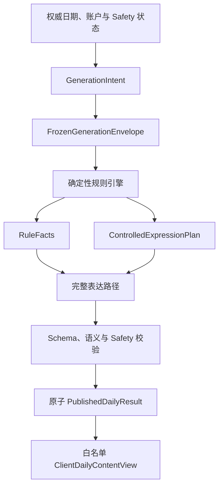

# DailyEnergy 确定性生成引擎规范

- **文档状态**：Draft
- **所属任务**：S-11 — 规则引擎规范
- **最后更新**：2026-07-21
- **适用范围**：GenerationManifest、冻结输入、确定性规则流水线、具名选择、RuleFacts、受控表达计划、失败与生命周期边界
- **上游规范**：[产品状态机](../product/state-machine.md)、[业务规则](../product/business-rules.md)、[今日内容 Schema](./daily-content-schema.md)、[七天趋势与总结 Schema](./weekly-summary-schema.md)、[共享 Schema](../../packages/shared-schemas/README.md)、[ADR-0002](../decisions/ADR-0002-deterministic-daily-result.md)
- **配套规范**：[评分与规则选择](./scoring-rules.md)、[S-11 测试向量](./s11-test-vectors.json)
- **下游任务**：S-12、S-13、S-15～S-20、C-006、C-007、C-008

## 1. 文档目的

本文定义从一个已接受生成意图到唯一规则事实和受控表达计划的闭合流程。核心验收句是：

> 对任一合法的 FrozenGenerationEnvelope 及其精确 GenerationManifest，规则引擎必须在有限步骤内产生唯一、逐字段可复算的 RuleFacts 与 ControlledExpressionPlan，或返回唯一的规范失败结果。

“确定性”承诺规则事实、候选、具名选择和表达计划可重放；不承诺 AI 文本按字节重放。PRIMARY_AI、BACKUP_AI 和 CONTROLLED_TEMPLATE 可以写出不同合格文案，但必须表达同一份事实与行动。

## 2. 权威层级与不可重开决定

本 Draft 继承并不得改写：

- `Asia/Shanghai` 04:00 与 `product-date-v1`；
- command commit、30 分钟 view continuation 与 15 分钟 generation completion 的区别；
- `seed-v1` 六字段 LP32、SHA-256 与原始 32 字节根种子；
- `choice-v1`、具名 namespace、U64_BE、BigInt 和 rejection sampling；
- 同一用户同一产品日期最多一个 intent 与一份 AVAILABLE 结果；
- 历史不因规则、目录、模型、Prompt、tzdb 或签到更正而重算；
- Safety、Deleting、账户状态和日期权威高于普通生成；
- DAY 删除不自动复活，ADR-0005 接受前也不允许同日显式重建；
- AI 只能表达，不能创造、修复或修改 `RuleFacts`；
- 不允许局部发布，也不允许把不同尝试的段落拼成一份结果。

若早期 README、ROADMAP 或聊天记录与上述决定冲突，以 Accepted ADR 和 Schema 为准。

## 3. 范围

### 3.1 本文负责

- manifest 版本闭包与选择时刻；
- frozen envelope 与 live guard 的分离；
- `GenerationInputSnapshot` 的封闭字段和归一化；
- 确定性流水线、候选目录、namespace registry 与输出不变量；
- `RuleFacts` 到 `ControlledExpressionPlan` 的受控投影；
- AI / 模板可以改变与禁止改变的边界；
- 失败分类、重试、跨日、并发、历史、Safety 和删除语义；
- server-only provenance、隐私和可观测性边界；
- 七天聚合与每日引擎共享的事实优先原则。

### 3.2 本文不负责

- 日期服务、数据库、缓存、队列、API 或事务实现；
- 生产 TypeScript 规则包；
- provider、模型、超时、成本和尝试次数；
- Prompt、完整模板文案和最终中文措辞；
- S-15 的风险分类器；
- S-18 的物理删除与最小保留；
- canonical fingerprint 的最终字节编码；
- 客户端组件或页面状态。

## 4. 对象边界与数据流



| 组件          | 可以决定                            | 禁止决定                         |
| ------------- | ----------------------------------- | -------------------------------- |
| 日期/账户服务 | 产品日期、窗口、账户与删除状态      | 五维、行动、仪式                 |
| 规则引擎      | RuleFacts、候选、具名选择、表达计划 | 日期、用户任务状态、关系事实变更 |
| AI Gateway    | 用受控计划完成一份表达              | 改分、换行动、补事实、重新抽取   |
| 受控模板      | 完整表达同一计划                    | 使用另一套 facts 或 seed         |
| 发布服务      | 校验、唯一性与原子发布              | 重算或拼接 RuleFacts             |
| 客户端投影    | 显式输出安全视图                    | 推断内部分数和 provenance        |

## 5. GenerationManifest

### 5.1 定义

`result_version` 是服务端不可变 GenerationManifest 的 ID，不是 semver 拼接、部署时间或客户端配置。`daily-v1` 在本 Draft 中解析为以下概念闭包：

```text
GenerationManifest {
  manifest_schema_version: generation-manifest-v1
  result_version: daily-v1

  product_date_policy_version: product-date-v1
  seed_policy_version: seed-v1
  choice_policy_version: choice-v1

  shared_schema_major: 0
  shared_schema_contract_version: 0.1.0
  daily_content_schema_version: 1.0.0
  input_snapshot_version: input-v1

  rule_version: daily-rules-v1
  algorithm_version: daily-score-v1
  action_catalog_version: action-catalog-v1
  task_catalog_version: task-catalog-v1
  ritual_catalog_version: ritual-catalog-v1
  content_catalog_version: content-catalog-v1
  namespace_registry_version: namespace-registry-v1

  expression_contract_version: daily-expression-v1
  template_compatibility_version: daily-template-v1
  safety_contract_floor: safety-baseline-v1
  experiment_variant_version: none-v1
}
```

这是内部概念对象，不得把这些字段加入严格 `GenerationInputSnapshot`、`RuleFacts` 或 `ExpressionPayload`。manifest registry 必须在发布 `result_version` 时冻结并保存一个不可变 `manifest_fingerprint`；S-17/S-19 只负责固化其最终 canonical bytes，不授权省略、运行时重算或替换 fingerprint。同一 `result_version` 必须始终只解析到这个 fingerprint。

`safety-baseline-v1` 在本 Draft 中只表示当前 Accepted 产品定位、人格和 Schema 的静态禁止边界，不冒充 S-15 风险分类器。生产 manifest 必须在 S-15 接受后解析到相容且不低于该边界的真实 Safety contract；不相容时按 `SAFETY_CONTRACT_INCOMPATIBLE` 失败。

### 5.2 完整性规则

- 所有引用版本必须存在、精确且相互兼容；禁止 `latest`、版本范围和运行时默认值。
- manifest 禁止原地修改。权重、阈值、候选资格、stable ID、canonical order、实验语义或 Safety 候选语义变化都创建新版本。
- 缺少任一字段或 fingerprint 不匹配时 terminal failure；禁止改用当前最新版。
- 当前 live Safety validator 可以否决发布，但不能悄悄改写 v1 候选含义；若冻结安全资格变化会改变候选，必须升级目录或 result version。
- 发布时间、发布人和通道是运维元数据，不参与规则结果。

### 5.3 选择时刻

manifest 只在服务端接受该用户该产品日期的第一个 intent 时从发布通道选择，并与 intent 一起冻结。已有 intent 不因当日部署改变；历史读取也不重新查询发布通道。

唯一性键的领域语义是 user + product date，不包含 result version。升级版本不能为同一用户同日创建第二份结果。

## 6. FrozenGenerationEnvelope

### 6.1 概念结构

```text
FrozenGenerationEnvelope {
  generation_intent_id
  stable_subject_id
  target_product_date
  product_date_policy_version
  accepted_at

  result_version
  manifest_ref
  manifest_fingerprint

  input_snapshot_ref
  input_snapshot_version
  input_snapshot_fingerprint
  generation_input_snapshot

  root_seed_raw_bytes
}
```

执行尝试另有不参与规则的 `ExecutionContext`：attempt ID、observed time、live guards、provider attempt 和 tracing ref。它们都不得进入 seed、score、候选或 plan。

### 6.2 冻结不变量

- snapshot 的 product date、result version 和 manifest 必须逐项绑定。
- 按 `stable_subject_id + product_date + result_version` 复算的 `seed-v1` 必须等于 envelope 中 32 字节根种子。
- 同一 intent 的每次重试使用完全相同的 envelope。
- provider、模型、进程、服务器、当前时间和尝试次数不影响 RuleFacts。
- 客户端不能提供或修改 envelope、manifest、stable subject 或 seed。

### 6.3 LiveGuard 不冻结

以下权威状态必须至少在开始规则计算前和原子发布前重新检查：

- Safety overlay；
- 账户 ACTIVE / RESTRICTED / DELETING / DELETED；
- DAY、RELATIONSHIP_DATA 或 ACCOUNT 删除；
- generation completion 资格；
- intent 取消状态；
- 是否已有 AVAILABLE 结果。

LiveGuard 失败只会返回 existing、blocked 或 cancelled，不允许为绕过守卫而换一套 facts、seed 或日期。

## 7. GenerationInputSnapshot

### 7.1 严格字段

输入必须先通过当前 `GenerationInputSnapshotSchema`：

```text
snapshot_version
product_date
result_version
user_ref?
checkin { revision, mood, energy, sleep }
profile { revision, preferred_name?, expression_style }
relationship { stage, encounter_day_count }
permitted_context[]
product?
```

`permitted_context` 每项只包含 source ref/type/revision/purpose/valid date，最多 8 项；valid date 必须等于 snapshot product date。严格 Schema 拒绝未知字段，缺少必需 checkin 无法生成。

### 7.2 字段分类

| 分类               | 字段                                                                                                         | 对 RuleFacts 的影响            |
| ------------------ | ------------------------------------------------------------------------------------------------------------ | ------------------------------ |
| RULE_INPUT         | checkin mood/energy/sleep                                                                                    | 按评分规范精确影响             |
| EXPRESSION_ONLY    | preferred name、expression style、relationship、permitted context、product locale/personality/content policy | 不改分、候选、choice 或 ritual |
| PROVENANCE/BINDING | versions、revisions、refs、product date、user ref                                                            | 只校验与追踪                   |

`permitted_context` 本身没有内容或 signal，因此 v1 不能从它评分。关系 stage 只能约束问候或关系语气，不成为每日关系结论。未来让这些字段改变规则必须升级 Schema、规则、算法和 manifest。

### 7.3 规范化

- 字符串和枚举必须已是 canonical token；禁止 trim、大小写修复、Unicode 归一化或同义词映射。
- `UNSURE` 是用户明确回答；字段缺失和 `UNKNOWN` 都是非法输入。
- 可选字段无值时省略，不使用 `null`、空字符串或占位 token。
- array 顺序按创建 snapshot 时的权威顺序冻结；任何需要排序的下游集合由规则显式 canonicalize。
- `snapshot_version` 必须等于 manifest 的 `input_snapshot_version`，snapshot 的 `result_version` 必须等于 envelope 与 manifest。
- manifest 为 `experiment_variant_version=none-v1` 时，`product.experiment_version` 必须省略；其它实验 token 必须与 manifest 精确绑定。会改变规则或候选的实验禁止只写 snapshot。
- `product.personality_version` 与 `content_policy_version` 若存在，必须通过 manifest 引用目录与 Safety floor 的兼容性登记；未知组合 fail closed。
- `profile.expression_style` 必须属于 `content-catalog-v1` 冻结的 `BALANCED`、`GENTLE`、`LIGHT_HUMOR`、`CLEAR_DIRECT`；共享 Schema 只验证 token 形状，语义 allowlist 由本层补充。未知 token 以 `SNAPSHOT_FIELD_INVALID` 失败，禁止透传给 AI、映射到最接近风格或回退默认值。
- snapshot fingerprint 必须覆盖全部字段和顺序；最终字节协议延期不授权忽略 fingerprint。
- snapshot 创建后的签到更正不回写本 envelope，也不重算已发布结果。

### 7.4 表达偏好 token

四个 token 的稳定语义由 [评分与规则选择规范](./scoring-rules.md#33-表达偏好) 唯一定义。`BALANCED` 是用户跳过选择时由产品写入的安全系统默认，不是第四个可见偏好；另外三个精确对应 Accepted 人格的温柔、轻松幽默、清醒直接。它们只进入受控表达计划，不改变 RuleFacts、候选、choice 或仪式。新增、删除、改名或改变含义必须升级 `content-catalog` 和引用它的 result manifest。

## 8. 根种子与具名选择

### 8.1 `seed-v1`

严格复用 ADR-0002 的六个 LP32 字段：

```text
dailyenergy
daily-result
seed-v1
stable_subject_id
product_date
result_version
```

根种子只稳定离散选择。签到、snapshot fingerprint、profile、上下文、provider 和实验运行数据都不得加入 material。分数不使用 seed。

### 8.2 `choice-v1`

每个具名决定独立使用：

```text
SHA256(
  LP32("dailyenergy-choice") ||
  LP32("choice-v1") ||
  LP32(root_seed) ||
  LP32(namespace) ||
  U32_BE(counter)
)
```

取摘要前 8 字节为 U64_BE 无符号整数，按 ADR-0002 的 `LIMIT = 2^64 - (2^64 mod n)` rejection sampling 选择。`1 <= n <= 2^32`；JavaScript 必须使用 BigInt。n=1 直接 index 0，可记录 namespace，但不需要哈希。counter 只因 rejection 增加；耗尽 U32 时 terminal failure。

### 8.3 Namespace registry

| namespace             | 决定            | canonical candidates                            | 空集合                 |
| --------------------- | --------------- | ----------------------------------------------- | ---------------------- |
| `focus.tie.v1`        | 并列 focus      | 五维固定顺序的并列子集                          | terminal，理论不可达   |
| `support.tie.v1`      | 并列 supporting | 五维固定顺序的并列子集                          | 省略 supporting        |
| `action.tie.v1`       | 主要行动        | action catalog rank                             | terminal               |
| `ritual.set.v1`       | 0～2 个仪式集合 | NONE、COLOR_ONLY、NUMBER_ONLY、COLOR_AND_NUMBER | terminal               |
| `ritual.color.v1`     | 颜色            | ritual catalog order                            | terminal when required |
| `ritual.number.v1`    | 数字            | 1～9                                            | terminal when required |
| `template.variant.v1` | 语义模板次序    | template compatibility order                    | terminal               |

`support.tie.v1` 与 `ritual.set.v1` 是 S-11 新登记项。namespace 必须是固定 ASCII 小写 token，禁止运行时拼接用户 ID、日期、候选数或字段名。

任务和 display order 是确定映射，不创建 `task.tie` 或共享其它 namespace。同一 root/manifest 下，额外计算一个已登记但本次未消费的 namespace 不改变其它 digest；禁止共享顺序 PRNG。registry 新增或变义必须升级 result version，而 result version 进入 root seed，因此不承诺跨 manifest 选择相同。

### 8.4 候选集合通用约束

每次选择必须依序：解析精确目录、应用冻结业务资格、应用冻结安全资格、检查 stable ID 唯一、按声明全序排序、再运行 choice。

重复 ID 或相同 ID 不同定义映射为 `CATALOG_DUPLICATE_ID`；rank 缺失、rank 重复或其它不能形成唯一全序的情况映射为 `CATALOG_ORDER_INVALID`。两者都是 catalog invalid，禁止静默去重或用存储顺序补序。数据库返回顺序、本地化名称、对象插入顺序和浮点误差都不能参与 canonical order。

普通 provenance 可以记录 namespace、counter、index 和候选集合 fingerprint；root seed、choice material、digest 与 X 只允许出现在受限调试或 golden fixture，禁止进入 AI、客户端、通知、分享和通用分析日志。

## 9. 确定性规则流水线

纯规则函数使用固定阶段：

```text
derive(envelope, exact_manifest, live_guard_snapshot):
  1. validate_live_admission
  2. resolve_exact_manifest
  3. validate_manifest_closure
  4. validate_envelope_bindings
  5. decode_snapshot_closed_world
  6. verify_seed_v1
  7. compute_integer_scores
  8. derive_bands_and_dimension_roles
  9. build_eligible_candidate_sets
 10. canonicalize_and_validate_candidates
 11. perform_named_choices
 12. construct_rule_facts
 13. construct_controlled_expression_plan
 14. validate_cross_field_invariants
 15. return deterministic_success
```

第 7～13 步的业务细节由 [评分与规则选择规范](./scoring-rules.md) 唯一定义。

规则函数不得读取数据库、网络、系统时间、默认 locale、环境变量或当前发布配置，不产生发布副作用。阶段不可回写前序事实，AI 不能修复任何阶段。目录遍历有限；唯一潜在循环是 choice rejection counter。

## 10. RuleFacts 边界

`RuleFacts` 必须精确匹配共享严格 Schema，不能增加 manifest、fingerprint 或调试字段。其内容只包括：

- overall 与 canonical 五维分数、档位和中性 label token；
- focus、可选 supporting、可选 care 和完整 display order；
- 最多 5 条受控 explanation basis；
- 1～3 个行动候选与唯一 selected action；
- 一个不可变 optional task plan；
- 0～2 个仪式事实。

禁止包含：

- 关系卡、encounter 路由或关系状态变更；
- 点亮、任务完成、帮助度或晚间反馈；
- AI 风格、Prompt、provider、model 或尝试信息；
- seed、稳定主体、内部 fingerprint 或删除 guard；
- 用户未来行为、预测、诊断、财务或法律判断。

RuleFacts 是服务端内部事实，不是客户端对象。客户端必须从 `PublishedDailyResult` 做白名单投影并删除 raw score、basis 和 provenance。

## 11. ControlledExpressionPlan

### 11.1 定义

`ControlledExpressionPlanV1` 是 RuleFacts 与 frozen snapshot 的不可变内部投影，约束 AI 和完整模板可以表达什么。它不是当前共享 Schema 的新增字段，也不持久化进严格 `RuleFacts`。v1 使用以下封闭对象；未知字段拒绝：

```text
ControlledExpressionPlanV1 {
  expression_contract_version: daily-expression-v1
  output_schema_version: <manifest.daily_content_schema_version>
  template_compatibility_version: daily-template-v1
  result_version: <manifest.result_version>
  template_variant_id: <selected stable template ID>
  assertion_mode: LOW_ASSERTION | PARTIAL_ASSERTION | STANDARD
  required_sections: <fixed array below>

  semantic_slots {
    overall { band, label_token }
    dimensions[] { id, band }
    focus_dimension_id
    supporting_dimension_id?
    care_dimension_id?
    selected_action: <exact selected ActionCandidate>
    optional_task: <exact OptionalTaskPlan>
    rituals: <exact ordered RitualFacts>
    explanation_basis_codes: <ordered codes from RuleFacts>
  }

  known_checkin_fields: <canonical field subset>
  uncertain_checkin_fields: <canonical field subset>
  allowed_state_assertion_basis_codes: <ordered subset>
  requested_expression_style: <snapshot.profile.expression_style>
  effective_expression_constraints {
    humor_ceiling: NONE | LIGHT
    pressure_ceiling: VERY_LOW | LIGHT
    opening_requirement: UNCERTAINTY_FIRST | CARE_FIRST | FACT_FIRST
    dimension_explanation_mode:
      NON_ASSERTIVE | KNOWN_SIGNALS_ONLY | BAND_GUIDANCE
  }
  greeting_context {
    preferred_name?
    relationship_mode: GENERIC
  }
  resolved_context_slots: []
  source_dependency_requirements: []
  prohibited_claim_classes: <fixed array below>
}
```

`output_schema_version` 在 `daily-v1` 固定为 `1.0.0`，直接绑定 manifest 已有的 `daily_content_schema_version`；不创建第二个隐含 ExpressionPayload 版本。

`required_sections` 固定为：

```text
greeting
state_response
overall_summary
core_tip
explanation_paragraphs
dimension_explanations
primary_action
optional_task
ritual_notes
closing
```

`prohibited_claim_classes` 固定按以下顺序完整输出，不是可扩展运行时集合：

```text
FUTURE_PREDICTION
DIAGNOSIS_OR_TREATMENT
FINANCIAL_OR_LEGAL_ADVICE
OTHER_PERSON_MIND_OR_RELATIONSHIP_OUTCOME
RESULT_GUARANTEE
RITUAL_CAUSALITY_OR_GAMBLING
TASK_PUNISHMENT_OR_SHAME
EXCLUSIVE_DEPENDENCY_OR_FABRICATED_INTIMACY
FABRICATED_MEMORY_OR_REAL_WORLD_EXPERIENCE
```

plan 不含运行时 ref、attempt ID 或尚未固化字节协议的 fingerprint。若 S-17 未来保存 plan ref/fingerprint，它们属于外部 derivation record，不参与 v1 plan body。同一次 intent 的所有表达尝试必须使用逐字段相同的 plan。

### 11.2 最小披露

- 默认不给 AI raw score、root seed、stable subject、choice trace 或内部 source fingerprint。
- dimensions 固定按五维 canonical order 从 RuleFacts 投影，只带 band；selected action、task 与 rituals 逐字段复制对应 RuleFacts，不能重新查当前最新版。
- preferred name、requested style、relationship greeting 与 context refs 只能来自冻结 snapshot。
- field order 固定为 mood、energy、sleep。`known_checkin_fields` 收集非 `UNSURE` 字段，`uncertain_checkin_fields` 收集 `UNSURE` 字段。
- `assertion_mode` 按评分规范唯一派生。LOW_ASSERTION 时 allowed state basis 为空，禁止把内部 50/STEADY 当用户状态；PARTIAL_ASSERTION 时 allowed state basis 只包含已知字段的 CHECKIN basis；STANDARD 时等于 RuleFacts explanation basis codes。
- `effective_expression_constraints` 不直接等于 requested style。care 或 LOW_ASSERTION 时 humor=`NONE`、pressure=`VERY_LOW`；否则两者为 `LIGHT`。opening 先按 care=`CARE_FIRST`，再按非 STANDARD=`UNCERTAINTY_FIRST`，否则 `FACT_FIRST`。dimension mode 按 LOW、PARTIAL、STANDARD 分别为 `NON_ASSERTIVE`、`KNOWN_SIGNALS_ONLY`、`BAND_GUIDANCE`。
- live Safety 不得改写 frozen plan。它只能接受该 plan，或 veto 普通发布并转入 S-15 的独立固定安全流程。
- greeting 只复制冻结 preferred name；`relationship_mode` 在 daily-v1 固定 `GENERIC`，不发送 encounter count 或 stage。

`permitted_context` 在当前 `daily-v1` 只留在 frozen envelope 作 server-side 审计，plan 的 `resolved_context_slots` 与 `source_dependency_requirements` 都固定为空，不把引用背后的文本发送给 AI。S-14 接受后必须使用新 manifest 和新 plan contract，逐项绑定 source ref/type/revision/purpose、`segment_paths`、`fallback_paths` 与发布前已校验的无源 fallback；禁止原地扩展本对象。

### 11.3 绑定规则

- `primary_action.action_id` 必须等于 selected action；optional task 和 ritual keys 必须逐项匹配 RuleFacts。
- AI 只能填写 `ExpressionPayload` 允许的文本槽位，不能新增事实或 ID。
- template variant 只改变段落次序；不能改变 score、band、focus、action、task、ritual 或 source dependencies。
- primary、backup 与 controlled template 接收同一 plan。
- 任何 action ID 替换、未批准事实、缺少必需槽位或未知字段都使整份 payload 失败。

## 12. 表达与降级

编排器按 S-12 最终策略尝试完整路径，但必须保持以下顺序语义：

1. PRIMARY_AI 尝试完整表达同一 plan；
2. 失败后可以用 BACKUP_AI 完整重做；
3. 再失败可以用 CONTROLLED_TEMPLATE 完整重做；
4. 每个候选分别通过 Expression Schema、ID/事实绑定、人格与 Safety；
5. 第一份完整合格且赢得唯一性事务的候选原子发布；
6. 其余候选丢弃，已发布结果不因主模型恢复而替换。

禁止“AI 成功几段 + 模板补几段”、跨尝试复用句子、让模板重新选择行动，或在表达失败后重算 RuleFacts。

实际 `PublishedDailyResult.provenance` 只能使用当前严格字段：input snapshot、rule、algorithm、generation mode、personalization level、prompt/template、provider/model 和 safety policy。目录/namespace/manifest 的完整闭包由 result version registry 与受限 derivation record 解释，不能向严格 provenance 增字段。

## 13. 结果类型与失败

### 13.1 引擎级结果

概念结果固定为：

```text
SUCCESS
RETURN_EXISTING_RESULT
BLOCKED
CANCELLED
RETRYABLE_EXECUTION_FAILURE
TERMINAL_CONTRACT_FAILURE
```

S-20 可以为 API 分配错误码，但不得改变这里的重试语义。

### 13.2 失败矩阵

| 类型               | 例子                                                 | 同 intent 重试       | 可换 facts/seed |
| ------------------ | ---------------------------------------------------- | -------------------- | --------------- |
| existing           | 并发胜者已发布                                       | 无需生成，读取胜者   | 否              |
| blocked            | Safety、Restricted、Deleting                         | 等权威状态改变       | 否              |
| cancelled          | DAY 删除、intent 取消、completion 关闭               | 否                   | 否              |
| retryable          | 临时执行基础设施故障                                 | 可以                 | 否              |
| terminal           | manifest、snapshot、目录、choice 或 RuleFacts 不合法 | 普通重试无意义       | 否              |
| expression failure | 完整 AI payload 不合格                               | 可走下一完整表达路径 | 否              |

### 13.3 稳定 reason 名称

服务端内部至少区分：

```text
SAFETY_OVERLAY_ACTIVE
ACCOUNT_NOT_ACTIVE
DELETION_IN_PROGRESS
DAY_SOURCE_INVALID
GENERATION_WINDOW_CLOSED
RESULT_ALREADY_AVAILABLE
INTENT_ALREADY_CANCELLED
MANIFEST_NOT_FOUND
MANIFEST_FINGERPRINT_MISMATCH
MANIFEST_DEPENDENCY_INVALID
UNSUPPORTED_POLICY_VERSION
SNAPSHOT_VERSION_MISMATCH
SNAPSHOT_BINDING_MISMATCH
SNAPSHOT_FIELD_INVALID
ROOT_SEED_MISMATCH
CATALOG_NOT_FOUND
CATALOG_DUPLICATE_ID
CATALOG_ORDER_INVALID
MANDATORY_CANDIDATE_EMPTY
CHOICE_COUNT_OUT_OF_RANGE
CHOICE_COUNTER_EXHAUSTED
RULE_FACTS_INVARIANT_FAILED
EXPRESSION_PLAN_INVARIANT_FAILED
SAFETY_CONTRACT_INCOMPATIBLE
```

这些不是本任务承诺的外部 API code。禁止未知 manifest 回退 latest、空行动让 AI 发明、choice 失败改用有偏 `% n`、日期失败改用设备日期或 terminal failure 创建新 intent。

## 14. 发布、幂等与并发

规则引擎只导出确定性候选，发布服务负责：

1. 读取同用户同日 existing result；
2. 验证 intent 仍有效与 live guards；
3. 校验完整 PublishedDailyResult；
4. 在同一串行化提交边界内再次比较 Safety/account/deletion/intent 的 guard epoch 或等价权威 revision、generation completion 资格与用户 + product date 唯一性；
5. 唯一性冲突者读取胜者；
6. 只有 AVAILABLE 后 intent 才标记成功。

同一 idempotency key + 同规范载荷返回已有逻辑结果；同 key + 不同载荷是冲突。客户端超时属于 unknown outcome，恢复时必须先读 intent/result，不能创建第二个 intent。

删除或 Safety 状态开始变化时必须先递增同一 guard epoch，或取得与发布互斥的 fence；发布提交发现 epoch/revision 变化时不得写入，按最新状态返回 BLOCKED/CANCELLED。禁止在“最后检查”和 commit 之间留下可发布幽灵结果。具体锁、事务或 compare-and-swap 由 S-17～S-20 决定，但这一原子不变量不得延期。

失败不得留下局部结果。两个执行者基于同 envelope 必须得到相同 RuleFacts；即使表达不同，也只有一份完整结果可发布。

## 15. 跨日生命周期

- command 已在边界前接受时继续使用冻结原产品日期；旧页面 continuation 不得创建 intent。
- 04:00 后的 generation completion 仅允许原 intent 在 15 分钟窗口内完成。
- `04:14:59` 可以发布原日结果；`04:15:00` 不可发布。
- 超时输出丢弃并取消，不迁移到新日、不换 seed、不改 product date。
- 新日 intent 不复用旧日候选、payload 或 root seed。
- 已完成的旧日结果只能作为历史读取，不能路由成今日结果。

## 16. Safety、删除与历史

### 16.1 Safety

调用前和发布前都重查 Safety。ACTIVE / RECOVERY_PENDING 等高优先级状态按 S-15 固定流程停止普通生成；计算中的 RuleFacts、plan 和 payload 必须丢弃。Safety 清除后不补生成已取消的旧日内容。

Safety 可以 veto，不得静默重排普通候选或让模型补足被过滤事实。若普通候选安全语义需要变化，升级目录和 manifest。

### 16.2 删除

DAY 删除开始后，使 intent、snapshot、RuleFacts、plan、payload、缓存、队列和旧 grant 不可发布或失效。删除成功后不能由 seed、manifest、缓存或重试复活；ADR-0005 接受前，同产品日期显式重新开始也禁用。

ACCOUNT DELETING / DELETED 取消生成。删除后不得为了保持 seed 单独保留可反查用户身份的 stable subject。关系或重要事项源删除时，依赖 source fingerprint 的表达与总结按上游规则失效；它们不改变已冻结核心 RuleFacts。

### 16.3 历史

历史读取直接读取 PublishedDailyResult，禁止重新运行规则引擎。规则、目录、模板、provider、Prompt、tzdb 或签到 revision 变化都不改写历史。旧 manifest 只用于解释兼容，不授权重建已删内容；历史缺失保持缺失。

## 17. Provenance、隐私与日志

### 17.1 Server-only derivation record

受限记录可以包含：result/manifest fingerprint、policy/rule/algorithm/catalog/namespace versions、snapshot fingerprint、choice namespace/counter/index/candidate-set fingerprint、RuleFacts fingerprint 和 plan fingerprint。

禁止普通日志记录 root material、root seed、choice digest、stable subject、preferred name 或上下文原文。日志使用 generation intent、result 和匿名 trace ref。

### 17.2 AI 与客户端

- AI 只接收最小 ControlledExpressionPlan 和获准表达上下文。
- root seed、raw score、choice trace、manifest、内部 provenance、源 revision 与删除状态不发送给 AI。
- ClientDailyContentView 是显式白名单，不含 raw score、explanation basis、模型、Prompt、Safety metadata 或 source refs。
- 通知、分享、分析与埋点同样不得包含 seed 或稳定主体。

## 18. 七天聚合边界

`weekly-aggregate-v1` 复用同一原则：程序独占事实写入权，AI 只读 `WeeklyExpressionPlan` 批准的 fact IDs。窗口、coverage、ordinal、direction、mode、fact catalog 和 plan priority 由 [评分与规则选择规范](./scoring-rules.md) 固化。

周聚合输入是 `WeeklySourceSnapshot`，不是每日 RuleFacts。每日五维、raw score、AI 文本和晚间 note 都不得进入真实趋势。源 revision 或 deletion 改变 source fingerprint 时可以按周 Schema 创建新 summary revision；这不是重算历史每日结果。

## 19. 验收用例

### 19.1 Manifest 与 envelope

- 任一 manifest 依赖缺失、未知或 fingerprint 不一致都 fail closed。
- 同一 result version 不能解析到两个闭包。
- retry、provider 或服务器变化不改变 RuleFacts。
- snapshot date/result/version/ref 绑定错误被拒绝。
- 非签到字段变化不改变 score、focus candidate eligibility、action 或 ritual。

### 19.2 Choice 与 RuleFacts

- ADR-0002 全部 seed/choice/rejection fixture 独立复算通过。
- n=1 直接 index 0；n=0 或 n>2^32 失败。
- 目录存储顺序打乱不改变输出；重复 ID 以 `CATALOG_DUPLICATE_ID` 失败，缺失或非唯一全序以 `CATALOG_ORDER_INVALID` 失败。
- 在同一 manifest 内额外计算已登记但未消费的 namespace，不改变现有选择；registry 升级必须使用新 result version。
- action 候选变化不移动 ritual 或 template stream。
- JSON fixture 的 daily RuleFacts 全部通过共享 Schema。

### 19.3 表达、发布与生命周期

- primary、backup、template 使用同一 plan 与 RuleFacts。
- AI 改 action/task/ritual 或新增事实时整份失败。
- 完整模板成功可以发布；局部拼接禁止。
- 两执行者并发只发布一份；输家读取胜者。
- 04:14:59 / 04:15:00 边界准确。
- Safety 或 DAY 删除在计算中触发时，发布前丢弃。
- 当前 manifest 升级后读取旧结果不重算。

### 19.4 隐私

- 普通日志、AI payload、客户端、通知和分享不出现 seed/stable subject。
- 删除后 provenance 不足以绕过删除重建内容。
- 客户端 projection 不出现 raw score 与 server-only trace。

## 20. 下游约束

- S-12 只能接收冻结 RuleFacts/plan；模型切换不改事实。
- S-13 Prompt 只能填计划允许的槽位。
- S-15 可以阻断发布，不得让 AI 重新决定普通事实。
- S-16 建立跨语言 golden corpus、属性测试和表达绑定测试。
- S-17 保存 intent、snapshot、manifest 与 facts/plan 的领域关系。
- S-18 删除必须使派生链、缓存和队列失效。
- S-19 落实用户 + 产品日期唯一性和原子发布。
- S-20 表达 existing、blocked、cancelled、retryable、terminal 与 unknown outcome。
- C-006 实现纯规则函数；C-007 用同一计划实现完整模板。

## 21. 明确延期

以下决定延期不影响本规范确定性：生产包结构、API error code、数据库格式、fingerprint 最终字节协议、provider/Prompt 策略、完整模板中文、S-15 风险分类、S-18 最小删除 guard、S-14 上下文内容解析。

延期不得削弱 exact manifest、frozen envelope、deterministic RuleFacts、AI 不改事实、单结果原子发布、历史不重算和删除不复活。
