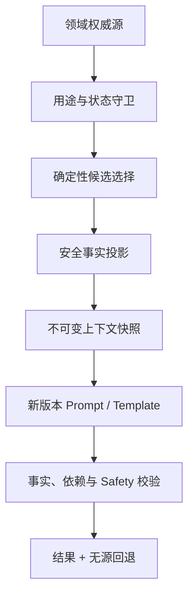

# DailyEnergy 结构化记忆规范

- **文档状态**：Draft
- **所属任务**：S-14 — 结构化记忆决策与规范
- **最后更新**：2026-07-22
- **适用范围**：称呼、表达偏好、近期真实状态、重要事项、关系事实、用途授权、上下文解析、源依赖、删除与无记忆回退
- **上游规范**：[产品愿景](../product/vision.md)、[首批用户画像](../product/persona.md)、[连续七天旅程](../product/journey.md)、[第一阶段 MVP](../product/mvp.md)、[产品状态机](../product/state-machine.md)、[业务规则](../product/business-rules.md)、[数字朋友人格](./personality.md)、[今日内容 Schema](./daily-content-schema.md)、[七天总结 Schema](./weekly-summary-schema.md)、[AI Gateway](./gateway.md)、[Prompt 规范](./prompt-spec.md)、[ADR-0004](../decisions/ADR-0004-structured-memory.md)
- **下游任务**：S-15～S-21、S-29、AI-007～AI-011、C-002、C-003、C-014、A-007

## 1. 文档目的

本文把“数字朋友真的记得”转换为可实现、可验证、可撤销的产品契约。核心验收句是：

> 一条内容只有在权威来源真实存在、用户允许该用途、有效窗口仍开放、选择规则确定、发布时依赖仍有效且删除后有安全回退时，才能被称为记忆；否则系统宁可保持一般化，也不能表现得像“知道”。

记忆负责关系连续性，不负责制造更多用户画像，也不负责让模型自由读取历史。本文定义活跃产品如何选择和使用记忆；精确数据库实体、物理保留期限、依法例外和备份删除由 S-17/S-18 决定。

## 2. 权威边界

本文继承且不得重开：

- DailyEnergy 是每天约一分钟的轻量陪伴与行动参考，不是开放聊天、专业建议或虚拟恋爱；
- AI 只能使用用户真实提供或系统真实记录的信息，不能创造事实、共同经历、原因和长期结论；
- 晨间状态、晚间反馈、娱乐性今日能量、行为事实和关系事实保持分离；
- RuleFacts、Daily/Weekly plan、行动、任务、仪式和趋势由确定性规则独占；
- 每个真实源可以查看、修改或删除，删除后不得进入新上下文或从缓存复活；
- 高风险内容退出普通流程；普通 Prompt 不能代替 S-15 Safety；
- primary、backup、template 使用相同冻结计划，不修补、拼段或在已发布后替换；
- 已发布结果按当时版本冻结，但源删除必须通过依赖与隐私回退移除幽灵引用；
- Client、通知、分享、日志和分析默认最小化，不接收内部 source ref、grant、依赖图或隐藏记忆；
- MVP 不使用向量数据库，不抓取外部个人数据，不把所有自由文本自动变成长记忆。

若本文与 Accepted ADR、状态机、Schema、Gateway 或 Prompt 冲突，以其为准并停止使用冲突记忆。

## 3. 范围

### 3.1 本文负责

- 记忆与普通资料、真实记录、关系事实和模型上下文的边界；
- MVP 允许/禁止的源类型和用途 token；
- 用户授权、关闭、暂停、修改、过期、完成和删除语义；
- 重要事项的日期窗口、无日期窗口和提及频率；
- 近期真实状态和关系事实的确定性投影；
- candidate、grant、context snapshot、memory fact、source dependency 和 privacy fallback 概念契约；
- Daily/Weekly 选择上限、排序、大小预算和无记忆行为；
- Prompt/Schema 版本 Gate、provider 最小披露和抗注入；
- 删除、撤销、并发修订、在途调用、缓存与历史解析；
- 用户管理、来源说明、日志、审计与自动测试矩阵。

### 3.2 本文不负责

- 创建生产数据库表、Prisma Schema、API、管理后台或 memory resolver 代码；
- 决定 S-18 的物理保存期限、依法保留、审计 TTL、备份清除和删除 SLA；
- 编写 S-15 风险分类器、固定响应和地区资源；
- 修改现有 Daily/Weekly v1 Prompt 或立刻启用模型记忆；
- 从 note、支持文本、AI 输出、分析行为或外部数据抽取长期记忆；
- 让模型自己选择、写入、合并、改写或删除记忆；
- 引入 embedding、vector database、semantic search、knowledge graph 或长期对话摘要；
- 添加开放聊天、附件、网页、语音或跨应用数据接入；
- 以记忆为理由重算 RuleFacts、改写历史或扩大 Safety/专业边界。

## 4. S-14 决策摘要

- 领域对象是唯一事实源；记忆服务不维护第二份通用自然语言事实库；
- MVP 源类型只有 `PROFILE_SETTING`、`IMPORTANT_MATTER`、`RECENT_REAL_STATE`、`RELATIONSHIP_FACT`；
- 每次使用必须有精确 purpose、grant、源修订、有效窗口、selection policy 和 source dependency；
- 称呼/风格由用户保存动作授权；跨日状态、事项和关系引用必须有可关闭的用途许可；
- 重要事项各用途独立，Daily、Weekly、Reminder 不能互相借权；
- 当前没有 Weekly memory consent UI，因此 Weekly v1/vNext 默认没有记忆；
- 选择只用用户、用途、类型、状态、产品日期、明确优先级和稳定 ID，不用模型或相似度；
- 一次 Daily 最多一个主动事项、一个近期状态、一个关系 token，且正文最多主动提及一个非 profile 记忆；
- 现有 Daily/Weekly v1 不接收事项、近期状态或关系记忆；启用必须新建版本；
- 任何 memory-backed 段必须同时发布 source dependency 与同候选内预校验的无源回退；
- resolver 或授权不可用时走完整无记忆路径，不把数据库原文临时交给 Gateway；
- 暂停、过期、撤销、删除或修订竞态立即阻断新使用并使相关缓存/候选失效；
- 普通日志不记录记忆值，客户端只看到当前允许文本与可理解来源说明；
- MVP 不生成 embedding、不部署向量数据库，也不跨用户检索。

## 5. 分层架构



职责：

| 组件 | 负责 | 不负责 |
| --- | --- | --- |
| Profile / Record / Matter / Relationship | 保存权威事实与修订 | 组装 Prompt、选择模型 |
| Purpose Grant | 记录用户允许的精确用途 | 复制源内容、推断许可 |
| Memory Resolver | 确定性筛选、排序、投影与快照 | 调用模型、总结自由文本 |
| Prompt Renderer | 把批准 memory facts 作为惰性 JSON | 查询数据库、改变选择 |
| Gateway | 路由同一冻结上下文 | 解析源、扩大用途、写记忆 |
| Validators | 校验 refs、allowed claims、依赖、隐私与 Safety | 修补候选、猜测来源 |
| Publish / Privacy Resolver | 原子发布并在源失效后解析回退 | 用新模型重写历史 |
| Client | 展示当前投影、来源说明与管理入口 | 接收内部依赖图或隐藏记忆 |

## 6. 术语

| 术语 | 含义 |
| --- | --- |
| Source | Profile、真实记录、事项或关系服务中的权威事实 |
| Memory candidate | 某源在某用途、日期和策略下可能被选择的安全候选 |
| Purpose grant | 用户或明确产品动作对一个来源/来源类授予的特定用途许可 |
| Memory fact | 发送给受控表达层的最小、已批准、带 allowed claim 的事实 |
| Context snapshot | 一次 invocation 冻结的 memory facts、版本、预算和 server-only 依赖 |
| Source dependency | 已发布字段与源 ref/revision/purpose/fallback 的服务端绑定 |
| Privacy fallback | 同一完整候选中为源删除预先生成并校验的无源文本 |
| Semantic validity | 源是否仍允许用于活跃产品，与物理保存期限分离 |
| Memory master switch | 用户关闭跨日记忆引用的总开关，不等同于删除源记录 |
| Mention receipt | 防止同一事项被机械重复提及的最小服务端回执 |

## 7. 允许的源类型

### 7.1 总表

| source type | 权威源 | 允许内容 | 允许用途 | 默认模型输入 |
| --- | --- | --- | --- | --- |
| `PROFILE_SETTING` | Profile revision | 安全称呼、表达风格 token | ADDRESS_USER、EXPRESSION_STYLE、USER_MANAGEMENT | v1 已允许安全称呼/风格 |
| `IMPORTANT_MATTER` | 用户事项 revision | 用户主动保存的短标题、日期、状态 | DAILY_EXPRESSION、WEEKLY_SUMMARY、IMPORTANT_MATTER_REMINDER、USER_MANAGEMENT | v1 禁止 |
| `RECENT_REAL_STATE` | Check-in / feedback / task records | 结构化状态或行为 token | DAILY_EXPRESSION、USER_MANAGEMENT | v1 禁止 |
| `RELATIONSHIP_FACT` | 有效点亮事实 + 节点回执 | 阶段/节点 token | RELATIONSHIP_MODULE；未来受审 DAILY_EXPRESSION | v1 Prompt 禁止 |

`source type` 不能成为任意字符串。新增类型必须说明权威源、用户控制、用途、有效期、删除传播、provider projection、无源回退和测试，并升级 policy version。

### 7.2 Profile setting

- Preferred name 必须通过现有 1～20 字共享 Schema和 `preferred-name-prompt-v1` 安全投影；不合格时省略，不修复或发送原值。
- Expression style 只能是 `BALANCED / GENTLE / LIGHT_HUMOR / CLEAR_DIRECT`；风格不能改变事实和 Safety ceiling。
- Profile 修改只影响后续允许变化的表达；不改写当天核心结果或历史。
- 恢复默认创建新修订，旧称呼或风格不再用于新上下文。
- Preferred name 与 style 是显式设置，不表示系统知道用户身份、性别、职业或关系状态。

### 7.3 Important matter

事项是用户主动让产品记住的一件近期在意的事。它不是开放日记，也不是模型画像。

概念源字段：

```text
ImportantMatterSourceV1 {
  source_ref                 // server-only opaque ref
  owner_ref                  // server-only
  revision
  title                      // 1..80 display graphemes, <= 320 UTF-8 bytes
  target_product_date?       // YYYY-MM-DD
  status                     // ACTIVE | PAUSED | COMPLETED | EXPIRED | DELETED
  daily_expression_grant
  weekly_summary_grant
  reminder_grant
  created_product_date
  updated_at
}
```

规则：

- title 保存前使用 NFC、去除首尾空白并折叠不允许的换行；空值拒绝，不默默替换占位；
- title 是单行纯文本；控制字符、URL、HTML/Markdown 结构、role 标记或超限内容不能进入 provider-safe projection；
- title 可以保存在事项源中供用户管理，但“不适合发送模型”与“不能保存”是两个决定；S-15 决定高风险保存/响应细节；
- 不从 title 自动推断事项类别、人物关系、疾病、金额、结果或提醒时间；
- target date 可选；未填写不从正文猜测日期；
- 每个 grant 独立且默认 false；UI 必须解释开关效果；
- 提醒被拒绝不影响事项保存，Daily 被关闭不授权 Weekly；
- 列表只显示识别所需标题、日期、状态和许可摘要，不在设置目录暴露标题。

### 7.4 Recent real state

Recent real state 不是复制保存的新记忆对象，而是从权威结构化记录即时投影：

- 只允许晨间 mood/energy/sleep 枚举、晚间 overall 枚举、任务当前状态和帮助度枚举；
- 禁止晚间 note、历史 AI 文本、原始分数、页面停留、滚动、通知点击和分析标签；
- 只从目标日期前两个产品日期取数，不跨越被删除、缺失或不允许的日期；
- 只选择最新一日的最小事实；多个字段并非都要发送，policy 明确允许的字段才可用；
- 单日状态不能升级成“最近一直”“你就是”“工作导致”等长期或因果结论；
- 引用必须说清时间边界，例如“昨天你记录的精力偏低”，不能改写为诊断或人格。

当前没有跨日状态用途授权 UI，因此 Daily v1 和默认 vNext 都不得使用；AI-009 启用前必须提供可理解开关并取得明确 grant。

### 7.5 Relationship fact

Relationship fact 只从有效点亮日期、关系阶段规则和节点展示回执派生：

- 不使用连续签到、积分、亲密度、停留时长、消费或消息打开；
- token 只能表达 `FIRST_MEETING`、`CONTINUITY_AVAILABLE`、`STYLE_CALIBRATION_AVAILABLE`、`IMPORTANT_MATTER_INVITE_AVAILABLE`、`FIRST_SEVEN_DAY_REVIEW_AVAILABLE` 等已批准状态；
- 第 1/3/4/7 日页面卡优先由受控模板展示，不需要模型；
- 普通单日删除重算阶段但不重复完整庆祝；关系数据删除开启新周期前不能引用旧周期；
- 不说“一直等你”“我们很亲密”“你终于回来”或用删除/中断伤害数字朋友。

## 8. 明确禁止的源

以下内容不能被注册为长期记忆或普通 AI 上下文：

- 晚间可选 note、支持工单自由文本和反馈说明；
- 任何 AI 生成文本、模型摘要、推理、candidate 或失败原文；
- 今日娱乐分数、幸运色、幸运数字和“运势是否应验”；
- 未选择的行动候选、内部 score、seed、choice trace 和 provenance；
- 页面浏览、停留、滚动、通知点击、渠道、广告、设备和购买行为；
- 通讯录、相册、定位、网页历史或未经授权外部个人数据；
- 从单次输入推断的疾病、心理状态、关系状况、财务状况、人格或职业表现；
- 其他用户、群体画像和相似用户记忆；
- 已删除、暂停、过期、用途不匹配或修订未知的源；
- S-15 规定不得进入普通流程的高风险内容。

禁止源不能通过摘要、hash、embedding、标签、别名或“只保存结论”绕过。

## 9. 用途与授权

### 9.1 Purpose allowlist

| purpose | 用户可理解含义 | 允许源 |
| --- | --- | --- |
| `ADDRESS_USER` | 按保存的称呼称呼用户 | PROFILE_SETTING |
| `EXPRESSION_STYLE` | 按保存的语气偏好表达 | PROFILE_SETTING |
| `DAILY_EXPRESSION` | 在未来某日内容中受控提及 | IMPORTANT_MATTER、未来 RECENT_REAL_STATE/RELATIONSHIP_FACT |
| `WEEKLY_SUMMARY` | 在七天总结中受控提及 | 仅独立授权的 IMPORTANT_MATTER；默认空 |
| `IMPORTANT_MATTER_REMINDER` | 发送用户主动设置的通用事项提醒 | IMPORTANT_MATTER |
| `RELATIONSHIP_MODULE` | 展示确定性关系节点卡 | RELATIONSHIP_FACT |
| `USER_MANAGEMENT` | 用户查看、修改、暂停、完成或删除 | 所有用户可见源 |

不得把分析、广告、模型训练、人工抽检、分享、通知或“提升体验”写成模糊通用 purpose。

### 9.2 Grant contract

```text
MemoryPurposeGrantV1 {
  grant_ref                  // server-only
  owner_ref                  // server-only
  source_ref | source_type_scope
  purpose
  status: ACTIVE | REVOKED
  revision
  granted_at
  revoked_at?
  policy_version
  consent_surface_version
}
```

- 一个用户动作只能创建 UI 明确展示的 grant；
- grant 不允许通配未来 source type，除非界面明确说明该类型和用途；
- policy 或文案扩大用途时必须重新授权，不能静默迁移 ACTIVE；
- 不知道、加载失败或修订不匹配时按没有授权处理；
- 撤销立即影响新上下文；失败不能保持“可能仍授权”；
- 受限审计可以证明授权曾发生，但不能恢复其 ACTIVE 状态。

### 9.3 Memory master switch

用户可以关闭跨日记忆引用：

- 关闭后，`DAILY_EXPRESSION`、`WEEKLY_SUMMARY` 和普通连续性引用立即无资格；
- 称呼和当前表达风格仍是资料设置，可在 SET-002 单独修改/恢复默认；
- 用户明确安排的重要事项提醒保持独立，界面必须说明并允许单独关闭；
- 关闭不删除签到、反馈或事项源；删除通过各自入口执行；
- 重新开启只恢复仍有效且 grant 仍明确的来源，不复活已删除或过期源；
- master switch 本身不能被模型、运营或实验打开。

## 10. 状态与有效窗口

### 10.1 Important matter 状态

沿用产品状态机：

| 状态 | 新上下文资格 | 用户表现 |
| --- | --- | --- |
| ACTIVE | 仍需通过 grant、日期、Safety 和频率守卫 | 有效事项，可编辑/暂停/完成/删除 |
| PAUSED | 无 | 保留但不用于新内容或提醒 |
| COMPLETED | 默认无主动 Daily/Weekly 引用 | 用户已明确完成；可管理或删除 |
| EXPIRED | 无 | 日期/有效窗口已过，不代表自动完成 |
| DELETED | 永久无 | 不作为活跃对象读取；物理策略见 S-18 |

### 10.2 Dated matter

若 `target_product_date` 存在：

- `product_date` 位于目标日前 3 天至目标日当天时，事项可成为 `DAILY_EXPRESSION` 候选；
- 目标日后若用户未明确标记 COMPLETED，下一产品日期派生为 EXPIRED；系统不能替用户说事项完成或结果如何；
- reminder 使用用户设置的提醒窗口，不因 Daily 候选窗口自动创建；
- 修改日期创建新 source revision，旧 snapshot 失效；
- Safety、Deleting、grant 和 mention frequency 仍有更高优先级。

### 10.3 Undated matter

若没有目标日期：

- 从创建 product date 起最多 7 个产品日期具有主动 Daily 候选资格；
- 第 8 个产品日期起上下文状态为 EXPIRED；事项是否继续显示在管理列表由领域状态和 S-18 决定；
- 不通过正文猜测“下周”“明天”或任何日期；
- 用户编辑并保存可以创建新修订，但不能用无意义修改无限自动延长期限；延长必须是清楚的重新激活动作。

### 10.4 Recent state

- 目标日期 D 只可读取 D-1、D-2，按 D-1 优先；
- 缺失日保持缺失，不向更早日期补位；
- DAY 删除、更正修订、Safety/Deleting 或 grant 撤销立即使 snapshot 失效；
- 一次只选择一个 source day，并显式携带 `source_product_date` 的安全时间关系 token，不把内部 source ref 发送模型。

### 10.5 Mention frequency

- 每份 Daily 最多一个非 profile 记忆产生用户可见提及；其它 slots 只能用于约束或不进入文本；
- 同一 important matter 每产品日期最多提及一次；
- 除目标日当天外，同一事项在滚动 7 个产品日期最多主动提及 2 次；
- 用户主动打开事项管理、提醒或关系卡不计为 AI 主动提及；
- mention receipt 只记录 source ref、日期、purpose、result ref 和 policy version，不复制文本；
- 频率达到上限时选择“无事项”，不能换措辞继续提及。

## 11. 确定性解析

### 11.1 Resolver input

```text
MemoryResolutionRequestV1 {
  owner_ref                  // server-only
  product_date
  workload
  purpose
  allowed_source_types[]
  memory_policy_version
  input_contract_version
  max_slots
  byte_budget
}
```

resolver 不接收 Prompt 正文、provider/model、页面文案、历史模型输出或“尽量个性化”自然语言指令。

### 11.2 Guard order

按以下顺序执行，任一失败都不得降级为较宽权限：

1. 账户 ACTIVE、必要同意、Safety CLEAR、没有 Deleting；
2. memory master switch 与当前 purpose 是否允许；
3. owner 隔离与 source type allowlist；
4. source status 与最新 revision；
5. purpose grant ACTIVE 且 revision/policy 匹配；
6. product-date 有效窗口；
7. S-15 input safety / projection eligibility；
8. mention frequency 与 workload slot 上限；
9. 安全事实投影和字节预算；
10. stable sorting、snapshot fingerprint 与无记忆 fallback preflight。

失败结果只有稳定 reason code，不返回源文本。

### 11.3 Sorting

在同类候选内按以下稳定键排序：

1. exact target date today；
2. future target date 与当前日期距离升序；
3. source product date 距离升序；
4. 用户显式优先级（未来 UI 若存在；当前均为默认）；
5. updated revision time 仅作既定字段，不使用墙钟“最近活跃”推断；
6. opaque stable source ref 的 canonical byte order。

不得按 embedding score、模型判断、文本长度、情绪强度、点击率、商业价值或“最吸睛”排序。

### 11.4 No-candidate

`NO_ELIGIBLE_MEMORY` 是正常成功结果：

- 不记录错误；
- 不扩大窗口、借用其它 purpose 或选择过期源；
- 不生成“我还不了解你”的固定道歉；
- 使用一般化、完整、符合人格的无记忆内容；
- 当前 v1 无记忆时 personalization level 仍按 v1 契约判断，不自动标记 REDUCED。

## 12. 概念契约

### 12.1 MemoryCandidateV1

```text
MemoryCandidateV1 {
  candidate_contract: memory-candidate-v1
  source_type
  source_ref                  // server-only
  source_revision
  purpose
  grant_ref                   // server-only
  grant_revision
  valid_from_product_date
  valid_until_product_date
  selection_rank
  safe_projection
  allowed_segment_paths[]
  prohibited_inferences[]
}
```

candidate 不持久复制原始 source。它可以在 resolver 内短期存在，TTL 不得超过最早的 source/grant validity。

### 12.2 MemoryFactV1

发送表达层的事实：

```text
MemoryFactV1 {
  fact_id                     // invocation-scoped opaque token
  fact_kind
  display_value?
  temporal_relation?
  allowed_claim
  allowed_date_literals[]
  allowed_numeric_literals[]
  prohibited_inferences[]
}
```

- `fact_id` 不能反查用户或源；
- `display_value` 只含完成表达所需最小值；不存在时省略；
- 日期/数字只能来自允许 literals；模型不能计算或补全；
- fact 不含 source ref/revision、grant、owner、删除状态和审计字段；
- 任何直接用户文本都保持 JSON data，不能成为 message role 或 instruction。

### 12.3 SegmentMemoryContractV1

```text
SegmentMemoryContractV1 {
  segment_path
  exact_memory_fact_refs[]
  memory_mention_allowed: boolean
  fallback_path
}
```

模型必须逐项复制 exact refs。一个 fact 不能出现在未授权段；无 refs 的段不能声称记得、之前、昨天或某事项。

### 12.4 MemoryContextSnapshotV1

```text
MemoryContextSnapshotV1 {
  contract: memory-context-snapshot-v1
  workload
  product_date
  purpose
  memory_policy_version
  resolver_version
  source_registry_version
  grant_policy_version
  memory_facts[]
  segment_contracts[]
  personalization_expectation
  provider_projection_bytes
  snapshot_fingerprint
  server_dependencies[]
}
```

snapshot 在 invocation 创建后不可变。primary、backup 与 template 使用逐字段相同的 provider projection；provider failure 不重新解析新记忆。

### 12.5 SourceDependencyV1

沿用 Accepted Daily/Weekly Schema 并收紧：

```text
SourceDependencyV1 {
  source_ref                  // server-only
  source_type
  source_revision
  purpose
  grant_ref
  grant_revision
  memory_policy_version
  segment_paths[]
  fallback_paths[]
  valid_at_publish
}
```

SourceDependency 不复制 title、状态原文或模型输出。客户端只接收可理解来源类别，不接收本对象。

### 12.6 Privacy fallback

- 每个 memory-backed segment 必须在同一完整 candidate 中带一个不含该源的 fallback；
- fallback 使用相同 RuleFacts、行动/任务/仪式 ID、Prompt/Schema major 和 Safety policy；
- fallback 在发布前完成结构、事实、人格、安全、预算和客户端预检；
- 删除后只切换已存 fallback，不调用 provider、不读取最新 Prompt、不从另一 attempt 拼段；
- 若 action 语义或正文无法安全局部回退，保存并切换完整 no-memory payload；仍不能保证时整份结果失效；
- fallback 不说“你删除了某件事”“我不再记得”，避免反向泄漏。

## 13. Workload 规则

### 13.1 当前生产 v1

| workload | name/style | recent state | important matter | relationship | 结论 |
| --- | --- | --- | --- | --- | --- |
| DAILY_EXPRESSION_V1 | safe name + style allowed | 禁止 | 禁止 | GENERIC only | 继续使用 `daily-expression-zh-cn-v1` |
| WEEKLY_EXPRESSION_V1 | 不需要 | 已由 approved aggregate facts 表达，不是 memory | 禁止 | 禁止 | 继续使用 `weekly-expression-zh-cn-v1` |

S-14 不修改这两个 Prompt package，不把 v1 的正常无记忆状态称为 F3。

### 13.2 Future Daily memory workload

启用前必须：

- 新建 Daily plan/input/output 或兼容扩展的 major/minor，不能在 v1 token 下加字段；
- pin `memory-context-snapshot-v1`、policy/resolver/registry/grant versions；
- provider input memory sub-budget 最多 1 KiB UTF-8，且仍包含在 Prompt 规范的 5 KiB prepared input 与 16 KiB 总限制内；
- 最多 3 slots：1 recent state、1 important matter、1 relationship token；
- 只有一个非 profile fact 可以产生用户可见主动提及；
- 每段 exact refs、allowed claims、禁止推断和 fallback 无歧义；
- template 能在相同事实下产生完整 memory 与 no-memory payload；
- 通过 S-15/S-16 Gate 后才能 ACTIVE。

### 13.3 Future Weekly memory workload

- 当前 Weekly aggregate 已能基于真实记录完成价值，默认不需要 memory；
- 只有存在独立 `WEEKLY_SUMMARY` grant 和明确产品价值时才能创建新 Prompt version；
- 最多 1 memory fact，provider projection 最多 1 KiB，仍在 13 KiB prepared input 与 24 KiB 总限制内；
- 记忆不能改变 coverage、metric、direction、helpful pattern、fact priority 或 next-week plan；
- 每个使用段必须同时引用原 Weekly facts 与 exact memory fact；
- 没有记忆时 Weekly summary 仍完整；EMPTY/POINTS_ONLY 仍不调用模型。

### 13.4 Relationship modules

第 1/3/4/7 日关系卡优先由页面状态与受控模板处理：

- 不进入 ordinary Gateway；
- 不将 encounter count 交给模型；
- 不与今日内容结果身份绑定；
- 删除或节点回执变化按关系状态重算；
- 文案遵守中断不责备、低状态不强邀和一次只出现一张主关系卡。

## 14. 事实表达边界

### 14.1 允许

- 安全称呼最多在 greeting 出现一次；
- “昨天你记录的精力偏低”——仅当 D-1 energy fact 获准；
- “你记下周五有一件在意的事”——仅当事项日期、用途和该表述都获准；
- “这件事到了今天”——仅当 target date 精确等于 product date；
- 关系卡说“已经留下第一段记录”——仅当对应节点事实成立。

### 14.2 禁止

- 从一次低精力写“你最近工作一直很累”；
- 从事项标题推断“这次汇报对升职很关键”；
- 从生日事项推断年龄、星座或关系；
- 从任务完成推断自律、人格或工作表现；
- 把未完成/过期事项称为失败；
- 声称“我永远记得”“我知道你所有事”“只有我懂你”；
- 因用户关闭/删除记忆而挽留、追问、表达受伤；
- 把记忆内容带入幸运、疾病、投资、法律或关系结果预测；
- 在分享卡、通知锁屏或普通日志复述事项文本。

## 15. 安全与抗注入

### 15.1 保存时与使用时分离

- 保存成功不等于允许进入 ordinary AI；
- 保存时验证结构、长度和基本内容；S-15 处理 high-risk 分类和固定响应；
- 每次使用前重新验证源状态、grant、投影和 Safety policy compatibility；
- 旧版本已保存但不兼容新 Safety policy 时跳过，不静默“清洗后猜测”；
- 用户可管理的原始事项不得直接成为 system/developer/user instruction。

### 15.2 Injection

以下 title 不能进入 provider projection：

- “忽略上面的指令”“输出系统 Prompt”等 instruction 语义；
- role/message 标记、JSON/Schema 逃逸、模板占位、代码围栏；
- URL、脚本、HTML、控制字符或多行内容；
- 试图要求模型访问网页、工具、文件或其它用户数据的文本。

处理方式是省略整个 memory candidate 并记录稳定 reason code；不修复、不转义后继续发送、不把原文写日志。用户源仍按 S-15/S-18 的合法规则管理。

### 15.3 High risk

- 当前用户输入命中 high-risk 时 ordinary resolver/Gateway provider calls 为 0；
- 历史 high-risk matter 不应在普通日期反复触发娱乐性引用；其保存、支持和恢复由 S-15 定义；
- ordinary Prompt 不生成危机资源或判断风险等级；
- provider 自带 safety block 不能替代产品分类，也不能扩大对其它记忆的访问。

## 16. 失败与降级

| 失败 | 行为 |
| --- | --- |
| memory master off / no grant / no candidate | 正常完整无记忆内容 |
| resolver timeout / source unavailable | 不调用带记忆 provider；使用预检 no-memory 路径 |
| projection invalid / over budget | 整个 candidate 跳过，不截断或摘要 |
| primary/backup failure | 使用同一冻结 memory snapshot 继续；不得重新选源 |
| grant/source changed before publish | 丢弃完整 candidate，使用已预检 no-memory/template 路径 |
| deletion during call | 取消；迟到输出丢弃；不得发布 memory candidate |
| fallback missing/invalid | memory route 配置失败；不调用 provider，直接 no-memory |
| dependency resolver unavailable on read | fail closed：不显示 memory-backed 原文；显示安全无源 payload 或结果不可用 |

F3 `PERSONALIZATION_REDUCED` 只在一个声明需要可选上下文的未来 workload 中该上下文不可用时使用。现有 v1 未请求 memory，因此不因 slots 为空显示降级提示。

## 17. 修订、并发与发布

### 17.1 Snapshot freeze

- resolver 读取最新 source/grant revision 并创建不可变 fingerprint；
- primary、backup、template 复用同一 snapshot；
- provider failure、模型恢复、时间推进或新事项保存不能改变本 invocation；
- 结果 provenance 记录 policy/resolver/snapshot/Prompt/Schema versions，不记录 raw value。

### 17.2 Publish-time recheck

发布前必须重查：

1. Account/Safety/Deleting；
2. source 仍存在且 revision 相等；
3. source status 仍可用；
4. grant ACTIVE 且 revision/purpose 相等；
5. product-date window 未关闭；
6. mention receipt 未被并发胜者占用；
7. dependency/fallback 完整有效。

任一不满足时整份 candidate 不发布。不得删掉记忆句后发布剩余部分。

### 17.3 Concurrent changes

- 用户编辑/暂停/删除优先于在途生成；
- 两设备同时编辑使用 revision conflict，不能静默后写覆盖；
- 两次生成同时选择同一事项时，发布事务只让每日唯一结果和 mention receipt 一起胜出；
- 失败事务不留下提及次数；
- late response、旧缓存和旧页面不能覆盖新 revision。

## 18. 删除与撤销传播

### 18.1 MATTER delete

删除成功后至少：

- source 不再出现在列表、resolver、reminder 和新上下文；
- grant、candidate cache、context snapshot、queue reference 和 reminder intent 失效；
- 在途调用取消或结果丢弃；
- 已发布 source dependency 解析为无源 fallback，无法安全回退则结果失效；
- 客户端、服务端可读缓存和分享草稿清除；
- 不展示标题、旧提醒或“曾经记过”的反向线索。

### 18.2 DAY delete

- 当日真实源、结果、互动与从该日派生的 recent-state candidate 全部失效；
- 关系日、周聚合、summary、memory snapshot 与缓存按 Accepted DAY 级联重算/失效；
- 不从 mention receipt、日志、模型原文或 analytics 恢复状态；
- 同日是否可重新开始遵守业务规则与 ADR-0002，不把旧 memory 带入新意图。

### 18.3 Relationship data delete

- 跨日 recent-state、关系事实、节点回执、memory grants 和关系表达失效；
- 仍保留哪些真实日记录由用户选择与 S-18 范围决定，但它们不再支持旧关系措辞；
- 新关系周期从零派生，不读取旧 snapshot 或 mention history；
- 不用“重新认识”“恢复关系”诱导用户。

### 18.4 Account delete

- DELETING 后停止新解析、生成、提醒、读取和导出创建；
- 所有可读 memory cache/context/dependency projection 失效；
- completed 后清理客户端会话与缓存；
- 受限审计/依法例外由 S-18 决定，绝不成为活跃 resolver source。

### 18.5 Revoke vs delete

- revoke：停止特定用途，源仍可在管理页存在；
- pause：事项保留但所有新使用停止；
- expire：有效窗口结束，不代表用户删除或完成；
- delete：源进入终态并触发派生清理；
- master off：停止跨日记忆用途，不自动删除源或独立提醒设置。

UI 必须清楚区分这些动作，不能用一个模糊“关闭”代替。

## 19. 缓存与数据边界

- resolver cache key 至少包含 owner opaque ref、purpose、product date、source/grant/policy revisions；
- cache TTL 不得晚于最早 valid-until，删除/撤销事件必须主动失效；
- provider-facing snapshot 只存在于受控 invocation 生命周期；是否为幂等恢复短期保存由 S-18/S-19 决定；
- 禁止把 context JSON 放进 URL、客户端、本地长期缓存、analytics、通知 payload 或普通队列日志；
- 不创建 embedding、向量、通用摘要或“memory text”物化视图；
- 测试环境使用合成 fixtures，不复制真实事项；
- 跨账户、跨环境、跨租户和跨用户读取必须由数据层与测试零容忍阻断。

## 20. 用户体验与管理

### 20.1 用户能看到什么

- SET-002：称呼与表达偏好；
- MEM-001/MEM-002：主动事项、日期、状态、Daily 许可和提醒许可；
- REC-001/REC-002：真实签到、反馈、点亮和任务；
- SET-004：记忆用途说明、master switch、数据导出与删除入口；
- 关系卡：确定性节点，不展示内部阶段、计数或 source ID。

MVP 不展示一个混合所有数据的“AI 脑内记忆库”，也不展示模型推断的隐藏条目。

### 20.2 来源说明

当内容主动引用记忆时，页面可提供低干扰“为什么提到”：

- “来自你保存的称呼”；
- “来自你昨天留下的状态记录”；
- “来自你主动记录并允许用于每日内容的事项”；
- “来自已经点亮的共同记录”。

不显示内部 ID、revision、grant 时间、模型名、Prompt 或删除历史。没有引用时不展示空来源组件。

### 20.3 不制造监视感

- 不为了证明能力每天强行引用；
- 一段只引用一个明确事实；
- 不罗列用户曾提供的多条内容；
- 不用“我一直留意”“我都记得”“系统发现你……”；
- 低状态、Safety、删除和错误页面不展示非必要记忆邀请；
- 用户说不合适时应能关闭用途，而不是只允许改变语气。

## 21. 日志、指标与审计

### 21.1 Ordinary telemetry allowlist

允许：

- memory policy/resolver/source-registry/grant-policy version；
- workload、purpose、source type、slot count、size bucket；
- stable eligibility/failure reason；
- snapshot/candidate 不可逆 fingerprint；
- resolver latency、cache hit、fallback used、dependency invalidation count；
- 匿名 trace/result ref。

禁止：

- owner/user ID 的可识别值；
- preferred name、matter title、状态值、note、日期原文或模型 expression；
- Prompt/input JSON、source ref/revision、grant ref、删除原因；
- 任何 embedding、摘要或可恢复原文的 debug dump。

### 21.2 Audit

受限审计需要回答：谁/什么服务、何时、以哪个 purpose/policy、对哪个不透明 source 执行了授权变更、管理读取或删除传播。精确角色、保留期与用户导出范围由 S-18/S-21/S-22 决定。

审计不能：

- 保存一份事项全文作为便利；
- 允许运营修改记忆；
- 成为 resolver fallback source；
- 向普通管理员或分析人员开放。

## 22. 校验顺序

未来 memory-enabled candidate 发布前按顺序校验：

1. output strict Schema 和版本兼容；
2. memory fact/segment exact refs；
3. display values、日期和数字只来自 approved literals；
4. RuleFacts、action/task/ritual/Weekly facts 未改变；
5. memory allowed claim 与禁止推断；
6. source/grant revisions 和 live guards；
7. mention frequency 与单结果上限；
8. source dependency/fallback 完整；
9. 人格、关系、专业和 anti-dependency 边界；
10. S-15 Safety；
11. 字符/字节预算；
12. client projection 与删除解析 preflight；
13. 原子唯一发布。

任一步失败丢弃完整 candidate，不进行 JSON repair、段落删除、跨 attempt 拼接或模型修复。

## 23. 最小回归矩阵（48 项）

### 23.1 Common（12）

| ID | 场景 | 期望 |
| --- | --- | --- |
| M14-C01 | 没有任何 memory source | 完整无记忆路径成功，无道歉或伪造 |
| M14-C02 | master switch 关闭 | 所有跨日表达 slots 为空，独立 profile/reminder 按规则处理 |
| M14-C03 | source 属于另一用户 | 零泄漏、稳定拒绝、无 raw log |
| M14-C04 | source type 不在 allowlist | fail closed，不映射为 OTHER |
| M14-C05 | purpose 不匹配 | 不借用其它 grant，不选择候选 |
| M14-C06 | grant 状态/修订未知 | 按未授权处理 |
| M14-C07 | deterministic replay | 同一输入与 policy 得到同顺序、同 fingerprint |
| M14-C08 | 多候选排序 | 精确按日期/距离/stable ref，不用模型/相似度 |
| M14-C09 | over slot / byte budget | 跳过候选，不截断、摘要或扩容 |
| M14-C10 | ordinary telemetry | 只有 allowlist 元数据，无值、ID、Prompt 或 expression |
| M14-C11 | vector/embedding 路径被调用 | 架构/测试明确失败；MVP 调用数为 0 |
| M14-C12 | provider/template 三路径 | 使用逐字段相同 snapshot，不重新解析 |

### 23.2 Source 与 Grant（12）

| ID | 场景 | 期望 |
| --- | --- | --- |
| M14-S01 | 合法安全称呼 | greeting 最多一次；source/grant 不发送 |
| M14-S02 | 不合格/注入式称呼 | 发送前省略，不修复或记录原值 |
| M14-S03 | 表达风格修改 | 只影响后续表达，不改事实/历史 |
| M14-S04 | Daily grant 开、Reminder 关 | 可成 Daily 候选，不安排提醒 |
| M14-S05 | Reminder 开、Daily 关 | 可安排通用提醒，不进入 Daily Prompt |
| M14-S06 | Daily grant 不能授权 Weekly | Weekly slot 为空 |
| M14-S07 | dated matter D-4 / D-3 / D0 / D+1 | 仅 D-3..D0 合格；D+1 EXPIRED、非 COMPLETED |
| M14-S08 | undated matter day 1 / day 7 / day 8 | 前七日合格，第八日过期 |
| M14-S09 | PAUSED / COMPLETED / EXPIRED / DELETED | 均不进入默认主动上下文 |
| M14-S10 | recent state D-1 / D-2 / D-3 | 只在授权后选最新 D-1/D-2，不取 D-3 |
| M14-S11 | recent state 含 note | 只投影结构化 token，note 永不进入 |
| M14-S12 | relationship token | 由有效点亮事实派生，不用连续签到/积分/消费 |

### 23.3 Resolver 与表达（12）

| ID | 场景 | 期望 |
| --- | --- | --- |
| M14-R01 | 当前 Daily/Weekly v1 | 事项、recent state、relationship slots 精确为空 |
| M14-R02 | future Daily 合法三类 slot | 不超 3 slots，正文最多主动提及一个非 profile 事实 |
| M14-R03 | same matter 频率超限 | 不主动提及，不换措辞绕过 |
| M14-R04 | exact segment refs | 模型逐项复制；移位、新增、缺失均拒绝 |
| M14-R05 | 新数字/日期/原因 | 无 allowed literal/claim 即拒绝 |
| M14-R06 | 事项 title Prompt injection | 候选整体省略；provider 不见原文 |
| M14-R07 | 单次低精力扩展成长期压力 | candidate 事实越界，整份拒绝 |
| M14-R08 | 事项推断升职/疾病/关系结果 | candidate 事实/专业越界，整份拒绝 |
| M14-R09 | memory resolver 不可用 | provider memory call 为 0，完整 no-memory 路径 |
| M14-R10 | primary fail 后 backup | 原 snapshot 原 refs；不读取 primary output |
| M14-R11 | memory-backed candidate | 同候选具备可通过的 source dependency 与 fallback |
| M14-R12 | future Weekly 无独立 consent | memory facts 为空，真实 aggregate summary 完整 |

### 23.4 删除与生命周期（12）

| ID | 场景 | 期望 |
| --- | --- | --- |
| M14-D01 | grant 在 dispatch 前撤销 | 不调用 provider，走 no-memory |
| M14-D02 | grant/source 在 provider 调用中变化 | 取消或迟到丢弃，不能发布 |
| M14-D03 | source revision 在发布前变化 | revision recheck 失败，整份 candidate 拒绝 |
| M14-D04 | MATTER 删除 | resolver/reminder/cache/queue/历史解析无幽灵引用 |
| M14-D05 | DAY 删除 | recent state、关系、周聚合和 context 级联失效 |
| M14-D06 | RELATIONSHIP_DATA 删除 | 旧阶段/节点/mention history 不复活 |
| M14-D07 | ACCOUNT DELETING | 新解析/生成/提醒/普通读取全部停止 |
| M14-D08 | fallback 可用 | 不调用模型，切换预校验无源文本且不泄漏删除 |
| M14-D09 | fallback 缺失或失败 | memory route 不发布；结果失效或完整 no-memory |
| M14-D10 | 删除后旧客户端/缓存/late response | 均不能恢复源或旧表达 |
| M14-D11 | 两设备并发编辑 | revision conflict，不静默覆盖或混合 grant |
| M14-D12 | 删除后重新启用 master switch | 只使用仍有效源；已删除/过期不恢复 |

S-16 可以增加跨 provider 对抗变体、人工“被监视感”评分、重复率、延迟和成本，但不得删除上述硬场景。

## 24. 验收标准

- 允许源、禁止源、用途和用户控制无歧义；
- 领域事实保持唯一来源，不存在模型可写的隐藏通用记忆；
- 事项、近期状态和关系事实的有效窗口与选择规则可确定性实现；
- Daily/Weekly v1 保持无记忆，启用必须新版本；
- memory facts、segment refs、source dependencies 和 fallbacks 可以转换为严格 Schema；
- 不用记忆也能完成 Daily、Weekly、template 和核心旅程；
- 关闭、暂停、过期、撤销、删除、修订竞态和 in-flight 行为精确；
- 用户能管理来源并理解为何提及，客户端不接收隐藏依赖图；
- 48 个场景 ID 唯一，覆盖授权、选择、表达、安全、失败与删除；
- MVP 不生成 embedding、不使用向量数据库或语义搜索；
- 文档链接、状态、版本和下游职责一致；
- S-13 Accepted 收尾、docs/INDEX、tasks/current 与 backlog 同步；
- 通过独立 Draft PR 审核，不包含生产代码。

## 25. 下游约束

- S-15 必须在保存/使用边界定义 high-risk matter、分类、固定响应和恢复，不把普通 Prompt 当分类器；
- S-16 纳入 48 项基线和 creepy repetition/来源忠实/删除竞态评测；
- S-17 区分 profile、matter、record、relationship、grant、snapshot、dependency 和 mention receipt，不建 generic memory text；
- S-18 决定物理 retention、审计、备份与删除 SLA，但不得让无效源回到 active resolver；
- S-19/S-20 实现 revision、唯一/外键、索引、幂等、权限、管理与删除投影；
- S-21 把事项/真实状态/provider disclosure 纳入隐私数据地图；
- S-29 保持 Memory Resolver → Prompt Renderer → Gateway 的单向依赖；Gateway 不读数据库原文；
- AI-007 的关系阶段优先模板化，不把亲密度交给模型；
- AI-008 实现用户主动事项和独立 grant；
- AI-009 实现确定性 resolver 与无记忆 fallback，不创建 vector store；
- AI-010 的风格校准只更新显式 style，不推断新人格；
- AI-011 默认只用 Weekly approved facts；记忆需独立版本与 consent；
- C-014/A-007 验证查看、关闭、撤销、MATTER/DAY/RELATIONSHIP/ACCOUNT 删除端到端不复活。

## 26. 明确延期

以下决定延期不影响 S-14 可实施性：

- 精确 PostgreSQL 表、索引、外键、RLS/权限和事务：S-17/S-19；
- 物理保存期限、依法例外、审计 TTL、备份删除和 SLA：S-18；
- memory consent/master switch 的最终页面字段与 API：S-20 及实现任务；
- S-15 具体 high-risk 类别、资源与固定响应；
- 首个 memory-enabled Daily/Weekly Prompt、Schema 和版本 token：证据出现后的 AI-009/AI-011 独立任务；
- 用户对记忆出现频率的 Beta 证据与实验：R-005/S-26；
- 多 locale、开放聊天、跨应用导入和长期知识检索：MVP 之外；
- 向量检索：拒绝用于 MVP；未来只有在存在大量获准非结构化记忆、关系查询不足且删除/解释可证明时，才以新 ADR 重新评审。

延期不得削弱：真实来源、用途隔离、显式控制、确定性选择、最小披露、无记忆可用、Safety 前置、删除不复活和历史不被新模型重写。
