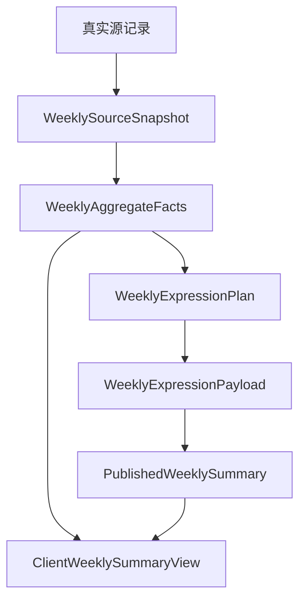

# DailyEnergy 七天趋势与总结 Schema

- **文档状态**：Accepted
- **接受日期**：2026-07-20
- **所属任务**：S-08 — 晚间反馈与七天总结 Schema
- **最后更新**：2026-07-20
- **适用范围**：REC-001 最近七个产品日期的真实记录、确定性聚合、阶段/完整回望、总结表达、客户端视图和源记录变更失效
- **上游规范**：[用户旅程](../product/journey.md)、[第一阶段 MVP](../product/mvp.md)、[产品状态机](../product/state-machine.md)、[业务规则](../product/business-rules.md)、[页面规格](../design/screen-specs.md)、[交互状态](../design/interaction-states.md)、[内容布局](../design/content-layout.md)、[今日内容 Schema](./daily-content-schema.md)、[晚间反馈 Schema](./evening-feedback-schema.md)
- **下游任务**：S-09 可执行共享 Schema、S-11 聚合规则、S-12～S-15 AI 与 Safety、S-17～S-21 数据与隐私、S-24～S-25 埋点与指标

## 1. 文档目的

本文定义 DailyEnergy 七天趋势与总结的唯一文档级契约，使真实记录图表、确定性聚合、AI/模板表达、删除传播和客户端展示使用同一语义。

七天回望必须让用户看见“这段时间留下了什么”，而不是证明今日能量准确、评价用户表现或伪造连续记录。

本文必须保证：

1. 窗口始终是七个连续产品日期，缺失日期留空；
2. 第七个相遇日与最近七个产品日期是不同概念；
3. 1～2 个真实样本不产生趋势结论；
4. 任何方向、计数和模式都由确定性聚合产生，AI 只表达；
5. 娱乐五维、原始分数和预测文本不进入真实趋势；
6. 每项结论带样本数、缺失数和源类别；
7. 数据不足、模型失败和表达失败不遮挡真实记录；
8. 更正或删除源记录后，旧总结立即失效且不保留幽灵引用；
9. 本文可以无歧义转换为 S-09 的可执行 Schema，但当前不创建代码。

## 2. 规范用语与术语

### 2.1 规范强度

- **必须**：下游 Schema、聚合、Prompt、API 和前端不得绕过；
- **应该**：默认设计，偏离需要单独评审；
- **可以**：不改变不变量时允许；
- **禁止**：AI、模板、分析或客户端都不能触发。

### 2.2 术语

| 术语         | 定义                                                             |
| ------------ | ---------------------------------------------------------------- |
| 窗口锚点     | 七天窗口最后一个产品日期                                         |
| 七天窗口     | 从锚点向前包含锚点的七个连续产品日期                             |
| 真实状态日   | 窗口内至少有一份有效晨间签到或晚间整体感受的日期                 |
| 可用观察     | 某指标有明确档位且不是 UNSURE 的一条用户记录                     |
| 缺失         | 该日期或字段没有允许使用的用户事实；不以其它字段填补             |
| 说不准       | 用户主动选择 UNSURE 的有效回答；计入回答覆盖，不进入有序趋势计算 |
| 聚合事实     | 程序从源快照确定性计算的计数、分布、模式和方向                   |
| 阶段回望     | 3～6 个真实状态日时可以生成的克制总结                            |
| 完整七天回望 | 七个日期均有真实状态日时可以生成的完整总结                       |
| 源指纹       | 由实际参与聚合的源引用、修订和规则版本计算的不透明摘要           |
| 总结修订     | 同一窗口因源更正、删除或规则变化产生的新发布版本                 |

## 3. S-08 七天总结决策摘要

以下结论已于 2026-07-20 接受，成为后续任务必须继承的约束：

|   # | 问题         | 推荐结论                                                                         |
| --: | ------------ | -------------------------------------------------------------------------------- |
|   1 | 窗口         | 最近七个连续产品日期，包含当前/所选锚点；不取最近七个相遇日                      |
|   2 | 第七日节点   | 第七个相遇日卡只打开当前七天窗口，不创造另一套窗口                               |
|   3 | 覆盖等级     | 0 天 EMPTY、1～2 天 POINTS_ONLY、3～6 天 PARTIAL、7 天 COMPLETE                  |
|   4 | 总结最低样本 | 3 个真实状态日才可生成阶段回望；1～2 天只展示点和固定说明                        |
|   5 | 趋势最低样本 | 每个指标至少 3 个可用观察；UNSURE 不作为数值但单独计数                           |
|   6 | 真实来源     | 晨间签到、晚间整体感受、点亮、帮助度和任务状态                                   |
|   7 | 每日结果用途 | 只允许用 HELPFUL 日对应的受控 action kind 统计建议类型；禁止分数、五维和 AI 文本 |
|   8 | 晚间自由文本 | P0 不进入聚合、Prompt 或总结；只在历史日由用户本人查看                           |
|   9 | 聚合与表达   | WeeklyAggregateFacts 完全确定；AI 只能表达带 fact_refs 的批准事实                |
|  10 | 最常状态     | 只有唯一最高频且至少出现 2 次时才显示；并列时省略结论                            |
|  11 | 最有帮助类型 | 至少 2 个 HELPFUL 样本且唯一最高频时才显示                                       |
|  12 | 任务与点亮   | 显示计数和明确分母；UNMARKED、SKIPPED 不解释为失败                               |
|  13 | 文本         | 阶段/完整总结正文 120～260 字，纯文本，不诊断、不找原因                          |
|  14 | 降级         | 图表与聚合优先可用；总结表达失败时用完整模板或固定不可用说明                     |
|  15 | 源变化       | 参与字段的更正/删除改变 source_fingerprint，立即失效旧总结并产生新修订           |
|  16 | 历史         | 不原地改写旧发布对象；客户端只展示当前允许且匹配源指纹的修订                     |
|  17 | 客户端       | 使用显式 ClientWeeklySummaryView，含样本与缺失说明，不含内部源 ID                |
|  18 | 版本         | 窗口、聚合、表达、Schema 和投影分别版本化                                        |

## 4. 七天窗口与覆盖

### 4.1 窗口定义

`window_end_date` 是权威产品日期锚点，`window_start_date` 是向前第六个产品日期。窗口必须恰好包含七个连续日期并使用同一产品时区规则版本。

例如锚点为 2026-07-20：

```text
2026-07-14, 2026-07-15, 2026-07-16, 2026-07-17,
2026-07-18, 2026-07-19, 2026-07-20
```

删除、中断或没有打开不会压缩窗口，也不会用更早日期补位。

### 4.2 与关系节点分离

- `relationship_day_count` 统计全部有效点亮日期；
- 七天窗口按连续产品日期取数；
- 第七个相遇日可能发生在一个只有 3 个真实状态日的最近窗口；
- 关系卡此时可以说“看看已经留下的记录”，但不能称为完整连续七天；
- 普通单日删除后关系节点不重复庆祝，REC-001 按新窗口事实显示。

### 4.3 CoverageLevel

`real_state_day_count` 是窗口内至少存在有效晨间签到或晚间整体感受的去重日期数。

| 枚举          | 数量 | 页面能力                                        |
| ------------- | ---: | ----------------------------------------------- |
| `EMPTY`       |    0 | 空状态，无图表趋势和 AI 总结                    |
| `POINTS_ONLY` | 1～2 | 展示离散真实点和样本数，不使用趋势词            |
| `PARTIAL`     | 3～6 | 允许逐指标方向与阶段回望，必须写“基于 N 天记录” |
| `COMPLETE`    |    7 | 允许完整七天回望，字段缺失仍逐项说明            |

CoverageLevel 是数据覆盖，不是关系等级、完成度、留存评价或用户得分。

## 5. 契约分层

### 5.1 六个对象边界

| 对象                    | 写入者       | 权威用途                             | 持久性               | 客户端可见 |
| ----------------------- | ------------ | ------------------------------------ | -------------------- | ---------- |
| WeeklySourceSnapshot    | 聚合编排服务 | 固定七日源引用和修订                 | 受限、随源删除处理   | 否         |
| WeeklyAggregateFacts    | 确定性聚合器 | 唯一计数、分布、模式、方向和展示资格 | 随源指纹版本化       | 通过投影   |
| WeeklyExpressionPlan    | 规则服务     | 选择允许表达的 fact IDs 与观察主题   | 随事实版本化         | 否         |
| WeeklyExpressionPayload | AI 或模板    | 对批准事实的克制表达                 | 随总结修订冻结       | 通过投影   |
| PublishedWeeklySummary  | 发布服务     | 原子、可追踪的内部表达结果           | 不可变修订，可失效   | 否         |
| ClientWeeklySummaryView | 服务端投影器 | REC-001 的真实记录、图表和当前总结   | 可缓存，随源变化失效 | 是         |

### 5.2 数据流



AI 不读取数据库、原始自由文本或完整每日结果，也不能返回聚合数字和趋势枚举。

## 6. 身份与版本

| 字段                  | 示例                   | 含义                               | 客户端                     |
| --------------------- | ---------------------- | ---------------------------------- | -------------------------- |
| `contract`            | `weekly-summary`       | 契约家族                           | 必需                       |
| `schema_version`      | `1.0.0`                | 结构版本                           | 必需                       |
| `window_id`           | 不透明 ID              | 用户、起止日期和窗口规则的稳定引用 | 必需                       |
| `window_start_date`   | `2026-07-14`           | 第一个产品日期                     | 必需                       |
| `window_end_date`     | `2026-07-20`           | 锚点产品日期                       | 必需                       |
| `window_rule_version` | `window-v1`            | 日期与窗口规则                     | 内部，客户端可接收摘要版本 |
| `source_fingerprint`  | 不透明摘要             | 实际参与字段的源修订集合           | 内部                       |
| `aggregate_version`   | `weekly-aggregate-v1`  | 计数和方向算法版本                 | 内部                       |
| `summary_id`          | 不透明 ID              | 一份已发布表达修订                 | 客户端可接收               |
| `summary_revision`    | `2`                    | 同一窗口当前总结修订               | 客户端可接收               |
| `expression_version`  | `weekly-expression-v1` | 表达规则组合版本                   | 内部                       |
| `projection_version`  | `weekly-view-v1`       | 客户端投影版本                     | 客户端可接收               |

Schema、窗口、聚合和表达版本不得混用。相同窗口在源修订变化后产生新 `source_fingerprint` 和新 summary revision，不修改旧对象。

## 7. WeeklySourceSnapshot

### 7.1 允许来源

每个产品日期只允许引用仍有效的：

- MorningCheckinRecord：情绪、精力、睡眠当前允许修订；
- EveningFeedbackRecord：只使用 `overall_feeling`，不使用 note；
- DailyLightRecord：是否 LIT；
- DailyHelpfulnessRecord：HELPFUL / NEUTRAL / NOT_HELPFUL / NOT_USED；
- DailyTaskState：当日任务 ID、受控 kind 和当前状态；
- PublishedDailyResult：仅在帮助度为 HELPFUL 时读取受控 `primary_action.kind`；
- 明确带 `WEEKLY_SUMMARY` 用途许可的结构化记忆，可选且必须有隐私回退。

### 7.2 禁止来源

禁止进入源快照、聚合或普通 Prompt：

- 今日整体分数、五维分数、档位和娱乐元素；
- 今日 AI 文本、核心提示、解释、幸运色或幸运数字；
- 晚间 note 和其它自由文本；
- 通知点击、页面停留、滚动、渠道标签和分析画像；
- 已删除、过期、未授权或用途不匹配的记忆；
- 模型推断的情绪、人格、职业表现、关系或健康结论；
- 其他用户或总体人群比较。

### 7.3 日期槽位

WeeklySourceSnapshot 必须有恰好七个按日期升序的 day slots。每个槽位包含：

- `product_date`；
- `source_state`：RECORDED / PARTIAL / MISSING；
- 可选源引用、revision 和允许字段；
- 该日期实际使用字段列表；
- 删除/失效守卫；
- 不透明源指纹片段。

删除原因、内部 ID 和 revision 不进入客户端。对客户端而言，已删除日期是缺失，不显示受限删除细节。

### 7.4 内部快照示例

以下脱敏示例保留完整七个日期槽位：

```json
{
  "contract": "weekly-source-snapshot",
  "schema_version": "1.0.0",
  "window_id": "ww_example_20260720",
  "window_start_date": "2026-07-14",
  "window_end_date": "2026-07-20",
  "window_rule_version": "window-v1",
  "days": [
    {
      "product_date": "2026-07-14",
      "source_state": "RECORDED",
      "checkin": {
        "source_ref": "checkin_example_14",
        "revision": 1,
        "mood": "STEADY",
        "energy": "LOW",
        "sleep": "OKAY"
      },
      "light": {
        "source_ref": "light_example_14",
        "is_lit": true
      },
      "helpfulness": {
        "source_ref": "help_example_14",
        "revision": 1,
        "rating": "HELPFUL",
        "action_kind": "REDUCE_SWITCHING"
      },
      "task": {
        "source_ref": "task_example_14",
        "revision": 2,
        "status": "COMPLETED"
      }
    },
    {
      "product_date": "2026-07-15",
      "source_state": "MISSING"
    },
    {
      "product_date": "2026-07-16",
      "source_state": "MISSING"
    },
    {
      "product_date": "2026-07-17",
      "source_state": "MISSING"
    },
    {
      "product_date": "2026-07-18",
      "source_state": "MISSING"
    },
    {
      "product_date": "2026-07-19",
      "source_state": "MISSING"
    },
    {
      "product_date": "2026-07-20",
      "source_state": "MISSING"
    }
  ],
  "source_fingerprint": "source-fingerprint-example"
}
```

该示例与第 15.2 节客户端窗口示例都可以作为七项数组的正式正向测试。

## 8. 真实状态值与有序语义

### 8.1 晨间签到值

S-09 必须为已接受页面选项固化以下值：

| 字段     | 有序值（从低到高）                     | 非有序值 |
| -------- | -------------------------------------- | -------- |
| `mood`   | VERY_LOW / LOW / STEADY / GOOD / LIGHT | UNSURE   |
| `energy` | EMPTY / LOW / STEADY / HIGH / FULL     | UNSURE   |
| `sleep`  | POOR / LOW / OKAY / GOOD               | UNSURE   |

默认中文分别对应已接受的五档情绪、五档精力、四档睡眠和“说不准”。具体本地化文案不改变 token 顺序。

### 8.2 晚间整体感受

`overall_feeling` 使用晚间 Schema 的：

`VERY_HEAVY → SOMEWHAT_HEAVY → STEADY → PRETTY_GOOD → LIGHT`

`UNSURE` 不在有序映射中。

### 8.3 限制

有序映射只用于同一用户、同一字段、同一窗口的确定性方向计算。禁止：

- 把档位称为心理、健康或绩效分数；
- 把不同字段合成一个“状态总分”；
- 与其他用户、年龄段或渠道比较；
- 用晨间值预测晚间值或验证今日能量；
- 把差值解释为具体原因。

## 9. WeeklyAggregateFacts

### 9.1 根结构

WeeklyAggregateFacts 至少包含：

- `coverage`：窗口天数、真实状态日、缺失日和覆盖等级；
- `day_slots`：七个客户端可投影真实记录槽位；
- `state_metrics`：晨间情绪、精力、睡眠和晚间整体感受；
- `light_facts`：点亮计数；
- `feedback_facts`：晚间反馈覆盖计数；
- `helpfulness_facts`：帮助度分布和可选最常帮助类型；
- `task_facts`：任务提供与状态计数；
- `approved_fact_catalog`：可以进入表达计划的稳定 fact IDs；
- `source_fingerprint` 和 `aggregate_version`。

所有计数和枚举在相同源快照与版本下确定。AI 只能读取批准目录。

### 9.2 CoverageFacts

必须明确：

- `window_day_count`：固定 7；
- `real_state_day_count`：0～7；
- `checkin_day_count`：0～7；
- `evening_feedback_day_count`：0～7；
- `lit_day_count`：0～7；
- `missing_dates`：0～7 个唯一日期；
- `coverage_level`；
- 每类数据自己的 observed / unsure / missing 计数。

任何百分比如果未来展示，都必须同时携带 numerator、denominator 和定义版本；MVP 客户端优先显示计数。

## 10. 指标分布、模式与方向

### 10.1 StateMetricFacts

每个真实状态指标包含：

- `metric_id`；
- `observed_count`：可用有序观察数；
- `unsure_count`；
- `missing_count`；
- `distribution`：各稳定枚举的计数；
- 可选 `mode_value` 与 `mode_count`；
- `direction`；
- `direction_basis_count`；
- 可选客户端中性摘要 token。

计数必须满足：

`observed_count + unsure_count + missing_count = 7`

### 10.2 Mode 规则

只有同时满足以下条件才提供 `mode_value`：

1. observed_count 至少为 2；
2. 有且只有一个最高频值；
3. 最高频值至少出现 2 次。

并列、每项只出现一次或样本不足时省略，不让 AI 自行挑选。

### 10.3 Direction 枚举

| 枚举                | 含义                         | 客户端措辞边界       |
| ------------------- | ---------------------------- | -------------------- |
| `INSUFFICIENT_DATA` | 少于 3 个可用观察            | “记录还不够形成方向” |
| `LOWER_LATE`        | 版本化规则判断后段相对偏低   | “后几次记录相对偏低” |
| `SIMILAR`           | 版本化规则判断前后相近       | “这几次大致相近”     |
| `HIGHER_LATE`       | 版本化规则判断后段相对偏高   | “后几次记录相对偏高” |
| `VARIABLE`          | 变化较分散，无法归入单一方向 | “这几次有些起伏”     |

精确计算、阈值和固定测试样例由 S-11 固化为 `aggregate_version`。S-11 不得改变至少 3 个可用观察、UNSURE 排除、缺失不填补和中性措辞边界。

禁止把 LOWER_LATE 写成“恶化”，把 HIGHER_LATE 写成“康复/效率提升”，或把 SIMILAR 写成“你一直都是这样”。

## 11. 点亮、帮助度与任务聚合

### 11.1 点亮

只显示 `lit_day_count` 和七个日期槽位。缺失或未点亮不是失败，不计算断签清零，不生成“连续中断”。

### 11.2 帮助度

帮助度事实包含：

- `rated_day_count`：HELPFUL / NEUTRAL / NOT_HELPFUL / NOT_USED 总数；
- 四种 rating 的计数；
- `unrated_day_count`；
- `helpful_action_kind_counts`：只统计 HELPFUL 日的受控 action kind；
- 可选 `top_helpful_action_kind`。

只有 HELPFUL 样本至少 2 个且存在唯一最高频 kind 时，才提供 `top_helpful_action_kind`。一个样本不能写成“最适合你”。

允许的 action kind 复用 S-07 allowlist。该有限引用只回答“用户明确认为哪类建议有帮助”，不把当日分数或预测当成真实状态。

### 11.3 任务

任务事实包含：

- `task_offered_day_count`；
- `completed_count`；
- `skipped_count`；
- `interested_count`；
- `unmarked_count`。

四个状态计数之和必须等于 task_offered_day_count。客户端不默认突出完成率；如果未来展示比例，分母必须是 task_offered_day_count。SKIPPED 和 UNMARKED 不产生负面结论。

## 12. WeeklyExpressionPlan

### 12.1 资格

| coverage    | 表达计划                               |
| ----------- | -------------------------------------- |
| EMPTY       | 无 AI；固定空状态                      |
| POINTS_ONLY | 无 AI；固定“记录还不多”说明            |
| PARTIAL     | 允许阶段回望，所有结论标注实际样本     |
| COMPLETE    | 允许完整七天回望，逐项保留字段缺失说明 |

### 12.2 批准事实

规则服务从 approved_fact_catalog 选择：

- 1 个 `headline_fact_id`；
- 1～2 个 `observation_fact_ids`；
- 可选 1 个 `helpful_pattern_fact_id`；
- 1 个 `next_observation_plan`；
- 必需 coverage 和 source disclosure tokens。

选择基于确定性优先级，不让 AI 判断哪个趋势更“重要”。如果没有合格趋势，headline 可以是覆盖、点亮或真实记录计数。

### 12.3 下一周轻观察

`next_observation_plan` 只允许：

- `NOTICE_ENERGY_TIMING`；
- `NOTICE_MOOD_SHIFTS`；
- `NOTICE_SLEEP_AND_ENERGY`；
- `NOTICE_HELPFUL_ACTIONS`；
- `KEEP_ONE_SMALL_NOTE`；
- `CONTINUE_WITHOUT_PRESSURE`。

规则只选择与已有事实相符的一项。它是观察邀请，不是任务、诊断、连续挑战或结果承诺。

## 13. WeeklyExpressionPayload

### 13.1 结构

| 字段              | 必需 |                                  长度/数量 |
| ----------------- | ---- | -----------------------------------------: |
| `title`           | 是   |                                   8～24 字 |
| `opening`         | 是   |               20～55 字，1～2 个 fact_refs |
| `observations`    | 是   | 1～2 项，每项 30～80 字，1～2 个 fact_refs |
| `helpful_pattern` | 否   |              20～55 字，恰好 1 个 fact_ref |
| `next_week`       | 是   |      20～55 字，引用 next_observation_plan |
| `closing`         | 是   |          10～30 字，可只引用 coverage fact |

除 title 外的正文总计必须为 120～260 个展示字符。每个文本段由：

```json
{
  "text": "基于这七天留下的 5 天记录，你的精力在后几次相对偏低。",
  "fact_refs": ["fact.energy.higher_or_lower", "fact.coverage.real_days"]
}
```

组成。fact_refs 必须来自表达计划；客户端投影只保留 text。

### 13.2 文本边界

所有表达必须：

- 使用简体中文纯文本；
- 不含 Markdown、HTML、URL、代码和文本内 emoji；
- 明确“基于 N 天记录”，不隐藏缺失；
- 使用“记录显示、这几次、可以继续观察”等概率克制语言；
- 不声称原因、诊断、人格、绩效、自律或运势准确；
- 不比较其他用户，不制造连续压力；
- 不复述或推断晚间自由文本；
- 不新增数字、日期、状态、记忆或行动类型。

### 13.3 正常表达示例

```json
{
  "title": "这七天，先看见真实留下的部分",
  "opening": {
    "text": "这七天里，你留下了 5 天真实状态，也点亮了其中 4 天。缺失的日期会继续留空。",
    "fact_refs": ["fact.coverage.real_days", "fact.light.count"]
  },
  "observations": [
    {
      "text": "基于 4 次可用的精力记录，后几次相对偏低；这只是这段时间的记录方向，不代表固定状态。",
      "fact_refs": ["fact.energy.direction", "fact.energy.observed_count"]
    },
    {
      "text": "你有 3 天留下了晚间回看，这三次的整体感受大致相近；样本不多，先把它看作一段记录。",
      "fact_refs": ["fact.feedback.count", "fact.evening.direction"]
    }
  ],
  "helpful_pattern": {
    "text": "目前更有信号的是先减少切换，但样本还不多，不必把它当成固定答案。",
    "fact_refs": ["fact.helpfulness.top_action_kind"]
  },
  "next_week": {
    "text": "下一周可以轻轻留意：一天里什么时候更容易觉得有余量，不需要每天都记。",
    "fact_refs": ["plan.notice_energy_timing"]
  },
  "closing": {
    "text": "已经留下的这些，就足够成为下一次回看的起点。",
    "fact_refs": ["fact.coverage.level"]
  }
}
```

## 14. PublishedWeeklySummary

### 14.1 根对象

内部发布对象包含：

- 契约与 summary identity；
- window identity；
- source_fingerprint；
- aggregate facts ref；
- expression plan；
- expression payload；
- source dependencies 和隐私回退；
- generation provenance；
- validation 与发布时间；
- 可选 `supersedes_summary_id`。

发布表达必须一次性完整。不得把通过的 AI 段落与失败段落临时拼接。

### 14.2 生成模式

| 字段                    | 枚举                                         |
| ----------------------- | -------------------------------------------- |
| `generation_mode`       | PRIMARY_AI / BACKUP_AI / CONTROLLED_TEMPLATE |
| `personalization_level` | FULL / REDUCED                               |
| `validation_status`     | PASSED                                       |

模型、Prompt、供应商、Token、延迟、Safety 细节和内部源引用不进入客户端。

## 15. ClientWeeklySummaryView

### 15.1 白名单结构

客户端视图包含：

- 契约、窗口、当前总结修订和投影版本；
- coverage、样本天数和缺失日期；
- 七个日期槽位的真实可展示字段；
- 四类状态指标的点、分布和中性方向；
- 点亮、反馈、帮助度和任务计数；
- 可选当前有效总结表达；
- 数据来源说明和表达可用状态；
- 关系节点的低压力展示 token。

不得包含源 ID/revision、source_fingerprint、内部 ordinal、每日娱乐分数、模型、Prompt、晚间 note、结构化记忆内容或 Safety 元数据。

### 15.2 完整窗口客户端示例

```json
{
  "contract": "weekly-summary-view",
  "schema_version": "1.0.0",
  "window_id": "ww_example_20260720",
  "window_start_date": "2026-07-14",
  "window_end_date": "2026-07-20",
  "projection_version": "weekly-view-v1",
  "coverage": {
    "level": "PARTIAL",
    "window_day_count": 7,
    "real_state_day_count": 5,
    "checkin_day_count": 5,
    "evening_feedback_day_count": 3,
    "lit_day_count": 4,
    "missing_dates": ["2026-07-15", "2026-07-18"]
  },
  "days": [
    {
      "product_date": "2026-07-14",
      "state": "RECORDED",
      "morning": {
        "mood": "STEADY",
        "energy": "LOW",
        "sleep": "OKAY"
      },
      "evening": {
        "overall_feeling": "STEADY"
      },
      "is_lit": true,
      "helpfulness": "HELPFUL",
      "task_status": "COMPLETED"
    },
    {
      "product_date": "2026-07-15",
      "state": "MISSING",
      "is_lit": false
    },
    {
      "product_date": "2026-07-16",
      "state": "RECORDED",
      "morning": {
        "mood": "GOOD",
        "energy": "STEADY",
        "sleep": "GOOD"
      },
      "is_lit": true,
      "helpfulness": "UNRATED",
      "task_status": "UNMARKED"
    },
    {
      "product_date": "2026-07-17",
      "state": "RECORDED",
      "morning": {
        "mood": "STEADY",
        "energy": "LOW",
        "sleep": "LOW"
      },
      "evening": {
        "overall_feeling": "SOMEWHAT_HEAVY"
      },
      "is_lit": true,
      "helpfulness": "HELPFUL",
      "task_status": "SKIPPED"
    },
    {
      "product_date": "2026-07-18",
      "state": "MISSING",
      "is_lit": false
    },
    {
      "product_date": "2026-07-19",
      "state": "RECORDED",
      "morning": {
        "mood": "LOW",
        "energy": "EMPTY",
        "sleep": "LOW"
      },
      "is_lit": true,
      "helpfulness": "NOT_USED",
      "task_status": "INTERESTED"
    },
    {
      "product_date": "2026-07-20",
      "state": "RECORDED",
      "morning": {
        "mood": "UNSURE",
        "energy": "LOW",
        "sleep": "OKAY"
      },
      "evening": {
        "overall_feeling": "STEADY"
      },
      "is_lit": false,
      "helpfulness": "NEUTRAL",
      "task_status": "UNMARKED"
    }
  ],
  "metrics": [
    {
      "id": "MORNING_MOOD",
      "observed_count": 4,
      "unsure_count": 1,
      "missing_count": 2,
      "direction": "LOWER_LATE",
      "direction_label": "后几次记录相对偏低"
    },
    {
      "id": "MORNING_ENERGY",
      "observed_count": 5,
      "unsure_count": 0,
      "missing_count": 2,
      "direction": "LOWER_LATE",
      "direction_label": "后几次记录相对偏低"
    },
    {
      "id": "MORNING_SLEEP",
      "observed_count": 5,
      "unsure_count": 0,
      "missing_count": 2,
      "direction": "VARIABLE",
      "direction_label": "这几次有些起伏"
    },
    {
      "id": "EVENING_OVERALL",
      "observed_count": 3,
      "unsure_count": 0,
      "missing_count": 4,
      "direction": "SIMILAR",
      "direction_label": "这几次大致相近"
    }
  ],
  "activity": {
    "lit_day_count": 4,
    "helpfulness": {
      "rated_day_count": 4,
      "helpful_count": 2,
      "neutral_count": 1,
      "not_helpful_count": 0,
      "not_used_count": 1,
      "unrated_day_count": 3,
      "top_helpful_action_kind": "REDUCE_SWITCHING"
    },
    "tasks": {
      "task_offered_day_count": 5,
      "completed_count": 1,
      "skipped_count": 1,
      "interested_count": 1,
      "unmarked_count": 2
    }
  },
  "summary": {
    "summary_id": "ws_example_revision_1",
    "revision": 1,
    "kind": "PARTIAL_REVIEW",
    "title": "这七天，先看见真实留下的部分",
    "paragraphs": [
      "这七天里，你留下了 5 天真实状态，也点亮了其中 4 天。缺失的日期会继续留空。",
      "基于 4 次可用的情绪记录和 5 次精力记录，后几次相对偏低；这只是这段时间的记录方向，不代表固定状态。",
      "你有两次觉得减少切换的建议有帮助。下一周可以轻轻留意一天里什么时候更容易觉得有余量，不需要每天都记。",
      "已经留下的这些，就足够成为下一次回看的起点。"
    ]
  },
  "summary_status": "AVAILABLE",
  "data_disclosure": "基于 5 天真实状态；2 个日期没有记录，未做推断或补齐。"
}
```

`days` 必须按日期升序且恰好七项。缺失槽位保留日期；不使用前值、均值或 AI 文本补齐。

## 16. 总结可用状态与降级

### 16.1 状态分离

数据覆盖与表达生命周期必须分开：

| SummaryStatus  | 含义                                   |
| -------------- | -------------------------------------- |
| `NOT_ELIGIBLE` | EMPTY / POINTS_ONLY，不生成表达        |
| `ELIGIBLE`     | PARTIAL / COMPLETE 且尚未请求表达      |
| `GENERATING`   | 同一源指纹的表达正在生成               |
| `AVAILABLE`    | 当前源指纹有完整校验通过的表达         |
| `INVALIDATED`  | 源或规则变化，旧表达不可再展示         |
| `FAILED`       | 所有完整表达路径失败；事实和图表仍可用 |

### 16.2 降级顺序

1. PRIMARY_AI；
2. BACKUP_AI；
3. CONTROLLED_TEMPLATE；
4. 固定说明“总结文字暂时不可用，真实记录仍在这里”。

每一次 AI/模板路径都必须产生完整 WeeklyExpressionPayload。单段失败时不拼接其它 AI 段落。表达失败只隔离总结文字，不删除已经验证的真实图表和计数。

### 16.3 数据不足固定说明

- EMPTY：“这七天还没有可用记录，想开始时从今天就可以。”
- POINTS_ONLY：“这七天留下的记录还不多，先把这些点如实放在这里，暂时不下趋势结论。”

固定说明不是 PublishedWeeklySummary，也不进入 AI。

## 17. 源变化、修订与删除

### 17.1 参与字段变化

当晨间状态、晚间整体感受、点亮、帮助度、任务状态或受控 action kind 的允许修订变化时：

1. 重新计算 source_fingerprint；
2. 立即使不匹配的 PublishedWeeklySummary 进入 INVALIDATED；
3. 图表和聚合用新事实重算；
4. 覆盖仍为 PARTIAL / COMPLETE 时产生新 summary revision；
5. 新对象用 `supersedes_summary_id` 指向旧对象；
6. 客户端只显示当前允许修订。

旧对象不原地改写。用户曾看到的总结也不能在删除后继续活跃展示。

### 17.2 非参与字段变化

晚间 note 不进入 P0 周聚合。仅修改或清除 note 不改变周 source_fingerprint，也不触发无意义重生成；历史日视图按反馈 revision 更新。

### 17.3 DAY 删除

删除窗口内一个日期后：

- 该日期 day slot 变为 MISSING；
- 所有源引用、聚合和客户端缓存失效；
- real_state_day_count 与各指标分母重算；
- coverage 可能从 COMPLETE 降为 PARTIAL、POINTS_ONLY 或 EMPTY；
- 旧 summary 立即 INVALIDATED；
- 仍有资格时可以生成新修订，否则只显示事实/固定说明；
- 不从分析日志、模型原文或旧缓存恢复内容。

### 17.4 关系数据删除

关系节点和关系表达失效，但用户仍允许保留的真实日记录按 S-18 范围处理。若 summary 使用了关系阶段或结构化记忆，必须切换发布时无源回退或失效；不得保留旧关系措辞。

## 18. 空值、可选字段与未知字段

- SourceSnapshot、AggregateFacts、PublishedWeeklySummary 和 ClientView 不使用 null；
- 可选 mode、top helpful kind、summary 和 permitted memory 无值时省略；
- 七个 day slots 不能省略缺失日期；
- 缺失字段不使用空字符串、零值或 UNSURE 代替；
- `missing_dates` 可以为空数组；
- distribution 必须包含 Schema 规定的全部枚举键或使用明确稀疏对象规则，由 S-09 统一；
- 内部对象与 AI 输出严格拒绝未知字段；
- 客户端同 major 的未知可选字段可以忽略但不得自动渲染；
- 未知枚举必须由服务端投影或返回不兼容状态；
- 禁止 `prediction_accuracy`、`user_score`、`personality_type`、`diagnosis`、`raw_notes`、`daily_energy_trend` 和 `model_output` 字段。

## 19. 校验与发布

### 19.1 聚合校验

1. 窗口恰好七个连续产品日期；
2. 所有源属于同一逻辑用户且用途有效；
3. 删除、Safety、账户和权限守卫通过；
4. day slots 唯一、升序且字段来源合法；
5. observed + unsure + missing 对每指标等于 7；
6. coverage 和实际源日期一致；
7. 帮助度和任务计数等式成立；
8. mode 和 top kind 满足最小样本与唯一性；
9. direction 少于 3 个观察时只能 INSUFFICIENT_DATA；
10. approved facts 都能追溯源字段。

### 19.2 表达校验

1. coverage 有资格；
2. expression plan 属于当前 source_fingerprint；
3. 所有 fact_refs 在批准集合；
4. 不含新数字、原因、诊断、比较或娱乐事实；
5. 字段与正文字符预算通过；
6. 纯文本、人格、隐私和 Safety 通过；
7. 客户端白名单投影再次校验；
8. 原子发布整份 PublishedWeeklySummary。

事实校验失败时不让 AI 补齐。表达校验失败时切换完整备用/模板；所有表达失败时保留事实模块并标记 FAILED。

## 20. 隐私、来源说明与用户控制

### 20.1 客户端来源说明

用户可以展开“依据哪些记录”，至少看到：

- 窗口日期；
- 晨间签到天数；
- 晚间反馈天数；
- 点亮、帮助度和任务计数的定义；
- 缺失日期；
- 明确声明不使用今日娱乐分数推断真实状态。

不显示内部 source IDs、revision、哈希、模型或 Safety 元数据。

### 20.2 结构化记忆

P0 默认不需要记忆即可完成总结。如果使用结构化记忆，必须：

- 用户已明确允许 WEEKLY_SUMMARY 用途；
- 只提供最小结构化事实，不提供无关历史文本；
- 每个表达段有 source dependency；
- 有发布时已校验的无记忆回退；
- 删除后立即切换回退或失效。

### 20.3 分享

分享是末端次操作，默认只允许非敏感计数和用户主动选择的概括。默认隐藏真实状态点、缺失详情、晚间反馈、任务、称呼、事项和总结原文。具体分享 Schema 不在本任务范围。

## 21. 页面组合边界

REC-001 可以组合：

```text
ClientWeeklySummaryView
+ RelationshipReviewCard
+ RecentDayListView
+ ShareEligibilityState
+ SystemDisplayState
```

RelationshipReviewCard 不改变窗口、coverage 或 summary facts。REC-002 读取单日真实记录和当时固定今日内容，不从周总结反推单日事实。

## 22. 下游必须继承的约束

### 22.1 S-09 Schema

- 为 source snapshot、aggregate facts、expression plan/payload、published result 和 client view 建立不同类型；
- 落实七项日期数组、日期连续、计数等式和互斥状态；
- 共享晨间、晚间、帮助度、任务和 action kind 枚举；
- 正向测试完整/部分窗口，负向测试缺失补齐、未知字段和娱乐分数；
- 示例 JSON 必须进入契约测试。

### 22.2 聚合与 AI

- S-11 固化 ordinal 映射、direction 阈值、事实选择和固定测试样例；
- AI 只得到 WeeklyExpressionPlan 和批准事实的安全显示值；
- Prompt 明确禁止计算、原因、诊断、比较和 raw notes；
- 主模型、备用模型和模板使用同一严格表达契约；
- 重复控制不能通过改变聚合事实制造新鲜感。

### 22.3 数据库与 API

- 源引用精确到实际使用字段及 revision；
- source fingerprint 可重建且不包含原始敏感内容；
- 同窗口总结用不可变修订和当前活跃指针；
- 源变化在返回前检查，旧总结不能继续缓存命中；
- 删除传播到快照、聚合、总结、关系卡和 CDN/设备缓存；
- API 显式返回 coverage 与 summary status，不创建可写 weekly_status 大枚举。

### 22.4 前端

- 缺失日期保留空槽位且不连线；
- 1～2 天只显示点和固定说明；
- 图表用形状/文字辅助颜色，每张图只回答一个问题；
- 真实状态和娱乐内容不共轴、不混色或混名；
- 每个趋势显示样本数；
- 总结失败不遮挡真实图表；
- 第七日关系卡不使用完美连续、倒计时或补签压力；
- 数据来源说明可查看。

### 22.5 测试与埋点

至少测试：

1. 窗口始终七个连续日期；
2. 缺失不被更早日期补位；
3. 1～2 个观察永不产生趋势；
4. UNSURE 计入回答但不进入 direction；
5. mode 并列时省略；
6. 一个 HELPFUL 样本不产生 top kind；
7. 任务状态计数等于提供天数；
8. 娱乐分数和晚间 note 被拒绝；
9. AI 不能返回未批准 fact_refs；
10. 表达单段失败不产生混合发布；
11. 源修订变化立即失效旧总结；
12. DAY 删除使日期留空并降低分母；
13. 第七相遇日不改变窗口；
14. 客户端视图不含内部源、模型或敏感文本。

埋点可以记录窗口到达、coverage level、趋势块查看、总结状态、来源说明和分享入口；不记录真实枚举值、缺失原因、自由文本或内部源 ID。

## 23. 验收场景

### 23.1 零天记录

窗口七个槽位全部 MISSING，coverage EMPTY，summary NOT_ELIGIBLE。页面显示从今天开始，不生成虚构图表或总结。

### 23.2 两天记录

显示两个离散点和“基于 2 天记录”，所有 direction 为 INSUFFICIENT_DATA，不调用 AI。

### 23.3 五天阶段回望

coverage PARTIAL。每个有至少 3 个观察的指标可以有中性方向；表达必须明确 5 天样本和两个缺失日期。

### 23.4 七天完整回望

七个日期都有真实状态，coverage COMPLETE。字段级 UNSURE 或晚间缺失仍逐项显示，不称为完美连续。

### 23.5 第七个相遇日但近期有缺失

关系卡打开最近七个日期，coverage 可能 PARTIAL。卡片祝贺“留下记录”，不替换窗口或声称连续七天。

### 23.6 说不准

情绪有 2 个明确观察、3 个 UNSURE、2 个缺失。observed_count 为 2，direction 必须 INSUFFICIENT_DATA；不能把 UNSURE 当作 STEADY。

### 23.7 模式并列

精力 LOW 与 STEADY 各出现两次。即使 observed_count 足够，也省略 mode_value；AI 不能自选一个“最常状态”。

### 23.8 一个帮助样本

只有一天 HELPFUL。显示帮助度计数，但不生成 top_helpful_action_kind 或“最适合你的建议”。

### 23.9 今日娱乐分数泄漏

源快照包含 `daily_score` 或五维档位时严格校验失败；聚合器不能使用，AI 也不能补充“运势准确度”。

### 23.10 主模型失败

丢弃整份主模型表达，备用模型或模板生成完整载荷。真实图表始终使用相同 AggregateFacts，不随模型变化。

### 23.11 所有表达失败

SummaryStatus 为 FAILED，客户端保留七日槽位、图表和计数，显示固定说明，不下发内部错误。

### 23.12 晨间记录更正

源 revision 和 fingerprint 变化，旧 summary INVALIDATED；事实立即重算并生成新修订，旧文本不能继续展示。

### 23.13 单日删除

原 COMPLETE 窗口删除一天后变 PARTIAL。该槽位 MISSING，旧总结失效，新总结只能基于 6 天且明确缺失。

### 23.14 只清除晚间一句话

note 不参与聚合，清除后历史详情更新，但周 source_fingerprint 和事实不变；任何周 Prompt 本来也不能包含旧 note。

## 24. 明确推迟的决定

| 决定                                                   | 负责任务          | 本文固定边界                          |
| ------------------------------------------------------ | ----------------- | ------------------------------------- |
| 可执行 Zod/JSON Schema、日期数组 refinement 和字符算法 | S-09              | 必须落实本文全部约束                  |
| 产品时区、窗口锚点解析与历史窗口导航                   | S-10              | 恰好七个连续产品日期，不压缩缺失      |
| direction 算法、ordinal 映射实现和事实优先级           | S-11              | 至少 3 个观察、UNSURE 排除、中性语义  |
| 模型、重试、超时、成本和结构化输出                     | S-12              | 所有表达路径同构，事实不变            |
| Prompt 全文和重复控制                                  | S-13              | 只读批准事实与 plan，不读 raw notes   |
| 结构化记忆用途、有效期和回退实现                       | S-14              | 默认不依赖记忆；使用时可追溯可删除    |
| Safety 分类和高风险固定响应                            | S-15              | 普通表达失败不遮挡允许的真实事实      |
| 领域实体、源字段依赖与修订                             | S-17              | 每个聚合可追溯实际源字段              |
| 保留、物理删除、审计和备份                             | S-18              | 活跃客户端不得读已删源和旧总结        |
| 存储、事务、活跃指针、缓存和失效                       | S-19              | 不原地改写；源变化立即失效            |
| API、错误码和投影协商                                  | S-20              | 分开返回 coverage 与 summary status   |
| 隐私数据地图                                           | S-21              | 晚间 note、敏感记忆和内部源默认不下发 |
| 指标、事件和分析样本规则                               | S-24 / S-25       | 埋点不成为趋势业务事实来源            |
| 图表视觉与分享 Schema                                  | 后续设计/工程任务 | 缺失不连线、真实与娱乐分离、默认隐私  |

## 25. 完成与审核清单

- [x] 七天窗口、关系节点和 coverage 边界明确；
- [x] 允许/禁止源和自由文本边界明确；
- [x] 六个对象分层与数据流明确；
- [x] 晨间、晚间、点亮、帮助度和任务聚合明确；
- [x] 样本、缺失、UNSURE、mode 和 direction 规则明确；
- [x] 表达计划、fact_refs、字符与人格边界明确；
- [x] 客户端完整窗口示例与降级状态完整；
- [x] 源更正、删除、修订和缓存失效完整；
- [x] null、未知字段、版本和校验明确；
- [x] 来源说明、记忆、隐私和分享边界明确；
- [x] 下游约束和 14 个验收场景完整；
- [x] 用户已于 2026-07-20 审核确认，本文从 Draft 更新为 Accepted。

本文已于 2026-07-20 接受。合并后可以开始 S-09，但仍不创建正式聚合、AI、前端、后端、数据库或 API 实现。
