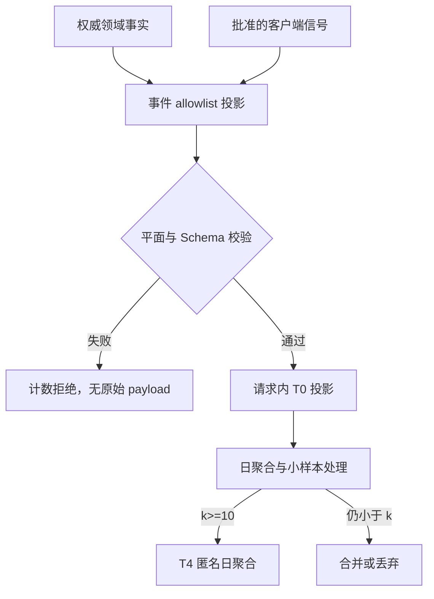

# DailyEnergy 埋点事件字典

- **文档状态**：Accepted
- **接受日期**：2026-07-26
- **所属任务**：S-24 — 埋点事件字典
- **最后更新**：2026-07-26
- **适用范围**：Phase 0B / P0～P1 的产品漏斗、互动反馈、可选能力、运行质量、数据权利与 Safety 控制的最小事件投影
- **上游权威**：[信息架构](../design/information-architecture.md)、[页面规格](../design/screen-specs.md)、[产品状态机](../product/state-machine.md)、[业务规则](../product/business-rules.md)、[ADR-0002](../decisions/ADR-0002-deterministic-daily-result.md)、[API 契约](../technical/api.md)、[错误码](../technical/error-codes.md)、[OpenAPI](../../openapi/openapi.yaml)、[隐私数据地图](../operations/privacy-data-map.md)、[ADR-0005](../decisions/ADR-0005-data-retention-and-deletion.md)、[AI Gateway](../ai/gateway.md)、[内容安全](../ai/safety.md)
- **下游任务**：S-25～S-27、S-29、S-31～S-33、C-015、AI-016、A-005、A-008

## 1. 目的

本文冻结 DailyEnergy 第一阶段的事件名称、触发事实、生产者、允许属性、聚合边界、保存期限和质量规则，使后续指标、实验、渠道归因、可观测性与实现不再各自发明埋点。

核心验收句是：

> Analytics 只能消费权威业务事实或经过批准的最小客户端信号；它不能保存用户级轨迹、不能反向决定业务状态、不能自动采集页面与设备信息，也不能接收自由文本、Safety 原文、内部引用或可跨日识别用户的标识。

本文回答：

1. 哪些产品和运行事实可以形成分析投影；
2. 每个事件何时发生、由谁产生、允许哪些有限枚举；
3. 如何避免重复命令、Unknown outcome、客户端重试和领域事件重放造成重复计数；
4. 哪些事件只能用于普通产品分析，哪些必须留在运行或受限控制平面；
5. 如何从 T0 临时投影形成不可识别、不可复原的 T4 日聚合；
6. 哪些指标仍必须由 S-25 定义，哪些渠道字段仍必须等 S-27；
7. 实现前还缺少哪些 Schema、聚合器、权限、审计和匿名化证明。

## 2. 权威边界

### 2.1 Analytics 不是业务事实来源

- 签到、结果、点亮、任务、帮助度、反馈、关系、事项、通知、Safety 与 DataTask 仍由各自领域模型拥有；
- 埋点丢失、延迟、重复或停用不能改变页面路由、关系天数、通知资格、删除状态或 Safety 覆盖；
- 分析聚合不能被回放为签到、点亮、反馈、通知、记忆、支持工单或删除证据；
- 客户端发送“成功”不能证明服务端成功；事实事件只在权威提交或状态转换后产生；
- 领域事件与 analytics 事件是不同合同：前者服务可靠派生，后者只是受控投影。

### 2.2 隐私与 Safety 高于分析完整性

- 任何字段不在 allowlist 时整条投影拒绝，不把未知字段序列化进 `extra`、日志或死信；
- high-risk 输入只进入固定 Safety 路径；普通产品事件、漏斗和营销分组不得记录其原文、类别组合或资源操作；
- 删除、撤回、账户阻断和 Safety 可以造成分析缺口；不得为“补齐数据”恢复已删对象、旧缓存或原始事件；
- 匿名化证明不成立时，相关事件保持关闭；指标缺失优先于越界采集。

### 2.3 服务端时间与产品日期

- `product_date` 由 `product-date-v1` 使用 `Asia/Shanghai`、04:00 边界解析；
- 业务事实使用服务端接受或提交事实所属的产品日期；
- 客户端信号使用服务端接收时解析的产品日期，不接受客户端自报日期纠正；
- T4 聚合不保存精确用户行为时间、客户端时钟或可还原顺序的时间线。

## 3. 范围与非目标

### 3.1 本文负责

- 事件命名、版本和事件平面；
- 权威触发、生产者、结果语义与去重原则；
- 公共属性和事件专属属性 allowlist；
- 属性基数、稀有值合并和小样本抑制；
- T0 投影、T4 日聚合、位置、访问与期限；
- 普通产品、运行、数据治理和 Safety 控制之间的隔离；
- 事件质量、迟到、重放、删除和版本迁移规则；
- 58 个 v1 逻辑事件和 48 个验证场景。

### 3.2 本文不负责

- 不定义 D1、D3、D7、漏斗、活跃、帮助度、成本等指标的唯一公式、分母和目标；由 S-25 负责；
- 不定义实验分组、显著性、停止条件或实验事件；由 S-26 负责；
- 不定义小红书、抖音素材 ID、活动 ID、承接版本映射和归因窗口；由 S-27 负责；
- 不新增 analytics API、SDK、Prisma model、migration、队列、定时任务、Dashboard 或生产配置；
- 不决定 S-33 的时序数据库、trace、告警接收人和 SLO；
- 不把用户研究问卷、访谈结论或“它记得我”“不像鸡汤”的答案塞进通用事件；
- 不授权第三方 analytics、广告、归因或实验平台；
- 不创建用户级事件历史、session replay、热力图、录屏、设备指纹或营销画像。

## 4. S-24 决策摘要

| # | 决策 | v1 结论 |
|---:|---|---|
| 1 | 是否建立用户级 event stream | 不建立；无事件表、用户轨迹、跨日 subject、session 或 device 标识 |
| 2 | 核心完成事件来源 | 从已提交的权威领域事实或受控 read model 派生，不信任客户端 success |
| 3 | 页面阅读信号 | 只允许少量显式客户端信号；只统计事件次数，不计算唯一用户或严格漏斗 |
| 4 | 普通保存形态 | 只保存通过不可识别验证与小样本规则的 T4 日聚合 |
| 5 | 第三方 SDK | v1 禁用；尤其禁止自动页面、请求、IP、设备和 session 采集 |
| 6 | 普通事件标识 | 不含 AccountRef、StableSubjectId、openid、IP、device/session/event ref |
| 7 | 时间精度 | T0 可用服务端瞬时时间完成处理；T4 只保留产品日期或更粗窗口 |
| 8 | 去重 | 事实事件按权威对象唯一性查询聚合；不为分析另存用户级 dedupe key |
| 9 | 小样本 | 默认 `k=10`；不足时合并到批准父桶，仍不足则不落 T4 行 |
| 10 | 维度组合 | 每个聚合单元除 event/date/environment 外最多 2 个批准维度 |
| 11 | 普通匿名聚合期限 | 产品、运行与成本 T4 日聚合最长 13 个自然月，然后物理删除 |
| 12 | Safety / 数据权利 | 使用独立控制平面；禁止与增长、渠道、付费、关系或营销漏斗联接 |
| 13 | 渠道 | v1 只保留粗粒度 `scene_code`；素材与渠道归因等 S-27 |
| 14 | 指标 | 事件可用不等于指标可用；S-25 未接受前不发布 KPI 结论 |
| 15 | 删除 | 无用户级 analytics 副本可删或导出；T4 聚合不可反查，不从删除证据恢复 |
| 16 | 实现 Gate | Schema、聚合器、匿名化测试、RBAC、TTL 和 raw-content detector 未完成前生产关闭 |

## 5. 事件平面

事件必须属于一个且仅属于一个平面。

| 平面 | 用途 | 允许联接 | 普通访问 | 保存 |
|---|---|---|---|---|
| `PRODUCT` | 首次、每日核心闭环、互动与可选能力 | 仅同一 T4 聚合查询中的批准维度 | 产品/数据只读角色 | T4 13 个月 |
| `RUNTIME` | API、生成、缓存、队列、成本与日期解析 | 非个人版本/环境维度 | 工程/运行角色 | T4 13 个月；原始 telemetry 服从 ADR-0005 |
| `GOVERNANCE` | DataTask 阶段、SLA 与删除复活防护 | 只能与自身 scope/stage 的聚合联接 | Privacy/运行受限角色 | T4 13 个月；正式回执期限仍按 ADR-0005 |
| `SAFETY_CONTROL` | Safety 组件可用性、固定响应与资源注册表 | 只能与非个人 policy/response 版本聚合 | Safety/运行受限角色 | T4 13 个月；SafetyEvent 另按 30 天规则 |

硬隔离：

- `SAFETY_CONTROL` 不得与 `PRODUCT`、渠道、留存、帮助度、付费或个性化联接；
- `GOVERNANCE` 不得进入增长漏斗，也不得暴露删除原因、对象引用或用户清单；
- `RUNTIME` 的 provider/model/route 深度诊断由 S-33 受限 telemetry 负责，不进入普通产品聚合；
- 一个事件不能复制到多个平面以绕过访问或保存边界。

## 6. 数据流与保存架构

### 6.1 v1 数据流



### 6.2 权威事实投影

核心事实事件优先使用日批查询从产品权威表直接聚合：

1. 在第一方受控计算中读取满足明确状态的业务事实；
2. 只计算批准的日、事件、粗粒度维度和计数；
3. 用户/对象引用只存在于既有权威数据读取期间，不复制到 analytics；
4. 聚合完成后只写 T4 单元；
5. 低于小样本阈值的细分合并或省略；
6. 任务重跑覆盖同一聚合版本，不累加第二份计数。

该方式适用于 onboarding、checkin、result、light、task、helpfulness、evening、matter、notification intent 和 DataTask 等有权威事实的事件。

### 6.3 客户端信号

客户端信号仅用于没有服务端事实的体验观察，例如：

- 承接页到达与主操作；
- 今日主要行动进入可视区；
- 五维展开；
- FAQ 展开。

约束：

- 使用显式 allowlist，不启用自动页面跟踪；
- 不携带 user/device/session ref、页面 URL、DOM/WXML、文本或任意参数；
- 不离线排队，不跨应用重启补发，不保证 exactly-once；
- T0 只增加符合聚合键的计数，不能建立用户级去重集合；
- 只能报告 `event_count`，不能作为唯一用户数、转化分母或严格序列依据；
- S-25 使用它们时必须显式标记为 best-effort。

### 6.4 逻辑位置

v1 只允许：

- 第一方 DailyEnergy 服务内的临时投影；
- 与产品业务表逻辑隔离、只存 T4 单元的第一方 PostgreSQL analytics schema 或 S-29 评审通过的等价第一方存储；
- 只读聚合 View 向 ADM-008 或受控报告提供数据。

禁止：

- 小程序直接发送到第三方；
- 通用 analytics SDK、广告 SDK、session replay 或自动网络抓取；
- 将原始事件写入 PostgreSQL、Redis、BullMQ、对象存储、日志或死信；
- 在通用 BI 中上传用户级导出、Safety 列表、DataTask 列表或支持文本。

### 6.5 保存期限

| 数据 | 最长期限 | 到期 |
|---|---:|---|
| T0 事件投影 | 当前请求/聚合计算期间 | 立即释放 |
| 客户端信号未达阈值的临时计数 | 当前产品日期聚合窗口 + 最多 2 小时 | 合并或丢弃 |
| PRODUCT T4 日聚合 | 聚合产品日期后 13 个自然月 | 物理删除 |
| RUNTIME / cost T4 日聚合 | 聚合产品日期后 13 个自然月 | 物理删除 |
| GOVERNANCE / SAFETY_CONTROL T4 日聚合 | 聚合产品日期后 13 个自然月 | 物理删除；不改变正式证据期限 |
| 事件 Schema、枚举、聚合版本 | 被历史聚合引用期间 | 版本化保留，不包含个人数据 |

任何延长必须更新 [ADR-0005](../decisions/ADR-0005-data-retention-and-deletion.md)、[隐私数据地图](../operations/privacy-data-map.md) 与本文，并重新评审。

## 7. 事件合同

### 7.1 T0 逻辑信封

```text
AnalyticsProjectionV1 {
  event_name
  event_schema_version
  plane

  server_received_at            // 只在 T0；不进入 T4
  product_date                  // server-authoritative
  product_date_policy_version
  environment

  app_version_bucket?
  locale_bucket?
  scene_code?

  outcome_code?
  event_properties?             // 仅事件专属 allowlist
}
```

明确没有：

- account、owner、stable subject、openid/unionid、手机号；
- device、session、cookie、token、IP、User-Agent；
- request/command/result/intent/task/matter/feedback/share/data-task/safety event ref；
- 精确客户端时间、经纬度、页面 URL、搜索词、剪贴板；
- `properties` 任意字典、raw payload、extra、debug 或 stack。

### 7.2 T4 日聚合

```text
AnonymousDailyAggregateV1 {
  aggregate_schema_version
  product_date
  environment
  plane
  event_name
  event_schema_version

  dimension_1_code?
  dimension_2_code?

  event_count
  unique_owner_count?           // 仅权威事实日批可计算
  sum_value?                    // 仅批准的 token/cost/latency bucket aggregate
  aggregation_revision
  source_contract_version
  generated_at
  expires_at
}
```

规则：

- `unique_owner_count` 只能在权威产品事实查询内计算，不能通过持久 user hash、device 或 session 去重；
- 客户端信号的 `unique_owner_count` 必须为空；
- `sum_value` 不能保存原始逐次金额、token、精确时长或用户级值；
- 每行最多两个事件专属维度；超过时拒绝，不拆分出更多行；
- 满足 `k=10` 才写入该维度单元；否则合并到批准父桶，仍不足则省略；
- `event_count` 与 `unique_owner_count` 不允许从一组稀疏切片反推出单个用户；
- T4 行没有用户权利 resolver，也不能被还原为事件列表。

## 8. 公共属性与基数

| 属性 | 允许值/归一化 | 基数上限 | 规则 |
|---|---|---:|---|
| `event_schema_version` | `1` | 1/事件 | breaking change 增加版本 |
| `product_date` | `YYYY-MM-DD` | 日期 | 服务端 `product-date-v1` |
| `environment` | `PROD/STAGING/TEST/DEV` | 4 | 环境绝不混算 |
| `app_version_bucket` | 审批后的 major.minor；稀有为 `OTHER` | 活跃 8 | patch/build 不进入 T4 |
| `locale_bucket` | `ZH_CN/OTHER` | 2 | 不保存设备完整 locale |
| `scene_code` | `DIRECT/CHANNEL_LANDING/SHARE/NOTIFICATION/OTHER` | 5 | 不含素材、平台 raw scene 或 campaign |
| `outcome_code` | 每事件封闭枚举 | 每事件 ≤ 8 | 不接受自由字符串 |
| `failure_class` | `AUTH/GUARD/VALIDATION/CONFLICT/RATE_LIMIT/TRANSIENT/TERMINAL/SAFETY` | 8 | 来自稳定错误 category；无 code/body |
| `latency_bucket` | `LT_250MS/250_999MS/1_2_99S/3_7_99S/8_14_99S/GE_15S/UNKNOWN` | 7 | 不保存精确毫秒到 T4 |
| `queue_age_bucket` | `LT_1S/1_4_99S/5_14_99S/15_59_99S/GE_60S/UNKNOWN` | 6 | 运行平面 |
| `generation_mode` | `AI/CONTROLLED_TEMPLATE/NO_GENERATION` | 3 | 不含 provider/model/route |
| `cache_outcome` | `HIT/MISS/STALE_REJECTED/NOT_APPLICABLE` | 4 | 不含 cache key |
| `lifecycle_day_bucket` | `D0/D1/D2/D3/D4_6/D7/D8_14/D15_PLUS` | 8 | 仅 S-25 评审后的事实聚合 |

禁止把两个低基数属性拼成新高基数字符串。任何新属性必须先补：目的、事件、允许值、基数、平面、期限、访问、删除/权利影响与测试。

## 9. 命名、触发与版本

### 9.1 命名

- 事件名使用 `lower_snake_case`；
- 名称表达已发生的事实或已解析的结果，例如 `day_lit`，不使用 `click_button_17`；
- 不在名称中嵌入页面版本、渠道、provider、实验、日期或用户类型；
- 成功与失败可由同一事件的封闭 `outcome_code` 表达；业务完成事件只在成功事实后产生；
- 事件 ID `S24-P* / O* / G* / R* / S*` 用于文档追踪，不进入生产 payload。

### 9.2 触发时点

- command 接受不等于资源最终完成时，分别使用“started/created”和“available/completed”事件；
- Unknown outcome 不发完成事件；恢复读到权威完成事实后再由事实聚合计算；
- 幂等重复、outbox 重放、客户端重试和多端读取不增加唯一事实计数；
- view/read 事件表示投影成功可用，不等于用户完整阅读或价值获得；
- `share_intent_created` 不等于微信分享成功；
- notification `SENT` 只表示交给平台，不得推断 `DELIVERED`；
- Safety 资源点击不表示接通、获助或危机解除。

### 9.3 版本

- 新增可选属性或枚举值前必须确认旧聚合器会拒绝、归 `OTHER` 或显式支持；
- 改变触发语义、生产者、单位、平面或字段含义必须增加事件 Schema version；
- 迁移期最多 14 天，旧/新版本分开聚合；指标只选择一个版本或做明确桥接；
- 不允许双发后直接相加；
- 未知版本拒绝并只增加无内容的 contract-failure 运行计数。

## 10. PRODUCT 核心事件

### 10.1 首次与每日核心闭环

| ID | `event_name` | 权威触发 / 生产者 | 允许专属属性 | 类型 |
|---|---|---|---|---|
| S24-P01 | `app_launch_resolved` | `GET /bootstrap/launch` 成功解析唯一 route | `scene_code`, `outcome_code=route bucket`, `latency_bucket` | 服务端投影 |
| S24-P02 | `landing_viewed` | ENT-001 审批页面完成首屏渲染 | `scene_code`, `surface_version_bucket` | 客户端信号 |
| S24-P03 | `landing_primary_action_clicked` | ENT-001 用户显式主操作 | `scene_code`, `surface_version_bucket` | 客户端信号 |
| S24-P04 | `consent_accepted` | 当前 notice version 的接受事实提交 | `notice_version_bucket` | 权威事实 |
| S24-P05 | `consent_withdrawn` | 撤回事实提交 | `notice_version_bucket` | 权威事实 |
| S24-P06 | `onboarding_completed` | Onboarding 从 NOT_COMPLETED → COMPLETED | 无；不含称呼/风格 | 权威事实 |
| S24-P07 | `checkin_submitted` | 当前日首份 MorningCheckin 提交 | 无；不含 mood/energy/sleep | 权威事实 |
| S24-P08 | `checkin_corrected` | MorningCheckin revision 成功增加 | 无；不含旧值/新值 | 权威事实 |
| S24-P09 | `checkin_rebuilt` | DAY 删除后受控重记事实创建 | `generation_mode=CONTROLLED_TEMPLATE` 或空 | 权威事实 |
| S24-P10 | `generation_started` | 唯一 GenerationIntent 首次创建 | `generation_mode=AI` | 权威事实 |
| S24-P11 | `daily_result_available` | 唯一 PublishedDailyResult 原子 AVAILABLE | `generation_mode`, `latency_bucket`, `cache_outcome` | 权威事实 |
| S24-P12 | `daily_result_read` | TodayView 成功返回可读结果 | `generation_mode`, `cache_outcome` | 服务端投影 |
| S24-P13 | `main_action_reached` | DLY-003 主要行动首次进入可视区 | 无；不含滚动百分比/停留时长 | 客户端信号 |
| S24-P14 | `dimensions_expanded` | 用户显式展开五维区 | 无；不含分数/重点维度 | 客户端信号 |
| S24-P15 | `day_lit` | 同用户同产品日唯一有效 LightFact 创建 | 无 | 权威事实 |

`surface_version_bucket` 与 `notice_version_bucket` 是低基数非个人配置 token，必须在发布注册表中登记；不能使用 Git SHA、随机 ID 或素材 ID。

### 10.2 互动、反馈与回看

| ID | `event_name` | 权威触发 / 生产者 | 允许专属属性 | 类型 |
|---|---|---|---|---|
| S24-P16 | `task_status_updated` | DailyInteraction task revision 成功变化 | `task_status=UNMARKED/INTERESTED/COMPLETED/SKIPPED` | 权威事实 |
| S24-P17 | `helpfulness_updated` | helpfulness revision 成功变化 | `helpfulness=HELPFUL/NEUTRAL/NOT_HELPFUL/NOT_USED` | 权威事实 |
| S24-P18 | `evening_saved` | EveningFeedback revision 0 → 1 的协调命令全量成功 | 无；不含 feeling/note/字段是否填写 | 权威事实 |
| S24-P19 | `evening_updated` | 已有 EveningFeedback revision 成功增加 | 无；不含旧值/新值 | 权威事实 |
| S24-P20 | `evening_skipped` | 显式 skip 事实被接受 | 无 | 权威事实 |
| S24-P21 | `weekly_view_read` | WeeklyView 成功返回 | `summary_status=AVAILABLE/ABSENT/INVALIDATED/FAILED` | 服务端投影 |
| S24-P22 | `weekly_summary_read` | 用户显式打开可用七天回望 | 无；不含总结正文/样本值 | 客户端信号 |
| S24-P23 | `history_day_read` | History Day View 成功返回 | `day_state=AVAILABLE/MISSING` | 服务端投影 |
| S24-P24 | `settings_viewed` | SET-001 完成首屏渲染 | 无 | 客户端信号 |
| S24-P25 | `faq_opened` | SET-005 用户展开批准 FAQ 条目 | `faq_category_code`（≤8） | 客户端信号 |

`overall_feeling`、mood、energy、sleep 与 evening note 永远不进入本表。帮助度和任务值只能在 T0 事实查询中聚合，不能形成用户级序列。

## 11. PRODUCT 可选能力事件

| ID | `event_name` | 权威触发 / 生产者 | 允许专属属性 | 备注 |
|---|---|---|---|---|
| S24-O01 | `profile_updated` | Profile revision 成功增加 | `change_group=NAME_OR_STYLE/STYLE_ONLY` | 不含值或长度 |
| S24-O02 | `style_calibration_saved` | style calibration 枚举成功保存 | 无 | 不含所选风格 |
| S24-O03 | `matter_created` | Matter 成功创建 | 无 | 不含标题、日期、grant |
| S24-O04 | `matter_updated` | Matter revision 成功增加 | 无 | 不含改动字段 |
| S24-O05 | `matter_status_changed` | pause/resume/complete 成功 | `matter_status=ACTIVE/PAUSED/COMPLETED` | EXPIRED 由派生，不伪装用户动作 |
| S24-O06 | `matter_deleted` | MATTER 删除成功 | 无 | 不含 matter/data-task ref |
| S24-O07 | `notification_settings_updated` | 账户级提醒偏好 revision 成功增加 | `notification_type`, `enabled` | 不含时间、平台 ref |
| S24-O08 | `notification_permission_observed` | 平台权限观察成功同步 | `permission_state=GRANTED/DENIED/UNKNOWN` | 不是用户偏好 |
| S24-O09 | `notification_intent_outcome` | Intent 进入 terminal 或 SENT | `notification_type`, `intent_outcome=CANCELLED/SUPPRESSED/SENT/EXPIRED` | 无 DELIVERED |
| S24-O10 | `notification_deeplink_resolved` | 点击后 SYS-001 重新校验并解析 | `notification_type`, `deeplink_outcome=VALID/EXPIRED/SOURCE_GONE/GUARD_BLOCKED` | 不含 intent ref |
| S24-O11 | `share_preview_created` | 服务端生成批准预览成功 | `share_surface=DAILY/WEEKLY` | 不含图/正文/模板自由 ID |
| S24-O12 | `share_intent_created` | 用户显式调用分享且 intent 接受 | `share_surface=DAILY/WEEKLY` | 不代表分享送达 |
| S24-O13 | `support_feedback_submitted` | `/support/feedback` 返回中性成功回执 | 无 | 不含分类、描述、case ref |
| S24-O14 | `data_rights_entry_viewed` | SET-004 完成数据权利区渲染 | 无 | 只表示入口可见 |

以下值本任务明确不收：

- Matter 日期、标题、提醒许可、Daily/Weekly grant；
- 通知发送时间、平台权限 ref、消息内容；
- 分享模板、分享图、接收者、平台回调猜测；
- 支持分类、描述、处理结果和 RestrictedSupportRef；
- 用户浏览了哪一种数据、删除原因或取消原因。

## 12. GOVERNANCE 事件

| ID | `event_name` | 权威触发 / 生产者 | 允许专属属性 | 规则 |
|---|---|---|---|---|
| S24-G01 | `data_task_created` | 唯一 DataTask 首次创建 | `scope=DAY/ACCOUNT`, `task_kind=EXPORT/DELETE` | v1 普通聚合只准 DAY/ACCOUNT |
| S24-G02 | `data_task_stage_changed` | DataTask 权威 stage 成功变化 | `scope`, `task_kind`, `stage_code` | 不含 task/owner/target ref |
| S24-G03 | `data_task_sla_outcome` | SLA 检查产生结果 | `scope`, `task_kind`, `sla_outcome=MET/BREACHED/UNKNOWN` | breach 是发布/告警 Gate |
| S24-G04 | `deleted_data_reactivation_blocked` | 恢复/缓存/队列尝试被 deletion guard 阻断 | `subsystem=CACHE/QUEUE/BACKUP/PROVIDER/CLIENT/OTHER` | 不含日期+用户组合 |

约束：

- 不统计删除原因、确认取消、身份验证结果或 legal hold 内容；
- 不允许按用户、渠道、版本、帮助度或留存切分；
- 正式 DataTask 与删除回执保存期由 ADR-0005 决定，本平面聚合不能替代证据；
- 需要 MATTER 或 RELATIONSHIP_DATA 聚合时先更新隐私数据地图和本表，不擅自归入 DAY/ACCOUNT。

## 13. RUNTIME 事件

| ID | `event_name` | 权威触发 / 生产者 | 允许专属属性 | 边界 |
|---|---|---|---|---|
| S24-R01 | `api_operation_outcome` | API 请求完成 | `operation_group`, `outcome_code=SUCCESS/FAILURE`, `failure_class`, `latency_bucket` | operation 为低基数组 |
| S24-R02 | `product_date_resolution_outcome` | 权威日期解析完成 | `outcome_code=SUCCESS/FAILURE`, `policy_version_bucket` | 不信任客户端日期 |
| S24-R03 | `generation_runtime_outcome` | GenerationIntent terminal / AVAILABLE | `workload=DAILY/WEEKLY`, `generation_mode`, `outcome_code`, `latency_bucket` | 不含 provider/model |
| S24-R04 | `cache_lookup_outcome` | 批准 read model cache 查询完成 | `cache_group`, `cache_outcome` | 不含 key |
| S24-R05 | `queue_stage_outcome` | 批准队列阶段完成 | `queue_group`, `outcome_code`, `queue_age_bucket` | 不含 job/ref |
| S24-R06 | `gateway_usage_aggregate` | 日批汇总 Gateway usage | `workload`, `generation_mode`, `usage_outcome=KNOWN/UNKNOWN` | 只存聚合 token/cost |
| S24-R07 | `notification_dispatch_outcome` | 唯一 dispatch claim 完成 | `notification_type`, `intent_outcome` | 不猜测 delivered |
| S24-R08 | `raw_content_detector_outcome` | 普通日志/telemetry 扫描完成 | `subsystem`, `outcome_code=CLEAN/MATCH/BLOCKED/FAILED` | MATCH 不含原文 |
| S24-R09 | `provider_profile_conformance_outcome` | 受控 profile/drift 检查完成 | `workload`, `outcome_code=PASS/DRIFT/UNKNOWN` | 不含合同/region 明细 |
| S24-R10 | `release_contract_outcome` | Schema/API/event contract Gate 完成 | `contract_group`, `outcome_code=PASS/FAIL` | 失败详情留 CI |

`provider`、`model`、route manifest、attempt ref 和精确 failure chain 属于 S-33 受限 observability，不进入 PRODUCT T4。若 S-33 需要保留这些非个人运行维度，必须定义独立位置、访问、基数和期限，不能偷偷扩充本文公共属性。

## 14. SAFETY_CONTROL 事件

| ID | `event_name` | 权威触发 / 生产者 | 允许专属属性 | 禁止解释 |
|---|---|---|---|---|
| S24-S01 | `safety_input_gate_outcome` | Input Gate 完成或 fail closed | `surface_bucket`, `outcome_code=ORDINARY/DIVERTED/INDETERMINATE`, `latency_bucket` | 不统计类别/文本/confidence |
| S24-S02 | `safety_fixed_response_outcome` | 固定响应成功或 emergency fallback 渲染 | `response_version_bucket`, `outcome_code=PRIMARY/FALLBACK/FAILED` | 不表示用户获助 |
| S24-S03 | `safety_resource_registry_outcome` | 地区资源解析完成 | `resource_outcome=PRIMARY/FALLBACK/GENERIC/FAILED` | 不含地区/号码/类别 |
| S24-S04 | `safety_resource_action_aggregate` | 用户显式资源操作的匿名日聚合 | `action_type=CALL/OPEN_LINK/COPY/OTHER` | 不表示接通/联系成功 |
| S24-S05 | `safety_recovery_outcome` | recovery start/confirm 权威命令结果 | `recovery_step=START/CONFIRM`, `outcome_code=ACCEPTED/REJECTED/CONFLICT` | 不表示危机解除 |

`surface_bucket` 只允许 `PROFILE/EVENING/MATTER/SUPPORT/OTHER`。该平面：

- 不包含 high-risk category、SafetyEvent ref、state revision、input fingerprint 或用户标识；
- 不与普通漏斗、留存、渠道、关系、帮助度或实验联接；
- 访问与导出必须受限；
- 不能替代 SafetyEvent、RestrictedAuditEvent 或 S-23 incident 流程；
- 小样本合并失败时整行省略，不能为 Safety 完整性降低 `k`。

## 15. 不允许的事件与属性

### 15.1 永久禁止进入普通 analytics

- openid/unionid、AccountRef、StableSubjectId、手机号、token、IP、设备或 session ref；
- preferred name、matter title、evening note、support description、Safety 原文；
- mood、energy、sleep 的用户级序列或可反查组合画像；
- 今日分数、raw score、seed、choice trace、幸运元素、内部原因；
- Prompt、prepared input、provider request/response、AI 正文；
- command/request/result/intent/source/grant/dependency/epoch/fingerprint opaque ref；
- 页面 URL、截图、录屏、WXML/DOM、点击坐标、剪贴板；
- 分享图、导出 artifact、通知 payload、删除原因、legal hold；
- 自由文本属性、任意 JSON、动态 label 或高基数 ID。

### 15.2 不创建的事件

- `user_active`：活跃是 S-25 指标，不是单一事件；
- `user_retained`：D1/D3/D7 由 S-25 从权威事实定义；
- `notification_delivered`：当前没有可信平台事实；
- `share_succeeded`：`share_intent_created` 不能证明接收；
- `content_read_completed`：没有可靠且克制的完成事实；只保留 action reached 与 light；
- `safety_resolved`：产品 recovery 不是临床结论；
- `relationship_grew`：关系阶段由 LightFact 派生，不是客户端感受；
- `user_churned`：未打开不能解释为流失原因；
- `ai_content_liked`：使用 Accepted `helpfulness`，不另造含义；
- `campaign_converted`：等 S-27 归因合同。

## 16. 去重、迟到与修订

### 16.1 权威事实

- 同一 owner/date 唯一事实在聚合查询中只计一次；
- revisioned 对象的“创建”只取第一有效 revision，“更新”按成功 revision 增量计数；
- 当前状态型指标由 S-25 读取最终状态，不用 update 事件次数代替人数；
- 日批重跑写同一 `aggregation_revision` 的替代版本，不在旧值上累加；
- 删除导致事实失效后，后续日批必须按当前权威数据重算尚可变聚合；已经发布为 T4 且无法反查用户的历史总量不尝试减去单人；
- 若这种历史保留在法律或产品上不可接受，则不能声称 T4，必须改为可删除个人数据并先更新隐私地图。

### 16.2 客户端信号

- 不提供持久用户级或 session 级去重；
- 单次页面生命周期可在内存避免重复上报，但刷新/多端仍可能重复；
- 不跨重启保存待发送事件；
- 重试失败可丢失；不能以此判断用户没有阅读或点击；
- S-25 不能把客户端信号作为高精度唯一用户漏斗的唯一来源。

### 16.3 迟到

- 权威事实按事实所属 `product_date` 聚合；
- 客户端信号按服务端收到时产品日期聚合，超过日期窗口不补发；
- 聚合任务允许产品日期结束后最多 2 小时处理迟到的第一方事实；
- 超过窗口的权威修订通过下一次 revision 重算，不修改事件发生时间；
- 不保存精确迟到记录或用户列表。

## 17. 维度、小样本与不可识别 Gate

### 17.1 维度注册

每个维度必须具备：

- 业务目的；
- 枚举所有者与版本；
- 最大基数和 `OTHER/UNKNOWN` 行为；
- 允许事件和平面；
- 是否可与第二维组合；
- 小样本父桶；
- 期限、访问与测试。

未登记值：

- PRODUCT/GOVERNANCE/SAFETY_CONTROL：拒绝或归明确 `OTHER`，不能原样保存；
- RUNTIME：增加 contract-failure 计数，原值留在受限诊断而非 analytics。

### 17.2 小样本

1. 默认最小单元 `k=10`；
2. 先移除第二维并尝试父桶；
3. 再把稀有枚举归 `OTHER`；
4. 仍不足 10 时不写该 T4 单元；
5. 报表不得用多个重叠切片做差分推断被省略用户；
6. 导出沿用同一抑制，不提供“管理员可看原始小样本”的后门；
7. Alpha 只有 10～20 人时，很多渠道/版本细分不可用是预期，不降低阈值。

### 17.3 T4 证明

生产启用前必须证明：

- 没有 user/device/session/cross-day subject；
- 没有精确时间线、稀有版本或高基数动态 label；
- 单元达到阈值且差分攻击风险受控；
- 聚合不能解析回产品表、日志、Safety、DataTask 或支持对象；
- 访问、导出、TTL 和删除任务已实现；
- raw-content/forbidden-field detector 在 contract、队列、日志和聚合输出上零命中。

不能完成证明时，该数据按个人数据处理，并因当前没有用户级 analytics 映射而保持生产关闭。

## 18. 数据质量

### 18.1 每日检查

- 未登记事件数必须为 0；
- 未登记属性、自由文本、高基数 label 命中为 0；
- PRODUCT 核心事实数与权威表日批校验一致；
- 同一聚合 key 同一 revision 只有一行；
- `event_count >= unique_owner_count >= 0`，客户端信号 unique 为空；
- staging/test/dev 不进入 PROD；
- 低于 k 的细分输出为 0 行；
- T0/raw event/event queue/event dead-letter 持久行数为 0；
- 过期 T4 删除成功；
- SAFETY_CONTROL 与 PRODUCT 查询无 join path；
- DataTask breach 与 raw-content match 触发 S-23/S-33 约定的发布或事件 Gate。

### 18.2 变更 Gate

以下任一变化必须重新评审：

- 新自由文本、页面自动采集、设备/session 标识；
- 新事件平面或跨平面联接；
- 新第三方、区域、SDK、导出目标；
- 新维度基数超过上限；
- 保存超过 13 个月；
- 需要用户级去重、跨日 cohort 或个体实验分配；
- 需要从 T4 返回用户列表；
- Safety/删除事件想进入增长或付费分析。

## 19. S-25、S-26 与 S-27 交接

### 19.1 S-25 指标

S-25 必须逐指标定义：

- 名称、目的、分子、分母、时间窗和产品日期；
- 依赖的权威事实与事件版本；
- 是否使用 `event_count` 或 `unique_owner_count`；
- cohort、D1/D3/D7、缺失、删除和重建处理；
- 小样本、渠道分组、置信表达和样本量展示；
- 模板降级、Unknown outcome 和客户端信号误差；
- 指标 owner、刷新频率和验收 SQL/fixture。

特别约束：

- `day_lit` 不自动等于活跃、留存或内容有帮助；
- `daily_result_read` 不自动等于完整阅读；
- `share_intent_created` 不自动等于分享成功；
- `notification_deeplink_resolved` 不自动等于自然回访；
- `helpfulness_updated` 的更新次数不能替代最终评价人数；
- D1/D3/D7 必须从第一方权威事实在 T0 计算后形成 T4，不创建跨日 event subject。

### 19.2 S-26 实验

- 实验分配不是本文公共属性；
- S-26 若需个体 assignment，必须先更新 PDM-ANALYTICS-001、依据、标识、期限、删除、导出与权限；
- 不能实验 Safety、删除、必要同意、恐惧、断签压力或保存期；
- 删除用户不得通过旧 assignment 或聚合恢复。

### 19.3 S-27 归因

- 当前 `scene_code` 只区分粗入口；
- 小红书/抖音、素材、活动和承接版本必须使用低基数注册表；
- 归因窗口、首次/末次触达、平台限制和 falsification 由 S-27 定义；
- 任何渠道参数不得含用户状态、事项、记忆或可识别标识；
- S-27 未接受前不得按素材报告 D1/D3/D7。

## 20. 验证场景

| ID | 场景 | 预期 |
|---|---|---|
| S24-EVT-001 | 首次 onboarding 成功，客户端重复回调 | 权威事实只产生一个 `onboarding_completed` |
| S24-EVT-002 | checkin 同 command 同 payload 重试 | `checkin_submitted` 唯一事实数不增加 |
| S24-EVT-003 | checkin 同键不同 payload 冲突 | 不产生成功事件；只可有无内容 failure aggregate |
| S24-EVT-004 | checkin 更正 revision 成功 | 产生 `checkin_corrected`，不复制旧值/新值 |
| S24-EVT-005 | 生成 start 响应丢失，恢复到同一 intent | `generation_started` 只计首次创建 |
| S24-EVT-006 | primary/backup 失败，template 发布 | 一次 `daily_result_available`，mode=CONTROLLED_TEMPLATE |
| S24-EVT-007 | 两个 worker 竞争同一结果 | 只按唯一 AVAILABLE 事实计一次 |
| S24-EVT-008 | TodayView 从缓存重复读取 | read 可计请求次数；不会增加 result/Light 唯一事实 |
| S24-EVT-009 | 用户多次展开五维 | 页面生命周期可内存抑制；仍不宣称唯一用户 |
| S24-EVT-010 | Offline 阅读缓存后关闭应用 | 不排队补发阅读或 action reached |
| S24-EVT-011 | 多端同时点亮 | 一份 LightFact、一个 `day_lit` 唯一用户事实 |
| S24-EVT-012 | task 从 INTERESTED 到 COMPLETED | 两次状态变化可计；最终完成比例由 S-25 读最终状态 |
| S24-EVT-013 | helpfulness 多次修改 | 更新事件可计；最终 rating 指标不按更新次数计算 |
| S24-EVT-014 | evening 协调保存 task revision 冲突 | 全命令失败；不产生 evening/task/helpfulness 成功事实 |
| S24-EVT-015 | evening note high risk | 普通 PRODUCT 事件为 0；只走受限 Safety 控制 |
| S24-EVT-016 | weekly summary INVALIDATED | `weekly_view_read` 可标 INVALIDATED，不读取旧正文 |
| S24-EVT-017 | 历史日已删除 | `history_day_read` 只标 MISSING，不恢复内容 |
| S24-EVT-018 | Matter 创建带自由文本 | 只聚合 `matter_created`；标题、日期、grant 为 0 |
| S24-EVT-019 | notification intent SENT | 只表示交给平台，不生成 DELIVERED |
| S24-EVT-020 | 过期通知深链点击 | outcome=EXPIRED；不补签到/反馈，不算自然回访 |
| S24-EVT-021 | 分享预览创建后用户取消 | 有 preview，无 share intent 或成功分享推断 |
| S24-EVT-022 | 调用微信分享 | 只产生 `share_intent_created`，不推断接收 |
| S24-EVT-023 | 支持反馈含描述 | 普通事件不含分类/描述/case ref |
| S24-EVT-024 | DAY DataTask 创建 | 进入 GOVERNANCE；不与 PRODUCT 漏斗联接 |
| S24-EVT-025 | ACCOUNT 删除 SLA breach | 受限聚合标 BREACHED，并触发运行 Gate |
| S24-EVT-026 | 备份恢复尝试复活已删数据 | 只聚合 subsystem 与 blocked，不含用户/日期组合 |
| S24-EVT-027 | Safety Input Gate high risk | ordinary PRODUCT 为 0；SAFETY_CONTROL 可计 DIVERTED |
| S24-EVT-028 | Safety 资源点击 | 只计 action type；不记录号码、类别、接通或时长 |
| S24-EVT-029 | recovery confirm 接受 | 不命名为“危机解除”，不进入留存 |
| S24-EVT-030 | raw-content detector 命中 | 聚合 MATCH/BLOCKED；原文不进 telemetry/analytics |
| S24-EVT-031 | provider/model 名准备进入 PRODUCT label | Contract 拒绝；深度诊断交 S-33 |
| S24-EVT-032 | payload 出现未知属性 `extra` | 整条投影拒绝，不写死信原文 |
| S24-EVT-033 | 未知 event schema version | 拒绝并增加无内容 contract-failure 计数 |
| S24-EVT-034 | app patch/build 版本稀有 | 归 major.minor 或 OTHER，不原样保存 |
| S24-EVT-035 | 一个聚合请求带 3 个专属维度 | 拒绝或移除未批准维度，不产生稀疏立方体 |
| S24-EVT-036 | 某维度单元只有 7 人 | 合并父桶；仍小于 10 则不落行 |
| S24-EVT-037 | Alpha 想降低 k 到 3 便于看渠道 | 拒绝；小样本不可用是预期 |
| S24-EVT-038 | 管理员尝试导出被抑制细分 | 拒绝；没有 raw 小样本后门 |
| S24-EVT-039 | 日批任务重跑 | 覆盖相同 aggregate revision，不重复累加 |
| S24-EVT-040 | 权威事实迟到修订 | 下一 revision 重算允许窗口，不写用户级迟到列表 |
| S24-EVT-041 | 客户端自报昨天 product date | 忽略；使用服务端接收产品日期 |
| S24-EVT-042 | TEST 事件误投 PROD | 环境 Gate 拒绝并告警，不混算 |
| S24-EVT-043 | 第三方 SDK 默认采集 IP/device | 集成 Gate 失败，SDK 不得启用 |
| S24-EVT-044 | ACCOUNT 删除后请求 analytics 导出 | 没有用户级事件历史；T4 不可反查、不进入导出 |
| S24-EVT-045 | 从 T4 与小切片差分定位用户 | 查询/导出 Gate 阻断重叠稀疏切片 |
| S24-EVT-046 | D1 需要跨日 subject | 在 T0 权威事实查询计算后只写 T4；不建 event subject |
| S24-EVT-047 | “不像鸡汤”没有 Accepted 输入 Schema | 不创建临时属性；S-25 标为定性/阻塞来源 |
| S24-EVT-048 | S-27 前请求素材级留存 | 不可用；只能使用粗 `scene_code` |

## 21. Production Gates 与下游交接

| Gate | Owner / 下游 | 解除条件 |
|---|---|---|
| 可执行事件 Schema 与枚举注册表 | C-015、packages/shared-schemas | 58 个事件、属性、版本、未知字段拒绝与测试实现 |
| 客户端信号第一方入口 | S-29、C-015 | 封闭 API、鉴权/限流、服务端日期、无离线队列和零 raw 持久化实现 |
| T0 → T4 聚合器 | S-29、C-015 | 无 raw event store、可重跑、revision、迟到和失败恢复实现 |
| 小样本与不可识别证明 | Privacy owner、S-31 | k、父桶、差分、访问和重识别测试通过 |
| 第一方 aggregate store / RBAC / TTL | S-29、E-006、A-005 | 独立逻辑位置、最小角色、13 个月到期和审计实现 |
| 处理目的与用户说明复核 | Privacy/Legal owner、C-002 | 按真实主体、实现位置和实际字段核验说明、依据、权利和受托方 |
| 指标唯一口径 | S-25 | 分子、分母、窗口、删除、降级、样本量和验收 SQL Accepted |
| 实验个体分配 | S-26 + privacy change | 更新 PDM、标识、依据、期限、删除、导出与同意/告知 Gate |
| 小红书/抖音归因 | S-27 | 低基数 registry、平台能力、归因窗口与隐私评审 Accepted |
| 运行 telemetry / 告警 | S-33、E-013 | 时序标签、trace、provider/model 受限访问和报警实现 |
| 第三方 analytics | 新评审 | 受托方、地区、SDK 自动采集、TTL、删除、导出和合同全部 Accepted |
| Safety / Governance 隔离 | S-29、S-31、A-008 | 独立权限、无 join path、演练和 raw-content detector 通过 |

上述 Gate 未完成前：

- 不得在生产发送、排队或持久化用户级 analytics 事件；
- 不得把本文理解为已接入 SDK、BI、数据仓库或管理后台；
- 不得发布 D1/D3/D7、渠道、帮助度、成本或 Safety 数字；
- 不得用日志、支持工单、SafetyEvent、删除回执或导出包临时代替事件源；
- 不得为了可观测性打开 raw body、Prompt、provider response 或自由文本日志。

## 22. S-24 验收标准

- 58 个事件均有唯一 ID、名称、平面、权威触发和属性边界；
- 权威事实、服务端投影和客户端信号的可靠性差异明确；
- analytics 永远不能反向决定业务状态、关系、Safety、通知或删除；
- 不建立 user/device/session/cross-day subject 或原始事件仓库；
- T0、T4、第一方位置、13 个月期限、k=10 和最多两个维度完整；
- PRODUCT、RUNTIME、GOVERNANCE、SAFETY_CONTROL 权限和联接边界明确；
- 48 个验证场景 ID 唯一，覆盖幂等、Unknown、离线、降级、删除、Safety、小样本、版本和第三方；
- 与页面、状态机、API、PDM、ADR-0005、Gateway 和 Safety 无冲突；
- S-25、S-26、S-27、S-29、S-31～S-33 与 C-015 的实现 Gate 清楚；
- PR 只包含文档和项目控制更新，不包含 SDK、Schema、API、数据库、migration、生产配置或真实数据；
- 本文只有在用户确认后转为 Accepted。

## 23. 审核记录

- 状态：Accepted；
- 接受日期：2026-07-26；
- 内容 PR：[PR #29](https://github.com/WeiHan1996/DailyEnergy/pull/29)；
- 已确认范围：无用户级 event stream、事实优先、客户端信号限制、4 个平面、58 个事件、T4/k=10/13 个月、第三方关闭、48 个验证场景和 Production Gates；
- 下一任务：S-25 指标唯一口径。
