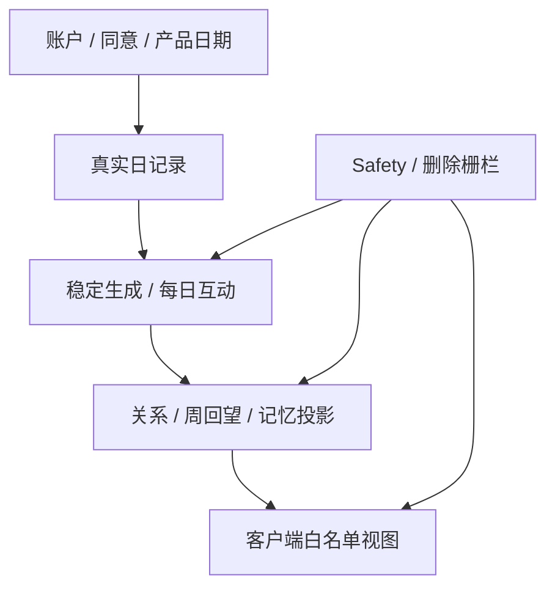

# DailyEnergy 领域模型

- **文档状态**：Draft
- **所属任务**：S-17 — 领域模型
- **最后更新**：2026-07-22
- **适用范围**：Phase 0B / P0 账户、每日记录、稳定生成、互动、关系、事项与记忆、七天回望、Safety、通知、数据任务和版本证据
- **上游规范**：[产品状态机](../product/state-machine.md)、[业务规则](../product/business-rules.md)、[今日内容 Schema](../ai/daily-content-schema.md)、[晚间反馈 Schema](../ai/evening-feedback-schema.md)、[七天总结 Schema](../ai/weekly-summary-schema.md)、[ADR-0002](../decisions/ADR-0002-deterministic-daily-result.md)、[确定性生成引擎](../ai/generation-engine.md)、[AI Gateway](../ai/gateway.md)、[Prompt 规范](../ai/prompt-spec.md)、[ADR-0004](../decisions/ADR-0004-structured-memory.md)、[结构化记忆](../ai/memory.md)、[内容安全](../ai/safety.md)、[AI 评价](../ai/evaluation.md)
- **下游任务**：S-18～S-25、S-29、S-31、S-33 以及 Phase 1～3 工程任务

## 1. 文档目的

本文把已接受的状态、Schema、稳定生成、记忆、安全与评价契约转换为统一的领域语言和一致性边界。它回答：

1. 哪个对象拥有哪项事实；
2. 哪些对象可以修改，哪些对象一经发布就不可变；
3. 跨对象引用怎样保持可追溯、可撤销和可删除；
4. 哪些动作必须原子完成，哪些派生视图可以重建；
5. 日期、修订、幂等、Safety 与删除怎样阻止迟到写入复活旧数据；
6. S-18 数据保存删除、S-19 数据库和 S-20 API 应继承哪些不变量。

本文是概念领域模型，不是数据库表设计。实体名可以在 S-19 映射为表、文档或模块对象，但不得因为存储便利改变本规范的事实归属和边界。

核心验收句：

> 每一项用户事实只有一个权威来源；每一份生成内容都能追溯到冻结输入与版本；每一项派生关系都能从合法源重建或在源失效时停止展示；任何 Safety、撤销或删除都能用修订栅栏阻止旧调用重新发布。

## 2. 权威边界

本文继承且不得重开：

- 产品日期由服务端 `product-date-v1` 解析，时区为 `Asia/Shanghai`，边界为 04:00；
- 同一逻辑用户、同一产品日期最多一个生成意图和一个 AVAILABLE 每日结果，唯一性不包含 `result_version`；
- 签到是真实可修订记录；每日结果使用生成时快照，签到更正不重写已发布结果；
- 规则引擎独占分数、档位、排序、行动、任务与仪式事实的写入权，AI 只表达；
- Primary、Backup、Controlled Template 使用同一冻结输入，顺序执行，不竞速、不修补、不拼接；
- 每日结果、周总结修订和它们的发布载荷不可原地改写；
- 点亮、任务、帮助度、晚间反馈和关系不是一个可写 `daily_status`；
- 关系天数来自有效相遇源日，不是连续签到、积分或亲密度；
- 记忆只来自权威领域源与精确用途授权，不存在通用 `memory_text`、embedding 或向量库；
- v1 Daily / Weekly 仍不启用事项、近期状态或关系记忆；
- Safety 状态独立于产品日期，高风险输入先于普通领域写入并使普通模型/模板调用数为 0；
- Safety event 不保存原始输入、诊断、置信度或分类解释；
- 晚间 note 只供用户本人回看和 Safety 检查，不进入周总结、普通 AI、记忆、通知、分享或分析；
- 删除命令与被删对象的业务状态分开；删除成功后所有活跃派生引用和可读缓存必须失效；
- ADR-0005 接受前，DAY 删除后同产品日期重新开始保持禁用；
- 评测身份和合成语料不得混入真实用户领域对象。

冲突时依次使用 Accepted ADR、Accepted 规范、共享可执行 Schema、本文，再到数据库和 API 设计。下游实现不能通过增加一张“万能状态表”或保存额外原文绕过上游约束。

## 3. 范围

### 3.1 本文负责

- 统一术语、上下文边界、聚合根、实体、值对象和派生投影；
- 账户、同意、资料、产品日期与 continuation 的身份关系；
- 每日签到、生成意图、执行尝试、候选和已发布结果的关系；
- 点亮、任务、帮助度与晚间反馈的原子交互边界；
- 关系周期、相遇源链接、阶段和节点回执；
- 事项、用途授权、提及回执、记忆快照与源依赖；
- 周窗口、源快照、聚合事实、表达修订与失效；
- Safety decision/state/event/response/resource 的分离；
- 通知偏好、平台权限快照、通知意图和发送尝试的分离；
- 删除/导出任务与业务数据的分离；
- ID、修订、fingerprint、epoch、版本和幂等的通用语义；
- 跨聚合原子不变量、事件、读模型、失效链和验收场景。

### 3.2 本文不负责

- 选择 PostgreSQL 表、列类型、Prisma 关系、索引语法、分区或加密实现；
- 决定物理保留期、软删/硬删、备份清除、依法保留、审计期限和删除 SLA；
- 定义 REST/OpenAPI、错误码、鉴权协议或客户端网络 DTO；
- 实现服务、数据库、队列、缓存、classifier、provider、通知或后台；
- 修改现有业务 Schema、Prompt、规则、模型路由或 Safety 文案；
- 允许 DAY 删除后同日重新开始；
- 确定生产 provider、primary/backup、ACTIVE route 或评测 winner；
- 决定运营人员、客服或专业审核角色权限；
- 建立分析事件和 KPI 口径。

## 4. S-17 决策摘要

1. 领域按账户、产品时间、每日记录、生成、发布内容、互动、关系、事项/记忆、周回望、Safety、通知、数据任务和版本证据分区。
2. `UserAccount` 拥有账户生命周期和不可变 `stable_subject_id`；微信 openid、设备 ID 或手机号不是稳定种子主体。
3. 必要同意、Profile 与 Onboarding Completion 分开；资料修改不重开首次认识，同意撤回也不删除资料事实。
4. 所有按日对象使用服务端 `ProductDate` 值对象，并保存适用 policy version；时间戳不能替代日期归属。
5. `MorningCheckin` 是可修订真实记录；同用户同日只有一个活跃逻辑记录。
6. `GenerationIntent` 是每日生成的一致性根，冻结 manifest、input snapshot、root seed identity 与生命周期；唯一性为用户 + 产品日期。
7. `GatewayInvocation`、`GatewayAttempt` 和短期 candidate 从属于一个 owner intent；candidate 不是已发布结果。
8. `PublishedDailyResult` 是独立不可变发布聚合；包含 RuleFacts、表达、依赖、fallback、provenance 与验证回执。
9. `DailyInteraction` 是窄范围互动聚合，包含点亮事实、任务状态、帮助度和晚间反馈，并允许“保存今天”原子更新多个独立修订组件；它不是综合每日状态。
10. 点亮确认创建唯一 `RelationshipEncounterLink`；关系阶段由当前 `RelationshipCycle` 的有效链接派生，节点回执不增加计数。
11. 关系数据整体删除终止旧 cycle；旧点亮不会被重放为新 cycle 的相遇日，未来新的合法点亮才进入新周期。
12. `ImportantMatter`、`MemoryPurposeGrant`、`MemoryMentionReceipt`、`MemoryContextSnapshot` 和 `SourceDependency` 分开，不复制一份通用记忆文本。
13. `WeeklyWindow` 固定七个连续产品日期；源 fingerprint 改变时旧 summary revision 失效，新修订不可原地覆盖旧对象。
14. `SafetyDecision`、`SafetyState`、`SafetyEvent`、`SafetyResponsePlan` 与 `SafetyResourceEntry` 分开；不存在诊断或风险分数字段。
15. Safety 使用单调 revision/epoch 作为跨域发布栅栏；ACTIVE 前的迟到候选不能发布。
16. `NotificationPreference`、外部 `PlatformPermissionSnapshot`、`NotificationIntent` 与 `DeliveryAttempt` 分开；SENT 只表示已交给平台。
17. `DataTask` 表达 DAY/MATTER/RELATIONSHIP_DATA/ACCOUNT 删除和导出流程；业务对象是否可用不能只从任务最终时间猜测。
18. 可变用户事实使用 revision，内容/清单使用 fingerprint，跨域覆盖使用 epoch；三者不能互换。
19. `EvaluationRun` 使用独立 synthetic subject namespace，不引用真实 `AccountRef`、Safety event 或用户内容。
20. 所有客户端页面使用白名单 read model；read model、缓存和 analytics 都不是业务事实来源。

## 5. 规范用语与核心术语

### 5.1 规范强度

- **必须 / 禁止**：下游实现不可偏离；
- **应该 / 不应该**：默认遵循，偏离需记录理由和测试；
- **可以**：在其它约束成立时允许；
- **延期**：由明确后续任务决定，当前不得猜测实现。

### 5.2 术语

| 术语 | 含义 |
| --- | --- |
| 逻辑用户 | 同一 DailyEnergy 账户生命周期内的领域主体，不等于微信身份或设备 |
| OwnerRef | 服务端跨聚合使用的不透明账户引用 |
| StableSubjectId | 仅用于稳定种子域的不可变、高熵 ASCII 标识 |
| ProductDate | 按已接受产品日期策略解析出的 `YYYY-MM-DD` 民用日期 |
| Aggregate | 一个需要在同一一致性边界内维护不变量的领域对象集合 |
| Entity | 有稳定身份、可以经历生命周期的对象 |
| Value Object | 由完整值定义、无独立生命周期的对象 |
| Revision | 可变事实成功修改后单调递增的并发版本 |
| Fingerprint | 规范化不可变内容或源修订集合的 SHA-256 类摘要；不是授权或加密 |
| Epoch | 用于跨域阻断旧工作结果的单调栅栏值 |
| Intent | 一个已被服务端接受、可幂等恢复的用户或系统业务意图 |
| Attempt | 为完成同一 intent 进行的一次有限技术执行 |
| Snapshot | 在某一边界冻结且之后不被原地改写的输入或源集合 |
| Published | 已完整校验并在唯一性边界内原子可读 |
| Projection | 从权威源计算的白名单读模型，可以失效和重建 |
| SourceDependency | 发布对象对某个源修订、用途与 fallback 的服务端依赖 |
| Tombstone / Guard | 为防止重建或迟到写入而保留的最小阻断语义；物理形式由 S-18/S-19 决定 |

### 5.3 建模规则

- 状态必须位于拥有该事实的聚合内，禁止把所有状态塞进 `user_status` 或 `daily_status`；
- 内部关联只传递 opaque ref、版本、revision 或 fingerprint，不复制来源全文；
- 枚举沿用上游 Schema；本文不创造同义别名；
- `null`、空字符串和占位文本不能表达“没有事实”；可选值省略，清除使用显式命令；
- 派生状态必须注明来源、版本和失效条件；
- 历史不可变对象用新 revision/新对象取代，不原地改写；
- 时间戳用于审计顺序，不能代替业务日期、revision 或幂等身份；
- 数据层唯一性与服务层幂等必须同时存在，客户端防双击不构成领域保证；
- 普通日志、埋点和缓存不得成为重建用户事实的后门。

## 6. 领域上下文地图

| 上下文 | 核心职责 | 主要输入 | 主要输出 | 禁止承担 |
| --- | --- | --- | --- | --- |
| Identity & Account | 逻辑用户、账户生命周期、会话映射、stable subject | 身份建立/恢复、账户操作 | AccountRef、账户状态与 revision | 每日状态、Safety 分类 |
| Consent & Profile | 必要同意、首次认识、称呼和风格偏好 | 显式用户提交 | Consent/Profile revisions | 推断职业、关系、人格 |
| Product Time | 产品日期、写入窗口、continuation | 权威时钟、policy | ProductDate、window decision、grant | 业务写入、设备时间猜测 |
| Daily Records | 晨间真实状态 | 签到提交/更正 | MorningCheckin revision | 生成分数、晚间覆盖 |
| Generation & Gateway | intent、冻结输入、规则、表达尝试与候选 | Checkin、manifest、plan | 完整 candidate 或失败 | 发布第二份结果、修改事实 |
| Content Publication | 唯一不可变 Daily/Weekly 发布对象和安全投影 | 合格 candidate、live guards | Published result、client view | 重新算规则、拼接候选 |
| Daily Interaction | 点亮、任务、帮助度、晚间反馈 | 用户互动命令 | 独立组件 revisions | 关系评分、综合 daily status |
| Relationship | 当前关系周期、相遇链接、阶段与节点回执 | 有效点亮源 | 派生 count/stage、node eligibility | 连续签到、亲密度 |
| Matter & Memory | 用户事项、用途授权、确定性解析、提及回执 | 显式事项/授权、领域源 | memory snapshot、dependency/fallback | 通用记忆文本、向量检索 |
| Weekly Reflection | 七日源快照、聚合事实和表达修订 | 合法日源 revisions | facts、summary revision、view | 使用 AI 文本或晚间 note 作趋势 |
| Safety | 输入决策、覆盖状态、固定响应与资源 | 受控文本 surface、policy | state epoch、fixed response plan | 普通生成、诊断、原文仓库 |
| Notification | 用户偏好、发送资格、意图与平台尝试 | 偏好、源事实、权限快照 | 去重 intent、send outcome | 关系召回、敏感锁屏文案 |
| Data Rights & Evidence | 删除/导出任务、版本目录、评测证据边界 | 用户请求、发布配置、合成评测 | DataTask、immutable catalogs、EvaluationRun | 恢复已删事实、混入真实评测身份 |

依赖方向必须从领域源流向派生/表达：



Gateway、Prompt Renderer、Notification Sender 和客户端不得反向查询并修改权威领域源。

## 7. 通用身份、版本与引用契约

### 7.1 身份类型

| 类型 | 规则 | 可见范围 |
| --- | --- | --- |
| `AccountRef` / `OwnerRef` | 高熵、不透明，不编码微信 ID、手机号或日期 | 服务端领域模块 |
| `StableSubjectId` | 不可变、高熵 ASCII；一个账户生命周期一个；删除后不单独保留以维持 seed | 仅账户/确定性生成受限边界 |
| `ProductDate` | `YYYY-MM-DD`，必须与 policy version 同时解释 | 服务端和允许的客户端视图 |
| `EntityRef` | 不透明；不从原文、seed 或用户可猜字段直接生成 | 对应服务端模块 |
| `CommandRef` | 一次逻辑命令的幂等身份，不可反查用户 | 客户端可提交，服务端校验 |
| `TraceRef` | 运行追踪，不是业务幂等或对象身份 | 受控观测 |
| `FactId` | invocation scoped，只用于表达层 exact refs | Prompt/validator 当前调用 |

任何 ref 都不是授权凭证。客户端得到 `result_id`、`task_id` 等引用后，服务端仍必须检查 owner、日期、状态和权限。

### 7.2 Revision

Revision 用于可变权威事实：Profile、Checkin、DailyTaskState、Helpfulness、EveningFeedback、Matter、Grant、SafetyState、NotificationPreference、DataTask 等。

规则：

- 创建后的首个有效 revision 为 1；不存在时 expected revision 为 0；
- 成功改变语义字段才递增；幂等 no-op 返回现有 revision；
- `updated_at` 相同或更晚不能证明 revision 匹配；
- 跨聚合协调命令必须携带每个被修改组件的 expected revision；
- 冲突先返回/读取最新事实，不做最后写入者静默覆盖。

### 7.3 Fingerprint

Fingerprint 用于不可变或可重建内容：manifest、input snapshot、RuleFacts、plan、route、request、candidate、source set、weekly sources、memory context、evaluation corpus。

规则：

- canonical bytes、算法和版本必须明确；
- fingerprint 不包含密钥，也不能作为权限判断；
- 相同版本 token 必须始终解析为相同 fingerprint；
- fingerprint 不一致属于契约错误，禁止回退 `latest`；
- 含敏感值的 fingerprint 仍可能可关联，只保存在允许边界。

### 7.4 Epoch 与 PublishGuard

跨域发布至少比较一个概念 `PublishGuardSnapshot`：

```text
PublishGuardSnapshotV1 {
  owner_ref
  account_revision
  safety_state_revision
  safety_epoch
  deletion_guard_revision
  owner_intent_revision
  source_revision_vector_or_fingerprint
  accepted_product_date
  completion_grant_revision?
}
```

它是服务端值对象，不进入客户端或模型。发布前任一 guard 改变都使旧候选 BLOCKED/CANCELLED；实现可以使用事务、比较交换或等价 fence，但不能只靠“发布前查过一次”。

### 7.5 Versioned catalog

ProductDatePolicy、GenerationManifest、RouteManifest、PromptPackage、TemplateBundle、MemoryPolicy、SafetyBundle、ResourceRegistry 和 projection adapter 都必须：

- 使用不可变 version + fingerprint；
- 以 STAGED / ACTIVE / DISABLED / RETIRED 等目录状态管理；
- 只对新 intent 选择 ACTIVE 版本；
- 已有 intent/历史按记录版本解释；
- 禁止原地改变语义、版本范围或运行时默认值。

## 8. 聚合与实体

### 8.1 UserAccount Aggregate

`UserAccount` 是账户生命周期的一致性根：

```text
UserAccount {
  account_ref
  stable_subject_id          // restricted
  state                      // ACTIVE | RESTRICTED | DELETING | DELETED
  revision
  created_at
  restriction_code?
  active_account_deletion_task_ref?
}
```

不变量：

- 一个账户生命周期只有一个 stable subject；
- DELETING 后不创建签到、结果、互动、事项、提醒或新导出；
- DELETED 是终态；未来重新开始是新 AccountRef、新 stable subject 和新同意；
- 会话 UNKNOWN/OFFLINE 不是账户状态；
- Safety 状态不嵌入 UserAccount，启动路由按独立覆盖优先级解析。

### 8.2 ConsentLedger 与 UserProfile

`NecessaryConsentRecord` 按账户和说明版本保存显式状态、accepted/withdrawn 时间和命令 ref。可选通知/分享权限不是必要同意。

`UserProfile` 是独立可修订聚合：

```text
UserProfile {
  profile_ref
  owner_ref
  revision
  preferred_name?
  expression_style          // BALANCED | GENTLE | LIGHT_HUMOR | CLEAR_DIRECT
  profile_schema_version
  updated_at
}
```

`OnboardingCompletion` 是一次稳定完成事实，引用当时 profile revision 和 consent version；Profile 后续修改不把它改回 NOT_COMPLETED。称呼可省略，风格可以默认 BALANCED。不得添加生日、职业、婚恋、生育、健康或收入等未定义资料字段。

### 8.3 ProductDatePolicy 与 ViewContinuationGrant

`ProductDatePolicy` 是系统不可变目录对象。每个按日写命令在服务端接受时冻结：

- target product date；
- policy version；
- accepted_at；
- command ref 与 payload fingerprint。

`ViewContinuationGrant` 是短期、可撤销、服务端权威对象，至少绑定 owner/session、DLY-003 或 EVE-001、原产品日期、结果/反馈读取版本、boundary、expires、允许操作和 revision。它不能由深链、历史页、缓存页或客户端设备时间创建/延长。

### 8.4 MorningCheckin Aggregate

```text
MorningCheckin {
  checkin_ref
  owner_ref
  product_date
  product_date_policy_version
  revision
  mood
  energy
  sleep
  first_submitted_at
  updated_at
  source_command_ref
}
```

不变量：

- 同 owner + product date 最多一个活跃逻辑签到；
- mood/energy/sleep 必须全部为共享 Schema 有效值，UNSURE 是正式值；
- 更正只在 OPEN 窗口，增加 revision；
- 更正不修改已冻结 GenerationInputSnapshot、RuleFacts 或 PublishedDailyResult；
- DAY 删除使记录不可作为活跃源；物理历史由 S-18 决定。

### 8.5 GenerationIntent Aggregate

`GenerationIntent` 是每日生成的唯一业务意图和执行生命周期根：

```text
GenerationIntent {
  generation_intent_ref
  owner_ref
  target_product_date
  product_date_policy_version
  accepted_at
  revision
  state
  result_version
  manifest_ref
  manifest_fingerprint
  input_snapshot_ref
  input_snapshot_fingerprint
  root_seed_fingerprint_or_restricted_material_ref
  completion_grant
  published_result_ref?
  terminal_reason?
}
```

state 沿用 `QUEUED / RUNNING / FALLBACK_RUNNING / RETRYABLE_FAILED / SUCCEEDED / TERMINAL_FAILED / CANCELLED`；不存在实体等价于 NOT_REQUESTED。

不变量：

- 唯一性为 owner + product date，不包含 result version；
- 首次接受时冻结 manifest、snapshot 和稳定 seed identity；
- 所有重试复用同一 FrozenGenerationEnvelope；
- 签到更正、provider 切换、部署和当前时间不修改 envelope；
- SUCCEEDED 必须引用一份 AVAILABLE result；
- Safety、删除、账户阻断、completion 关闭或并发 existing 可以取消/阻断，但不能换日期、facts 或 seed；
- CANCELLED/TERMINAL_FAILED 不通过普通重试创建第二个 intent。

### 8.6 GatewayInvocation、Attempt 与 Candidate

`GatewayInvocation` 引用一个 Daily GenerationIntent 或 Weekly SummaryIntent，冻结 workload、plan、Prompt、Schema、template、Safety、route 与 deadline fingerprint。它不含 user ID、stable subject、root seed 或客户端 token。

`GatewayAttemptRecord` 的逻辑唯一键为 `(invocation_ref, route_role, ordinal)`，只保存：角色、request fingerprint、adapter/provider/endpoint/model 版本、开始结束时间、脱敏 outcome、usage/cost、opaque provider request ref 和 candidate fingerprint。无效 raw output 默认不持久化。

`GatewayCandidate` 只有全部 validator 通过后才存在，属于短期对象：

- candidate 只引用 invocation/attempt；
- payload 是一份完整对象；
- primary 失败片段不能进入 backup/template；
- candidate 不等于 AVAILABLE result；
- 并发输家和迟到 candidate 必须删除/失效，不能比较后选文案。

### 8.7 PublishedDailyResult Aggregate

PublishedDailyResult 是独立、不可变、原子发布的内容聚合，结构沿用共享 Schema：

- identity：result ref、owner ref、product date、result version、generated_at；
- input snapshot ref；
- RuleFacts；
- ExpressionPayload；
- SourceDependencies；
- privacy fallbacks；
- provenance；
- validation receipt。

不变量：

- 同 owner + product date 最多一份活跃 AVAILABLE 结果；
- 整体对象一次性发布，不存在部分发布；
- 原始分数、stable subject、seed、attempt chain、token/cost 和内部依赖不进入客户端视图；
- 历史按存储版本读取，不运行新规则/Prompt 改写；
- profile 修改不改历史；checkin 更正只改变真实趋势，不改该结果；
- source dependency 失效时只使用已发布且预校验的 fallback，不能新调用模型；
- 无法安全 fallback 时结果变为不可展示，而不是删除句子后继续展示。

### 8.8 DailyInteraction Aggregate

`DailyInteraction` 是 owner + product date + result ref 范围内的窄一致性根。它包含独立身份和 revision 的组件：

```text
DailyInteraction {
  interaction_ref
  owner_ref
  product_date
  result_ref
  aggregate_revision
  light_fact?
  task_state
  helpfulness_record?
  evening_feedback?
}
```

- `DailyLightFact`：一旦成功创建，不提供普通撤销；同日最多一个；
- `DailyTaskState`：引用已发布不可变 task ID，状态为 UNMARKED / INTERESTED / COMPLETED / SKIPPED，拥有独立 revision；
- `DailyHelpfulnessRecord`：UNRATED 表示无评分实体/读取状态；有效值 HELPFUL / NEUTRAL / NOT_HELPFUL / NOT_USED，拥有独立 revision；
- `EveningFeedbackRecord`：overall feeling、可选 note、first_submitted_at、updated_at 和 revision；
- `EveningFeedbackRevision`：只保留冲突和数据权利所需最小变更元数据，期限由 S-18 决定。

为什么组合为一个聚合：EVE-001 的“保存今天”必须在一次事务中更新 feedback、helpfulness 和可选 task patch，任一 expected revision/Safety 校验失败则全部不写。各组件仍有独立 ID、revision 和业务含义；这个聚合不包含 Checkin、Result、Generation 或 Relationship，也不保存可写综合状态。

其它不变量：

- 点亮不依赖任务、帮助度或反馈；
- 任务/帮助度/反馈修改不改变 result 或关系日；
- note 先通过 Safety，再进入事务；HIGH_RISK 时本次所有协调更新为 0；
- note 不复制到周源、memory、通知、分享或 analytics；
- 历史 CLOSED 时只读；Offline 不排队；
- DAY 删除使整个互动范围及派生引用不可读。

### 8.9 RelationshipCycle Aggregate

关系上下文不直接修改 DailyLightFact，而是维护当前关系周期中的最小源链接：

```text
RelationshipCycle {
  cycle_ref
  owner_ref
  revision
  started_at
  source_cutoff_epoch
  state                  // ACTIVE | CLOSED_BY_DELETION
  encounter_links[]
  node_receipts[]
  projection_fingerprint
}
```

`RelationshipEncounterLink` 只包含 cycle ref、source light ref、product date 和 source validity revision，不复制每日内容。它由成功点亮事件幂等创建，唯一性为 current cycle + source light ref / product date。

`RelationshipProjection` 从当前有效 encounter links 派生：

- `relationship_day_count`；
- BEFORE_FIRST_MEETING / NEWLY_MET / BECOMING_FAMILIAR / FIRST_WEEK_RECORDED；
- 第 1/3/4/7 日 node eligibility；
- source fingerprint。

`RelationshipNodeReceipt` 只记录节点、cycle、source fingerprint 和展示/跳过结果，用于防重复；它不增加 relationship day count。

关系数据整体删除关闭旧 cycle 并清除/失效 links、projection、receipts、关系 grants 和表达。旧 DailyLightFact 即使因用户选择仍保留，也不能被后台重放进新 cycle；新周期只接收删除完成后发生的新的合法点亮源事件。普通 DAY 删除只失效对应 link、重算当前 cycle，不重放完整节点庆祝。

### 8.10 ImportantMatter Aggregate

```text
ImportantMatter {
  matter_ref
  owner_ref
  revision
  title
  target_product_date?
  state                  // ACTIVE | PAUSED | COMPLETED | EXPIRED | DELETED
  created_product_date
  created_at
  updated_at
}
```

不变量：

- title 是用户主动保存的 1～80 grapheme 单行纯文本，不从中猜日期、类别、人物、疾病、金额或结果；
- target date 可选，缺失时不从 title 推断；
- EXPIRED 是日期派生，COMPLETED 是用户事实，PAUSED 是使用控制，三者分开；
- 高风险 title 不创建 matter/grant/reminder/candidate；
- professional-boundary title 是否可保存为私有事项与是否可投影给 AI 分开；
- DELETED 不再作为活跃对象或 resolver source；物理策略由 S-18 决定。

### 8.11 MemoryPurposeGrant、MentionReceipt 与 ContextSnapshot

`MemoryPurposeGrant` 是独立可修订聚合，精确绑定 owner、source ref 或 source type scope、purpose、ACTIVE/REVOKED、policy version 和 consent surface version。Daily、Weekly、Reminder 互不借权；加载失败等价没有授权。

`MemoryMasterPreference` 是账户级可修订设置，只关闭跨日 DAILY_EXPRESSION/WEEKLY_SUMMARY/普通连续性用途，不自动删除源，也不替代称呼/风格或独立事项提醒开关。

`MemoryMentionReceipt` 只记录 source ref、product date、purpose、result ref、policy version，不复制 title。它与每日结果发布在同一逻辑提交中产生；失败事务不消耗频次。

`MemoryContextSnapshot` 是 invocation 级不可变对象，包含批准的 MemoryFacts、segment contracts、policy/resolver/registry/grant versions、snapshot fingerprint 和服务端依赖。当前 v1 memory facts 为空；未来启用必须升级 workload/Prompt/Schema 并通过 Safety/Evaluation Gate。

`SourceDependency` 分开保存 source/grant revisions、purpose、segment/fallback paths 和 publish validity，不复制原文。Matter、grant、DAY 或 relationship source 失效时，发布解析器切换预校验 fallback 或使结果不可展示。

### 8.12 WeeklyWindow Aggregate

`WeeklyWindow` 的稳定身份由 owner、window end product date 和 window rule version 定义。它恰好包含七个连续 ProductDate slots，不因缺失或删除用更早日期补位。

聚合内概念对象：

- `WeeklySourceSnapshot`：七个槽位、实际使用源 ref/revision/fields、source fingerprint；
- `WeeklyAggregateFacts`：coverage、真实指标、点亮、帮助度、任务和 approved fact catalog；
- `WeeklyExpressionPlan`：确定性批准的 fact IDs 和 next observation；
- `WeeklySummaryIntent`：同 source fingerprint 的表达 intent；
- `PublishedWeeklySummaryRevision`：不可变完整表达、版本、dependencies、fallback、provenance 和 validation；
- `current_summary_ref`：只指向与当前 source fingerprint 匹配的允许修订。

不变量：

- 窗口与 relationship day count 分开；
- 晚间 note、Daily 分数/AI 文本、通知点击和分析标签禁止进入 source snapshot；
- EMPTY / POINTS_ONLY 不调用普通 AI；
- 参与源 revision/delete 改变时先改变 source fingerprint，使旧 summary INVALIDATED；
- 事实/图表在表达 FAILED 时仍可读；
- 旧 summary 不原地改写，新修订用 supersedes ref；
- 只修改 note 不改变周 source fingerprint。

### 8.13 SafetyState Aggregate 与受限对象

每个 owner 最多一个当前 `SafetyState`：

```text
SafetyState {
  safety_state_ref
  owner_ref
  state                  // CLEAR | ACTIVE | RECOVERY_PENDING
  revision
  guard_epoch
  latest_event_ref?
  response_plan_ref?
  updated_at
}
```

分离对象：

- `SafetyDecision`：一次 surface 输入的封闭 decision、categories、policy versions、irreversible fingerprint；不生成回复；
- `SafetyEvent`：受限最小事件，包含 event ref、state revision、surface、decision/categories、policy/rule/classifier/response/resource versions 和 created_at；不含 raw text；
- `SafetyResponsePlan`：某 state revision 使用的固定 block IDs、resource entry revisions、locale/region fallback 和 view version；
- `SafetyResourceEntry`：系统级版本化资源目录项，不属于用户；
- `RecoveryCommandReceipt`：expected revision 下的两个显式用户意图；资源点击不是 recovery 证据。

HIGH_RISK 的逻辑原子边界必须：递增 state revision/epoch、写最小 event、阻断普通协调写入、使旧 publish guard 失败、取消/抑制可取消 intents，并解析固定 response plan。技术取消可以异步，但 epoch 必须先使迟到结果不可发布。

SafetyState 不是诊断、病历、风险分数或“已经安全”的事实。跨日、重启、缓存、Offline、Deleting 和普通返回不能自动 clear。

### 8.14 Notification Aggregates

`NotificationPreference` 是账户级权威设置，按类型保存 enabled、用户选择时段、revision、auto-pause 状态和规则版本。所有类型默认关闭。

`PlatformPermissionSnapshot` 是设备/平台外部观测，包含平台、设备不透明 ref、状态、observed_at；它不是业务偏好，也不能伪造 GRANTED。

`NotificationIntent` 的语义唯一键由 owner、type、target product date 或 matter ref、planned window 和 rule version组成。状态沿用 SCHEDULED / CANCELLED / SUPPRESSED / SENT / OPENED / EXPIRED；SENT 只表示已提交平台，不声称送达。

`NotificationDeliveryAttempt` 保存 intent ref、channel credential ref、attempt ordinal、request fingerprint、平台 opaque ref、started/finished、outcome；不保存 matter title、情绪、note 或敏感 payload。多个事项同窗合并为一个通用 IMPORTANT_MATTER intent。

发送前必须重读账户、Safety、删除、维护、偏好、平台权限、日期、完成状态、源事项、频率和静默。关键状态未知时 SUPPRESSED，不在恢复后追发。

### 8.15 DataTask Aggregate

删除和导出使用独立任务聚合：

```text
DataTask {
  data_task_ref
  owner_ref
  kind                   // DELETE | EXPORT
  scope                  // DAY | MATTER | RELATIONSHIP_DATA | ACCOUNT | approved export scope
  target_ref_or_date
  state                  // QUEUED | RUNNING | FAILED | SUCCEEDED
  revision
  confirmation_version
  requested_at
  started_at?
  finished_at?
  failure_scope_summary?
}
```

不变量：

- 同 owner + kind + scope + target 同时最多一个活跃任务；
- 创建 ACCOUNT delete task 后 Account 进入 DELETING；
- 创建删除任务必须先递增相关 deletion guard，使在途 publish/notification/cache write 不再成功；
- FAILED 必须表达未完成范围，不能让客户端假装数据已删；
- SUCCEEDED 后活跃读模型、source dependency、cache、queue 和 client session 按范围失效；
- EXPORT 不复用删除状态，DELETING 后不创建新 export；
- retention、tombstone、backup、审计与 SLA 由 S-18 决定。

### 8.16 VersionCatalog 与 EvaluationRun

系统级 `VersionCatalogEntry` 管理不可变配置对象及其 compatibility/fingerprint。激活指针只影响新 intent，不修改历史。

`EvaluationRun` 位于独立证据上下文：

- 使用 `SyntheticSubjectRef`，禁止 `AccountRef` / StableSubjectId；
- 固定 corpus fingerprint、代码 commit、Schema/Prompt/Safety/route/candidate 参数版本；
- case/sample 只保存合成输入的受限证据与脱敏结果；
- provider request ref、人工评分和受限 artifact 的 retention/权限由 S-18/S-21；
- EvaluationRun 不能成为用户 profile、memory、route runtime 或产品分析事实。

## 9. 聚合清单与唯一性

| 聚合/对象 | 领域唯一性 | 可变性 | 主要并发控制 |
| --- | --- | --- | --- |
| UserAccount | AccountRef；身份映射下一个逻辑账户 | 状态可变，DELETED 终态 | account revision |
| NecessaryConsent | owner + notice version + logical intent | append/revoke | command idempotency |
| UserProfile | owner 一份当前资料 | revisioned | expected profile revision |
| OnboardingCompletion | owner 一份有效完成事实 | 不重开 | completion command |
| ViewContinuationGrant | owner + session + page + date + grant ref | 短期可失效 | revision + expires |
| MorningCheckin | owner + product date 一份活跃记录 | revisioned | expected checkin revision |
| GenerationIntent | owner + product date 一个 | lifecycle | unique key + intent revision |
| GatewayAttempt | invocation + role + ordinal | metadata 可补 usage | request fingerprint |
| PublishedDailyResult | owner + product date 一份活跃结果 | immutable | unique publish transaction |
| DailyInteraction | owner + product date + result | component revisions | aggregate + component revisions |
| RelationshipCycle | owner 一个当前 active cycle | revisioned/closed | cycle revision + cutoff epoch |
| EncounterLink | cycle + source light/date | source-validity driven | unique source link |
| NodeReceipt | cycle + node + source fingerprint | minimal outcome | idempotency/ref |
| ImportantMatter | matter ref；owner scoped | revisioned | expected matter revision |
| MemoryPurposeGrant | source/scope + purpose + policy current grant | revisioned | expected grant revision |
| MemoryMentionReceipt | source + date + purpose + result | immutable | publish transaction unique |
| WeeklyWindow | owner + end date + window rule | source-driven | source fingerprint |
| WeeklySummaryRevision | window + summary revision/ref | immutable | current pointer CAS |
| SafetyState | owner 一份 | revisioned | safety revision + epoch |
| SafetyEvent | event ref / idempotent decision | immutable restricted | decision command ref |
| NotificationPreference | owner 一份设置集 | revisioned | expected preference revision |
| NotificationIntent | semantic notification key | lifecycle | unique key + dispatch fence |
| DataTask | owner + kind + scope + target 一个 active | lifecycle | unique active + revision |
| CatalogEntry | catalog type + version | immutable | fingerprint |
| EvaluationRun | evaluation run ref | append-only evidence | corpus/run fingerprint |

“活跃唯一”不等于保留策略。S-19 可以保留历史 revisions，但任何查询只能有一个当前权威对象；S-18 决定历史物理期限。

## 10. 状态所有权矩阵

| 状态 | 唯一权威 | 派生/持久 | 禁止替代来源 |
| --- | --- | --- | --- |
| Account ACTIVE/RESTRICTED/DELETING/DELETED | UserAccount | 持久 | 会话、客户端缓存 |
| Consent MISSING/ACCEPTED/WITHDRAWN | ConsentLedger + current notice | 持久/解析 | 通知权限 |
| Onboarding completed | OnboardingCompletion | 持久 | profile 是否有昵称 |
| ProductDate/write window | Product Time resolver | 派生 + grant | 设备时间、timestamp |
| Checkin ABSENT/RECORDED | MorningCheckin existence | 持久 | Daily result、晚间 feedback |
| Result ABSENT/AVAILABLE | PublishedDailyResult existence | 持久不可变 | generation state |
| Generation lifecycle | GenerationIntent | 持久/可恢复 | 客户端 timeout |
| Light NOT_LIT/LIT | DailyInteraction.light | 持久 | 滚动位置、任务完成 |
| Task state | DailyInteraction.task | 持久可修订 | feedback 文本、analytics |
| Helpfulness | DailyInteraction.helpfulness | 持久可修订 | task 或周推断 |
| Evening ABSENT/SUBMITTED | DailyInteraction.feedback | 持久可修订 | morning checkin |
| Relationship count/stage | Current cycle encounter links | 派生可物化 | 打开、签到、通知点击 |
| Matter state | ImportantMatter + 日期规则 | 持久/部分派生 | Reminder、模型推断 |
| Memory eligibility | source + grant + policy + window | 请求时派生 | 模型/embedding |
| Weekly coverage/facts | Weekly source snapshot/aggregator | 派生可物化 | Daily score/AI 文本 |
| Weekly summary status | WeeklyWindow/current summary | revisioned | coverage alone |
| Safety CLEAR/ACTIVE/RECOVERY_PENDING | SafetyState | 持久覆盖 | 日期、资源点击、模型判断 |
| Notification status | NotificationIntent | 持久运行 | analytics delivery guess |
| Delete/export progress | DataTask | 持久运行 | 对象列表是否消失 |
| Loading/Offline/展开/草稿 | 当前客户端 | 临时 | 服务端业务 enum |

## 11. 跨聚合关系与 SourceDependency

### 11.1 核心关系

| 来源 | 目标 | 引用内容 | 失效条件 |
| --- | --- | --- | --- |
| Account | 所有 owner scoped 聚合 | OwnerRef | account deletion/restriction guard |
| Checkin revision | GenerationInputSnapshot | source ref + frozen revision/value | snapshot 创建后不改；DAY delete 失效整日 |
| GenerationIntent | PublishedDailyResult | intent/result refs + frozen versions | intent cancel、guard change、unique loser |
| Published result | DailyInteraction | result ref、task definition ref | DAY/result delete |
| LightFact | EncounterLink | source light ref + date | DAY delete、relationship cycle delete |
| Daily sources | WeeklySourceSnapshot | precise source ref/revision/used fields | revision/delete changes fingerprint |
| Matter/Profile/Relationship | MemoryContextSnapshot | source/grant revisions + safe projection | edit/pause/revoke/delete/policy mismatch |
| Memory snapshot | Published result/summary | SourceDependency + fallback paths | publish recheck or later source invalidation |
| SafetyState | all publish/read routes | revision + epoch | any Safety transition |
| DataTask | source/dependent objects | scope + target + deletion guard | task state and completion |
| Catalog entries | intents/results/evaluation | exact version + fingerprint | never mutates; incompatible blocks new work |

### 11.2 SourceDependency 最小语义

```text
SourceDependencyV1 {
  source_ref
  source_type
  source_revision
  purpose
  grant_ref?
  grant_revision?
  policy_version
  segment_paths[]
  fallback_paths[]
  valid_at_publish
}
```

禁止保存源全文、删除原因或 classifier 原文。依赖图服务端可解析；客户端只得到当前允许投影和可理解的来源类别。

### 11.3 特殊失效规则

- Checkin 更正：不失效当日 PublishedDailyResult；会改变后续 Weekly source fingerprint；
- Profile 修改：只影响未来允许变化的表达，不失效历史 result；
- Note 修改/清除：只改变历史 feedback view，不改变 Weekly fingerprint；
- Matter/Grant/Relationship 源失效：切换已校验 fallback；不能安全回退则 result/summary 不再展示；
- Safety ACTIVE：不删除此前合法结果，但在覆盖期间所有普通读路由、缓存和深链不可展示；
- DAY delete：失效整日源、结果、互动、关系 link、周快照、memory projection、通知和缓存；
- Relationship delete：旧 cycle/links/receipts/关系 grants 失效；是否保留真实日记录由 S-18 的用户范围决定。

## 12. 原子一致性与命令流程

### 12.1 必须原子或等价 fenced 的动作

1. 同一命令 key 的 payload fingerprint 登记与领域写入；
2. Profile 首次提交与 OnboardingCompletion；
3. 发布 Daily result、赢得 owner/date 唯一性、关联 intent SUCCEEDED，以及可选 memory mention receipt；
4. EVE-001 同时更新 feedback、helpfulness 和可选 task patch；
5. HIGH_RISK 递增 Safety revision/epoch、写最小 event、阻断普通命令和解析 response plan；
6. 删除任务创建与相应 deletion guard 生效；
7. NotificationIntent 从 SCHEDULED 到 SENT 的唯一 dispatch claim；
8. Weekly current summary pointer 只指向当前 source fingerprint 的完整 revision。

“等价 fenced”允许使用数据库事务、唯一约束、CAS、outbox/inbox 或串行化命令，但用户可观察结果必须满足同一不变量。

### 12.2 签到到结果

1. Product Time 解析并冻结 date/policy/accepted_at；
2. Safety、account、consent、onboarding、window 和幂等守卫通过；
3. 创建/读取唯一 MorningCheckin；
4. 注册/恢复唯一 GenerationIntent；若异步登记失败，恢复器只能用同一 owner/date intent key 补齐；
5. 冻结 input snapshot/manifest/seed identity；
6. 规则产生 facts/plan；
7. Gateway 顺序尝试完整路径；
8. 发布前比较 PublishGuard；
9. 唯一事务发布 result 并完成 intent；
10. 输家读取 existing，不覆盖。

### 12.3 点亮到关系

1. 校验 result、owner、date/window、Safety、deletion 和 command key；
2. 在 DailyInteraction 创建/读取唯一 LightFact；
3. 可靠地产生 `DayLit` domain event；
4. 当前 RelationshipCycle 幂等创建 EncounterLink；
5. projection 以 links 计算 count/stage/node eligibility；
6. 节点展示另写 receipt，不能反向改变 count。

实现必须用同事务或可重放 outbox/inbox 保证 Light 与 EncounterLink 最终不丢、不重。关系数据删除后的 cycle cutoff 必须阻止旧 DayLit 事件重放。

### 12.4 晚间保存

1. note 单字段先进入 Safety input gate；
2. HIGH_RISK 时 Safety 原子触发，普通协调写入数为 0；
3. CLEAR 时校验 owner/date/result/window/submission payload；
4. 同时比较 feedback/helpfulness/task expected revisions；
5. 在 DailyInteraction 一次提交全部有意修改；
6. 返回新白名单 view；
7. 使相关 Weekly source projection/cache 失效；note-only 变化除外。

### 12.5 记忆支持的未来发布

1. resolver 读取最新 source/grant/policy 并创建 immutable snapshot；
2. primary/backup/template 使用同一 provider projection；
3. candidate 带 exact fact refs、dependency 和同候选 fallback；
4. 发布前重查 source/grant revisions、window、Safety/deletion 与 mention frequency；
5. result 与 mention receipt 一起提交；
6. 任一 revision 变化整份候选丢弃，不删句继续。

### 12.6 周总结

1. 固定 window identity 与七日 slots；
2. 读取允许字段 revisions，生成 source fingerprint；
3. 确定性聚合 facts/plan；
4. EMPTY/POINTS_ONLY 直接返回事实与固定说明；
5. PARTIAL/COMPLETE 创建一个 source fingerprint scoped SummaryIntent；
6. 表达候选通过 Schema/fact refs/Safety 后发布新 revision；
7. 读取时重新比较 current source fingerprint；不匹配立即隐藏旧 summary。

## 13. 幂等、并发与未知结果

### 13.1 通用 CommandIdentity

每个可重试写命令至少绑定：

```text
CommandIdentityV1 {
  command_ref
  operation
  owner_ref
  target_scope_ref_or_product_date
  product_date_policy_version?
  normalized_payload_fingerprint
  accepted_at
}
```

- 同 key + 同 payload 返回原逻辑结果；
- 同 key + 不同 payload 是冲突；
- key 不决定权限、owner 或 date；
- accepted_at 是冻结归属的证据，不是 revision；
- 客户端超时后先查原 command/aggregate，不能换 key 猜测重提。

### 13.2 并发优先级

同一时刻出现冲突时：

1. Safety epoch / account deletion / scope deletion guard；
2. 已存在唯一 Published result；
3. source/grant revision change；
4. explicit user edit with latest expected revision；
5. background generation/notification/cache work。

用户撤销、暂停、删除和 Safety 必须胜过在途生成。后台迟到响应只能记录脱敏 outcome，不得改变业务对象。

### 13.3 Unknown outcome

Unknown 是调用者知识不足，不是聚合状态。恢复顺序：

1. 读取高优先级 Safety/account/deletion；
2. 用原 command ref 查询 receipt/aggregate；
3. 已成功则返回当前结果；
4. 进行中则恢复/轮询同一 intent/task；
5. 明确不存在才重放同一 command；
6. 禁止创建新日期、新 intent、新 role attempt 或第二份结果。

## 14. Read Model 与缓存

允许的主要白名单投影：

| Read model | 组成源 | 禁止成为 |
| --- | --- | --- |
| LaunchStateSnapshot | account、Safety、consent、onboarding、current date、today presence | 可写首页状态 |
| TodayView | ClientDailyContentView + DailyInteraction + relationship/node modules | 内部 PublishedResult 序列化 |
| EveningView | feedback/helpfulness/task components + write window | 新权威反馈对象 |
| WeeklyView | current aggregate facts + matching summary revision | 可写 weekly status |
| MemoryManagementView | matter、grant、master preference 的用户可理解投影 | source dependency/内部审计 |
| NotificationSettingsView | account preference + platform permission observation | 伪造系统权限 |
| SafetyView | fixed response plan + ACTIVE resources | classifier 解释/类别分数 |
| DataTaskView | task status、范围和必要说明 | 被删业务内容入口 |

缓存键必须包含 owner-scoped opaque ref、对象/投影版本和足以发现 revision/fingerprint/epoch 变化的 token。缓存失效不能只依赖 TTL；Safety、delete、source revision、grant revoke 和 current summary pointer change 必须主动失效或在读时拒绝旧 token。

Offline 只允许读取已验证且未被最后已知高优先级状态否定的安全视图。缓存永远不能证明 Safety CLEAR、删除完成或写窗口仍开放。

## 15. 数据最小化与访问边界

本节只定义领域分类提示，最终隐私数据地图、加密和期限由 S-18/S-21 决定。

| 类别 | 示例 | 默认边界 |
| --- | --- | --- |
| Product Public | 客户端枚举、已审核静态说明 | 可随客户端发布 |
| Internal Configuration | manifest、Prompt/route/Safety versions、fingerprints | 服务端与发布系统 |
| Internal Identifier | OwnerRef、stable subject、source/grant refs | 最小服务端模块，禁止客户端/provider |
| Personal Structured | profile、checkin、overall feeling、task/helpfulness、relationship sources | owner-scoped 业务访问 |
| Personal Free Text | preferred name、matter title、evening note | 最小用途、受控访问、禁止普通日志 |
| Restricted Safety | Safety event/categories、response/recovery audit | 隔离访问；不保存原文 |
| Restricted Generation | input snapshot、prepared input、candidate artifact、provider request ref | invocation/发布受限边界 |
| Synthetic Evaluation | corpus fixtures、blind scores、synthetic responses | 独立 evidence context |
| Secret | provider/API/platform credentials | secret manager，不属于领域对象 |

明确禁止：

- 把 free text、Prompt 或模型输出放进 URL、通知参数、analytics property 或普通队列日志；
- 用 stable subject、source ref、Safety event 或 provider request ref 做跨系统营销/留存标签；
- 为排障永久保存 provider raw response；
- 从删除审计、mention receipt、evaluation artifact 或 cache 恢复活跃业务事实；
- 让普通管理员编辑用户内容、Safety category 或已发布结果。

## 16. 删除、撤销与失效钩子

### 16.1 语义分离

- **Revoke**：停止一个 purpose；源可以继续存在；
- **Pause**：事项保留但停止新使用；
- **Expire**：有效窗口结束；不代表完成或删除；
- **Delete**：用户要求移除指定源/范围并清理派生；
- **Invalidate**：派生对象因源变化不能再作为 current view；
- **Cancel**：在途 intent/attempt 不得继续；
- **Tombstone/Guard**：防止迟到写入或稳定结果重建的最小语义，物理策略延期。

### 16.2 范围矩阵

| 范围 | 立即阻断 | 活跃源处理 | 派生处理 | 不得发生 |
| --- | --- | --- | --- | --- |
| DAY | 当日 writes、intent、invocation、continuation、notification | checkin/result/interaction 不可读 | encounter link、weekly、memory dependency、cache/share 失效 | 自动/显式同日重建（ADR-0005 前） |
| MATTER | matter writes/use/reminder/inflight publish | matter/grants 不再 active | candidates/snapshots/mentions/reminders/cache；结果切 fallback | 标题从日志/旧模型恢复 |
| RELATIONSHIP_DATA | relationship modules/new old-cycle links | close old cycle、links/receipts/grants 失效 | stage/node/memory/summary relationship wording 失效 | old lights replay into new cycle |
| ACCOUNT | 所有普通 read/write/new export/session | account DELETING → DELETED | 全部 owner-scoped cache/queue/dependency cleanup | 恢复旧 AccountRef/stable subject |

### 16.3 S-18 必须决定

- 每类源、revision、command receipt、attempt metadata、Safety event、audit、evaluation artifact 和 backup 的保存期；
- DAY 删除后保持稳定不重抽所需最小 guard 是否可保留、目的、期限、用户说明与物理形式；
- 软删、硬删、加密销毁、备份传播与完成 SLA；
- Relationship data 删除时用户可选择保留哪些真实日记录；
- Matter/history 已发布文本的遮蔽、fallback 和不可展示策略；
- 自由文本字段加密、受限运维读取与数据导出格式；
- FAILED deletion 的部分完成与重试语义；
- 依法/安全保留例外如何不成为活跃 resolver source。

在这些决定 Accepted 前，S-19 不得用数据库默认软删除替代产品语义，也不得开放同日重建。

## 17. 领域事件

领域事件记录已经发生的业务事实，用于可靠派生和失效；它不是 analytics 事件，也不能携带未允许原文。

| 事件 | 最小语义 | 主要消费者 |
| --- | --- | --- |
| ConsentAccepted/Withdrawn | owner、notice version、revision | launch/access |
| ProfileChanged | owner、profile revision、changed field names | future memory/prompt eligibility |
| OnboardingCompleted | owner、profile/consent refs | launch |
| CheckinRecorded/Corrected | owner、date、revision | generation/weekly invalidation |
| GenerationIntentAccepted | intent、date、manifest/snapshot fingerprints | orchestrator |
| GatewayAttemptFinished | invocation/role/outcome metadata | breaker/cost/evidence |
| DailyResultPublished | result/intent/date/version | today view/interaction |
| DayLit | light ref、owner/date/result | relationship/metrics later |
| TaskStateChanged | task ref/date/revision/status token | weekly invalidation |
| HelpfulnessChanged | record/date/revision/rating token | weekly invalidation |
| EveningFeedbackSaved | feedback/date/revision、note_changed flag | weekly/history |
| RelationshipEncounterChanged | cycle/source link/fingerprint | stage/node projection |
| MatterChanged | matter/ref/revision/state, no title | resolver/reminder invalidation |
| MemoryGrantChanged | grant/ref/revision/purpose/status | resolver/cache invalidation |
| WeeklySourceChanged | window/source fingerprint | summary invalidation |
| WeeklySummaryPublished | window/summary revision/fingerprint | weekly view |
| SafetyTriggered/RecoveryStarted/Cleared | owner opaque ref、state revision/epoch、versions | all live guards/route |
| NotificationIntentChanged | intent/type/state, no sensitive payload | settings/observability |
| DataDeletionStarted/Succeeded/Failed | task/scope/target opaque ref/guard revision | all affected contexts |

事件重放必须受 current cycle、deletion guard、revision 和 idempotency 约束。事件总线丢失不能让核心不变量只靠“希望最终一致”；S-19/S-29 必须选择可靠事务/outbox/inbox方案。

## 18. 领域结果与失败语义

内部协调结果统一保持以下语义，不在本文分配 HTTP code：

```text
SUCCESS
RETURN_EXISTING
BLOCKED
CANCELLED
CONFLICT
RETRYABLE_FAILURE
TERMINAL_CONTRACT_FAILURE
UNKNOWN_OUTCOME
```

- RETURN_EXISTING：幂等或并发胜者已完成；
- BLOCKED：Safety、account、consent、deletion、window 等权威状态阻止；
- CANCELLED：原 intent/attempt 已明确终止，不可普通重试；
- CONFLICT：同 key 不同 payload 或 expected revision 不匹配；
- RETRYABLE：同一 intent/envelope 可以恢复；
- TERMINAL：版本、fingerprint、Schema 或不变量错误，换一次普通重试无意义；
- UNKNOWN：调用者不知道结果，必须查询，不是持久业务状态。

下游错误不得泄露 provider 原因、Safety category、source ref、内部版本细节或删除审计。

## 19. 最小验收矩阵（48 项）

### 19.1 身份、同意与日期（6）

| ID | 场景 | 期望 |
| --- | --- | --- |
| D17-I01 | 同一微信身份在正常会话恢复。 | 解析到同一 AccountRef/stable subject；不创建第二账户。 |
| D17-I02 | 账户删除完成后同一外部身份再次进入。 | 新账户、新 stable subject、新同意；旧关系/缓存不可恢复。 |
| D17-I03 | 必要同意撤回但通知权限仍 granted。 | 普通使用阻断；通知权限不能替代 consent。 |
| D17-I04 | Profile 修改 preferred name/style。 | Profile revision 增加，Onboarding 仍 completed，历史结果不改。 |
| D17-I05 | 03:59:59 与 04:00:00 提交。 | 服务端按 policy 绑定不同 ProductDate；设备时间无权决定。 |
| D17-I06 | 旧页 continuation grant 被登出/Safety/“去今天”失效。 | 后续旧日写入拒绝，不改写到新日。 |

### 19.2 日记录与幂等（6）

| ID | 场景 | 期望 |
| --- | --- | --- |
| D17-D01 | 同 owner/date 并发首次签到。 | 一份 MorningCheckin；败者读取同一逻辑记录。 |
| D17-D02 | 同 command + 同 payload 重试。 | 返回原结果，不增加 revision。 |
| D17-D03 | 同 command + 不同 payload。 | CONFLICT，不静默覆盖。 |
| D17-D04 | 签到保存成功但客户端超时。 | 查询原 command/checkin；不换 key 创建第二记录。 |
| D17-D05 | 签到更正发生在结果发布后。 | Checkin revision 更新；Daily result/snapshot 不变，Weekly source 变化。 |
| D17-D06 | UNSURE 状态提交。 | 作为正式有效值保存，不转换为缺失或负面。 |

### 19.3 生成与发布（6）

| ID | 场景 | 期望 |
| --- | --- | --- |
| D17-G01 | 同 owner/date 在新 manifest 发布前后并发创建 intent。 | 只有一个 intent，冻结一个 result version/fingerprint。 |
| D17-G02 | Primary 部分 JSON 后超时。 | attempt 失败；片段不持久为 candidate、不拼入 backup。 |
| D17-G03 | Primary/Backup 均失败，template 合格。 | 一份 template candidate 原子发布，事实与原 plan 相同。 |
| D17-G04 | 两个执行者产生不同合格表达。 | 唯一事务只发布一份；输家 RETURN_EXISTING。 |
| D17-G05 | 发布检查后 Safety epoch 在 commit 前变化。 | fence 拒绝旧 candidate；没有幽灵 result。 |
| D17-G06 | 04:15:00 后旧日 provider 迟到成功。 | CANCELLED/LATE discarded；不迁移新日、不换 seed。 |

### 19.4 互动与关系（6）

| ID | 场景 | 期望 |
| --- | --- | --- |
| D17-R01 | 同日多端点亮。 | 一份 LightFact、一条 encounter link、关系计数加一。 |
| D17-R02 | 任务 SKIPPED 或未完成。 | 不撤销点亮、结果或关系日。 |
| D17-R03 | EVE 保存同时更新 feedback/helpfulness/task，其中 task revision 冲突。 | 三项全部不写，返回最新 components。 |
| D17-R04 | EVE note high risk。 | 普通 feedback/helpfulness/task 写入均为 0；Safety epoch 生效。 |
| D17-R05 | DAY 删除一个已点亮日。 | Light/link 失效，count/stage/node/weekly 重算，无责备。 |
| D17-R06 | Relationship data 删除后旧 DayLit 事件重放。 | cycle cutoff 拒绝；新周期不恢复旧相遇日。 |

### 19.5 事项、记忆与周总结（6）

| ID | 场景 | 期望 |
| --- | --- | --- |
| D17-M01 | Matter Daily grant ACTIVE，Weekly grant REVOKED。 | 只能成为 Daily 候选；Weekly 仍无该记忆。 |
| D17-M02 | Matter 编辑后旧 context snapshot 迟到。 | source revision recheck 失败，整份 candidate 丢弃。 |
| D17-M03 | 同 matter 达到 7 日提及上限。 | 无 eligible memory；不换措辞继续提及。 |
| D17-M04 | Matter 删除后已发布段有 fallback。 | 切换同候选预校验 fallback，不调用模型。 |
| D17-M05 | 周窗口中一个 checkin revision 改变。 | 新 source fingerprint；旧 summary INVALIDATED；事实重算。 |
| D17-M06 | 只清除 evening note。 | Feedback view 更新；Weekly fingerprint/summary 不变。 |

### 19.6 Safety 与通知（6）

| ID | 场景 | 期望 |
| --- | --- | --- |
| D17-S01 | VERY_LOW/EMPTY/POOR 无自由文本危险语义。 | 普通结构化事实；不创建 Safety event。 |
| D17-S02 | high-risk matter title。 | Safety state/event/response 生效；matter/grant/reminder 为 0。 |
| D17-S03 | ACTIVE 期间资源注册表部分失败。 | 固定响应仍可用，使用合法 fallback；不回普通页。 |
| D17-S04 | 点击 110/120/12356 链接。 | 只记录最小资源动作；不证明接通、不自动 recovery。 |
| D17-S05 | 晚间提醒排期后反馈已完成。 | send-time recheck 取消 intent，不追发。 |
| D17-S06 | 多设备相同通知 intent 同时 dispatch。 | 一个 dispatch claim/SENT；不重复发送。 |

### 19.7 删除与失效（6）

| ID | 场景 | 期望 |
| --- | --- | --- |
| D17-X01 | DAY delete task 创建时生成仍 RUNNING。 | deletion guard 先阻断发布，attempt/candidate/cache 随范围失效。 |
| D17-X02 | DAY delete 成功后用户请求重新记录同日。 | ADR-0005 前保持阻断，不从当前 manifest 重建。 |
| D17-X03 | MATTER delete task FAILED。 | 活跃可用性按明确任务/源状态处理；不能展示“已删除成功”。 |
| D17-X04 | ACCOUNT DELETING 请求新 export。 | 拒绝；只允许删除状态/必要支持读取。 |
| D17-X05 | 删除后 CDN/设备返回旧 result。 | epoch/projection token 拒绝并清理，不展示旧内容。 |
| D17-X06 | 删除审计仍有 opaque ref。 | 不成为 resolver/生成/关系恢复来源。 |

### 19.8 版本、隐私与评测（6）

| ID | 场景 | 期望 |
| --- | --- | --- |
| D17-V01 | 同 version token 解析出不同 manifest fingerprint。 | TERMINAL_CONTRACT_FAILURE；禁止 latest fallback。 |
| D17-V02 | 客户端请求内部 PublishedDailyResult。 | 只返回白名单 projection，不序列化内部对象。 |
| D17-V03 | 普通日志扫描 input snapshot/Prompt/note/matter/Safety raw text。 | 零命中；只允许版本、reason、size bucket 和 opaque trace。 |
| D17-V04 | EvaluationRun 试图引用 AccountRef。 | 契约拒绝；只能用 SyntheticSubjectRef。 |
| D17-V05 | Provider request ref 含账户或密钥。 | 拒绝/脱敏；不可写 attempt metadata。 |
| D17-V06 | 旧客户端遇到不支持的 schema major。 | 请求受支持 projection 或可恢复提示；不猜字段、不改历史。 |

## 20. 下游实施交接

### 20.1 S-18 数据保存和删除决策

- 逐类决定 source/revision/intent/attempt/result/Safety/audit/evaluation artifact 的保存期和删除 SLA；
- 解决 DAY 删除与稳定不重抽所需最小 guard 的冲突；
- 固化 relationship scope、backup、加密销毁、依法例外和失败重试；
- 不得让受限保留成为 active resolver、关系或生成来源。

### 20.2 S-19 数据库规格

- 把第 9 节唯一性转换为数据库唯一/部分唯一/外键/检查约束；
- DailyInteraction 支持 component revisions 与 EVE 原子事务；
- 实现 owner/date result/intent 唯一、Gateway attempt key、notification semantic key 和 active DataTask key；
- 保存 immutable snapshots/fingerprints 与 current pointers，旧 revision 不原地覆盖；
- 选择可靠 outbox/inbox 与 publish fence；
- 不创建 generic memory text、可写 daily_status 或可恢复 raw provider output。

### 20.3 S-20 API 契约

- 命令携带 command ref、target date/policy 和 expected component revisions；
- 显式区分 existing、blocked、cancelled、conflict、retryable、terminal、unknown；
- 客户端只接收白名单 projections；
- continuation、Safety revision、deletion status 和 source-invalid 语义可恢复且不泄露内部细节。

### 20.4 S-21～S-25

- 隐私地图覆盖所有分类、provider/classifier disclosure、Safety restricted store 和 evaluation evidence；
- 审核/支持/事件响应不得增加原文副本或普通管理员写权限；
- 埋点只消费成功领域事件的脱敏投影，不反向决定业务状态；
- 指标定义沿用稳定 reason/version/fingerprint，不把敏感值作 label。

### 20.5 S-29 / S-31 / S-33

- 在模块化单体内保持上下文边界，不提前拆微服务；
- 测试唯一性、revision、property、publish fence、outbox replay、删除复活、零普通 high-risk call 和日志扫描；
- 监控 intent/attempt/outcome、fallback、latency/cost、guard rejection 和 invalidation，只用脱敏元数据。

## 21. 明确延期

- 数据库表、Prisma model、索引和事务隔离级别；
- 所有物理 retention、审计、备份、导出和删除 SLA；
- API DTO、HTTP code、OpenAPI 和鉴权；
- 具体 outbox/inbox、队列、cache key 与锁实现；
- 同日删除后重新开始；
- memory vNext、Weekly memory、provider bake-off 和生产 route；
- 专业 Safety 审核、资源上线、人工支持和事故流程；
- 分析事件、指标、实验与渠道归因；
- 管理后台权限和人工数据访问。

## 22. S-17 验收标准

- 所有 P0 权威事实映射到明确上下文与聚合；
- 没有通用 `daily_status`、`user_data`、`memory_text`、诊断或风险分数字段；
- account/profile/consent、checkin/result/generation、interaction/relationship、matter/grant/snapshot/dependency、Safety decision/state/event/resource 明确分离；
- 每个可变对象有 revision 语义，每个不可变配置/快照有 fingerprint 语义，跨域发布有 epoch/fence；
- owner + product date intent/result、interaction components、weekly revision、notification intent 与 DataTask 唯一性明确；
- EVE 协调保存、Daily 发布、Safety trigger、deletion guard 和 notification dispatch 的原子边界可实现；
- DAY/MATTER/RELATIONSHIP_DATA/ACCOUNT 的源与派生失效路径闭合；
- v1 empty memory、历史冻结、AI 只表达、high-risk ordinary call=0 和 no same-day rebuild 保持不变；
- EvaluationRun 与真实用户域隔离；
- 48 项场景 ID 唯一并覆盖正常、并发、跨日、失败、删除、安全和隐私；
- 本文保持 Draft，S-16 evaluation/corpus 在本分支收尾为 Accepted；
- docs/INDEX、tasks/current 与 backlog 同步；
- PR 不包含数据库、Prisma、API、生产代码或真实用户数据。

## 23. 审核记录

- Draft PR：[#20](https://github.com/WeiHan1996/DailyEnergy/pull/20)；
- 接受状态：未接受；
- 接受日期：待用户确认；
- 需要审核：聚合边界、RelationshipCycle、DailyInteraction 原子边界、唯一性、发布栅栏、失效链和 S-18 交接；
- 下一任务：S-18 数据保存和删除决策（ADR-0005）。
