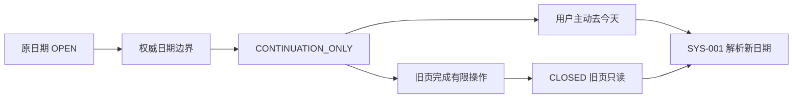
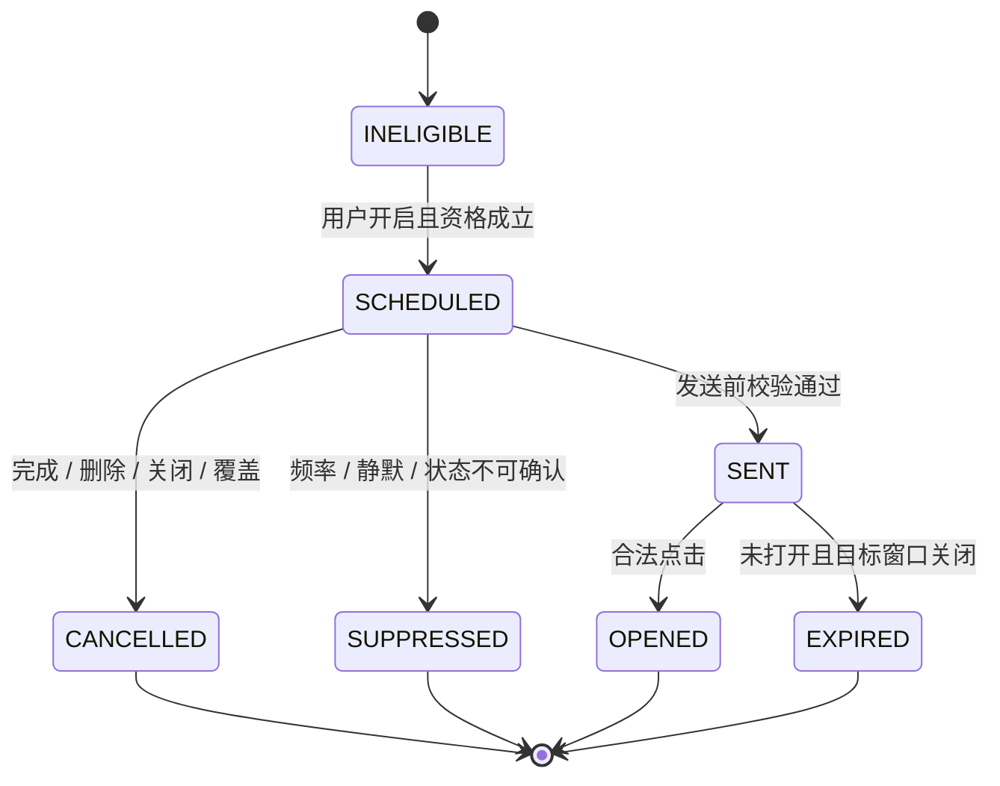

# DailyEnergy 点亮、跨日、中断与通知业务规则

- **文档状态**：Draft
- **所属任务**：S-06 — 点亮、跨日、中断与通知业务规则
- **最后更新**：2026-07-20
- **适用范围**：MVP 小程序的点亮、每日写入窗口、跨日、中断恢复、关系节点重放和通知
- **上游规范**：[产品状态机](./state-machine.md)、[用户旅程](./journey.md)、[第一阶段 MVP](./mvp.md)、[页面规格](../design/screen-specs.md)、[交互状态](../design/interaction-states.md)、[内容布局](../design/content-layout.md)
- **下游任务**：S-07～S-09 Schema、S-10 产品日期、S-15 Safety、S-17～S-20 数据与接口、S-24 埋点

## 1. 文档目的

本文在已接受的产品状态机之上定义可以被产品、Schema、API、前端和测试共同执行的业务规则，重点消除以下歧义：

1. 用户什么时候可以点亮，重复、超时、离线和多端点亮如何处理；
2. 产品日期变化时，旧页面、进行中命令、异步生成和未提交草稿属于哪一天；
3. 中途退出后应恢复权威事实、恢复本地草稿还是重新开始；
4. 任务、帮助度和晚间反馈可以修改到什么时候；
5. 删除当前日后能否重新开始，以及怎样保证不是“再抽一次”；
6. 删除关系源日后，关系节点是否重复庆祝或重复索取信息；
7. 何时可以邀请用户开启提醒，哪些通知可以发送，何时必须取消或暂停；
8. 通知深链如何在过期、Safety、Deleting、账户阻断和跨日时安全降落；
9. 用户中断一天或多天后，产品如何欢迎而不制造断签和关系压力。

本文不定义 IANA 时区、零点宽限分钟数、稳定种子算法、微信模板 ID、数据库、API、队列或代码。时间和平台实现必须服从本文行为；实现细节由对应下游任务固化。

## 2. 规范用语与术语

### 2.1 规范强度

- **必须**：任何页面、缓存、通知平台和实现都不能绕过；
- **应该**：默认产品行为，偏离需要明确评审；
- **可以**：不改变不变量时允许选择；
- **禁止**：不能通过配置或客户端分支启用。

### 2.2 术语

| 术语         | 定义                                                                                 |
| ------------ | ------------------------------------------------------------------------------------ |
| 原产品日期   | 页面、草稿、命令或生成意图最初被权威日期服务归属的产品日期                           |
| 当前产品日期 | 当前时刻由权威日期服务解析出的产品日期                                               |
| 日期边界     | 原产品日期与当前产品日期发生变化的权威事件；不直接等同设备显示的 00:00               |
| 已接受命令   | 服务端已识别用户、产品日期和幂等意图并决定处理的命令；按钮点击或本地排队不等于已接受 |
| 页面续写资格 | 跨日前已合法打开的页面，在日期边界后被允许对原日期完成少量操作的服务端权威资格       |
| 生成完成资格 | 原日期生成意图在日期边界后继续执行的权威资格                                         |
| 写入窗口     | 某操作对目标产品日期是否可写的权威结果，可为 OPEN / CONTINUATION_ONLY / CLOSED       |
| 未知结果     | 客户端没有收到确定响应，但服务端可能已经完成；它是客户端恢复语义，不是业务失败       |
| 通知意图     | 某用户、通知类型、目标日期或事项及计划窗口下的一次逻辑提醒；重试不是新意图           |
| 周期提醒     | DAILY_START 和 EVENING_REFLECTION 等按用户设置重复安排的提醒                         |
| 节点重放     | 用户曾见过关系节点后，因为源日删除和再次跨过阈值而重新展示完整节点反馈               |

## 3. 规则优先级

业务规则冲突时按以下顺序处理：

1. Safety ACTIVE / RECOVERY_PENDING；
2. ACCOUNT DELETING / DELETED、关系数据删除任务；
3. 账户限制与阻断性维护；
4. 必要同意、会话和身份；
5. 权威产品日期、目标日期和写入窗口；
6. 每日结果、生成、点亮和真实记录的权威状态；
7. 通知、深链和客户端草稿；
8. 动画、滚动、局部错误和缓存。

高优先级状态可以取消、拒绝或替代低优先级操作。低优先级状态永远不能解除高优先级阻断。

## 4. S-06 决策摘要

以下结论在本文仍为 Draft，等待本 PR 审核后成为后续任务的约束。

|   # | 问题                     | 推荐结论                                                                                                             |
| --: | ------------------------ | -------------------------------------------------------------------------------------------------------------------- |
|   1 | 点亮最早何时可用         | 主要行动已经完整渲染并进入可理解视区后可用；不设置强制停留时间或滚动百分比                                           |
|   2 | 服务端是否验证滚动       | 不验证、不持久化滚动；只验证有效结果、原日期、账户、Safety、删除和写入窗口                                           |
|   3 | 点亮能否普通撤销         | 不能。点亮是一次主动完成事实；移除只能通过删除单日或关系数据，不设“取消点亮”按钮                                     |
|   4 | 跨日后的旧页写入         | 只对跨日前已打开且获得页面续写资格的页面，在有限窗口内允许点亮、任务、帮助度或已打开反馈表单写回原日期；其余旧页只读 |
|   5 | 生成中跨日               | 已接受的原日期生成意图可以在 S-10 定义的有限完成窗口内继续；超出后取消，不迁移到新日期                               |
|   6 | 提交中跨日               | 服务端在边界前已接受的命令继续归原日期；仅在客户端点击但未被接受的命令不补交、不跨日排队                             |
|   7 | 每日记录修改窗口         | 签到只在当前日期 OPEN 时更正；任务、帮助度和反馈在 OPEN 或合法续写资格内修改；历史默认只读                           |
|   8 | 当前日删除后能否重新开始 | 可以，但必须由用户在仍可写的当前日期明确选择“重新记录今天”；不得自动恢复，核心结果仍须稳定且不能提供另一份运势       |
|   9 | 关系节点是否重放         | 普通单日删除后不重放完整庆祝或再次自动索取；关系数据整体删除后，未来新关系周期可以重新出现节点                       |
|  10 | 中断恢复依据             | 永远先读权威覆盖和业务状态；本地草稿只用于提示继续，不能决定已提交或已点亮                                           |
|  11 | 何时邀请通知             | 第一次点亮成功后可展示一次非模态、可关闭说明；不自动弹系统授权，用户进入设置并主动选择类型/时段后才请求              |
|  12 | MVP 通知类型             | DAILY_START、EVENING_REFLECTION、IMPORTANT_MATTER；默认全部关闭，不加入坏运势、断签或关系召回                        |
|  13 | 频率与静默               | 同类型每产品日期最多一次，全局每产品日期最多两次；默认 22:00～08:00 不发送，连续三次周期提醒后仍无打开则自动暂停     |
|  14 | 取消和过期               | 行为已完成、源数据删除、用户关闭、权限失效、Safety、Deleting 或阻断时取消；错过计划窗口不追发、不补发                |
|  15 | 深链和多端               | 点击后始终先走 SYS-001；深链过期回当前合法路径。提醒设置和发送在账户级去重，多端不能重复安排或发送                   |

## 5. 统一写入守卫

任何点亮、任务、帮助度、反馈、提醒设置或删除后的重新开始都必须同时满足相关守卫：

| ID     | 守卫                                 | 失败行为                                 |
| ------ | ------------------------------------ | ---------------------------------------- |
| BR-G01 | 账户为 ACTIVE，必要同意和会话有效    | 回到高优先级路由，不保留已成功假象       |
| BR-G02 | Safety 为 CLEAR                      | 进入 SAFE-001；普通命令不继续            |
| BR-G03 | 没有账户或关系数据删除阻断           | 进入 SYS-003 / SET-006 状态页            |
| BR-G04 | 目标每日结果为 AVAILABLE，且未被删除 | 重新读取或显示目标已不可用               |
| BR-G05 | 目标产品日期明确，写入窗口允许该操作 | 写入原日期或拒绝；禁止改写成当前日期     |
| BR-G06 | 当前在线；MVP 不存在离线写队列       | 保留允许的本地草稿并提示联网后主动重试   |
| BR-G07 | 幂等意图未与不同载荷冲突             | 同载荷返回已有结果；不同载荷进入冲突处理 |
| BR-G08 | 修订型写入基于最新修订               | 先读最新事实，再让用户明确应用草稿       |
| BR-G09 | 通知偏好开启，平台权限和发送资格有效 | 不发送；不影响核心每日体验               |
| BR-G10 | 深链的用户、日期、类型和源对象仍合法 | 丢弃深链目标并重新解析当前合法页面       |

客户端按钮禁用、防双击和忙碌态只是体验保护，不能代替这些守卫。

## 6. 点亮业务规则

### 6.1 可用条件

点亮按钮可以成为当前唯一主操作，必须满足：

1. DLY-003 的每日结果完整渲染并通过校验；
2. 主要行动标题、行动内容及必要说明已进入可理解视区；
3. 当前页面没有被 Safety、删除、账户或维护覆盖；
4. 客户端读取的点亮权威状态为 NOT_LIT；
5. 在线，且目标日期的写入窗口为 OPEN 或该页面具备合法续写资格。

不要求：

- 停留固定秒数；
- 滚动到固定百分比；
- 展开全部五维；
- 接受、完成或跳过小任务；
- 提交帮助度或晚间反馈；
- 开启通知、分享或授权。

无障碍焦点、页内锚点或合法深链直接到达主要行动时，只要主要行动内容已实际渲染并可读取，也可以把客户端阅读阶段派生为 MAIN_ACTION_REACHED。

### 6.2 提交与确认

1. 用户点击后，按钮进入 Pending，保留目标产品日期和同一幂等意图；
2. 客户端不在服务端确认前增加关系天数或展示持久 LIT；
3. 服务端通过统一守卫后创建或读取该日期唯一点亮事实；
4. 同一意图或同日重复点击返回同一 LIT；
5. 成功后只播放一次克制反馈，并显示日期；
6. 不自动弹分享、系统通知授权、勋章商城或下一任务；
7. 第一次点亮后可以在反馈结束后展示一次低权重通知说明卡，详见第 12 节。

### 6.3 超时、失败和恢复

| 情况                       | 规则                                                       |
| -------------------------- | ---------------------------------------------------------- |
| 客户端超时                 | 标记未知结果；恢复后先查询该日期点亮事实，不直接重试新意图 |
| 确认服务端没有点亮         | 允许用户用原意图主动重试                                   |
| 已存在 LIT                 | 显示稳定完成状态，不再次播放完整动效或增加关系日           |
| Offline                    | 禁用点亮并说明需要联网；不排队                             |
| 多端同时点亮               | 数据层合并为同一日期一个事实；两端随后读取 LIT             |
| Safety 在 Pending 期间触发 | 普通页面被替代；不把未知结果显示为成功。恢复仍先查权威状态 |
| 日期窗口关闭               | 不改写到新日；旧页转只读并提供“去今天”                     |

### 6.4 撤销与删除

MVP 不提供普通“取消点亮”。原因：点亮是一项已经发生的完成核心阅读事实，并且是关系相遇日的来源。

用户需要移除时：

- 删除单日：移除当日签到、结果、点亮、任务、帮助度、反馈和派生引用；
- 删除关系数据：按 SET-006 两阶段流程移除关系来源与回执；
- 账户注销：按账户删除流程处理。

删除后不使用“你失去了一天”“关系退步”等文案。普通单日删除和关系节点的影响见第 11 节。

## 7. 任务、帮助度和晚间反馈修改规则

### 7.1 当前日期

| 记录       | OPEN 窗口内                                                 | 结果影响                     | 点亮/关系影响 |
| ---------- | ----------------------------------------------------------- | ---------------------------- | ------------- |
| 签到       | 可以更正同一记录并增加修订                                  | 不重生成、不改变核心结果     | 无            |
| 小任务     | 可在 UNMARKED / INTERESTED / COMPLETED / SKIPPED 间明确更正 | 不改变每日结果               | 无            |
| 内容帮助度 | 可在未评分和三个已评分值间更新                              | 不改变每日结果               | 无            |
| 晚间反馈   | 可保存或修改同一逻辑反馈                                    | 不覆盖晨间签到，不生成新结果 | 无            |

每次修改使用最新修订或明确冲突流程。多端冲突不能静默采用最后写入者。

### 7.2 日期边界后的有限续写

只有跨日前已经合法打开相应页面或表单，并且权威日期服务仍返回 CONTINUATION_ONLY 时：

- DLY-003 可以对原日期完成点亮、任务和内容帮助度；
- 已打开的 EVE-001 可以对原日期完成一次保存或修改；
- 已经进入 Pending 且被服务端接受的写入继续归原日期；
- 签到新增和签到更正不在续写范围内；
- 新打开的历史页、通知深链或缓存页不能获得续写资格。

续写资格关闭后，旧页面全部只读。精确窗口长度由 S-10 决定，前端不能根据设备时间自行延长。

### 7.3 历史日期

历史日默认只读：

- 不补签到；
- 不点亮；
- 不改任务、帮助度或反馈；
- 不用通知深链强迫补填；
- 可以删除整个历史日；
- 数据权利所需的更正机制由 S-18 决定，不通过普通每日 UI 实现。

## 8. 产品日期边界

### 8.1 三类边界资格

为避免用一个模糊“零点宽限”覆盖不同场景，产品区分：

| 资格                  | 适用对象                             | 业务语义                             | 精确参数负责人 |
| --------------------- | ------------------------------------ | ------------------------------------ | -------------- |
| COMMAND_COMMIT        | 日期边界前已被服务端接受的命令       | 继续按原日期完成；响应晚到不改变归属 | S-10 / S-20    |
| VIEW_CONTINUATION     | 边界前已合法打开的 DLY-003 / EVE-001 | 有限完成点亮、任务、帮助度或反馈     | S-10           |
| GENERATION_COMPLETION | 边界前已创建的原日期生成意图         | 在有限窗口内继续；超出取消           | S-10 / S-12    |

资格都是服务端权威结果，不要求后续实现一定使用“令牌”或某种具体技术。

### 8.2 日期边界时间线

边界发生时：

1. 当前旧日页面不突然替换；
2. 页面顶部显示“新的一天已经开始”轻提示；
3. 所有后续命令继续携带原日期，不能静默替换为新日期；
4. 可续写操作按第 7.2 节执行；
5. 用户点击“去今天”或续写窗口关闭后，进入 SYS-001；
6. 新日期没有有效签到时进入 DLY-001；
7. 旧日期保持历史快照，不复制到新日期。

### 8.3 签到提交跨日

| 时点                                 | 规则                                                   |
| ------------------------------------ | ------------------------------------------------------ |
| 服务端在边界前接受                   | 命令继续归原日期；生成意图也绑定原日期                 |
| 用户边界前点击，但请求未被服务端接受 | 不视为已提交；没有离线补交                             |
| 边界后仍停留在旧 DLY-001             | 禁止提交旧日；清楚提示日期已变化并回新日签到           |
| 本地仍有旧日选择草稿                 | 到新日期时丢弃，不自动预填或复制；用户重新表达当前状态 |

### 8.4 生成中跨日

- 原日期生成意图不迁移、不复制、不改变稳定结果键；
- 在 GENERATION_COMPLETION 有效时继续同一执行；
- 完成结果始终标记原日期，并可以在旧日页面短暂展示“这是上一产品日期的内容”；
- 当前首页仍按新日期解析，不把旧结果当作今天；
- 超出完成资格后执行进入 CANCELLED，不生成到新日期；
- 用户新日期签到创建新的日期意图，但不能与旧意图共享结果；
- 精确完成窗口、并发与稳定种子由 S-10、S-12 决定。

### 8.5 晚间深链跨日

- 深链目标日期仍在 OPEN 或合法 CONTINUATION_ONLY，且原表单资格存在时，可以进入 EVE-001；
- 目标日期已 CLOSED 时，不补填、不弹出空表单；
- 有历史结果时可以进入 REC-002 只读详情，否则回当前今日路径；
- 深链文本和参数都不包含反馈内容、情绪、低分或“错过”压力。

## 9. 中断与恢复

### 9.1 统一恢复顺序

任何冷启动、热启动、网络恢复或深链打开都按以下顺序：

1. 检查 Safety、删除、账户限制和维护；
2. 恢复同一逻辑用户会话；
3. 解析当前产品日期和目标日期；
4. 查询原幂等意图或最新业务状态；
5. 判断本地草稿是否仍属于相同用户、日期、记录版本和允许窗口；
6. 只在权威状态允许时恢复草稿或页面位置；
7. 后台刷新非关键模块。

本地页面路径、按钮 Pending 或缓存不能跳过前四步。

### 9.2 恢复矩阵

| 中断位置            | 可保留内容                         | 再次进入                                           | 禁止行为                 |
| ------------------- | ---------------------------------- | -------------------------------------------------- | ------------------------ |
| ENT-001             | 无正式事实；静态来源参数可保留     | 重新显示承接/同意状态                              | 把浏览当成同意           |
| ONB-001             | 同设备短期称呼与风格草稿           | 同意有效时可继续或清空                             | 自动提交、跨账户恢复     |
| DLY-001 未提交      | 同设备、同产品日期的非敏感选择草稿 | 日期仍相同时提示继续；跨日丢弃                     | 自动提交、复制到新日     |
| DLY-001 提交未知    | 原幂等意图标识                     | 先查签到、生成和结果                               | 直接创建第二次提交       |
| DLY-002             | 不依赖页面草稿；生成在服务端       | 查询同一意图：结果存在进 DLY-003，运行中回 DLY-002 | 再生成一份               |
| DLY-003 阅读中      | 同会话可保留稳定章节位置           | 同日期同结果版本可继续；否则从顶部或今日路由       | 用滚动位置证明点亮       |
| 点亮 Pending        | 原日期与幂等意图                   | 先查 LIT / NOT_LIT                                 | 在未知时增加关系日       |
| 任务/帮助度 Pending | 草稿、期望修订、原意图             | 先读最新记录，再决定重试或处理冲突                 | 静默覆盖多端修改         |
| EVE-001 未提交      | 同日期结构化选择可短期保留         | 窗口仍开时继续；关闭后说明未保存并丢弃             | 跨日自动补填             |
| 事项/反馈自由文本   | MVP 默认只在当前会话内存保留       | 应用退出后重新输入                                 | 长期明文缓存或跨账户恢复 |
| 删除确认未完成      | 只保留来源和范围说明               | 重新显示说明，仍需明确最终确认                     | 自动恢复到“已确认”       |
| 删除任务已创建      | 服务端任务事实                     | 进入 SET-006 / SYS-003 查询状态                    | 重复创建删除任务         |
| 系统权限弹窗中断    | 读取最新系统权限                   | 回设置并显示实际状态                               | 自动重复弹权限           |
| Safety 触发         | 只读取权威 Safety 状态             | SAFE-001                                           | 恢复被替代普通页面       |

自由文本包括晚间可选一句话、重要事项文本和支持说明。未来若需要加密本地草稿，必须先通过隐私与威胁评审。

### 9.3 Offline 恢复

- 已缓存内容可以只读，并显示最后同步时间；
- 所有写入禁用，不创建“待同步”队列；
- 网络恢复后，用户主动重试前先读权威状态；
- 若原操作已经成功，显示已有结果；
- 若明确未发生，才使用原意图重试；
- 写入窗口已关闭时不补交，也不改写到当前日期。

## 10. 当前日删除后重新开始

### 10.1 产品行为

当前产品日期的 DAY 删除成功后：

1. 旧签到、结果、点亮、任务、帮助度、反馈和派生引用保持已删除；
2. 系统不得恢复缓存、自动生成或自动重新提交；
3. SYS-001 按源事实为空进入 DLY-001 的删除后空状态；
4. 页面可以中性说明“今天的记录已删除”；
5. 当且仅当当前日期写入窗口仍为 OPEN，用户可以明确选择“重新记录今天”；
6. 写入窗口已关闭时，只能从当前合法日期继续。

重新开始不是撤销删除。旧数据不恢复，新提交是用户新的明确意图。

### 10.2 防止重抽

- 同一用户、产品日期和结果版本仍只能有一份活跃结果；
- 新流程必须使用同一稳定日身份和 S-10 规定的确定性核心规则；
- 不提供“换一份”“再看看”“不满意重来”等入口；
- 新签到可以成为新的真实记录，但不能把删除变成改变核心运势的手段；
- 删除前点亮已从关系集合移除；重新生成并再次点亮只恢复该产品日期一个相遇日，不增加第二天；
- 删除回执、稳定身份和数据最小化怎样共存由 S-10、S-18 决定；无法同时满足时不得实现重新开始。

## 11. 关系节点失效与重放

### 11.1 普通单日删除

删除相遇源日后必须重算关系计数、阶段、节点资格和总结。对于用户已经见过的节点：

- FIRST_MEETING：不重复完整欢迎；
- STYLE_CALIBRATION_AVAILABLE：不自动重复询问，入口仍可在 SET-002 使用；
- IMPORTANT_MATTER_INVITE_AVAILABLE：不自动重复邀请，入口仍可在 MEM-001 使用；
- FIRST_SEVEN_DAY_REVIEW_AVAILABLE：源数据足够时可以重新生成有效总结，但不重复里程碑庆祝。

如果计数下降后未来再次跨过相同阈值，普通单日删除不触发完整节点重放。产品可以展示低权重、无庆典的可用入口。

### 11.2 关系数据整体删除

关系数据删除成功后，关系源事实、阶段、节点回执和关系表达均按 S-18 约定清除。用户未来主动重新使用并重新积累相遇日时，可以作为新的关系周期展示第 1/3/4/7 日节点。

重新出现仍不得：

- 暗示用户“回来修复关系”；
- 追问为什么删除；
- 恢复已删除记忆；
- 用旧周期计数或文案。

### 11.3 节点跳过

- 风格校准和重要事项邀请都可以跳过；
- 跳过后不在同一节点自动再次弹出；
- 用户仍可从设置主动进入；
- 七天回望可稍后查看，但不使用倒计时或过期焦虑；
- 节点展示回执只用于防重复，不增加关系日。

## 12. 通知价值与权限请求

### 12.1 默认状态

所有通知类型默认关闭。通知不是完成每日体验、点亮、关系或重要事项的条件。

禁止在以下位置请求系统通知权限：

- ENT-001 首屏；
- ONB-001；
- DLY-001 签到前或提交中；
- DLY-002 生成等待的默认流程；
- Safety、错误、删除或账户阻断页面；
- 用户尚未获得第一次完整价值时。

### 12.2 第一次邀请

第一次点亮成功并完成点亮反馈后，可以展示一次低权重、非模态说明卡：

- 说明可以选择提醒类型和时段；
- 说明不开启不影响完整使用；
- 主操作是“看看提醒设置”，不是系统“允许”；
- 次操作是“暂时不用”；
- 关闭后不在其他页面自动弹系统权限；
- 用户跳过后，MVP 不再自动展示该邀请，只保留 SET-003 入口。

点亮成功本身不直接弹微信/系统权限，也不自动开启任何提醒。

### 12.3 系统权限请求

只有用户在 SET-003 中：

1. 主动选择至少一个提醒类型；
2. 选择合法时段或事项提醒；
3. 看见提醒内容和可关闭说明；
4. 点击明确的“开启提醒”；

才可以调用平台授权。

权限拒绝、取消、平台不支持或配额不足只使相关提醒保持关闭，并显示真实状态。不得循环弹窗或降级核心功能。

## 13. MVP 通知类型

### 13.1 类型表

| 类型               | 用户价值                             | 发送资格                                          | 完成后取消                             | 允许文案方向                       |
| ------------------ | ------------------------------------ | ------------------------------------------------- | -------------------------------------- | ---------------------------------- |
| DAILY_START        | 在用户选择的时段提醒开始今天的一分钟 | 当前日期未签到且无结果；偏好开启                  | 已签到、已有结果、日期关闭             | “想开始时，今天的一分钟在这里。”   |
| EVENING_REFLECTION | 提醒留下可选的真实晚间反馈           | 当前日期结果 AVAILABLE、反馈 ABSENT、达到晚间时段 | 已反馈、结果删除、日期关闭             | “如果你愿意，可以用十秒回看今天。” |
| IMPORTANT_MATTER   | 提醒用户主动设置的一件在意事项       | 事项 ACTIVE、提醒开启、目标时间有效               | PAUSED / COMPLETED / EXPIRED / DELETED | “你为一件在意的事设置了提醒。”     |

MVP 不包含：

- 低分或“坏运势”提醒；
- 断签、连续天数即将消失；
- 数字朋友想念、等待、失望或关系受伤；
- 任务未完成追赶；
- 未经用户选择的促销、会员或内容推送；
- 在锁屏显示情绪、睡眠、事项文本、关系或反馈；
- 因生成慢自动发送“结果已准备好”的新通知类型；该能力若有证据再另行评审。

### 13.2 事项隐私

IMPORTANT_MATTER 默认使用通用文案，不在通知标题、正文、渠道参数或锁屏中包含事项文本、类别、日期含义或推断。MVP 不提供“在锁屏显示事项名称”的开关。

多个事项落在同一计划窗口时合并成一条通用提醒，不分别暴露或连续发送。

## 14. 通知频率、静默、取消与暂停

### 14.1 频率上限

- 同一通知类型、同一目标产品日期最多发送一次；
- DailyEnergy 所有通知合计每产品日期最多两次；
- 两次通知之间至少间隔 4 小时；
- 同一计划窗口的多个事项合并为一条通用 IMPORTANT_MATTER；
- 达到上限时优先级为：用户明确设置的重要事项 > EVENING_REFLECTION > DAILY_START；
- 被抑制通知不追发、不顺延到下一日期。

### 14.2 静默时段

- 默认 22:00～次日 08:00 为静默时段；
- MVP 的可选提醒时段必须落在 08:00～22:00；
- 晚间反馈提醒不得早于产品定义的晚间入口，当前为 18:00；
- 精确时区依据 S-10 的产品日期策略；
- 因平台延迟错过计划窗口或进入静默时段时直接过期，不在夜间或次日补发。

### 14.3 发送前重新校验

每次发送前必须重新读取而不是只相信排期时快照：

1. 账户、必要同意、Safety、删除和维护；
2. 用户通知偏好和平台权限；
3. 当前产品日期与目标日期；
4. 类型对应的完成状态；
5. 源事项是否仍 ACTIVE；
6. 全局频率、间隔和静默规则；
7. 同一通知意图是否已发送或取消。

无法读取关键状态时按失败关闭处理：跳过本次，不猜测发送，不恢复后补发。

### 14.4 取消条件

| 条件                                 | 取消范围                               |
| ------------------------------------ | -------------------------------------- |
| 用户关闭某类型                       | 该类型所有未来待发送意图               |
| 用户关闭全部提醒或平台权限失效       | 全部普通通知                           |
| 签到或结果已存在                     | 当日 DAILY_START                       |
| 晚间反馈已提交                       | 当日 EVENING_REFLECTION                |
| 单日结果删除                         | 当日 DAILY_START / EVENING_REFLECTION  |
| 事项暂停、完成、到期或删除           | 对应 IMPORTANT_MATTER                  |
| Safety ACTIVE / RECOVERY_PENDING     | 全部普通通知；不由普通通知替代安全流程 |
| 账户 RESTRICTED / DELETING / DELETED | 全部普通通知                           |
| 阻断性维护                           | 本次跳过，不恢复后集中补发             |
| 目标日期写入窗口关闭                 | 目标日期日常与晚间通知                 |

通知已经提交给平台后可能无法物理撤回，因此消息本身始终保持非敏感；点击后仍必须经过最新路由检查。

### 14.5 连续未打开自动暂停

对 DAILY_START 和 EVENING_REFLECTION：

1. 每发送一次后观察是否在下一次周期提醒前有任何合法应用打开；
2. 有打开则未响应计数归零；
3. 连续三次已发送提醒之间都没有打开，自动暂停这两类周期提醒；
4. IMPORTANT_MATTER 不因该计数自动关闭，但仍受总频率和源事项状态约束；
5. 暂停不发送“我们暂停了”通知；
6. 用户再次打开时只在 SET-003 显示“日常提醒已暂停”，不自动恢复；
7. 用户必须明确选择恢复。

该计数用于发送克制性，不等于留存、关系或用户价值评分。

## 15. 通知意图、去重与多端

### 15.1 逻辑唯一性

一个通知意图至少由以下产品语义唯一确定：

- 逻辑用户；
- 通知类型；
- 目标产品日期或事项；
- 计划窗口；
- 规则版本。

具体幂等键格式由 S-20 决定。调度重试、平台重试和多端设置同步必须复用同一意图。

### 15.2 生命周期

SENT 只表示产品已把意图交给平台；送达回执可能缺失，不能伪造 DELIVERED。分析事件不是业务资格来源。

### 15.3 多端规则

- 提醒偏好是账户级权威事实，不是每台设备独立开关；
- 设置更新使用修订号，冲突先读最新状态；
- 多个设备或渠道凭证只能产生一个账户级通知意图；
- 同一意图即使平台需要多个技术尝试，也不能向同一用户重复发送；
- 一个设备关闭提醒后，其他设备刷新后显示相同账户偏好；
- 平台级权限仍按设备/平台真实状态展示，不能伪造同步成功。

## 16. 通知深链

### 16.1 参数边界

深链只携带不透明目标引用、类型、目标日期和规则版本。禁止携带：

- 情绪、精力、睡眠或反馈；
- 今日能量、低分或任务失败；
- 事项正文、关系或敏感记忆；
- 可以绕过身份和 Safety 的页面标记。

### 16.2 点击解析

任何通知点击都先进入 SYS-001：

1. 检查 Safety、删除、账户和维护；
2. 恢复会话和逻辑用户；
3. 解析当前产品日期；
4. 校验通知意图、目标日期和源对象；
5. 读取最新完成状态；
6. 决定目标页或回当前今日路径。

点击通知本身不等于签到、点亮、反馈、事项完成或用户回访价值完成。

### 16.3 类型落点

| 类型               | 有效时                                               | 已完成                                     | 已过期/源失效                                   |
| ------------------ | ---------------------------------------------------- | ------------------------------------------ | ----------------------------------------------- |
| DAILY_START        | 按今日状态进入 DLY-001 / DLY-002 / DLY-003           | 进入当前 DLY-003 或普通今日路径            | 回当前今日路径                                  |
| EVENING_REFLECTION | 目标日期可写时进入 EVE-001                           | 进入 EVE-001 已提交态或 DLY-003            | 有历史结果进 REC-002 只读，否则回今日           |
| IMPORTANT_MATTER   | 事项 ACTIVE 且账户允许时进入 MEM-002 只读/编辑上下文 | COMPLETED 时显示当前真实状态，不要求再操作 | 事项不存在或已删时回 MEM-001 / 今日，不暴露原因 |

Safety、Deleting 和账户阻断始终覆盖这些落点。过期深链不补填、不重抽、不追发，也不出现“你错过了”。

## 17. 中断后回来

### 17.1 页面行为

| 中断情况             | 推荐回应                           | 数据行为                     |
| -------------------- | ---------------------------------- | ---------------------------- |
| 同日离开后回来       | “继续今天”或直接恢复稳定页面       | 读取同一结果和状态           |
| 缺失 1～2 个产品日期 | “欢迎回来，我们从今天继续。”       | 保留缺失，不清零关系         |
| 缺失 3～6 个产品日期 | 同样克制欢迎，不强调离开天数       | 今日正常签到；趋势留空       |
| 缺失 7 天及以上      | 简短说明“想开始时，我们从今天继续” | 不自动补历史，不升级召回频率 |
| 曾关闭或暂停提醒     | 不借欢迎页自动请求权限             | 只在 SET-003 显示真实状态    |

### 17.2 禁止文案与行为

禁止：

- “断签”“连续记录要消失”“之前努力白费”；
- “我一直在等你”“为什么不来”“关系变淡了”；
- 用低分、坏事、幸运即将失效促使打开；
- 自动补点亮、补签到、补反馈或补关系日；
- 因中断提高通知频率；
- 把未打开解释为情绪、工作或关系问题。

可以：

- “欢迎回来”；
- “我们从今天继续”；
- 如实显示趋势中的缺失日期；
- 让用户从今天完整使用，不要求解释离开原因。

## 18. Safety、删除、维护和权限覆盖

### 18.1 Safety

- Safety 触发时取消或抑制所有普通通知意图；
- 普通通知不能承担危机响应，Safety 通知是否存在由 S-15 单独决定；
- 旧通知点击后仍进入 SAFE-001；
- 页面续写和生成完成资格不能解除 Safety；
- Safety 清除后不恢复或补发期间被取消的普通通知；用户偏好可以保留，但下次发送需重新满足资格。

### 18.2 删除和账户

- DAY 删除取消目标日期所有日常与晚间通知；
- MATTER 删除取消对应事项通知并禁止通知文本继续引用；
- RELATIONSHIP_DATA 删除不发送关系召回或节点通知；
- ACCOUNT DELETING / DELETED 取消全部通知；
- 删除完成后平台仍投递的旧通知必须因通用文案和深链重校验而不暴露数据。

### 18.3 维护与平台限制

- 局部降级但核心状态可读时，按发送前校验决定；
- 关键状态不可读或 BLOCKING 时跳过，不猜测；
- 恢复后不集中补发；
- 平台权限、配额或审核不支持时，SET-003 显示真实限制并保持核心功能可用；
- 平台行为最终以实现时官方文档复核，但不能突破本文频率、隐私和压力边界。

## 19. 关键决策表

### 19.1 旧日操作

| 操作        | 边界前已接受                     | 合法续写窗口             | 窗口关闭/历史页  |
| ----------- | -------------------------------- | ------------------------ | ---------------- |
| 签到提交    | 归原日期并继续                   | 不允许新提交             | 不允许           |
| 签到更正    | 归原日期并继续                   | 不允许                   | 不允许普通更正   |
| 生成执行    | 原日期继续                       | 按 GENERATION_COMPLETION | 取消，不迁移     |
| 点亮        | 原日期继续                       | 仅边界前已打开 DLY-003   | 不允许           |
| 任务/帮助度 | 原日期继续                       | 仅边界前已打开 DLY-003   | 不允许           |
| 晚间反馈    | 原日期继续                       | 仅边界前已打开 EVE-001   | 只读             |
| 事项编辑    | 不依赖每日窗口，但日期字段重校验 | 继续按事项规则           | 继续按事项规则   |
| 删除        | 按目标对象继续                   | 允许在线明确发起         | 允许在线明确发起 |

### 19.2 通知是否发送

| 偏好 | 权限      | 源状态     | 覆盖                       | 频率/静默   | 结果                     |
| ---- | --------- | ---------- | -------------------------- | ----------- | ------------------------ |
| 关闭 | 任意      | 任意       | 任意                       | 任意        | 不安排、不发送           |
| 开启 | 拒绝/失效 | 任意       | CLEAR                      | 合法        | 不发送，设置显示需要授权 |
| 开启 | 有效      | 行为已完成 | CLEAR                      | 合法        | 取消                     |
| 开启 | 有效      | 仍符合     | Safety/Deleting/Restricted | 任意        | 取消或抑制               |
| 开启 | 有效      | 仍符合     | CLEAR                      | 超上限/静默 | 抑制并过期，不补发       |
| 开启 | 有效      | 仍符合     | CLEAR                      | 合法        | 发送同一唯一意图         |

## 20. 验收序列

### 20.1 第一次点亮与通知邀请

1. 用户阅读到主要行动，客户端派生 MAIN_ACTION_REACHED。
2. 用户点亮，服务端确认该日期唯一 LIT。
3. 关系计数增加一个去重日期。
4. 点亮反馈结束后出现一次低权重提醒说明卡。
5. 用户选择“暂时不用”，不弹系统权限，核心流程完成。
6. 后续页面不再自动邀请；SET-003 始终可主动进入。

### 20.2 点亮超时和双击

1. 用户双击点亮，客户端复用同一意图。
2. 服务端已创建 LIT，但响应丢失。
3. 客户端显示未知结果，不增加本地关系日。
4. 恢复后查询到 LIT，显示一次稳定完成状态。
5. 关系只增加一个相遇日。

### 20.3 阅读中跨日并在续写窗口点亮

1. 用户在原日期打开 DLY-003 并阅读到主要行动。
2. 权威日期边界发生，页面不替换并显示轻提示。
3. 日期服务返回 CONTINUATION_ONLY。
4. 用户点亮，命令明确写回原日期。
5. 成功后用户点击“去今天”，SYS-001 进入新日期流程。

### 20.4 续写窗口关闭后操作旧页

1. 用户长时间停留在旧 DLY-003，窗口已 CLOSED。
2. 页面转只读，点亮、任务和帮助度禁用。
3. 用户触发旧控件时重新校验并得到日期关闭语义。
4. 系统不写入新日期，提供“去今天”。

### 20.5 签到请求跨边界

1. A 请求在边界前被服务端接受，响应在边界后到达：继续归原日期并生成原日期结果。
2. B 只在客户端点击，因离线未被服务端接受：不排队、不补交。
3. B 恢复时已是新日期，旧选择草稿丢弃，重新表达当前状态。

### 20.6 生成中跨日

1. 原日期生成意图已创建。
2. 日期边界后仍在 GENERATION_COMPLETION 内，执行继续原意图。
3. 结果发布为原日期 AVAILABLE，不成为新日结果。
4. 超出完成窗口的另一个执行被 CANCELLED，也不迁移到新日。

### 20.7 当前日删除后明确重新开始

1. 用户删除当前日，所有源事实和派生引用失效。
2. 系统不自动重建，DLY-001 显示中性删除后空状态。
3. 写入窗口仍 OPEN，用户明确选择“重新记录今天”。
4. 新流程仍使用稳定日身份，不提供另一份核心运势。
5. 重新点亮只使该产品日期恢复为一个相遇日。

### 20.8 DLY-002 中断恢复

1. 用户签到后在生成中退出。
2. 再次进入先检查覆盖和日期，再查询原生成意图。
3. 已完成则进入相应日期 DLY-003；仍运行则回同一 DLY-002。
4. 不创建第二意图、不显示重新抽取。

### 20.9 Offline 点亮

1. 用户读取缓存 DLY-003，但设备 Offline。
2. 点亮、任务、帮助度和反馈写入全部禁用。
3. 网络恢复后先刷新权威结果和点亮状态。
4. 用户主动点击后才提交；没有自动同步队列。

### 20.10 晚间提醒在发送前取消

1. 用户开启 EVENING_REFLECTION，并已安排当日提醒。
2. 用户在计划时间前主动提交反馈。
3. 发送前读取反馈为 SUBMITTED，取消通知意图。
4. 不发送“你已经完成”类多余通知。

### 20.11 过期晚间深链

1. 用户次日点击昨晚未打开的提醒。
2. SYS-001 校验目标日期已 CLOSED。
3. 有历史结果则进入 REC-002 只读，否则回当前今日。
4. 不弹反馈表单，不显示“错过”，不写到新日期。

### 20.12 Safety 与旧通知

1. 普通提醒已经交给平台，随后 Safety 变为 ACTIVE。
2. 尚可取消的通知被取消；无法撤回的消息仍是通用非敏感文案。
3. 用户点击旧通知，SYS-001 优先读取 Safety。
4. 进入 SAFE-001，不闪现 DLY-003 或 EVE-001。

### 20.13 多端同时修改提醒

1. 两台设备读取提醒设置修订 4。
2. A 关闭晚间提醒，产生修订 5 并取消未来意图。
3. B 基于修订 4 修改时间时遇到冲突。
4. B 先读取修订 5，再让用户明确是否重新开启。
5. 不因两个设备产生重复发送。

### 20.14 关系节点再次跨阈值

1. 用户曾看过第 3 相遇日风格校准，后删除一个普通源日，计数降至 2。
2. 后续新点亮使计数再次为 3。
3. 系统不重复弹完整校准节点，只保留 SET-002 主动入口。
4. 若此前删除的是全部关系数据，则新周期未来可以重新展示节点。

## 21. 下游必须继承的约束

### 21.1 Schema 与领域模型

- 点亮命令必须包含明确目标日期和结果引用，但不保存滚动像素；
- 每日写入返回权威写入窗口或等价语义；
- 修订型记录支持冲突检测；
- 通知偏好、平台权限快照、通知意图和发送结果分开；
- 通知意图能追溯类型、目标日期/事项、计划窗口和规则版本；
- 节点资格、节点展示回执和关系源事实分开；
- 删除后重新开始不能恢复已删源事实。

### 21.2 API 与服务

- 所有写入在服务端重查账户、Safety、删除、日期和幂等守卫；
- 返回结果未知、日期关闭、修订冲突和覆盖阻断的明确语义；
- 跨日不能依赖客户端时钟或偷偷改日期；
- 发送通知前重新校验最新状态；
- 取消、抑制、发送和过期是不同结果；
- 多端和平台重试保持账户级唯一；
- 关键状态不可读时跳过通知，不补发。

### 21.3 前端

- 主要行动实际可读后才显示点亮主操作；
- 不用强制停留时间或滚动百分比；
- Pending、未知结果、Offline 和日期关闭有不同反馈；
- 旧页保持日期并在续写关闭后只读；
- 本地草稿按用户、日期和版本校验，不能决定服务端成功；
- 第一次点亮后通知邀请非模态且只自动出现一次；
- 系统权限只在用户明确设置后请求；
- 通知深链先进入启动解析，不直接 push 页面。

### 21.4 测试

至少建立以下属性测试或模型测试：

1. 同日任意重复点亮只产生一个 LIT 和一个关系日；
2. 任何旧日写入都不会落到新日期；
3. 未被服务端接受的离线命令永远不会自动补交；
4. VIEW_CONTINUATION 只授予边界前合法打开的页面；
5. 删除后不会自动重建，明确重新开始也不能提供重抽；
6. 普通 DAY 删除不会自动重放关系节点；
7. 通知默认关闭，权限拒绝不影响核心功能；
8. 同类型每日最多一次、全局每日最多两次且满足静默间隔；
9. 完成、删除、Safety 和账户阻断会取消通知；
10. 深链过期或状态变化后只进入当前合法页面；
11. 连续三次未打开会暂停周期提醒且不会自动恢复；
12. 多端并发不会重复发送或静默覆盖设置。

## 22. 明确推迟的决定

| 决定                                                   | 负责任务                 | 本文固定边界                                         |
| ------------------------------------------------------ | ------------------------ | ---------------------------------------------------- |
| 产品时区、日期边界、三类续写资格的精确时长和稳定日身份 | S-10 / ADR-0002          | 原日期不迁移；有限续写；历史关闭后只读               |
| 生成完成资格的技术尝试、模型和模板执行参数             | S-12                     | 仍是同一原日期意图，超出资格取消                     |
| 每日结果、反馈、总结和通知引用的精确 Schema            | S-07～S-09               | 状态分离、修订和源引用必须保留                       |
| 微信订阅消息当前平台能力、模板、配额与审核             | 工程架构与实现前官方复核 | 平台限制只能减少能力，不能突破隐私、频率和压力边界   |
| Safety 分类、固定资源、恢复和可能的安全通知            | S-15                     | 普通通知全部取消或抑制，旧深链进入 SAFE-001          |
| 删除回执、节点防重复回执和隐私最小保留                 | S-18 / ADR-0005          | 活跃产品不得引用已删数据；关系整体删除后新周期可重建 |
| 唯一约束、调度、事务、锁和队列                         | S-19                     | 逻辑唯一、发送前校验和不补发必须成立                 |
| API、错误码、幂等键和冲突协议                          | S-20                     | 必须表达未知结果、日期关闭、冲突与覆盖               |
| 通知埋点、未打开计数和 D1/D3/D7 口径                   | S-24 / S-25              | 埋点不是业务事实来源，不携带敏感内容                 |
| 本地敏感草稿加密和保留                                 | 隐私、架构与前端任务     | MVP 默认不跨应用终止持久保存自由文本                 |

任何下游实现如果需要改变本文的点亮含义、旧日归属、通知默认关闭、频率上限、Safety 覆盖或不重抽原则，必须先回到规范评审。

## 23. 完成与审核清单

- [x] 点亮资格、幂等、失败、恢复和删除完整；
- [x] 点亮与任务、帮助度、反馈和关系保持独立；
- [x] 当前日期、有限续写和历史只读规则明确；
- [x] 阅读、签到、生成、提交和深链跨日完整；
- [x] 全部核心流程有中断恢复矩阵；
- [x] 当前日删除后明确重新开始且不重抽；
- [x] 关系节点失效、跳过和重放规则明确；
- [x] 通知邀请、权限、类型、频率、静默、取消和暂停完整；
- [x] 通知深链和多端幂等完整；
- [x] Safety、删除、维护和平台限制覆盖完整；
- [x] 包含决策表、时间线和 14 个验收序列；
- [x] 下游约束和延期任务明确；
- [ ] 用户审核确认后将本文从 Draft 更新为 Accepted。

本文被接受前，不开始 S-07，也不进入正式前端、后端、数据库、通知服务或 AI 实现。
