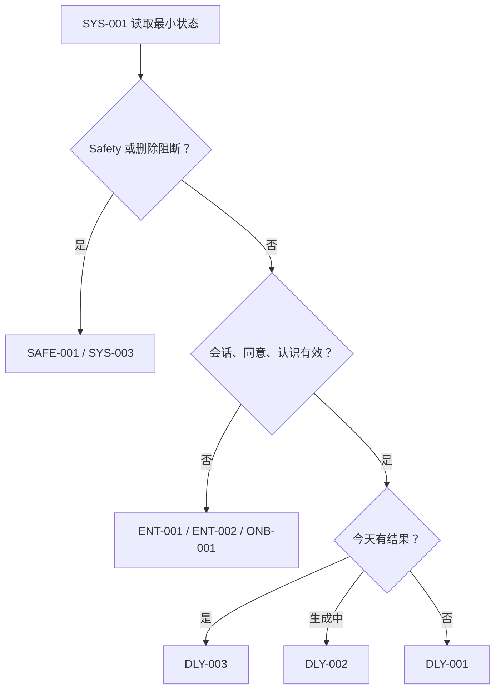
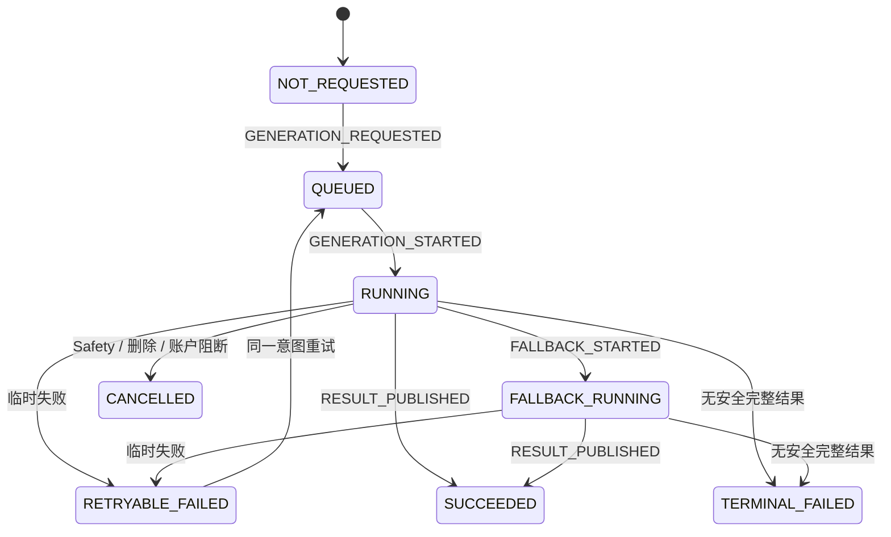
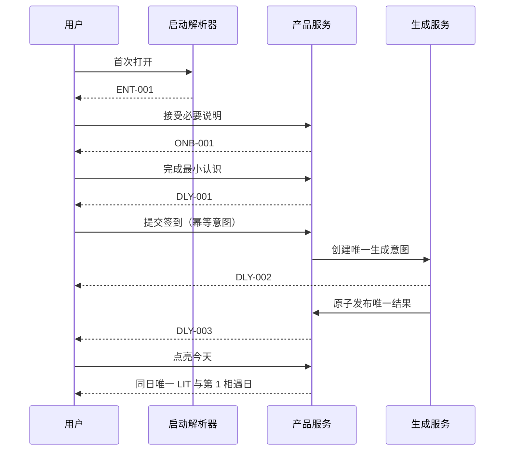

# DailyEnergy 产品状态机

- **文档状态**：Accepted
- **接受日期**：2026-07-20
- **所属任务**：S-05 — 产品状态机
- **最后更新**：2026-07-20
- **适用范围**：MVP 小程序的账户、首次认识、每日体验、关系、重要事项、安全与删除状态
- **上游文档**：[产品愿景](./vision.md)、[用户画像](./persona.md)、[用户旅程](./journey.md)、[第一阶段 MVP](./mvp.md)、[信息架构](../design/information-architecture.md)、[页面规格](../design/screen-specs.md)、[交互状态](../design/interaction-states.md)、[内容布局](../design/content-layout.md)、[原型验证方案](../design/prototype-validation.md)
- **下游任务**：S-06 业务规则、S-07～S-09 Schema、S-10 产品日期、S-17～S-20 数据与接口、S-24 埋点

## 1. 文档目的

本文把已接受的用户旅程、页面行为和异常恢复规则整理成一组可组合的产品状态机，作为后续业务规则、Schema、数据库、API、前端和测试的共同语义来源。

本文必须保证：

1. 同一事实只有一个权威来源；
2. 账户、每日结果、生成执行、点亮、任务、反馈、关系和安全不会被压成一个巨大枚举；
3. 任意合法状态组合都能解析到唯一页面或明确的局部状态；
4. 重复提交、超时、恢复、跨日和删除不会制造第二份逻辑结果；
5. 真实状态、娱乐性今日结果、用户行为和系统运行状态始终分离；
6. Safety、删除中和账户阻断始终高于普通内容与本地缓存；
7. 未提交草稿、Loading、Offline、弹层和局部错误不会被误当成服务端业务事实。

本文使用概念状态名表达产品语义，不定义数据库列、TypeScript 枚举、API 路径、错误码、队列或具体算法。下游可以调整代码命名，但不能改变已接受的语义、优先级和不变量。

## 2. 规范用语与核心术语

### 2.1 规范强度

- **必须**：下游实现不得绕过；
- **应该**：默认实现，偏离时需要记录理由并评审影响；
- **可以**：不改变核心语义时允许选择；
- **禁止**：任何页面、Prompt、运营配置或缓存都不能触发。

### 2.2 术语

| 术语           | 定义                                                                           |
| -------------- | ------------------------------------------------------------------------------ |
| 产品日期       | DailyEnergy 用于归属签到、结果和行为的业务日期；精确时区与零点算法由 S-10 决定 |
| 当前产品日期   | 启动或写入时由权威日期策略解析出的产品日期                                     |
| 每日结果       | 某用户、产品日期、资料版本和算法版本下唯一、不可重抽的今日内容快照             |
| 生成意图       | 用户完成签到后，请求获得该产品日期唯一结果的一次逻辑意图；网络重试不是新意图   |
| 生成执行       | 为完成同一生成意图而发生的排队、规则、AI、备用模型或模板执行过程               |
| 真实记录       | 用户主动提交的晨间签到、晚间反馈、任务结果和重要事项，不含今日能量分数         |
| 点亮日         | 某一产品日期存在有效点亮事实，表示用户完成了当天核心阅读                       |
| 相遇日         | 用于关系阶段计数的去重产品日期；MVP 中与有效点亮日相同                         |
| 派生状态       | 可以从权威事实确定性重算的状态，不是第二份可独立修改的真相                     |
| 覆盖状态       | 暂时替代普通旅程的高优先级状态，例如 Safety、删除中或阻断维护                  |
| 客户端显示状态 | Loading、Offline、局部错误、折叠、弹层、滚动位置和未提交草稿等临时 UI 状态     |
| 有效记录       | 未被删除、未被无效化且属于明确用户与产品日期的权威记录                         |

### 2.3 建模规则

1. 各状态域独立推进，通过守卫条件组合，不创建“已签到且生成中且离线”等组合枚举。
2. 派生状态只能由源事实计算，禁止同时提供一个可手工修改的副本。
3. 服务端业务状态只描述产品事实；网络、动画、骨架、弹层和本地草稿由客户端持有。
4. 降级路径描述生成方式，不描述用户处境，不能成为用户关系状态。
5. 删除成功后，已删除对象不再是活跃业务事实；是否保留受限审计记录由 S-18 决定。
6. 事件表达用户或系统已经发生的事实；命令可以失败，失败本身不能伪装成事实事件。

## 3. S-05 决策摘要

以下结论已于 2026-07-20 随本规范一并接受，是后续任务的约束。

|   # | 问题                                       | 推荐结论                                                                                 | 主要理由                                                 |
| --: | ------------------------------------------ | ---------------------------------------------------------------------------------------- | -------------------------------------------------------- |
|   1 | 今日结果与生成执行是否拆分                 | **拆分**。每日结果只表示 ABSENT / AVAILABLE；生成执行另有生命周期                        | 客户端超时、备用模型和模板执行不能改变结果是否存在的事实 |
|   2 | 签到是否允许更正                           | 允许在 S-06 定义的写入窗口内更正同一真实记录；增加修订号，但**不重生成、不改写每日结果** | 保留真实记录权利，同时守住当日稳定性                     |
|   3 | 到达主要行动是否持久化                     | 只作客户端派生，不进入服务端业务枚举；点亮服务端守卫只依赖有效结果与覆盖状态             | 滚动位置不是可靠业务事实，跨设备也无需同步               |
|   4 | 点亮事实被删除后的影响                     | 移除对应相遇日；确定性重算关系天数和阶段；失效所有引用该日的节点、总结与缓存             | 删除后不能保留幽灵关系证据                               |
|   5 | 晚间反馈跨日编辑                           | 本文只承诺同产品日期内可修改；历史日默认只读，精确窗口由 S-06 决定                       | 避免状态机提前发明零点规则                               |
|   6 | 关系节点按什么计数                         | 按去重的有效点亮日计数，不按自然连续日、打开日或仅签到日                                 | 点亮才代表完成核心阅读；中断不清零                       |
|   7 | 重要事项到期、完成、停用                   | 三者分开：EXPIRED 是日期派生，COMPLETED 是用户确认结果，PAUSED 是停止使用但保留          | 用户意图、日期和数据控制不能混为一谈                     |
|   8 | 模板降级是否为用户状态                     | 否。它是每日结果的生成元数据；完整模板成功后结果仍为 AVAILABLE                           | 降级不应污染关系、签到或页面路由                         |
|   9 | Safety 属于每日状态吗                      | 否。Safety 是独立覆盖状态；ACTIVE 和 RECOVERY_PENDING 都替代普通旅程                     | 高风险不能被每日缓存或跨日自动解除                       |
|  10 | 删除中的账户可访问什么                     | 只允许读取删除状态、经审核的必要说明和支持入口；禁止普通数据读取、新导出和普通写入       | 避免继续暴露或重新创建承诺删除的数据                     |
|  11 | Offline、Loading、局部错误是否进服务端枚举 | 不进入。它们是客户端或运行时状态；服务端只返回权威事实和可恢复语义                       | 防止 UI 状态成为长期数据债务                             |
|  12 | 多状态冲突怎样决定页面                     | 使用本文第 5 节的固定优先级；解析器必须对同一输入给出唯一结果                            | 深链、缓存和局部模块不能绕过安全与账户边界               |

## 4. 状态域与单一事实来源

| 状态域       | 权威来源                               | 持久性               | 负责回答                                     | 明确不负责                 |
| ------------ | -------------------------------------- | -------------------- | -------------------------------------------- | -------------------------- |
| 必要同意     | 服务端同意事实与版本                   | 持久                 | 是否已接受当前必要说明                       | 会话是否有效、认识是否完成 |
| 账户生命周期 | 账户服务                               | 持久                 | 是否可正常使用、受限、删除中或已删除         | 页面 Loading、生成失败     |
| 会话         | 身份服务与客户端凭证                   | 短期                 | 当前请求能否代表同一逻辑用户                 | 账户是否已删除             |
| 首次认识     | 服务端完成事实；未提交草稿在客户端     | 持久 + 临时          | 最小资料是否完成                             | 每日签到是否完成           |
| 产品日期     | S-10 日期解析器                        | 派生                 | 一个事件属于哪一天                           | 用户是否连续使用           |
| 晨间签到     | 真实记录服务                           | 持久                 | 当天真实情绪、精力和睡眠                     | 今日能量或关系阶段         |
| 每日结果     | 每日结果快照                           | 持久且不可变         | 当天唯一内容是否可读                         | 执行目前跑到哪一步         |
| 生成执行     | 生成编排服务                           | 持久或可恢复运行状态 | 同一生成意图是否排队、执行、降级、成功或失败 | 用户关系和真实状态         |
| 阅读阶段     | 当前客户端页面                         | 临时派生             | 主要行动是否已进入视区、当前主操作是什么     | 用户是否已点亮             |
| 点亮         | 行为记录服务                           | 持久                 | 核心阅读是否由用户主动完成                   | 任务是否完成、内容是否应验 |
| 小任务       | 行为记录服务                           | 持久                 | 用户对可选任务的当前真实标记                 | 点亮资格或关系惩罚         |
| 内容帮助度   | 轻反馈记录服务                         | 持久                 | 用户认为当日内容是否有帮助                   | 晚间真实状态或每日结果     |
| 晚间反馈     | 真实记录服务                           | 持久；草稿临时       | 当天真实回看是否已保存及最新修订             | 晨间签到或今日能量         |
| 关系         | 由有效点亮事实派生；节点展示回执可持久 | 派生 + 最小回执      | 相遇天数、阶段和节点资格                     | 连续签到、积分或亲密度     |
| 重要事项     | 用户控制的结构化事项                   | 持久；草稿临时       | 哪些事项可在未来内容中使用                   | 从自由文本推断出的隐藏记忆 |
| Safety       | 安全服务和受控人工流程                 | 持久覆盖             | 普通旅程是否必须被替代                       | 每日结果是否存在           |
| 维护         | 平台运行配置                           | 外部覆盖             | 核心能力是否能安全继续                       | 用户业务进度               |
| 删除任务     | 隐私/数据任务服务                      | 持久运行状态         | 删除范围、执行状态和结果                     | 被删对象的活跃业务内容     |
| 权限         | 微信/操作系统 + 用户提醒偏好           | 外部 + 持久偏好      | 某一非核心能力是否可用                       | 核心每日状态               |
| 客户端显示   | 当前设备内存或受控本地缓存             | 临时                 | Loading、Offline、错误、弹层、折叠和草稿     | 服务端业务真相             |

## 5. 启动路由与覆盖优先级

### 5.1 解析原则

`SYS-001` 是解析过程，不是用户选择的首页。解析器读取最小状态快照并产生一个目标页。相同输入必须得到相同目标；任何深链只能在更高优先级检查通过后参与解析。

本地快照可以加快骨架或提供候选落点，但不能证明 Safety 已解除、删除已完成、账户已恢复或今日可以重新生成。已知的高优先级阻断状态必须保持阻断，直到权威来源明确改变。

### 5.2 确定性优先级

| 优先级 | 条件                                                              | 唯一目标或行为                                     |
| -----: | ----------------------------------------------------------------- | -------------------------------------------------- |
|      0 | 尚未取得足够状态                                                  | 留在 SYS-001 最小骨架；无可点击功能首页            |
|      1 | Safety = ACTIVE 或 RECOVERY_PENDING                               | SAFE-001；隐藏普通内容、返回历史、点亮、任务和分享 |
|      2 | 账户 = DELETED                                                    | SET-006 Completed 结束态；清理本地缓存与会话后退出 |
|      3 | 账户 = DELETING，或关系数据删除任务正在执行                       | SYS-003 Deleting；只开放任务状态和支持             |
|      4 | 账户 = RESTRICTED，或阻断性维护 = BLOCKING                        | SYS-003；恢复后重新进入 SYS-001                    |
|      5 | 返回用户会话未知或失效                                            | 先静默恢复；无法恢复则 ENT-002                     |
|      6 | 首次用户无有效必要同意，或必要同意已失效                          | ENT-001 的承接/边界与必要同意状态                  |
|      7 | 首次认识 = NOT_COMPLETED                                          | ONB-001                                            |
|      8 | 合法晚间深链且反馈访问资格成立                                    | EVE-001；不成立则丢弃深链并继续解析今天            |
|      9 | 当前产品日期每日结果 = AVAILABLE                                  | DLY-003；普通回访直接读取相同快照                  |
|     10 | 生成执行为 QUEUED / RUNNING / FALLBACK_RUNNING / RETRYABLE_FAILED | DLY-002；恢复同一生成意图                          |
|     11 | 签到存在但尚无结果和执行                                          | DLY-002，并幂等恢复或创建同一生成意图              |
|     12 | 生成执行 = TERMINAL_FAILED 且没有安全完整结果                     | SYS-003；不显示“再生成一份”                        |
|     13 | 当前产品日期无有效签到和结果                                      | DLY-001                                            |

补充规则：

- 首次设备没有返回用户标识时，不先展示 ENT-002；进入 ENT-001。
- 分享、记录、设置和历史深链通过身份、账户、Safety 与数据权限检查后才可落地；无效或过期深链回到上述今日路径。
- 晚间入口在 18:00 前可以作为 DLY-003 的次级主动入口，但不能抢占默认启动页；18:00 后是否提升入口由派生访问状态决定。
- 已验证无高优先级阻断且存在可用缓存时，Offline 可以只读 DLY-003、REC-001、REC-002 或静态说明；所有写操作禁用。
- 若设备最后已知状态为 Safety、DELETING 或 RESTRICTED，离线不能用旧缓存解除它。
- 信息架构旧表中的“SYS-004 维护与恢复”按已接受页面清单统一解释为 **SYS-003**，不新增页面 ID。

## 6. 账户、必要同意、会话与首次认识

### 6.1 必要同意

| 状态      | 含义                 | 进入事件             | 允许退出                                          | 禁止行为                     |
| --------- | -------------------- | -------------------- | ------------------------------------------------- | ---------------------------- |
| MISSING   | 从未接受当前必要版本 | 首次识别或旧版本失效 | CONSENT_ACCEPTED → ACCEPTED                       | 创建正式认识、签到或生成事实 |
| ACCEPTED  | 已接受当前必要版本   | CONSENT_ACCEPTED     | CONSENT_WITHDRAWN → WITHDRAWN；版本失效 → MISSING | 用该状态代替具体权限授权     |
| WITHDRAWN | 用户主动撤回必要同意 | CONSENT_WITHDRAWN    | 重新接受或进入数据权利/注销流程                   | 继续普通使用、借缓存隐式恢复 |

必要同意与通知、分享等可选权限分开。可选权限拒绝不能把必要同意改成 MISSING。

### 6.2 账户生命周期

| 状态       | 含义                           | 进入事件                   | 允许退出                                         | 禁止行为                                         |
| ---------- | ------------------------------ | -------------------------- | ------------------------------------------------ | ------------------------------------------------ |
| ACTIVE     | 账户可以进入普通旅程           | 身份建立或限制解除         | → RESTRICTED；最终确认注销后 → DELETING          | 绕过 Safety 或必要同意                           |
| RESTRICTED | 账户因受控原因不能普通使用     | ACCOUNT_RESTRICTED         | ACCOUNT_RESTORED → ACTIVE；经确认 → DELETING     | 展示普通缓存或创建新业务数据                     |
| DELETING   | 唯一账户删除任务已创建且未完成 | ACCOUNT_DELETION_STARTED   | 成功 → DELETED；可恢复失败仍停留并展示状态       | 新签到、生成、点亮、反馈、事项、普通读取和新导出 |
| DELETED    | 账户删除任务完成               | ACCOUNT_DELETION_COMPLETED | 终态；未来重新开始必须创建新的逻辑账户并重新同意 | 恢复旧会话、旧关系或旧缓存                       |

用户只是在 SET-006 阅读、选择范围或取消时，账户仍为 ACTIVE；只有最终明确确认并成功创建唯一删除任务后才进入 DELETING。

### 6.3 会话状态

会话状态用于请求编排，不写入账户生命周期。

| 状态                | 含义                       | 用户可见结果                                   |
| ------------------- | -------------------------- | ---------------------------------------------- |
| UNKNOWN             | 冷启动尚未判断             | SYS-001 最小反馈                               |
| REFRESHING          | 正在静默恢复同一用户       | SYS-001；超过阈值显示可理解短句                |
| VALID               | 当前凭证可代表同一逻辑用户 | 继续路由                                       |
| RECOVERABLE_FAILURE | 网络或临时身份服务失败     | ENT-002“重新连接”；不得创建新用户              |
| INVALID             | 已确认会话不可恢复         | ENT-002 或按首次身份规则重新建立；不得重复资料 |

会话失败、客户端超时和离线不是账户 RESTRICTED。恢复成功后必须重新读取权威状态，不能默认回到认识或签到。

### 6.4 首次认识

| 状态          | 权威事实                                     | 进入事件               | 允许退出                               | 说明                                     |
| ------------- | -------------------------------------------- | ---------------------- | -------------------------------------- | ---------------------------------------- |
| NOT_COMPLETED | 没有有效完成记录                             | 必要同意完成后首次进入 | ONBOARDING_COMPLETED → COMPLETED       | 称呼和风格的未提交内容只在客户端为 DRAFT |
| COMPLETED     | 最小资料已提交；称呼可为空，风格可用默认平衡 | ONBOARDING_COMPLETED   | 保持 COMPLETED；后续偏好修改不重开认识 | 不收集生日、职业、关系或重要事项         |

重复 `ONBOARDING_COMPLETED` 必须返回同一逻辑完成结果。偏好修改是资料修订，不是认识状态倒退。

## 7. 产品日期与每日体验聚合

### 7.1 产品日期

每个正式写事件必须在服务端绑定一个明确的产品日期和日期策略版本。客户端显示的自然日期不能单独决定归属。S-10 将确定时区、零点宽限、稳定种子和版本算法。

状态机只固化：

- 同一逻辑命令重试必须保持原产品日期；
- 旧日期生成执行不能自动迁移到新日期；
- 旧日期签到不能自动复制成新日期签到；
- 页面跨日不突然替换正在阅读的内容；
- 新写入在归属不确定时必须先解析日期，不能猜测；
- 历史结果按生成时版本读取，不用新规则重写。

### 7.2 晨间签到

签到的活跃业务状态只有 ABSENT 与 RECORDED。修订通过 `revision` 和事件历史表达，不创建 CORRECTED 终态。

| 状态     | 含义                             | 进入或自转换                 | 守卫                                      | 结果                                     |
| -------- | -------------------------------- | ---------------------------- | ----------------------------------------- | ---------------------------------------- |
| ABSENT   | 当前产品日期没有有效签到         | CHECKIN_SUBMITTED → RECORDED | G-01～G-05、在线、三项均有有效选择        | 创建一个逻辑签到并触发同一生成意图       |
| RECORDED | 存在真实情绪、精力、睡眠与修订号 | CHECKIN_CORRECTED → RECORDED | 写入窗口开放、基于最新修订、Safety 未覆盖 | 更新真实记录；每日结果与生成输入快照不变 |

“说不准”是有效值。重复提交通过同一幂等意图返回已有记录。单日删除成功后，活跃签到回到 ABSENT；删除任务和受限审计是否保留由 S-18 决定。

### 7.3 每日结果

| 状态      | 含义                                   | 进入或退出                   | 不变量                                       |
| --------- | -------------------------------------- | ---------------------------- | -------------------------------------------- |
| ABSENT    | 没有可展示的有效结果                   | RESULT_PUBLISHED → AVAILABLE | 不能从客户端超时推断为 ABSENT                |
| AVAILABLE | 唯一、可验证、可安全展示的结果快照存在 | 单日删除成功 → ABSENT        | 核心事实、分数、主要行动方向和生成版本不可变 |

每日结果必须保存其生成输入快照与规则、算法、模型、Prompt、模板版本。签到修订更新真实趋势，但不回写该快照，也不改变已有结果。

模板或备用模型成功只改变结果元数据，例如：

- `expression_mode`：PRIMARY_AI / BACKUP_AI / CONTROLLED_TEMPLATE；
- `personalization_level`：FULL / REDUCED；
- 版本与校验摘要。

这些元数据不能改变路由、关系阶段或点亮含义。完整受控模板成功后，结果同样是 AVAILABLE；只有个性化明显缺失时才按已接受规则轻提示。

### 7.4 每日聚合视图

“未签到、生成中、已生成、已点亮、已反馈”不是单一枚举，而是下列元组的读取视图：

`{ product_date, checkin, result, generation, light, task, helpfulness, feedback, overlays }`

页面和 API 可以返回聚合视图，但不得把它保存为第二份可独立修改的状态。

## 8. 生成执行生命周期

### 8.1 状态定义

| 状态             | 含义                                     | 进入事件                  | 允许退出                                                                                                         | 禁止转换                                |
| ---------------- | ---------------------------------------- | ------------------------- | ---------------------------------------------------------------------------------------------------------------- | --------------------------------------- |
| NOT_REQUESTED    | 尚无生成意图                             | 签到成功或恢复发现缺失    | GENERATION_REQUESTED → QUEUED                                                                                    | 在已有 AVAILABLE 结果时创建新意图       |
| QUEUED           | 唯一生成意图已登记                       | GENERATION_REQUESTED      | GENERATION_STARTED → RUNNING；受控取消 → CANCELLED                                                               | 用户重复请求创建第二个任务              |
| RUNNING          | 规则、表达、校验或安全检查进行中         | GENERATION_STARTED        | 成功 → SUCCEEDED；可降级 → FALLBACK_RUNNING；临时失败 → RETRYABLE_FAILED；不可继续 → TERMINAL_FAILED / CANCELLED | 发布未经校验或不安全的结果              |
| FALLBACK_RUNNING | 备用模型或受控模板为同一意图生成完整结果 | FALLBACK_STARTED          | 成功 → SUCCEEDED；临时失败 → RETRYABLE_FAILED；无安全完整结果 → TERMINAL_FAILED                                  | 把降级变成新抽取或改变核心事实          |
| RETRYABLE_FAILED | 当前尝试失败，但同一意图可恢复           | GENERATION_ATTEMPT_FAILED | 重试同一意图 → QUEUED / RUNNING / FALLBACK_RUNNING；耗尽安全路径 → TERMINAL_FAILED                               | 直接把客户端超时当作本状态              |
| SUCCEEDED        | 结果已原子发布                           | RESULT_PUBLISHED          | 终态                                                                                                             | 在无 AVAILABLE 结果时标记成功；重新生成 |
| TERMINAL_FAILED  | 所有允许的安全完整路径均失败且无结果     | GENERATION_TERMINATED     | 终态；只能由后续受控运维流程创建新的执行记录，但仍受唯一结果约束                                                 | 普通页面提供“换一份”或静默改写事实      |
| CANCELLED        | 因 Safety、删除、账户或明确日期规则停止  | GENERATION_CANCELLED      | 终态                                                                                                             | 条件未解除时恢复普通生成                |

### 8.2 原子发布

生成成功必须以一个原子产品结果表现：

1. 校验规则事实、结构、人格边界和 Safety；
2. 尝试在唯一键下发布结果；
3. 如果已有结果，读取已有结果并将本执行视为合并，不覆盖；
4. 只有结果 AVAILABLE 后才把执行标为 SUCCEEDED；
5. 客户端随后进入 DLY-003。

生成执行可以有多次技术尝试，但只有一个逻辑生成意图和一个最终结果。

## 9. 阅读阶段、点亮与小任务

### 9.1 阅读阶段

阅读阶段是当前 DLY-003 实例根据内容渲染和滚动位置派生的客户端状态：

| 状态                | 含义                       | 主操作                     |
| ------------------- | -------------------------- | -------------------------- |
| BEFORE_MAIN_ACTION  | 主要行动尚未进入可理解区域 | “看看今天怎么做”的页内锚点 |
| MAIN_ACTION_REACHED | 主要行动已进入视区         | “点亮今天”                 |
| LIGHT_CONFIRMED     | 已从服务端读取有效点亮事实 | 不可重复的已点亮状态       |

`MAIN_ACTION_REACHED` 不持久化、不进入服务端枚举、不参与关系计数。服务端接受点亮时必须检查有效每日结果、账户、Safety、删除和产品日期，但不信任或保存滚动像素。

### 9.2 点亮

| 状态    | 含义                       | 事件                           | 守卫                                            | 说明                               |
| ------- | -------------------------- | ------------------------------ | ----------------------------------------------- | ---------------------------------- |
| NOT_LIT | 该产品日期没有有效点亮事实 | DAY_LIT → LIT                  | 结果 AVAILABLE、账户 ACTIVE、Safety CLEAR、在线 | 重复事件返回同一事实               |
| LIT     | 已主动完成核心阅读         | 删除源日或关系数据后 → NOT_LIT | 删除已明确确认                                  | 不表示任务完成、运势应验或连续签到 |

点亮不依赖任务、帮助度或晚间反馈。点亮一旦有效，该产品日期成为相遇日；同一天重复点亮只计一次。

### 9.3 小任务

| 状态        | 含义                           | 允许转换                                               |
| ----------- | ------------------------------ | ------------------------------------------------------ |
| NOT_OFFERED | 当日结果没有可选任务或没有结果 | 结果提供任务后 → UNMARKED                              |
| UNMARKED    | 已展示但用户未表态             | → INTERESTED / COMPLETED / SKIPPED                     |
| INTERESTED  | 用户选择“想试试”               | 在允许窗口内 → COMPLETED / SKIPPED / UNMARKED          |
| COMPLETED   | 用户真实标记“已完成”           | 在允许窗口内可更正到其他非终态                         |
| SKIPPED     | 用户选择“今天先不做”           | 在允许窗口内可更正到 INTERESTED / COMPLETED / UNMARKED |

任务状态通过 `TASK_STATUS_SET(target, expected_revision)` 更新同一逻辑记录。任务没有惩罚性终态；未完成或跳过不会撤销点亮、关系日或每日结果。精确可修改窗口由 S-06 决定。

### 9.4 帮助度轻反馈

DLY-003 的内容帮助度与 EVE-001 晚间反馈分开。它可以是 UNRATED / HELPFUL / NEUTRAL / NOT_HELPFUL，并通过同一产品日期、结果引用和修订号保存一份逻辑记录。修改帮助度不会改变每日结果、点亮、任务或关系；未评分不表示负面。精确字段由 S-08 定义。

## 10. 晚间反馈

### 10.1 访问资格是派生状态

| 派生状态            | 条件                                                   | 页面行为                                       |
| ------------------- | ------------------------------------------------------ | ---------------------------------------------- |
| UNAVAILABLE         | 没有 AVAILABLE 结果、Safety 覆盖、账户阻断或日期不合法 | 不进入 EVE-001                                 |
| AVAILABLE_SECONDARY | 当前产品日期有结果，且在提升入口时间前                 | 可从次级“现在回看”主动进入，不抢占今日主操作   |
| AVAILABLE_PROMOTED  | 当前产品日期有结果，且达到 S-06 最终时间规则           | DLY-003 末端显示反馈卡；合法深链可进入 EVE-001 |
| READ_ONLY           | 历史日期或写入窗口已关闭                               | REC-002 显示已有反馈或缺失，不强迫补填         |

18:00 是已接受的当前产品建议；精确时区、宽限和窗口仍由 S-06、S-10 固化。

### 10.2 反馈记录

| 状态      | 含义                     | 事件                         | 守卫                                   |
| --------- | ------------------------ | ---------------------------- | -------------------------------------- |
| ABSENT    | 没有有效已提交反馈       | FEEDBACK_SAVED → SUBMITTED   | 访问可写、最新修订、在线、Safety CLEAR |
| SUBMITTED | 存在一份逻辑反馈及修订号 | FEEDBACK_UPDATED → SUBMITTED | 同一产品日期可修改；冲突先读最新版本   |

未提交内容是客户端 DRAFT。重复保存复用同一反馈意图；多端冲突使用期望修订号，不能静默覆盖更新后的真实记录。单日删除成功后反馈回到 ABSENT。

反馈不能覆盖晨间签到；“没帮助”“未使用”或任务未完成都不能触发责备。可选一句话命中高风险时，普通保存收尾停止并进入 Safety 覆盖流程。

## 11. 关系阶段与节点

### 11.1 关系计数

`encounter_days` 是该用户所有有效 LIT 记录按产品日期去重后的集合。

`relationship_day_count = count(distinct encounter_days)`

因此：

- 同日重复点亮不增加；
- 打开、签到、生成、任务完成或通知点击本身不增加；
- 中断一天或多天不清零、不倒退；
- 删除一个点亮源日会减少计数并触发确定性重算；
- 账户或关系数据删除成功后，相应源集合被清除；
- 关系天数不是连续签到、积分、亲密度或用户价值评分。

### 11.2 阶段

| 阶段                 | 派生条件        | 表达边界                                 |
| -------------------- | --------------- | ---------------------------------------- |
| BEFORE_FIRST_MEETING | 0 个相遇日      | 不假装认识用户                           |
| NEWLY_MET            | 1～2 个相遇日   | 礼貌、轻松、低亲密；只引用真实已授权信息 |
| BECOMING_FAMILIAR    | 3～6 个相遇日   | 可以证明连续性和轻量校准，不夸大记忆     |
| FIRST_WEEK_RECORDED  | 至少 7 个相遇日 | 可以回望真实记录；仍不使用排他或依赖语言 |

阶段只随有效源事实变化。删除导致计数下降时，当前阶段按新计数重算；不展示责备、降级或“关系受伤”。

### 11.3 节点资格

| 计数阈值 | 节点                              | 资格与作用                                   |
| -------: | --------------------------------- | -------------------------------------------- |
|        1 | FIRST_MEETING                     | 第一次见面文案或轻视觉反馈                   |
|        3 | STYLE_CALIBRATION_AVAILABLE       | 核心价值完成后可询问一次表达是否合适         |
|        4 | IMPORTANT_MATTER_INVITE_AVAILABLE | 可选邀请记录近期重要事项；可永久跳过当次邀请 |
|        7 | FIRST_SEVEN_DAY_REVIEW_AVAILABLE  | 可进入第一次七天回望；总结只使用真实可用数据 |

节点资格从关系计数派生。为避免重复弹出，可以保存最小 `node_receipt`，记录节点、源事实指纹和已展示/已处理结果；该回执不能增加关系天数。

删除源日后：

1. 重新计算相遇日集合、计数和阶段；
2. 失效引用该日的节点源事实指纹；
3. 失效或重算引用该日的七天总结与趋势缓存；
4. 不补造替代日期；
5. 是否在未来再次跨过阈值时重放节点，由 S-06 固化，但不得重复制造情绪压力。

REC-001 的“最近 7 个产品日期趋势窗口”与关系的“第 7 个相遇日”是两个概念。趋势窗口始终如实显示缺失；七天总结的最终取数窗口由 S-08 定义。

## 12. 重要事项

### 12.1 状态

| 状态      | 含义                                             | 进入事件                          | 允许退出                                        | 内容使用                                 |
| --------- | ------------------------------------------------ | --------------------------------- | ----------------------------------------------- | ---------------------------------------- |
| ACTIVE    | 用户允许在合适的未来内容中使用                   | MATTER_SAVED / MATTER_REACTIVATED | → PAUSED / COMPLETED / EXPIRED / DELETED        | 按用途、日期和 Safety 守卫受控使用       |
| PAUSED    | 用户保留事项，但暂停后续使用                     | MATTER_PAUSED                     | → ACTIVE / COMPLETED / EXPIRED / DELETED        | 禁止进入新生成上下文                     |
| COMPLETED | 用户明确标记事情已经完成                         | MATTER_COMPLETED                  | 可编辑并重新激活；或 → DELETED                  | 只可在合适的真实回望中使用，不当作仍待办 |
| EXPIRED   | 事项日期已过且未被用户标记完成，或已超出有效窗口 | 日期派生                          | 用户编辑日期 → ACTIVE；或 → COMPLETED / DELETED | 默认不进入新生成上下文                   |
| DELETED   | 用户确认删除                                     | MATTER_DELETED                    | 终态                                            | 禁止未来使用；相关派生引用必须失效       |

EXPIRED 是日期派生结果，不能自动替用户声明事情“完成”；COMPLETED 是用户事实；PAUSED 是使用控制。未提交新增或编辑内容是客户端 DRAFT。

DELETED 表示产品语义上的删除完成回执，不代表已删除事项仍是可查询的活跃对象；物理删除与受限审计由 S-18 决定。

### 12.2 删除与历史引用

删除事项后，未来生成、结构化记忆、提醒和列表不得再引用它。已经发布的不可变历史结果如果含有该事项的可识别引用，必须被标记为需要删除、遮蔽或失效，不能保留幽灵引用；具体保留、审计和安全遮蔽方式由 S-18 决定。

提醒权限拒绝只使提醒能力不可用，不阻止保存 ACTIVE 事项。

## 13. 权限、离线与客户端显示状态

### 13.1 非核心权限

通知、分享、相册或其他系统能力的状态可以表示为 UNKNOWN / NOT_REQUESTED / GRANTED / DENIED / RESTRICTED，但这是外部权限快照，不是 DailyEnergy 核心业务状态。

规则：

- 权限只在用户触发相关价值时请求；
- DENIED 只禁用依赖该权限的能力；
- 不反复弹出，不把拒绝当作账户限制；
- 设置中的用户提醒偏好与系统权限分开；
- 系统权限变化后重新读取，不能由本地业务枚举伪造 GRANTED。

### 13.2 Offline

Offline 是客户端网络观测，不是服务端事实。

- 可以读取经验证、未被高优先级状态否定的缓存今日内容、历史和静态说明；
- 禁止签到、生成、点亮、任务、反馈、事项、删除、导出和偏好写入；
- MVP 不建立离线写队列，不显示“稍后会自动提交”；
- 恢复网络后先读取权威状态，再决定是否重试同一意图；
- 客户端超时只产生 UNKNOWN_OUTCOME 显示语义，不能把服务端执行改成失败。

### 13.3 客户端状态边界

下列内容不得进入服务端业务枚举：

- Loading、Skeleton、Refreshing；
- Offline、弱网、请求超时；
- 局部 Recoverable Error；
- 折叠、展开、滚动位置和页内锚点；
- 确认弹层当前开关；
- 未提交的认识、签到、反馈、事项或支持草稿；
- 减少动态效果、字号和当前动画帧；
- 仅用于主持的原型演示场景。

服务端可以记录命令处理状态、错误类别或幂等结果，但不能把 UI 呈现细节作为产品真相。

## 14. Safety、维护与删除覆盖

### 14.1 Safety

| 状态             | 含义                                       | 进入事件                | 允许退出                                   | 路由             |
| ---------------- | ------------------------------------------ | ----------------------- | ------------------------------------------ | ---------------- |
| CLEAR            | 当前没有要求覆盖普通旅程的权威 Safety 状态 | 初始或受控解除完成      | SAFETY_TRIGGERED → ACTIVE                  | 按普通优先级继续 |
| ACTIVE           | 已命中需要固定安全响应的受控条件           | SAFETY_TRIGGERED        | SAFETY_RECOVERY_STARTED → RECOVERY_PENDING | SAFE-001         |
| RECOVERY_PENDING | 正在等待 S-15 定义的恢复条件或人工流程     | SAFETY_RECOVERY_STARTED | SAFETY_CLEARED → CLEAR                     | 仍为 SAFE-001    |

Safety 状态独立于产品日期。跨日、重启、前端倒计时、清缓存、离线或普通返回都不能自动解除。触发后：

- 停止普通娱乐内容提交与生成；
- 已在屏幕上的普通内容被替代；
- 普通生成执行进入 CANCELLED，并记录受限原因；
- 只使用版本化、审核过的固定响应与现实帮助资源；
- 地区资源失败时仍保留通用审核说明；
- 不补发当时被停止的娱乐内容。

高风险分类、资源、最小事件字段、恢复条件和专业评审由 S-15 决定。

### 14.2 维护

| 状态     | 含义                             | 行为                                     |
| -------- | -------------------------------- | ---------------------------------------- |
| NORMAL   | 核心能力正常                     | 普通路由                                 |
| DEGRADED | 局部能力失败但核心安全结果可完成 | 保留已读内容，局部降级或重试；不覆盖全页 |
| BLOCKING | 核心能力无法安全继续             | SYS-003；恢复后回 SYS-001                |

供应商故障但受控模板可完成时属于 DEGRADED，不应进入全页维护。恢复时间未知时禁止伪造预计时间。

### 14.3 删除任务

删除命令与被删除对象状态分开。统一逻辑状态为：

| 状态      | 含义                         | 允许转换                        |
| --------- | ---------------------------- | ------------------------------- |
| NONE      | 没有该范围的活跃删除任务     | 最终确认后 → QUEUED             |
| QUEUED    | 唯一任务已创建               | → RUNNING / FAILED              |
| RUNNING   | 正在删除源数据、派生物和缓存 | → SUCCEEDED / FAILED            |
| FAILED    | 未完成；必须说明仍保留的范围 | 同一任务重试 → QUEUED / RUNNING |
| SUCCEEDED | 承诺范围已完成且缓存失效     | 终态；重复查询返回同一结果      |

范围至少区分 DAY、MATTER、RELATIONSHIP_DATA、ACCOUNT。EXPORT 是独立数据任务，不能复用删除状态。

- DAY 和 MATTER：一次明确确认；执行中保留来源页或受控状态，失败不得假装对象已删。
- RELATIONSHIP_DATA 和 ACCOUNT：SET-006 两阶段确认；需要时重新验证身份。
- ACCOUNT 删除开始后，账户进入 DELETING 并由 SYS-003 覆盖。
- 删除中的账户只可读取删除状态、必要说明和支持；不创建新导出。已存在导出如何处理由 S-18 决定。
- 完成后清理本地缓存、会话和所有已删除范围的派生引用。

## 15. 事件、守卫与转换规则

### 15.1 规范事件

| 事件                                          | 产生者          | 必须携带的产品语义                   | 幂等范围                   |
| --------------------------------------------- | --------------- | ------------------------------------ | -------------------------- |
| CONSENT_ACCEPTED / CONSENT_WITHDRAWN          | 用户确认        | 用户、说明版本、时间                 | 用户 + 版本 + 意图         |
| SESSION_REFRESHED / SESSION_INVALIDATED       | 身份服务        | 逻辑用户与会话结果                   | 会话                       |
| ONBOARDING_COMPLETED                          | 用户提交        | 最小资料版本；称呼可为空             | 用户 + 完成意图            |
| CHECKIN_SUBMITTED                             | 用户提交        | 用户、产品日期、三项有效选择、意图   | 用户 + 产品日期 + 意图     |
| CHECKIN_CORRECTED                             | 用户修改        | 产品日期、目标修订、最新期望修订     | 签到记录 + 修订意图        |
| GENERATION_REQUESTED                          | 签到流程/恢复器 | 用户、产品日期、结果版本、生成意图   | 用户 + 产品日期 + 结果版本 |
| GENERATION_STARTED / FALLBACK_STARTED         | 编排器          | 同一生成意图与尝试                   | 生成意图 + 尝试            |
| RESULT_PUBLISHED                              | 生成服务        | 唯一结果、版本和校验摘要             | 唯一结果键                 |
| DAY_LIT                                       | 用户操作        | 用户、产品日期、结果引用             | 用户 + 产品日期            |
| TASK_STATUS_SET                               | 用户操作        | 产品日期、目标状态、期望修订         | 任务记录 + 意图            |
| CONTENT_HELPFULNESS_SET                       | 用户操作        | 产品日期、结果引用、目标值、期望修订 | 帮助度记录 + 意图          |
| FEEDBACK_SAVED / FEEDBACK_UPDATED             | 用户提交        | 产品日期、真实字段、期望修订         | 用户 + 产品日期 + 意图     |
| PRODUCT_DATE_CHANGED                          | 日期解析器      | 旧日期、新日期、策略版本             | 设备会话 + 边界            |
| MATTER_SAVED / PAUSED / COMPLETED / DELETED   | 用户操作        | 事项、用途许可、目标修订             | 事项 + 意图                |
| SAFETY_TRIGGERED / RECOVERY_STARTED / CLEARED | 安全服务        | 受限类别、响应版本、权威决定         | 安全事件/流程              |
| DAY_DELETE_STARTED / COMPLETED                | 隐私服务        | 用户、产品日期、范围、任务           | 删除范围 + 唯一任务        |
| ACCOUNT_DELETION_STARTED / COMPLETED          | 隐私服务        | 用户、确认版本、任务                 | 账户 + 唯一任务            |

埋点事件不是业务事件来源。分析平台收到事件不代表业务写入成功；业务事件也不得依赖埋点可用性。

### 15.2 守卫条件

| ID   | 守卫                                                              |
| ---- | ----------------------------------------------------------------- |
| G-01 | 账户为 ACTIVE，且没有更高优先级删除或限制                         |
| G-02 | Safety 为 CLEAR；RECOVERY_PENDING 仍视为不通过                    |
| G-03 | 必要同意为 ACCEPTED 且版本有效                                    |
| G-04 | 首次认识为 COMPLETED                                              |
| G-05 | 产品日期由权威策略解析，命令归属明确                              |
| G-06 | 写操作在线；MVP 没有离线写队列                                    |
| G-07 | 目标每日结果为 AVAILABLE 且没有被删除或失效                       |
| G-08 | 目标写入窗口开放；具体时间由 S-06 / S-10 决定                     |
| G-09 | 命令的 `expected_revision` 与最新真实记录一致，或使用明确合并规则 |
| G-10 | 生成唯一键下不存在另一份 AVAILABLE 结果；存在时读取并合并         |
| G-11 | 删除已经过对应的一次或两阶段明确确认，且需要时身份已重验          |
| G-12 | 深链目标、日期、身份和权限都合法；失败时回今日路径                |
| G-13 | 非核心系统权限已授予；失败只禁用依赖模块                          |
| G-14 | 派生结果的全部源事实仍有效，源指纹未变化                          |
| G-15 | 内容结构、安全和版本校验全部通过后才可发布 AVAILABLE 结果         |

### 15.3 全局禁止转换

禁止以下行为：

- AVAILABLE 每日结果回到生成中或被另一结果覆盖；
- 刷新、重试、切换供应商或修改偏好触发“再抽一次”；
- 客户端超时直接把服务端生成改成 RETRYABLE_FAILED 或 TERMINAL_FAILED；
- 未完成任务撤销点亮或关系日；
- 晚间反馈覆盖晨间签到；
- 今日能量写入真实趋势；
- 非连续使用把关系计数清零；
- 权限拒绝把账户改成 RESTRICTED；
- Offline、清缓存或跨日把 Safety / DELETING 改成普通状态；
- 删除成功后派生总结、趋势、关系或记忆继续引用已删源事实；
- 未提交客户端草稿被服务端、AI 上下文或分析平台当作正式事实；
- 深链跳过同意、身份、账户、Safety、日期或数据权限守卫。

## 16. 幂等、并发与恢复不变量

### 16.1 唯一性

1. 同一用户、产品日期和结果版本最多一份 AVAILABLE 每日结果。
2. 同一用户、产品日期最多一份活跃签到、一份有效点亮事实和一份逻辑晚间反馈。
3. 同一生成唯一键可以有多次执行尝试，但只能有一个生成意图和一个发布结果。
4. 同一删除范围同一时刻最多一个活跃任务。

### 16.2 重复命令

- 首次成功写入后，重复相同幂等键返回已有逻辑结果；
- 同键但载荷不同必须拒绝为冲突，不能静默覆盖；
- 客户端按钮第一次触发后进入忙碌态只是体验保护，服务端仍必须幂等；
- 点亮、任务、反馈、认识、删除和生成都不能只依赖前端防双击。

### 16.3 未知结果恢复

当请求超时、应用退出或网络中断：

1. 客户端只记录“结果未知”的本地意图标识；
2. 恢复后先读取权威状态和原幂等键结果；
3. 已有结果则直接读取；
4. 任务进行中则订阅或轮询同一任务；
5. 明确不存在时才重放同一意图；
6. 不创建新产品日期、新生成意图或新内容版本。

### 16.4 并发修订

签到更正、任务、反馈、事项和偏好使用修订号或等价乐观并发控制。冲突时先展示或读取最新事实，再让用户明确应用当前修改；禁止最后写入者静默覆盖真实记录。

## 17. 跨日、历史冻结与删除失效

### 17.1 正在阅读时跨日

- 当前 DLY-003 保持原日期与原快照，不突然替换；
- 页面出现“新的一天已经开始”的轻提示；
- 用户完成只读操作或主动切换后回 SYS-001；
- 对旧日的点亮、任务和反馈写入默认禁用，除非 S-06 明确允许；
- 禁用时解释归属，绝不把旧日操作写到新日。

### 17.2 生成中跨日

- 执行仍属于原产品日期和原生成意图；
- 恢复先读取原日期执行与唯一结果；
- 旧日完成结果不能复制为新日结果；
- 是否允许旧日执行在宽限期后继续由 S-06 / S-10 决定；不允许时进入 CANCELLED，不迁移事实；
- 当前首页随后按新日期重新解析。

### 17.3 历史冻结

- AVAILABLE 结果按生成时版本展示；
- 规则、Prompt、模型、模板或人格版本升级只影响未生成结果；
- 偏好修改只影响后续允许变化的表达，不重写核心结果；
- 签到更正更新真实记录和趋势，但每日结果保留原生成输入快照；
- 历史缺失保持缺失，不用推断或模板补造。

### 17.4 单日删除级联

DAY 删除成功至少使以下活跃事实与派生物消失或失效：

1. 当日签到及修订；
2. 当日每日结果与可展示缓存；
3. 当日生成执行的活跃索引和可读输出；受限运维审计按 S-18 处理；
4. 当日点亮、任务、帮助度和晚间反馈；
5. 引用该日的关系相遇日、阶段、节点源指纹；
6. 引用该日的趋势样本、七天总结、帮助度和任务聚合；
7. 从该日事实生成的结构化记忆或未来上下文引用；
8. 设备、CDN 或服务缓存中的可读副本。

删除后 REC-001 如实显示缺失日期和新样本数。任何不能安全局部重算的总结必须标记失效并重新生成或不展示，不能继续使用旧内容。

如果被删除的是当前产品日期，系统不得自动重建该日。重新进入时按源事实为空解析到 DLY-001；只有用户再次明确提交才可能创建新记录。是否允许同日重新创建、删除回执如何与唯一键共存以及再次生成的精确规则由 S-06、S-10 和 S-18 共同决定；在这些规则接受前不得隐式重建。

精确物理删除、依法保留、审计字段、备份清除和完成时限由 S-18 决定；这些实现细节不能削弱“活跃产品不再引用”的要求。

## 18. 页面 ID 与状态映射

| 页面                       | 进入条件                                        | 读取的主要状态                                   | 允许的业务写入                   |
| -------------------------- | ----------------------------------------------- | ------------------------------------------------ | -------------------------------- |
| SYS-001 启动路由           | 所有启动、恢复和深链                            | 覆盖、账户、会话、同意、认识、日期、每日聚合     | 无；只编排读取与静默恢复         |
| SYS-002 全局确认与授权     | 需要同意、权限或危险确认                        | 操作类型、可逆性、权限、删除范围                 | 明确确认事件；取消不写入         |
| SYS-003 维护与恢复         | BLOCKING、RESTRICTED、DELETING 或无安全完整结果 | 维护、账户、删除任务、恢复状态                   | 重试、支持；删除中无普通写入     |
| ENT-001 承接与产品边界     | 首次或必要同意无效                              | 来源、说明版本、同意                             | 必要同意                         |
| ENT-002 会话恢复           | 返回用户会话不可静默恢复                        | 会话与错误类别                                   | 同一用户会话恢复                 |
| ONB-001 第一次认识         | 同意有效且认识未完成                            | 本地草稿、人格默认                               | ONBOARDING_COMPLETED             |
| DLY-001 今日签到           | 认识完成，当前日无签到/结果                     | 产品日期、签到、结果                             | CHECKIN_SUBMITTED                |
| DLY-002 今日生成           | 签到存在且结果缺失，执行可恢复                  | 生成意图、执行、结果                             | 无新意图；只重试/恢复同一意图    |
| DLY-003 今日内容           | 当前日结果 AVAILABLE                            | 结果、阅读阶段、点亮、任务、关系、反馈、事项许可 | 点亮、任务、帮助度、合法入口操作 |
| EVE-001 晚间反馈           | 有结果且访问资格成立                            | 结果、任务、反馈与修订                           | 保存或修改同一反馈               |
| REC-001 记录与七天趋势     | 合法记录入口                                    | 最近日期真实记录、点亮、聚合、总结资格           | 无核心写入；选择日详情           |
| REC-002 历史日详情         | 合法历史日期                                    | 冻结结果、真实记录、行为和版本                   | 发起 DAY 删除；旧日默认只读      |
| MEM-001 重要事项列表       | 合法设置或第 4 相遇日邀请                       | 事项状态和用途许可                               | 暂停、恢复、进入新增/编辑        |
| MEM-002 新增或编辑事项     | 合法新增/编辑入口                               | 事项、日期、用途、权限、修订                     | 保存、修改、完成、暂停、删除     |
| SET-001 设置中心           | 账户 ACTIVE 且无覆盖阻断                        | 偏好、事项、提醒和数据任务摘要                   | 目录导航                         |
| SET-002 资料与表达偏好     | 设置或第 3 相遇日校准                           | 当前资料与修订                                   | 保存同一资料；不改变当日核心结果 |
| SET-004 隐私与数据         | 设置或隐私入口                                  | 数据类别与任务状态                               | 发起导出/删除流程                |
| SET-005 帮助、反馈与关于   | 设置、错误或帮助度入口                          | FAQ、分类、最小上下文许可                        | 用户明确提交的支持反馈           |
| SET-006 注销与关系数据确认 | 关系数据/账户删除两阶段流程                     | 范围、例外、身份、任务                           | 最终确认、取消、查询状态         |
| SAFE-001 固定安全响应      | Safety ACTIVE / RECOVERY_PENDING                | 审核响应、地区资源、最小安全状态                 | 受控现实帮助操作；无普通业务写入 |

P1 的 SHR-001 和 SET-003 也必须服从相同高优先级守卫：分享不得携带私人真实状态；提醒权限拒绝不得改变每日状态。

## 19. 序列样例

### 19.1 首次完整路径

### 19.2 提交超时与重复点击

| 步骤 | 发生的事                         | 正确解析                               |
| ---: | -------------------------------- | -------------------------------------- |
|    1 | 用户双击“生成今天”               | 客户端锁定；服务端两次命令使用同一意图 |
|    2 | 第一次已创建签到和生成，响应丢失 | 客户端只知道结果未知，不标记失败       |
|    3 | 用户重开                         | SYS-001 查询权威状态                   |
|    4 | 发现 RUNNING                     | 进入同一 DLY-002，不新建任务           |
|    5 | 结果发布                         | 进入唯一 DLY-003；第二请求返回同一结果 |

### 19.3 主模型失败但模板成功

| 步骤 | 状态变化                  | 用户体验                                       |
| ---: | ------------------------- | ---------------------------------------------- |
|    1 | RUNNING 发生超时/校验失败 | 不暴露供应商或技术错误                         |
|    2 | → FALLBACK_RUNNING        | 仍是同一生成意图和相同核心事实                 |
|    3 | 受控模板通过校验并发布    | 结果 → AVAILABLE，执行 → SUCCEEDED             |
|    4 | 进入 DLY-003              | 完整模板不提示技术失败；个性化明显缺失时轻提示 |

### 19.4 同日回访、签到更正与偏好修改

1. 同日回访读取同一 AVAILABLE 结果、点亮、任务和反馈。
2. 用户在允许窗口更正真实签到，签到修订增加；趋势读取新真实值。
3. 每日结果、核心分数、主要行动方向和生成输入快照不变。
4. 用户修改表达偏好，资料修订增加；对后续允许变化的表达生效，不重开认识。

### 19.5 阅读时跨日

1. 用户在旧日 DLY-003 阅读，产品日期解析器发现新日期。
2. 当前内容不替换，页面显示轻提示。
3. 旧日写入默认禁用；用户主动切换后回 SYS-001。
4. 新日无签到则进入 DLY-001；旧日记录仍按旧版本存在。

### 19.6 晚间反馈多端冲突

1. 设备 A 与 B 都读取反馈修订 2。
2. A 保存修改，服务端产生修订 3。
3. B 用期望修订 2 保存时收到冲突语义。
4. B 先读取修订 3，再让用户明确是否应用当前草稿；不得静默覆盖。

### 19.7 删除一个历史日

1. 用户从 REC-002 发起，SYS-002 明确列出范围和趋势影响。
2. 一次确认创建唯一 DAY 删除任务；重复确认复用该任务。
3. 任务成功后移除当日活跃事实并失效所有派生引用。
4. 关系计数、阶段、节点、趋势样本和总结重新计算或标记不可用。
5. REC-001 显示真实缺失日期，不补造记录。

### 19.8 Safety 在普通提交期间触发

1. 可检查的输入命中高风险，SAFETY_TRIGGERED 使覆盖状态变为 ACTIVE。
2. 普通保存收尾和娱乐生成停止；相关生成执行 CANCELLED。
3. 路由立即进入 SAFE-001，隐藏普通内容与返回历史。
4. 网络失败仍显示审核过的通用现实帮助。
5. 跨日或重启仍先进入 SAFE-001，直到权威 SAFETY_CLEARED。

### 19.9 账户注销

1. SET-004 进入 SET-006；阅读范围与例外不改变账户状态。
2. 用户完成第二阶段明确确认和必要身份验证。
3. 创建唯一账户删除任务，账户 → DELETING，路由 → SYS-003。
4. 处理中只能读取任务状态、必要说明和支持。
5. 成功后账户 → DELETED，清理本地缓存与会话，进入结束态；返回不能恢复旧数据。

## 20. 下游必须继承的约束

### 20.1 Schema 与领域模型

- 分开表达签到、每日结果、生成执行、点亮、任务、反馈、关系源事实和覆盖状态；
- 不创建一个跨域 `daily_status` 可写枚举；聚合状态必须可由源事实重建；
- 每日结果包含明确的结果版本、生成输入快照和生成方式元数据；
- 真实记录使用修订号或等价并发控制；
- 关系阶段由有效点亮日派生，节点回执不增加计数；
- 所有可被删除的派生物都能追溯其源事实或源指纹。

### 20.2 数据库与 API

- 在数据层强制每日结果、点亮、签到、反馈和活跃删除任务的逻辑唯一性；
- 写接口接受幂等意图并能区分“同键同载荷”与“同键不同载荷”；
- 超时恢复提供读取正式状态或查询原意图结果的能力；
- 删除不能只隐藏主表，必须处理派生、缓存和可读引用；
- Safety、账户和删除守卫必须在服务端执行，不能只靠路由前端；
- 错误契约区分可恢复、冲突、被覆盖、结果未知和终止，不能让客户端猜测。

### 20.3 前端

- 启动解析只有一个目标，不展示功能选择首页；
- 本地快照只作骨架和只读候选，不能解除高优先级状态；
- 防双击是体验层，不能代替服务端幂等；
- Offline 不排队写入；恢复后先读后重试；
- 阅读阶段、折叠、弹层、局部错误和草稿留在客户端；
- 页面文案不得把任务、点亮、连续使用或删除变成关系压力。

### 20.4 测试

后续测试至少覆盖以下性质，而不只覆盖单页快乐路径：

1. 任意合法状态组合由启动解析器产生且只产生一个目标；
2. Safety、DELETING、RESTRICTED 和 BLOCKING 总能压过缓存、深链和普通结果；
3. 任意次数相同生成命令最多发布一份结果；
4. 客户端超时后恢复不会创建新生成意图；
5. 点亮不依赖任务，任务未完成不撤销关系日；
6. 缺失日期不补造，关系中断不清零；
7. 删除任一源事实后不存在可读幽灵引用；
8. 历史版本升级前后不被重写；
9. Offline 不产生服务端写入；
10. 冲突修订不会静默覆盖真实记录。

建议对状态转换表做模型化测试或属性测试，并把禁止转换作为负向契约用例。

## 21. 明确推迟的决定

| 决定                                                           | 负责任务           | 本文当前边界                                   |
| -------------------------------------------------------------- | ------------------ | ---------------------------------------------- |
| 产品时区、零点宽限、旧日执行宽限、稳定种子和结果版本键         | S-10 / ADR-0002    | 所有事实必须有明确产品日期；不可跨日迁移或重抽 |
| 点亮可写窗口、跨日写入、任务更正、节点重放、中断欢迎和通知规则 | S-06               | 旧日写入默认禁用；中断不清零、不责备           |
| 晚间反馈提升时间和跨日编辑窗口                                 | S-06               | 同产品日期可修改；历史默认只读                 |
| 今日结果、晚间反馈和七天总结精确字段及枚举                     | S-07 / S-08 / S-09 | 必须继承本状态域分离、真实/娱乐分离与版本约束  |
| 七天总结资格后的精确取数窗口和重算文案                         | S-08               | 缺失如实展示；删除后重算或失效                 |
| 关系/事项进入结构化记忆的字段、用途和有效期                    | S-14 / ADR-0004    | 只使用真实、授权、可追溯且可删除的事实         |
| 高风险分类、地区资源、响应字段、恢复条件和人工权限             | S-15               | Safety 覆盖优先且不能自动解除                  |
| 实体、关联、源事实指纹和派生依赖模型                           | S-17               | 单一事实来源和可重算约束已固定                 |
| 保存期限、依法保留、备份、审计、导出与删除完成时限             | S-18 / ADR-0005    | 活跃产品和缓存删除后不得继续引用               |
| 数据库表、唯一约束、事务与迁移                                 | S-19               | 必须落实本文逻辑唯一性和原子发布               |
| API 路径、错误码、并发协议和幂等键格式                         | S-20               | 必须表达本文恢复、冲突和覆盖语义               |
| 埋点名称、属性、D1/D3/D7 口径与删除传播                        | S-24 / S-25        | 埋点不是业务事实来源，不采集未授权敏感内容     |

这些未决项不会阻塞 S-05 的状态语义。任何下游结论若需要改变本文状态域、优先级或不变量，必须先回到规范评审，不能在代码中隐式修改。

## 22. 完成与审核清单

- [x] 状态域拆分并标明单一事实来源；
- [x] 账户、会话、认识、每日、生成、点亮、任务、反馈、关系、事项和覆盖状态完整；
- [x] 启动冲突有固定优先级和唯一页面；
- [x] 事件、守卫、终态和禁止转换明确；
- [x] 重复提交、并发、未知结果和恢复不变量明确；
- [x] 跨日、历史冻结、删除和派生失效明确；
- [x] 全部 P0 用户页面有状态映射；
- [x] 正常、失败、并发、跨日、删除、Safety 和注销序列可演练；
- [x] 下游 Schema、数据库、API、前端和测试约束明确；
- [x] S-06、S-10、S-15 与数据任务边界明确；
- [x] 用户已于 2026-07-20 审核确认，本文从 Draft 更新为 Accepted。

本文已于 2026-07-20 接受。合并后可以开始 S-06，但仍不进入正式前端、后端、数据库或 AI 实现。
