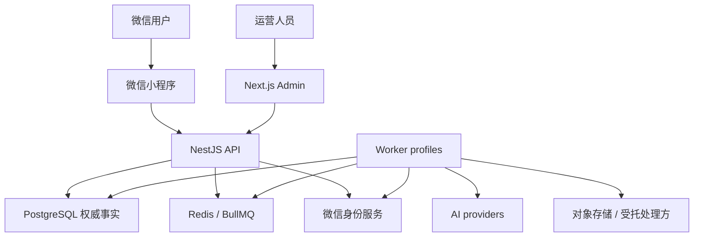
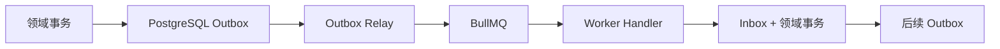

# DailyEnergy 系统架构

- **文档状态**：Draft
- **所属任务**：S-29 — 系统架构
- **最后更新**：2026-07-26
- **适用范围**：Phase 0B / Phase 1～3 的系统上下文、运行时、同步与异步边界、事务、Worker、AI Gateway、Redis/BullMQ、数据访问和故障恢复
- **上游权威**：[ADR-0003 AI Provider Abstraction](../decisions/ADR-0003-ai-provider-abstraction.md)、[AI Gateway](../ai/gateway.md)、[领域模型](../data/domain-model.md)、[ADR-0005 数据保存与删除](../decisions/ADR-0005-data-retention-and-deletion.md)、[数据库规格](./database.md)、[API 契约](./api.md)、[隐私数据地图](../operations/privacy-data-map.md)、[ADR-0006 Monorepo 与技术栈](../decisions/ADR-0006-monorepo-and-stack.md)
- **可执行合同**：[共享 Schema](../../packages/shared-schemas/README.md)、[Prisma 草案](../../prisma/schema.prisma)、[OpenAPI 草案](../../openapi/openapi.yaml)
- **下游任务**：S-30～S-33、E-003、E-006～E-013、C-001～C-016、AI-001～AI-016

## 1. 目的

本文把已接受的产品、AI、数据、API、隐私与技术栈合同转换为一个可实施、可恢复且不过度工程化的系统架构。核心验收句是：

> 用户命令先在 PostgreSQL 的唯一事实与短事务中成立，异步副作用再通过事务型 outbox 和可重放 Worker 完成；任何缓存、队列、模型、平台或进程故障都不能创造第二份事实、绕过 Safety/删除 guard，或让已删除数据复活。

本文回答：

1. 哪些是独立运行时，哪些只是同一模块化单体内的模块；
2. API、Admin、Worker、PostgreSQL、Redis/BullMQ 和外部平台怎样连接；
3. 哪些操作同步完成，哪些通过 outbox 异步完成；
4. TX-01～TX-09、命令幂等、PublishGuard、outbox/inbox 和未知结果怎样协作；
5. Daily 与 Weekly AI Gateway 在哪个进程运行，怎样隔离容量与供应商 SDK；
6. Redis、队列和缓存丢失时怎样从 PostgreSQL 恢复；
7. Safety、删除、受限数据和管理后台怎样获得更小权限；
8. 何时才有证据拆分微服务、数据库或读副本。

## 2. 不重开的已接受边界

- DailyEnergy 使用一个 pnpm/Turborepo TypeScript Monorepo；仓库模型和主版本以 ADR-0006 为准。
- 客户端是微信原生小程序；公开与管理 API 使用 NestJS；管理界面使用 Next.js。
- Phase 1～3 使用一个 PostgreSQL 18 权威数据库；Redis、BullMQ、缓存、日志和分析都不是业务事实。
- API 是 HTTPS JSON REST `/v1`；客户端只接收白名单 view，DTO 不直接等于 Prisma model。
- 同 owner + ProductDate 只有一个 GenerationIntent 和一份 AVAILABLE Daily result；历史发布对象不可变。
- 业务规则产生事实，AI 只表达；所有普通模型调用经过服务端 AI Gateway。
- primary → backup → controlled template 顺序有限，不竞速、不拼接、不修补。
- Safety ACTIVE / RECOVERY_PENDING、账户状态、删除 guard、日期窗口和 source revision 是普通读写与发布的硬栅栏。
- HIGH_RISK 输入不进入 ordinary Gateway/template，普通业务写入数为 0。
- 删除确认同步提交 guard；物理清理由同一 DataTask 异步推进，失败不得解封。
- 普通命令使用 CommandReceipt、payload fingerprint 和 expected revision；未知结果只能恢复原意图。
- outbox/inbox 只传 allowlisted 元数据，不保存称呼、签到值、事项标题、note、Prompt、表达、Safety 原文或 provider raw response。
- Next.js Admin 不直连 PostgreSQL、Redis、provider 或对象存储，只调用受控 Admin API。
- Phase 1～3 不引入内部 HTTP/RPC、事件总线平台、多数据库、CQRS 独立读库或微服务。

如本文与 Accepted ADR、Schema、数据库或 API 合同冲突，以上游权威为准；不得用架构便利改写业务语义。

## 3. 范围与不做事项

### 3.1 本文负责

- 系统上下文、信任边界和长期运行时；
- NestJS API、Next.js Admin 和 Worker 的进程职责；
- 模块化单体的依赖方向与跨模块交互规则；
- 同步命令、查询、事务、外部调用和异步副作用的边界；
- PostgreSQL outbox/inbox 到 BullMQ 的可靠投递与恢复；
- Daily、Weekly、通知、关系、数据任务、TTL 与投影的 Worker 隔离；
- AI Gateway、provider adapter、breaker、预算与发布服务的运行位置；
- Redis/BullMQ、缓存、rate limit、短期协调与故障语义；
- PostgreSQL 数据区、连接池和最小数据库角色；
- Safety、删除、Admin 和第三方平台的安全边界；
- 48 个固定架构验证场景。

### 3.2 本文不负责

- 创建 Monorepo、应用骨架、package、目录、tsconfig 或依赖；
- 固定模块文件名、package public exports 或目录树；这些属于 S-30；
- 定义单元/集成/契约/E2E 的完整测试矩阵；这些属于 S-31；
- 选择云厂商、容器编排、域名、网络、KMS、secret store、CI 或发布策略；这些属于 S-32；
- 固定 SLO、告警阈值、日志/trace 后端或成本面板；这些属于 S-33；
- 创建 Prisma migration、Redis key、BullMQ queue 名、Docker Compose 或生产配置；
- 选择具体 AI provider/model、微信模板、对象存储或企业 SSO；
- 实现任何业务、Worker、provider adapter、数据库、缓存或队列代码。

## 4. S-29 决策摘要

| 主题 | 唯一结论 |
|---|---|
| 架构风格 | 模块化单体；一个代码库、一个权威数据库，无内部网络 RPC |
| 客户端 | 微信小程序只调用 `/v1` API，不直连数据或第三方 AI |
| API runtime | NestJS 无状态 HTTP 进程；守卫、命令、查询与短事务 |
| Admin runtime | Next.js 独立部署；只调用独立鉴权的 `/v1/admin` |
| Worker artifact | 一个服务端 Worker 代码产物，以不同 profile 启动不同进程 |
| Worker profiles | Interactive Generation、Background、Restricted Data 三类必需隔离 |
| AI Gateway | Worker 内的服务端模块，不是独立微服务；provider SDK 只在 adapter 边界 |
| Database | 一个 PostgreSQL database、一个应用 schema、S-19 前缀数据区与 table grants |
| Redis | cache、rate limit、breaker、semaphore、短期协调与 BullMQ；永不拥有业务事实 |
| Queue | BullMQ 至少一次投递；PostgreSQL outbox 是待投递事实，InboxReceipt/唯一性去重 |
| 事务 | 只覆盖 PostgreSQL；任何微信/provider/对象调用都在事务外 |
| 同步/异步 | 用户可观察事实同步提交；可重试副作用异步；发布最终事实仍回到 PostgreSQL 事务 |
| 缓存 | 只缓存白名单 projection；先校验 PostgreSQL guard，再接受 cache hit |
| 一致性 | guard、命令、唯一发布强一致；关系/周表达/通知/分析等可最终一致 |
| 演进 | 先水平扩 API/Worker；拆服务、数据库或读副本必须有指标、边界和新 ADR |

## 5. 系统上下文与信任边界



信任边界：

- 小程序、Admin 浏览器、深链参数、设备时间和客户端缓存都不可信；
- API 是用户与内部事实的唯一在线授权边界；
- Admin 与小程序使用不同 session、路由 namespace 和权限策略；
- PostgreSQL 是事实与 guard 权威；API/Worker 不能把 Redis 状态当作授权；
- provider、微信平台、对象存储和其它受托方都在外部信任边界；
- provider key、数据库凭据、签名密钥和 restricted 数据永不进入客户端；
- Worker 获取外部数据前必须用最小 opaque ref 回读当前权威事实与 guard。

## 6. 运行时与进程拓扑

### 6.1 长期运行时

| 运行时 | 主要职责 | 禁止承担 |
|---|---|---|
| Mini Program | 页面、局部草稿、命令 ref、轮询与白名单 view | ProductDate 真值、owner、规则、AI、Safety/删除判断 |
| API Runtime | auth/bootstrap、守卫、REST、命令/查询、TX-01～09 入口、读投影 | BullMQ consumer、长任务、provider 重试、任意 SQL/Prisma 行外泄 |
| Admin Runtime | 企业身份外壳、运营页面、受控 Admin API client | 直连 PG/Redis/provider、浏览任意用户全文、解除 Safety |
| Interactive Generation Worker | Daily 生成、Gateway、candidate validation、PublishGuard 与 Daily publish | Weekly/TTL/删除占用其保留容量 |
| Background Worker | outbox relay、关系、Weekly、通知、一般投影、匿名分析和非受限 TTL | 读取 restricted 原文、改变权威命令语义 |
| Restricted Data Worker | 删除/导出、provider/object cleanup、backup deadline、restricted TTL/legal hold | 普通产品请求、AI 表达、通用分析 |
| Migration Job | 版本化 migration、grants、检查约束和 drift Gate | 常驻业务流量、`prisma db push` |

三类 Worker 是同一受审代码产物的不同启动 profile，不是三个 repository 或微服务。它们必须：

- 加载不同 handler allowlist；
- 使用不同 BullMQ queue/concurrency 配置；
- 使用不同数据库凭据和外部 egress allowlist；
- 拒绝收到不属于本 profile 的 job type；
- 共享稳定 message envelope、Schema 和版本，但不共享进程内状态。

S-32 决定每个 profile 的容器、replica、CPU/内存和网络；S-29 只冻结逻辑隔离。

### 6.2 非长期运行能力

- CLI、seed、migration、回填、恢复校验和合成评测使用一次性 job；
- 不与 API 进程共用 migration owner 或 evaluation 凭据；
- 定时触发器只负责唤醒扫描，不拥有任务事实；
- 本地开发可以用 Docker Compose 运行同一拓扑，但不能把“一个 Compose”理解为生产单进程。

## 7. 模块化单体边界

S-29 固定业务上下文与依赖方向，S-30 再把它们映射为 package/module/public API。

| 模块上下文 | 拥有 | 可以依赖 |
|---|---|---|
| Identity & Account | 账户、身份、会话、账户生命周期 | system catalog、outbox |
| Consent & Profile | 必要同意、资料、首次认识 | Identity、Safety gate |
| Product Time | ProductDate、窗口、continuation | system clock/catalog |
| Daily Records | Checkin 与修订 | Identity、Product Time、Safety/Data guards |
| Generation | intent、snapshot、规则计划、invocation orchestration | Daily Records、catalog、Gateway port |
| AI Gateway | route、adapter、template、validator、attempt/candidate | frozen plan、system/runtime ports |
| Content Publication | Daily/Weekly immutable publish 与 client projection | candidate、PublishGuard、source dependencies |
| Daily Interaction | light/task/helpfulness/evening | Publication、Product Time、Safety/Data guards |
| Relationship | cycle、encounter link、node receipt | DayLit event、source validity |
| Matter & Memory | matter、grants、snapshot/dependency | Profile、Product Time、Safety/Data guards |
| Weekly Reflection | seven-day source、facts、summary revision | Daily/Interaction、Publication、Gateway port |
| Safety | decision/state/event/fixed response/resource | policy/catalog、restricted persistence |
| Notification | preference、intent、dispatch claim/attempt | approved source facts、guards、platform adapter |
| Data Rights & Evidence | DataTask、guard、export/delete、restricted evidence | all scope registries through explicit ports |
| Operations & Catalog | version catalog、route/config publication、read-only operations | system/restricted read ports |

依赖规则：

- transport 只调用 application command/query；application 调用 domain 与明确 port；infrastructure 实现 port；
- 跨模块只能使用 public command/query/port、opaque ref、version、revision、fingerprint 或 allowlisted domain event；
- 一个模块不能导入另一个模块的 repository、Prisma delegate、内部 entity 或数据库 row；
- 禁止从下游 projection、analytics、cache、notification 或 provider 反向修改权威 source；
- 跨模块协调由 application service + 同一 PostgreSQL transaction，或 outbox/inbox 完成；
- 不用 localhost HTTP、GraphQL、gRPC 或消息 broker 模拟同进程模块边界；
- package/目录/exports 与静态依赖检查由 S-30 固定。

## 8. 同步请求架构

### 8.1 请求管线

```text
TLS / request limits
  → request_id + closed transport Schema
  → minimal Safety route identity
  → Safety overlay
  → session / account / deletion guards
  → maintenance / consent / onboarding
  → ProductDate / window
  → owner / revision / domain validation
  → command or query handler
  → short PostgreSQL transaction when needed
  → allowlisted response view
```

- Safety continuation 只能进入 bootstrap、SafetyView 和 recovery allowlist；
- UUID/ref 只定位候选对象，owner 与状态必须在查询中重新验证；
- 写命令先注册/锁定 CommandReceipt，再执行同事务领域写；
- 相同 command ref + fingerprint 返回原 outcome；不同 fingerprint 立即冲突；
- CAS 0 行时回读当前事实，返回稳定 conflict 或 idempotent existing；
- 所有成功/错误响应都由 transport mapper 生成，不泄露 Prisma/SQL/provider 内部信息。

### 8.2 查询与 read-after-write

- command 成功响应使用同事务产生的白名单 view 或事务提交后按 owner 重新读取；
- 不等待异步 projection 才确认同步事实；
- 历史/列表使用数据库 keyset，不把 Redis list 当权威；
- current summary/result 只在 source fingerprint、visibility 和 guard 当前有效时返回；
- eventual projection 未追上时返回明确 ABSENT/RUNNING/INVALIDATED，不补造成功；
- Unknown outcome 通过原 command/intention query 恢复，不更换 command ref。

### 8.3 事务纪律

- 数据库事务必须短；不得在事务内调用微信、AI provider、对象存储、CDN、邮件、Webhook 或等待 BullMQ；
- 外部调用前先提交 intent/attempt/claim；外部返回后用新短事务保存稳定 outcome；
- 事务 isolation 以保护不变量所需的最小级别为准，不能依赖客户端串行；
- 唯一性、CAS、row lock、constraint 和 PublishGuard 是并发权威；
- 事务回滚时领域事实、CommandReceipt 结果和 outbox 必须一起回滚。

## 9. 异步架构：Outbox、BullMQ 与 Inbox



### 9.1 Outbox 是待投递权威

- 权威领域写与 OutboxEvent 在同一个 PostgreSQL transaction 提交；
- outbox payload 只含 `event_id`、stable event type/version、aggregate opaque ref、revision/fingerprint、必要 guard epoch 和发生时间；
- outbox 不保存正文、个人值、Prompt、表达、密钥、provider body 或对象 key；
- relay 用 `FOR UPDATE SKIP LOCKED` 或等价 claim 小批处理；
- BullMQ `jobId` 使用 event id 或稳定派生 id，重投不能创造新业务意图；
- relay 在 enqueue 成功后标记 PUBLISHED；若 enqueue 成功但标记前崩溃，重复 enqueue/consume 必须安全；
- outbox terminal 后按 retention 清理，不是永久审计或 analytics。

### 9.2 Inbox 与 handler

- consumer 先在同一 PostgreSQL transaction 插入 `(consumer_code, event_id)` InboxReceipt，再执行幂等领域写；
- handler 成功写入、后续 outbox 与 receipt 同事务提交后才 ACK queue；
- crash 在 commit 后/ACK 前会重投，但 InboxReceipt 使其 no-op；
- consumer 必须回读当前 aggregate、source revision 和 guard epoch；旧消息不能靠“仍在队列”获得权限；
- terminal contract/config failure 写稳定失败码与受限诊断引用，停止盲重试并告警；
- retryable internal failure 使用同一 event/job id 和有界 backoff；不得换 business key；
- provider/平台 outcome unknown 遵循各自 attempt/claim 恢复，不把 queue retry 当成第二次业务请求。

### 9.3 不经过通用队列的能力

- Safety state/epoch 的首次提交；
- 删除 guard 与 DataTask 创建；
- command receipt 与同步领域写；
- Daily/Weekly 最终 publish transaction；
- Notification dispatch claim；
- PostgreSQL guard/owner/unique/CAS 检查。

这些事实可以产生 outbox，但不能等事件消费后才生效。

## 10. 一致性与 TX-01～TX-09

| TX | 执行边界 | 提交后异步 |
|---|---|---|
| TX-01 Profile + Onboarding | API 单 PostgreSQL transaction | 最小分析/运营投影 |
| TX-02 Checkin + GenerationIntent | API 单 transaction；冻结 date/snapshot/outbox | Daily generation job |
| TX-03 Daily publish | Interactive Worker 单 transaction；重查 PublishGuard | view invalidation、后续关系/分析 |
| TX-04 Evening coordinated save | API 单 transaction；多 revision 全成或全败 | Weekly source invalidation、分析 |
| TX-05 HIGH_RISK | API Safety 专用 transaction；epoch/event/plan/outbox | 取消/抑制清理；普通写为 0 |
| TX-06 Light + Relationship | light 与 DayLit outbox 同 transaction；relationship consumer inbox transaction | projection/node eligibility |
| TX-07 Weekly current pointer | Background Worker 单 transaction；source fingerprint + CAS | view/cache invalidation |
| TX-08 Notification dispatch claim | Background Worker claim transaction；平台调用在外 | attempt outcome/reconcile |
| TX-09 Delete task + guard | API/restricted port 单 transaction；同步 semantic block | Restricted Worker 物理清理 |

一致性分类：

- **强一致**：账户/Safety/删除 guard、同意、ProductDate 接受、CommandReceipt、Checkin、GenerationIntent、Daily publish、interaction revisions、DataTask state；
- **最终一致**：Relationship projection、Weekly expression、通知、匿名分析、cache、对象/provider 删除、TTL 物理清理；
- **不可由最终一致替代**：Safety overlay、删除阻断、owner 授权、唯一发布、revision conflict、用户可见删除阶段；
- **可重建**：client read model、关系/周投影、匿名聚合、cache；重建前必须先应用 guard、source invalidation 和 restore deny。

## 11. Daily / Weekly 生成与 AI Gateway

### 11.1 运行位置

- `POST /daily/generation/start` 只创建/恢复 intent、snapshot 和 outbox，随后返回 RUNNING/existing；
- Interactive Generation Worker 消费同一 intent，执行规则、冻结 GatewayInvocation、顺序调用 Gateway 并发布；
- 客户端轮询原 intent 或 `/daily/today`；API 不在 HTTP controller 中调用 provider；
- Weekly facts 由 Background Worker 生成；只有需要表达时才通过独立 Weekly AI pool 调用同一 Gateway contract；
- AI Gateway 是 Worker 进程内模块，不提供内部 HTTP endpoint，不单独拥有数据库或 repository；
- provider SDK 只能由 provider adapter 引入，业务/API/Admin/package 不得依赖。

### 11.2 Daily 与 Weekly 容量隔离

- Daily queue/profile 有保留 worker concurrency、provider concurrency 和 template reserve；
- Weekly/background AI 使用不同 queue 与 semaphore，不能耗尽 Daily 保留容量；
- queue wait 不改变 Gateway 已冻结的 8 秒 Daily / 20 秒 Weekly deadline；开始 invocation 前若无法保证预算，Daily 保持 RUNNING/稳定失败，不能偷减 template reserve；
- S-33 定义排队与端到端 SLO，S-32 定义 replica/resources；不得通过并发 primary/backup 降低尾延迟。

### 11.3 Gateway 状态

- route manifest、price catalog、provider data profile 和 policy version 从 PostgreSQL system catalog 读取，并在 invocation 冻结 fingerprint；
- Redis 保存共享 breaker、semaphore、rate/cost counter 等可丢失运行状态；
- breaker/budget 状态不可用时 fail closed：跳过 provider，使用已验证 controlled template；
- provider attempt 与归一化 usage/outcome 在 PostgreSQL runtime 区；无效 raw response 不保存；
- candidate 通过完整 validator 后短期加密保存，最终 publish transaction 才产生 AVAILABLE；
- provider timeout/unknown 不重复同一 role；迟到 response 只能补受限 usage，不能发布。

### 11.4 Queue/Redis 故障边界

Controlled Template 是 provider、breaker、成本或 candidate failure 的降级，不是 PostgreSQL/BullMQ 故障的伪成功路径。

- Redis/BullMQ 不可用时，TX-02 仍可提交 intent + outbox；intent 保持 RUNNING/可恢复；
- outbox relay 恢复后按原 event id 投递，不能创建第二 intent；
- API 返回稳定 transient/RUNNING，不在 API 另写一套 inline generation；
- 若用户所需时间窗口已关闭，Worker 按 intent/window 取消，不把迟到任务迁移到新日期；
- 数据库不可用时不产生新 intent/result；只允许与个人事实无关的静态故障/Safety 最小说明。

## 12. Redis、BullMQ 与缓存

### 12.1 Redis allowlist

Redis 只用于：

- BullMQ queue/lease；
- API coarse rate limit；
- AI route breaker、semaphore、budget counter；
- 短期 non-authoritative coordination；
- 白名单 projection cache；
- 可丢失的 session lookup acceleration（session authority 仍在 PostgreSQL）。

禁止：

- 保存唯一用户事实、CommandReceipt、Safety/删除真值、关系计数或 Daily result 权威；
- 保存 note、matter title、Prompt、provider body、Safety 原文或密钥；
- 用 Redis lock 代替 PostgreSQL unique/CAS/transaction；
- 从 queue 历史重建用户事实；
- 将失败/完成 BullMQ job 当作客户端业务状态。

### 12.2 Cache 读取

- 普通读先从 PostgreSQL 解析 account/Safety/deletion guard 与 owner；
- 只有 guard 当前有效后才读取 projection cache；
- cache key 至少绑定 view type/ref、projection version、source fingerprint 和相关 guard epoch/revision；
- guard/epoch 递增后旧 key 立即不可命中，后台 15 分钟清理只是物理 SLA；
- cache miss 从权威 source 重建白名单 view；
- Redis 故障回退 PostgreSQL；数据库 guard 不可确认时 fail closed，不返回旧 cache；
- cache 不延长源 retention，不进入导出或删除完成判定。

### 12.3 Queue 生命周期

- queue payload 保持最小，真实数据由 Worker 在执行时按权限回读；
- completed/failed job metadata 使用短 TTL，不作为审计；
- 大批量 TTL/删除使用 PostgreSQL claim/checkpoint，不把所有 target body 展开进 Redis；
- 重试次数、backoff 与 quarantine 由 E-007/S-31 固定，但必须有界；
- 清空/重建 Redis 前不需要业务数据恢复；只需从 outbox、due rows 和 active DataTask 重投。

## 13. Worker profile 与调度

### 13.1 Interactive Generation

允许：Daily generation、Daily Gateway、candidate validation、Daily publish、interactive recovery。

禁止：Weekly batch、通知风暴、TTL、大规模删除、导出、评测和任意运营任务。

### 13.2 Background

允许：outbox relay、Relationship consumer、Weekly facts/summary、通知、普通 projection、匿名事件聚合、非受限运行清理。

要求：

- Weekly AI 与 Daily 使用不同 queue/semaphore；
- 通知先 claim 再调用微信平台；
- analytics 只消费批准事件投影，不扫描正文或直接 join restricted 数据；
- due scanner 使用 PostgreSQL 索引和 `SKIP LOCKED`，定时器不是权威。

### 13.3 Restricted Data

允许：DataTask、provider deletion、对象/CDN 清理、export、backup deadline、restore deny、restricted TTL/legal hold cleanup。

要求：

- 独立进程 profile、独立 DB role 和独立 egress allowlist；
- 任务只携带 opaque task/scope ref；
- 每步使用 checkpoint 与原 task ref 重试；
- failure summary 只含 stable subsystem code/count；
- guard 在任务失败时保持；
- export 使用白名单投影与短期对象，不导出 restricted/seed/attempt/audit。

## 14. PostgreSQL 数据区与角色

### 14.1 Database 与 schema

Phase 1～3 使用：

- 一个 PostgreSQL database；
- 一个应用 PostgreSQL schema；
- 保留 S-19 的 `app_`、`runtime_`、`restricted_`、`system_`、`evaluation_` 物理表前缀；
- 不启用 Prisma multi-schema、多 datasource、跨数据库事务或读写分离；
- 通过 table grants、专用连接池、repository owner predicate 和 service authorization 分层保护。

选择单 schema 是为了让首次 migration、Prisma 关系、事务和恢复保持简单。前缀不是安全控制，E-006 必须 revoke 默认 public 权限并创建明确 table/sequence/function grants。未来拆 schema 也不能改变数据区语义，且需 migration 与访问矩阵评审。

### 14.2 最小角色

| 角色/连接 | 使用者 | 允许范围 |
|---|---|---|
| migration owner | 一次性 Migration Job | DDL、grants、migration；不服务流量 |
| api-app | API 普通模块 | 允许的 `app_*` 与必要 `runtime_command_receipt/outbox` |
| api-safety | API Safety module 专用 pool | Safety current state、最小 restricted event/plan 写入 |
| worker-core | Interactive/Background | 允许的 app/runtime/system rows；无任意 restricted 文本读取 |
| worker-deletion | Restricted Worker | DataTask/guard/checkpoint 与 scope-limited app cleanup |
| operations-read | 受控 Admin API | 聚合/脱敏 view；无 ciphertext/原文 |
| evaluation | 合成评测一次性 job | `evaluation_*`；禁止真实 AccountRef |

- API/Worker 不使用 owner/superuser；
- 一个进程即使配置多个 pool，也只能由对应模块通过封闭 port 获取；禁止通用 `db.query(role)`；
- ciphertext 解密通过字段/用途明确的 adapter，不把 key 放数据库；
- S-19 暂不以 RLS 为唯一 owner 边界；若未来采用，必须新评审连接池身份注入与 bypass role。

## 15. Admin 与运营边界

- Admin Runtime 只保存浏览器会话/UI 状态；不嵌入 provider/database secret；
- `/v1/admin` 使用与小程序完全不同的 session、audience、CSRF/二次验证策略；
- Admin controller 调用同一模块化单体的受控 operations/query ports，不访问其它 module repository；
- Safety event、DataTask、成本和运行数据默认脱敏、聚合和最小字段；
- 受限操作必须有 reason、operator、scope、expiry 和 RestrictedAuditEvent；
- Admin 不能编辑已发布结果、修改用户事实、任意测试生产 Prompt、下调 Safety、取消已生效删除 guard；
- Next.js route handler/server component 不成为绕过 NestJS 的第二 API。

SSO 厂商、网络 allowlist、break-glass 与具体 RBAC 由 S-22/S-32 落地，不改变以上边界。

## 16. Safety 与删除架构

### 16.1 Safety

- 所有允许自由文本的 API surface 在普通 command transaction 前调用统一 Safety input gate；
- HIGH_RISK 使用 `api-safety` 专用 port 执行 TX-05，同步递增 revision/epoch、写最小 event/plan 并产生取消 outbox；
- ordinary command transaction 不开始或整体回滚，ordinary Gateway/template 调用数为 0；
- SafetyView 使用固定版本化资源；provider/Redis 故障不能阻止固定响应；
- Safety continuation 每次仍校验当前 SafetyState，不能靠 token/cache 认为已 CLEAR；
- candidate Safety validation 位于 AI Worker，仅拒绝普通表达，不能推翻 input HIGH_RISK。

### 16.2 删除

- 删除 prepare/confirm 由 API 完成身份、scope、target、revision 与 challenge 校验；
- TX-09 同步创建/读取 DataTask、递增 guard 并写 outbox；成功响应即普通路径 semantic blocked；
- Restricted Worker 按 child → source → identity/account 的注册表与 checkpoint 执行；
- cache、queue 和迟到 callback 都必须比较 guard epoch，不能等待物理清理；
- provider/object/backup 清理是 DataTask 的异步 step，不扩大 scope；
- restore 在开放前先应用 retention policy、DeletionReceipt/RestoreDeny、guard 与 source invalidation；
- Worker 失败、Redis 丢失、部署回滚或恢复旧备份都不能清除 guard。

## 17. 外部适配器

| 外部系统 | 调用者 | 事务外状态 |
|---|---|---|
| 微信身份/session | API Identity adapter | code exchange 后短事务建立/恢复 session；不回显 openid |
| 微信订阅消息 | Background Notification adapter | dispatch claim 后发送；timeout 为 unknown attempt |
| AI provider | Interactive/Weekly Worker provider adapter | attempt 已登记；同 role 不盲重试 |
| 对象存储/CDN | Restricted Worker / approved share service | opaque object ref；URL 先失效，清理 checkpoint |
| provider deletion | Restricted Worker | 受限 request/evidence ref；不保存 raw body |

共同规则：

- adapter 只做协议、认证、deadline/cancel、错误/usage 归一化；
- 业务选择、重试、Safety、幂等和 fallback 在 application/domain 层；
- secret 只从服务端配置注入；
- egress endpoint 必须 allowlist + TLS 校验；
- 任何外部回调/response 都视为不可信输入并再次验证；
- external request idempotency 能用则使用不可反查用户的 attempt/claim ref，不能用用户正文或身份生成。

## 18. 故障模式与恢复

| 故障 | 行为 | 恢复来源 |
|---|---|---|
| API replica crash | 客户端按 command ref/query 恢复；无进程内事实 | PostgreSQL CommandReceipt/aggregate |
| PostgreSQL unavailable | 新写、guarded read、publish fail closed；不返回旧个人 cache | 数据库恢复与事务日志 |
| Redis unavailable | API 回退 PG；provider breaker 不可见则 template；queue job 暂停 | PG outbox/due rows/DataTask |
| BullMQ 重复/丢元数据 | handler inbox/unique no-op；outbox 重投 | PG outbox/inbox |
| Outbox relay crash | 未发布/未标记 event 可再次 claim | PG outbox |
| Worker commit 后 ACK 前 crash | 同 event 重投，InboxReceipt no-op | PG receipt/domain row |
| provider timeout/late response | attempt OUTCOME_UNKNOWN；不重发同 role；late 不发布 | attempt/candidate/result |
| 微信通知 timeout | 原 intent/claim/attempt reconcile；不新建 semantic intent | NotificationIntent |
| stale cache | guard/source fingerprint mismatch 拒绝 | PG source/projection rebuild |
| deletion step failure | task FAILED/可重试，guard 保持 | checkpoint + scope registry |
| bad deployment/config | 停止新 invocation/command、回滚应用/config；不改历史 | immutable catalog/previous version |
| backup restore | 隔离恢复，先重放 deny/guard/TTL，再开放 | backup catalog + restricted ledger |

进程内 memory 只允许 request scope 或可丢失短缓存。任何需要跨 replica 一致或重启恢复的状态必须进入 PostgreSQL，或作为 Redis 可丢失协调并定义 fail-closed/fallback。

## 19. 扩缩容与演进门槛

### 19.1 初始扩缩

- API 无状态水平扩；session/guard/command 不在本地内存；
- Worker 按 profile、queue depth、age 和外部配额独立扩；
- Daily 与 Weekly/后台容量分开；
- PostgreSQL 保持单 writer；先优化查询、索引、批次、连接池和任务并发；
- Redis topology、持久化和 failover 由 S-32 决定，不能改变其非权威地位。

### 19.2 暂不采用

- 多 region active-active；
- PostgreSQL read replica 作为用户 read-after-write 或 guard 来源；
- Kafka/Pulsar/RabbitMQ；
- Kubernetes/service mesh；
- 独立 AI Gateway service；
- event sourcing；
- CQRS 独立事实/查询数据库；
- GraphQL/BFF 第二契约层；
- 每个领域独立 database/schema/repository。

### 19.3 拆分服务的必要证据

只有同时具备以下证据时才新建 ADR：

1. 某模块有独立且持续的容量、故障或安全隔离需求；
2. 明确的数据所有权和 API/event contract 已在模块化单体中稳定；
3. 跨边界事务可以被 saga/outbox 接受，且不会削弱 Safety/删除/唯一发布；
4. SLO、成本、团队所有权与运维能力证明收益大于网络和一致性成本；
5. 完成数据迁移、回滚、双写/兼容、删除与恢复方案；
6. S-31 场景和 S-33 指标能证明拆分前后语义一致。

## 20. 安全、隐私与可观测接口

- trace 只传播 request/event/intent/attempt 的 opaque ref、version、time、outcome；不传播正文；
- metric labels 只使用低基数 workload/environment/operation/outcome/version，不使用 account、fact、文本或对象 key；
- queue/cache/job/log field allowlist 由 contract test 扫描；
- SQL/Prisma 生产日志不含 bind values；
- ciphertext、provider raw output、Prompt、note、matter title、Safety 原文不进普通日志、outbox、analytics 或 trace；
- restricted profile 与 ordinary profile 的连接/egress 使用不同凭据；
- source map、coverage、trace、queue UI 和 external cache 上传仍受 S-21/S-32/S-33 Gate；
- health endpoint 只报告组件状态，不泄露 hostname、credential、provider account 或用户计数；
- 观测失败不能放宽 guard、provider breaker、预算或删除语义。

## 21. 固定验证场景（48）

### 21.1 架构与模块边界（8）

| ID | 场景 | 必须结果 |
|---|---|---|
| S29-ARCH-001 | 小程序直接引入 provider SDK/key | 构建/依赖 Gate 失败 |
| S29-ARCH-002 | Next.js route handler 直连 PostgreSQL | 架构 Gate 失败，只能调用 Admin API |
| S29-ARCH-003 | 业务模块导入另一模块 repository/Prisma delegate | 依赖边界失败 |
| S29-ARCH-004 | 同进程模块通过 localhost HTTP 通信 | 拒绝；使用 in-process public port |
| S29-ARCH-005 | 为 AI Gateway 创建独立数据库或网络服务 | 拒绝；需新 ADR 与证据 |
| S29-ARCH-006 | API 普通连接读取 restricted event 原文/密文 | table grant 拒绝 |
| S29-ARCH-007 | Worker profile 收到未 allowlist job type | 拒绝并告警，不执行 |
| S29-ARCH-008 | 数据库 transaction 内等待 provider/微信/对象存储 | 架构测试失败 |

### 21.2 同步命令与守卫（8）

| ID | 场景 | 必须结果 |
|---|---|---|
| S29-ARCH-009 | Safety ACTIVE 时提交签到 | 返回 SafetyView；普通写 0 |
| S29-ARCH-010 | DELETING 账户命中旧 Today cache | 先由 PostgreSQL guard 阻断，不返回 cache |
| S29-ARCH-011 | 同 command ref + 同 fingerprint 重试 | 返回原 receipt/事实 |
| S29-ARCH-012 | 同 command ref + 不同 fingerprint | IDEMPOTENCY_CONFLICT；领域写 0 |
| S29-ARCH-013 | EVE 任一 component revision 冲突 | 整个协调 transaction 回滚 |
| S29-ARCH-014 | 客户端提交 device date/owner/epoch | 忽略或拒绝；服务端解析权威值 |
| S29-ARCH-015 | transaction 在 outbox insert 后失败 | 领域写、receipt 与 outbox 全不存在 |
| S29-ARCH-016 | PostgreSQL guard 无法读取但 Redis 有旧 view | fail closed，不展示个人 view |

### 21.3 Outbox、Queue 与恢复（8）

| ID | 场景 | 必须结果 |
|---|---|---|
| S29-ARCH-017 | 领域事实提交成功 | 对应 allowlisted outbox 同 transaction 存在 |
| S29-ARCH-018 | enqueue 成功、relay 标记前 crash | 同 event 可重投；单业务效果 |
| S29-ARCH-019 | consumer commit 后、ACK 前 crash | InboxReceipt 使重投 no-op |
| S29-ARCH-020 | 旧 safety/deletion epoch event 迟到 | consumer 同步拒绝 |
| S29-ARCH-021 | BullMQ 重复同 jobId/eventId | 不创建第二 intent/link/notification |
| S29-ARCH-022 | Redis 全量丢失后恢复 | 从 outbox、due rows、active task 重投；业务事实不丢 |
| S29-ARCH-023 | queue payload 含 note/title/Prompt/表达 | Schema/field allowlist Gate 失败 |
| S29-ARCH-024 | terminal contract job 被重试器无限重建 | 拒绝；稳定失败/告警，保留原业务 key |

### 21.4 AI Gateway 与容量（8）

| ID | 场景 | 必须结果 |
|---|---|---|
| S29-ARCH-025 | Weekly 批次耗尽 background concurrency | Daily 保留 queue/pool 仍可运行 |
| S29-ARCH-026 | API controller 直接调用 provider | 依赖边界失败 |
| S29-ARCH-027 | primary timeout、backup 成功 | 同一 frozen plan 完整 BACKUP candidate |
| S29-ARCH-028 | breaker/预算共享状态不可读 | provider 调用 0，使用 validated template |
| S29-ARCH-029 | provider response invalid 但部分字段可用 | 整份拒绝，禁止局部发布 |
| S29-ARCH-030 | provider late success 前 guard 已变化 | PublishGuard 拒绝，不能 AVAILABLE |
| S29-ARCH-031 | 相同 invocation/role/ordinal 被两个 Worker claim | 单 attempt dispatch；输家恢复 existing |
| S29-ARCH-032 | Redis/BullMQ outage 后另建 inline intent | 拒绝；恢复原 PG intent/outbox |

### 21.5 Safety、删除与受限数据（8）

| ID | 场景 | 必须结果 |
|---|---|---|
| S29-ARCH-033 | HIGH_RISK note 与普通 evening patch 同请求 | TX-05 成功；TX-04 写入 0；ordinary Gateway 0 |
| S29-ARCH-034 | Safety continuation token 请求普通 history | 拒绝；只允许 Safety 白名单 |
| S29-ARCH-035 | 删除 confirm 成功但 Worker 尚未运行 | guard 已同步阻断普通路径 |
| S29-ARCH-036 | Restricted Worker 第三步失败 | 原 DataTask/checkpoint 重试，guard 保持 |
| S29-ARCH-037 | guard epoch 增加后旧 cache key 尚未物理删 | 旧 key 不可命中 |
| S29-ARCH-038 | provider/object 删除需外部调用 | transaction 外执行，scope/checkpoint 不扩大 |
| S29-ARCH-039 | Redis 丢失期间账户删除 | PostgreSQL guard 仍权威，普通路径阻断 |
| S29-ARCH-040 | 备份恢复包含已删 DAY | 先应用 restore deny/guard/source invalidation，再开放 |

### 21.6 Admin、外部平台与演进（8）

| ID | 场景 | 必须结果 |
|---|---|---|
| S29-ARCH-041 | 小程序 session 调 `/v1/admin` | 鉴权拒绝；audience 不互换 |
| S29-ARCH-042 | Admin 尝试编辑已发布结果或解除 Safety | 无此 port/endpoint |
| S29-ARCH-043 | 微信通知 timeout | 原 claim/attempt reconcile；不新建 semantic intent |
| S29-ARCH-044 | provider adapter 自行 retry/切 model | adapter conformance 失败 |
| S29-ARCH-045 | 普通 analytics 扫描产品正文/restricted 表 | DB/架构 Gate 拒绝，只消费批准投影 |
| S29-ARCH-046 | 增加 read replica 承担 guard/read-after-write | 拒绝；需新 ADR 与一致性证据 |
| S29-ARCH-047 | API replica 重启后会话/命令事实丢失 | 架构失败；必须由 PG 恢复 |
| S29-ARCH-048 | 按模块拆微服务/数据库但无量化证据 | 拒绝；继续模块化单体 |

## 22. 验收标准

- 系统上下文、信任边界、运行时和外部依赖明确；
- 模块化单体、无内部 RPC、一个数据库与一个应用 schema 的边界明确；
- API、Admin、Interactive Worker、Background Worker、Restricted Worker 的职责无重叠；
- TX-01～TX-09 与同步/异步边界一一对齐；
- PostgreSQL outbox、BullMQ 至少一次、InboxReceipt、job id 和 ACK 顺序可执行；
- Redis、BullMQ、cache、breaker 丢失不会丢事实或绕过 guard；
- Daily/Weekly Gateway 运行位置、容量隔离、template fail-closed 和 publish 路径明确；
- Safety、删除、Admin、数据库角色与 restricted egress 边界明确；
- 故障、重试、unknown outcome、迟到消息、恢复和回滚语义明确；
- 48 个 `S29-ARCH-*` 场景完整且唯一；
- S-30～S-33、E-003/E-006/E-007 的交接清楚；
- PR 只包含架构与项目控制 Markdown，不包含代码、workspace、migration、队列或生产配置；
- 用户确认前本文保持 Draft，S-29 保持 In Review。

## 23. 下游交接

### S-30 仓库结构与模块边界

- 把本文上下文映射到 app/package/module/public exports；
- 固定 Worker artifact/profile 入口、provider adapter 隔离和禁止跨 module repository import；
- 为 client-safe Schema、server-only package 和 restricted port 建立静态依赖 Gate；
- 不改变本文的运行时与事务语义。

### S-31 测试策略

- 将 48 个场景与 S-19 SQL-001～020、TX-01～09、S-20 API、Gateway 和删除场景建立 coverage map；
- 包含 transaction/outbox/inbox、duplicate、crash、late message、Redis loss、provider unknown、restore 和权限测试；
- 证明每个 Worker profile 的 handler/credential allowlist。

### S-32 部署、配置与回滚

- 为各 runtime/profile 固定容器、network/egress、secret、replica、health、migration 与 rollback；
- 保证数据库/Redis/时钟/备份恢复不削弱 guard；
- 不用 remote cache、queue UI 或日志平台泄漏内容。

### S-33 可观测性

- 为 API/Worker/PG/outbox/BullMQ/Gateway/DataTask 定义低基数指标、SLO 和告警；
- 覆盖 queue age、outbox lag、template/F4、unique/CAS、TTL/deletion SLA 和 unknown cost；
- 日志/trace/metric 不记录正文或高基数用户标识。

### E-003 / E-006 / E-007

- E-003 创建无状态 NestJS API、守卫、错误/请求信封和 health skeleton；
- E-006 创建一个 database/application schema、S-19 表/constraints/grants 与角色；
- E-007 实现 Redis/BullMQ、outbox relay、InboxReceipt、profile queues、bounded retry 和 Redis-loss rebuild；
- 三者都不能提前写业务完整实现或改变 Accepted contract。

## 24. 明确禁止

- 小程序或 Admin 直连 provider、PostgreSQL、Redis 或对象存储；
- 在 controller、queue processor 或 adapter 中复制业务规则；
- 把一个 BullMQ job、cache entry、log 或 analytics event 当作业务事实；
- 在 PostgreSQL transaction 内等待外部网络；
- 让 Worker 绕过 CommandReceipt、unique、revision、guard 或 PublishGuard；
- 普通 API/Worker 使用 migration owner、superuser 或 unrestricted connection；
- 在 queue/cache/log/trace 保存正文、Prompt、Safety 原文、provider raw response 或 secret；
- 用 Redis lock 替代数据库唯一性；
- 用 stale cache/read replica 绕过 Safety、删除或 read-after-write；
- API 与 Worker 各写一套生成/重试语义；
- 因 Monorepo 把所有 runtime 部署成一个进程；
- 因模块边界建立内部 HTTP、微服务、独立数据库或多仓；
- 在 S-29 PR 中创建代码、目录、配置、migration、Docker 服务、Redis key 或 queue。

## 25. 审核记录

- 状态：Draft；
- 接受日期：待用户确认；
- 内容 PR：待创建；
- 基线：`main`（ADR-0006 / S-28 已随 PR #33 合并并获用户确认）；
- 待确认范围：模块化单体、运行时与 Worker profiles、单数据库/schema、事务/outbox/inbox、Gateway、Redis/cache、roles、故障恢复、48 个场景；
- 下一任务：S-30 仓库结构和模块边界；S-29 被接受前不初始化业务模块或运行时。
